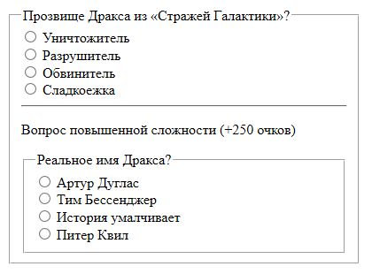
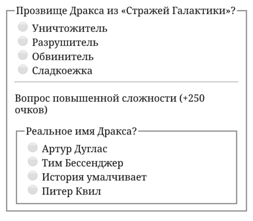

## Кратко

Тег `<fieldset>` группирует элементы формы (поля ввода [`<input>`](/html/input/), [`<textarea>`](/html/textarea/), выпадающие списки [`<select>`](/html/select/) и другие) в блок с характерным выделением границ. Опционально с помощью тега [`<legend>`](/html/legend/) внутри `<fieldset>` можно задать заголовок для создаваемой группы (он может быть только один и обязательно должен идти первым вложенным элементом).

## Пример

```html
<form>
  <fieldset>
    <legend>Прозвище Дракса из «Стражей Галактики»?</legend>
    <label>
      <input type="radio" name="answer" value="Exterminator">
      Уничтожитель
    </label>
    <label>
      <input type="radio" name="answer" value="Destroyer">
      Разрушитель
    </label>
    <label>
      <input type="radio" name="answer" value="Accuser">
      Обвинитель
    </label>
    <label>
      <input type="radio" name="answer" value="Sweet-tooth">
      Сладкоежка
    </label>
  </fieldset>
</form>
```

## Как понять

В сложных формах количество контролов может устрашающе перегружать интерфейс, и правильным решением в этом случае будет группировка смысловых элементов.

## Как пишется

```html
<fieldset>…</fieldset>
```

Для добавления подписи внутри `<fieldset>` следует использовать [`<legend>`](/html/legend/):

```html
<fieldset>
  <legend>Заголовок для группы</legend>
  …
</fieldset>
```

## Атрибуты

- [`disabled`](/html/disabled/) — блокирует все контролы **внутри** тега (как будто каждому из них указали этот атрибут — очень удобно);
- `form` — связывает контролы **внутри** тега с формой (будто они располагаются внутри) — для этого в значении атрибута следует указать ID формы;
- также для `<fieldset>` доступны все [глобальные атрибуты](/html/global-attrs/).

## Подсказки

<aside>

💡 Самое удобное в использовании `<fieldset>` — возможность заблокировать **все** вложенные контролы внутри тега одним атрибутом `disabled`:

</aside>

<iframe title="Блокирование всей формы при помощи disabled" src="demos/disabling/" height="370"></iframe>

Внешний вид оформления рамки по умолчанию у `<legend>` немного отличается в зависимости от браузера и операционной системы:

<section class="section section_column_2">
  <figure class="section__item">
    
    <figcaption>Windows 10, Google Chrome 71.0</figcaption>
  </figure>
  <figure class="section__item">
    
    <figcaption>macOS Big Sur Big Sur, Google Chrome 71.0</figcaption>
  </figure>
  <figure class="section__item">
    
    <figcaption>Windows 10, Edge 18.0</figcaption>
  </figure>
  <figure class="section__item">
    
    <figcaption>macOS Big Sur Big Sur, Safari 14.0</figcaption>
  </figure>
  <figure class="section__item">
    
    <figcaption>Samsung Galaxy S7</figcaption>
  </figure>
  <figure class="section__item">
    
    <figcaption>Google Nexus 6</figcaption>
  </figure>
</section>
