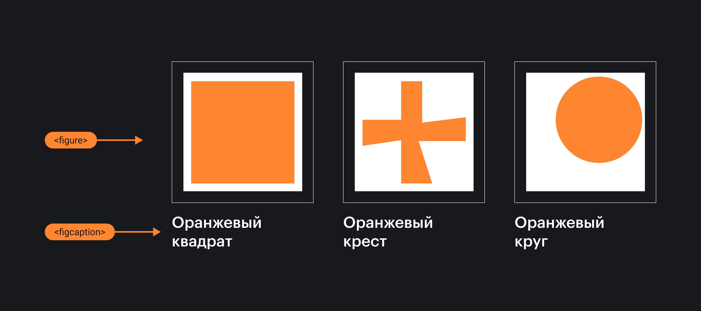

## Кратко

Элемент `<figure>` используется для вёрстки иллюстраций, изображений или другого автономного содержимого, которое может иметь поясняющую подпись в виде тега `<figcaption>`.


Пример использования `<figure>` и `<figcaption>`.

## Пример

```html
<figure>
  
  <figcaption>Слон на фоне заката</figcaption>
</figure>
```

## Как понять

Обычно тегом `<figure>` верстают изображение, иллюстрацию, кусок кода и тому подобное, на которые будут ссылаться из основного содержимого документа. При этом `<figure>` вместе со всем содержимым (картинкой, подписью) может быть перенесён в другую часть документа без нарушения целостности потока документа.

## Как пишется

Только изображение:

```html
<figure>
  
</figure>
```

Изображение с подписью:

```html
<figure>
  
  <figcaption>Супер-логотип</figcaption>
</figure>
```

Подпись может быть с уточнением:

```html
<figure>
  
  <figcaption>
    <p>Новый красивый логотип</p>
    <p>Автор: Дока Дог</p>
  </figcaption>
</figure>
```

Фрагменты кода:

```html
<figure>
  <figcaption>Получаем данные о текущем URL из свойства <code>location</code>.</figcaption>
  <pre>
    function LocationExample() {
    console.log(`Protocol: ${location.protocol}`);
    console.log(`Host: ${location.host}`);
    console.log(`Path: ${location.pathname}`);
    console.log(`Hash: ${location.hash}`);
    }
  </pre>
</figure>
```

## Подсказки

💡 Если содержимое элемента на странице является автономным (даже в отрыве от основного контента будет иметь смысл) и имеет подпись, то почти наверняка можно верстать его тегом `<figure>`. Самыми яркими примерами такого содержимого могут быть:

- картинка либо другое медиасодержимое с подписью;
- фрагменты кода с пояснением;
- цитата с указанием автора;
- отрывок стихотворения с указанием автора и т.п.

💡 Разрешено использовать только один тег `<figcaption>` внутри `<figure>`.

💡 Элемент `<figcaption>`, если он есть, обязательно должен быть первым или последним потомком элемента `<figure>`.
