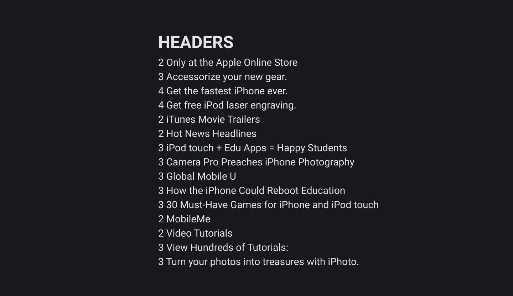

🛠 Важно соблюдать порядок заголовков не только из-за их внешнего вида, но и ради удобства людей с ограниченными возможностями.

Такие люди часто используют так называемые скринридеры — программы чтения с экрана — для навигации по сайтам.

Если заголовки расставлены правильно и логично, то скринридер составит карту навигации по заголовкам и пользователю будет удобно на вашем сайте.

🛠 Если углубиться в интернеты, то можно найти следующее: внутри каждого блока `section` может быть заголовок `h1`. Это немного сбивает с толку, потому что все кругом твердят, что на странице сайта должен быть только один заголовок первого уровня.

Но в этом утверждении описаны технические возможности разметки. Ваше тело, например, может обходиться без воды три дня, а без еды вообще все семь. Это технические возможности. Но это не значит, что нужно пить раз в три дня, а есть раз в неделю.

Также с заголовками. Технически допустимо вставлять по заголовку первого уровня в каждую секцию. Но делать это не нужно. Причина в поисковых роботах. Они берут заголовок первого уровня для поисковых сниппетов. Если заголовков будет много, то робот не сможет сам понять, какой из них взять в сниппет и понизит рейтинг вашего сайта. Просто так, на всякий случай.

Поэтому на одной странице сайта должен быть всего один заголовок первого уровня.
