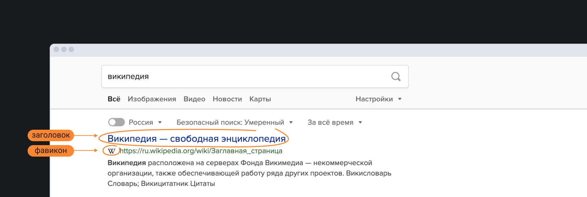

## Кратко

Элемент `<head>` содержит основную информацию о документе: метаданные (например, заголовок окна или кодировку), ссылки на скрипты и таблицы стилей.

Эта информация не отображается на странице браузера. Пользователи увидят только заголовок окна страницы — его задаёт тег [`<title>`](/html/title/), ну и [фавиконку](https://ru.wikipedia.org/wiki/Favicon), если вы её поставите.



## Пример

```html
<html>
  <head>
    <title>Заголовок страницы</title>
  </head>
</html>
```

## Как пишется

Кроме `<title>`, внутри контейнера `<head>` можно разместить и другие элементы: [`<base>`](/html/base/), [`<link>`](/html/link/), [`<meta>`](/html/meta/), [`<script>`](/html/script/), [`<style>`](/html/style/). Вот пример того, как можно поставить фавиконку — маленькую иконку в углу вкладки браузера.

```html
<head>
  <link rel="shortcut icon" type="image/png" href="/favicon.png">
</head>
```
