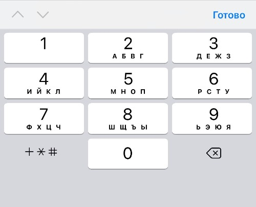

## Кратко

Тег `<input>` позволяет создавать интерактивные элементы на сайте — поле для ввода текста, кнопка, ползунок, переключатель и другие.

## Пример

Создадим поле для ввода текста в одну строчку и ограничим количество допустимых символов в нём:

```html
<label for="name">Введите название (от 4 до 8 символов):</label>

<input
  type="text"
  id="name"
  name="name"
  required
  minlength="4"
  maxlength="8"
  size="10"
>
```

## Как понять

`<input>` — это контейнер для интерактивных элементов, с помощью которых пользователь может ввести данные, что-то выбрать, поставить галочку или нажать кнопку.

## Как пишется

Если хочется, чтобы введённые или выбранные в `<input>` данные отправились на сервер, нужно поместить этот тег в `<form>` либо связать этот элемент с формой через атрибут `id`.

Атрибут `type` определяет, какой вид примет элемент `<input>` и какую функцию будет выполнять: например, для создания поля с паролем мы напишем `type="password"`, чтобы сделать переключатель — `type="radio"`, а для создания кнопки — `type="button"`.

Благодаря огромному количеству вариантов и функций, которые задаются через `type` и другие атрибуты, `<input>` стал одним из самых полезных и сложных тегов в HTML.

## Атрибуты

К элементу можно применить все [глобальные атрибуты](/html/global-attrs/).

### `type`

`type` — тип элемента `<input>`: текстовое поле, кнопка, флажки выбора и так далее. Если не указать его, то элемент будет обычным текстовым полем `text` в одну строку.

Типы для ввода данных разных форматов:

- `text` — поле для ввода текста в одну строку. Если попробовать вставить текст из нескольких абзацев, то они всё равно сложатся в одну строчку.
- `email` — поле для ввода имейла. Браузер проверит, есть ли в нём знак «@» и домен.
- `search` — поле для поиска.
- `tel` — поле для ввода номера телефона.
- `url` — поле для ввода URL-адреса.
- `password` — ввод пароля. По мере ввода символы будут меняться на звёздочки \*\*\*. Можно задать минимальное и максимальное количество символов с помощью атрибутов `minlength` и `maxlength`.
- `number` — ввод числа.

Типы для различных кнопок:

- `submit` — простая кнопка для отправки формы.
- `button` — обычная кнопка.
- `image` — кнопка «Отправить» в виде картинки. Чтобы задать адрес картинки, используйте атрибут `src`, а для альтернативного текста — атрибут `alt`. Чтобы скорректировать размер изображения в пикселях, используйте атрибуты `height` и `width`.
- `reset` — кнопка, которая сбрасывает всё, что пользователь ввёл в поля текущей формы ранее.

Типы для ввода дат:

- `date` — ввод даты без времени: год, месяц и дата.
- `datetime-local` — ввод даты и времени в текущем часовом поясе, когда зоны UTC не указываются.
- `month` — ввод месяца и года, без указания часового пояса.
- `week` — ввод номера недели.
- `time` — ввод времени без указания часового пояса.

Элементы форм:

- `checkbox` — флажки, или чекбокс, с несколькими вариантами на выбор.
- `radio` — круглая кнопка-переключатель для выбора одного из нескольких вариантов.
- `range` — ползунок для выбора чисел из заданного диапазона.
- `color` — виджет для выбора цвета. Иногда его называют колорпикер (от английского colorpicker).
- `file` — выбор файла для отправки.

И отдельно стоит значение `hidden`. Поле ввода с этим значением атрибута `type` не видно на странице, но в то же время оно отправляет своё значение на сервер.

Большое преимущество установки правильного значения для `type` — в мобильных браузерах будет появляться «специальная» клавиатура, упрощающая и улучшающая пользовательский опыт. Так, для `<input type=tel>` у пользователя отобразится клавиатура, содержащая лишь цифры и специальные символы, нужные для корректного ввода номера телефона. Пример такой клавиатуры можно увидеть на картинке ниже:



### `value`

`value` — значение элемента `<input>`, которое отправляется на сервер в формате «имя=значение». Имя задаётся атрибутом `name`, а значение — `value`. Например, `<input type="radio" name="answer" value="a1">`.

- Если `<input>` — кнопка (`<input type="button | reset | submit">`), то `value` будет надписью на ней. Значение `value` для кнопки (`<input type="reset">`) не передаётся на сервер.
- Если `<input>` — кнопка в виде картинки (`<input type="image">`), то `value` будет передано в виде двух значений координат нажатия относительно изображения `имя.x` и `имя.y`, где `имя` — это значение атрибута `name`.
- Если — текстовое поле (`<input type="password | text">`), то `value` задаст текст, который появится в этом поле при загрузке страницы. Пользователь сможет его удалить или отредактировать.
- Если вы вставляете флажок или переключатель (`<input type="checkbox | radio">`), то `value` задаст уникальное значение элемента, по умолчанию `on`.

### Прочие атрибуты

- `name` — уникальное имя элемента. Обычно имя нужно, чтобы связать `<input>` с формой и отправить данные на сервер.
- `required` — делает поле для ввода обязательным для заполнения. Пользователь не сможет нажать «Отправить», пока не введёт сюда данные. А если попробует, то браузер выведет сообщение о необходимости заполнить поле.
- `disabled` — отключает элемент. Пользователь не сможет, например, ввести текст или выбрать нужный параметр, а сам элемент будет отображаться в сером цвете, как неактивный.
- `autocomplete` — разрешает автозаполнение. Автозаполнение — это когда браузер предлагает сохранить, например, пароль или номер банковской карты, чтобы данные подставлялись при следующем входе. Подробнее можно прочитать в статье про [`autocomplete`](/html/autocomplete/).
- `autofocus` — фокусируется на элементе `<input>` сразу после загрузки страницы. Это значит, что пользователю не нужно специально нажимать на этот элемент, чтобы начать в нём что-то писать. В фокусе может быть только один элемент на странице. Но это не может быть элемент типа `hidden`.
- `form` — связывает отдельно стоящий элемент `<input>` с формой. Для этого укажите в качестве значения имя идентификатора, который задан нужному тегу `<form>`. Например, так `form="special-form"`. Этот атрибут позволяет разместить `<input>` в любом месте на странице за пределами `<form>`. Если его не указать, элемент `<input>` будет связан с ближайшей формой.
- `list` — связывает `<input>` с элементом [`<datalist>`](/html/datalist/) через его ID. В элементе `<datalist>` указывают значения, которые пользователь может выбрать, когда вбивает текст в пустое поле. Допустим, вы ввели букву «М» в поле ввода города, и браузер предложил варианты из `<datalist>`: «Москва», «Минск» и так далее. Этот атрибут не подходит для таких типов `<input>`, как `hidden`, `password`, `checkbox`, `radio`, `file` и любых кнопок.
- `readonly` — не позволяет пользователю как-либо изменять элемент, оставляя его при этом рабочим. Применимо только для текстовых полей.
- `step` — указывает шаг, с которым будет изменяться значение поля. Задаётся в числовом формате и работает с любым из перечисленных типов: `number`, `range`, `date` и `datetime-local`.
- `min`, `max` — указывают минимальные и максимальные числовые значения соответственно для полей с типами `number` и `range`. Минимальные и максимальные значения даты в формате `ГГГГ-ММ-ДД` для полей с типами `date` и `datetime-local`.
- [`size`](/html/size/) — указывает ширину поля для ввода в символах.
- [`placeholder`](/html/placeholder/) — это короткая подсказка (слово или фраза), предназначенная для помощи пользователю при вводе данных, когда поле для ввода пустует.
- [`pattern`](/html/pattern/) — задаёт регулярное выражение, по которому проверяется значение элемента `<input>`.
- [`multiple`](/html/multiple/) — указывает, что пользователь может выбрать больше одного значения.

## Подсказки

💡 Чтобы даже те, кто использует специальные средства для чтения с экрана (скринридеры), могли точно понять, что делает тот или иной `<input>`, используйте этот тег в паре с [`label`](/html/label/).

## Ещё пример

Вот так будет выглядеть простая форма, собранная из нескольких элементов `<input>`. Мы поместили их все в контейнер `<form>`, чтобы данные, которые введёт пользователь, можно было отправить на сервер:

```html
<form name="test" method="post" action="input1.php">
  <label>
    Текстовое поле в одну строчку:
    <input type="text" size="40">
  </label>

  <fieldset>
    Радиокнопки:
    <label class="radio-label">
      <input type="radio" name="browser" value="ie" id="ie">
      Вариант 1
    </label>
    <label class="radio-label">
      <input type="radio" name="browser" value="opera" id="opera">
      Вариант 2
    </label>
    <label class="radio-label">
      <input type="radio" name="browser" value="firefox" id="firefox">
      Вариант 3
    </label>
  </fieldset>

  <label>
    Большое текстовое поле:
    <textarea name="comment" cols="40" rows="3"></textarea>
  </label>

  <div>
    <input type="reset" value="Очистить">
    <input type="submit" value="Отправить">
  </div>
</form>
```

<iframe title="Различные input" src="demos/inputs/" height="440"></iframe>
