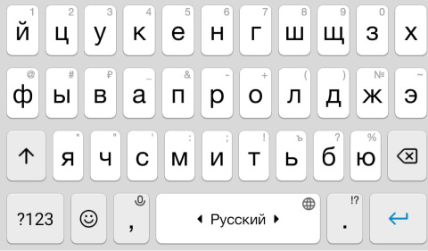
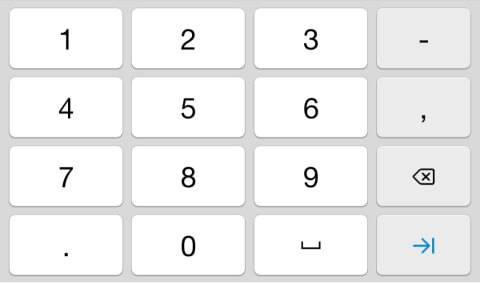
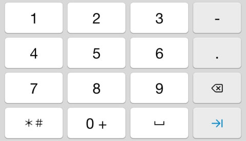
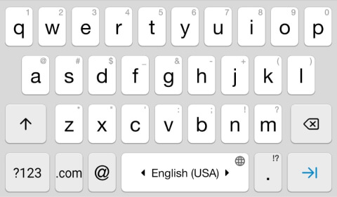
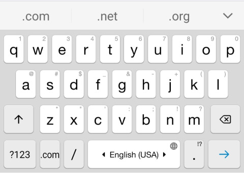

## Кратко

Атрибут `inputmode` говорит браузеру на устройствах с экранной клавиатурой какой набор символов показать при вводе данных в конкретное поле. Указывается для элементов [`<input>`](/html/input/) или [`<textarea>`](/html/textarea/).

## Пример

```html
<input type="text" inputmode="numeric">

<textarea inputmode="text"></textarea>
```

## Как понять

Важно понимать разницу между атрибутом [`type`](/html/input/#type) и атрибутом `inputmode`:

- атрибут `inputmode` только **подсказывает** браузеру, какой набор символов предложить пользователю для взаимодействия с полем ввода;
- атрибут `type` **устанавливает** тип данных, которые пользователь может ввести в поле ввода.

Вид клавиатуры отличается в зависимости от локализации устройства, используемой операционной системы или браузера.

## Как пишется

### `none`

Не показывает виртуальную клавиатуру устройства пользователя. Может использоваться для приложения или сайта, которые предлагают свою клавиатуру.

### `text`

Используется стандартная клавиатура устройства пользователя. Является значением по умолчанию, учитывает локализацию устройства пользователя.



### `numeric`

Числовая раскладка клавиатуры. Чаще всего используется для полей ввода, ожидающих цифры: код доступа, номер документа, почтовый индекс и т.п.



В сочетании с атрибутами `pattern`, `minlength` и `maxlength` позволяет настроить поле ввода для разных вариантов использования.

### `decimal`

Ввод дробных значений чисел с разрядами и разделителем. Для использования символа-разделителя (точка или запятая) учитывается локализация устройства пользователя.

### `tel`

Ввод номера телефона на клавиатуре, которая использует числа от 0 до 9, звёздочку <kbd>*</kbd> и решётку <kbd>#</kbd>.



При использовании этого значения, для поля ввода рекомендуется указывать тип `tel`:

```html
<input type="tel" inputmode="tel">
```

### `email`

Клавиатура, оптимизированная для ввода электронной почты. Символы <kbd>@</kbd> и точка <kbd>.</kbd> могут располагаться в более удобном месте. Может иметь отдельные кнопки для ввода доменов первого уровня (.com, .ru).



При использовании этого значения, для поля ввода рекомендуется указывать тип `email`:

```html
<input type="email" inputmode="email">
```

### `search`

Используется клавиатура, оптимизированная для работы с поиском:

- кнопка ввода может быть заменена на «Enter», «Поиск» или «Go»;
- может добавиться функция голосового ввода;
- может добавиться кнопка ввода эмодзи или смайлов.

### `url`

Используется клавиатура, оптимизированная для ввода ссылок. Может иметь отдельные кнопки для ввода доменов первого уровня (.com, .ru). Символы точки <kbd>.</kbd> и косой черты <kbd>/</kbd> могут располагаться в более удобных местах.



Посмотрите на смартфоне или планшете, как будут изменяться клавиатуры для полей ввода.

<iframe title="Атрибут inputmode" src="demos/basic/" height="420"></iframe>

## Подсказки

💡 Атрибут `inputmode` поддерживается современными браузерами. Рекомендуем проверять поддержку на сайте [Can I use](https://caniuse.com/input-inputmode).
