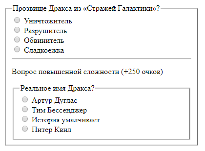
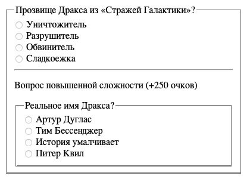
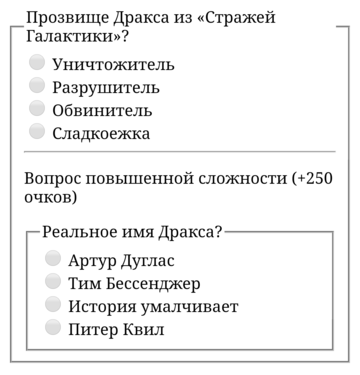

## Кратко

Добавляет заголовок в [`<fieldset>`](/html/fieldset/), который по умолчанию оформляется браузером как текст, органично вписанный в рамку.

## Пример

```html
<fieldset>
  <legend>Заголовок для группы контролов</legend>
  …
</fieldset>
```

## Как понять

`<legend>` позволяет описать содержимое `<fieldset>`, но семантически он не является «представителем» [заголовков](/html/h1-h6/), хотя выполняет схожую функцию. Он не задаёт иерархию, а лишь характеризует контент внутри «своей» группы — как [`<label>`](/html/label/) для соответствующего контрола.

## Как пишется

```html
<fieldset>
  <legend>Заголовок для группы</legend>
  …
</fieldset>
```

<aside>

⚠️ Важно, чтобы `<legend>` был первым дочерним элементом внутри `<fieldset>`. Если внутри `<fieldset>` будет больше одного `<legend>`, отобразится только первый, все остальные отобразятся как обычные блочные элементы:

</aside>

<iframe title="Меняющаяся легенда" src="demos/legend-rotate/" height="200"></iframe>

## Атрибуты

У `<legend>` нет никаких своих атрибутов, ему доступны все [глобальные атрибуты](/html/global-attrs/).

## Подсказки

Внешний вид оформления рамки по умолчанию у `<legend>` немного отличается в зависимости от браузера и операционной системы:

<section class="section section_column_2">
  <figure class="section__item">
    
    <figcaption>Windows 10, Google Chrome 71.0</figcaption>
  </figure>
  <figure class="section__item">
    
    <figcaption>macOS Big Sur, Google Chrome 71.0</figcaption>
  </figure>
  <figure class="section__item">
    
    <figcaption>Windows 10, Edge 18.0</figcaption>
  </figure>
  <figure class="section__item">
    
    <figcaption>macOS Big Sur, Safari 14.0</figcaption>
  </figure>
  <figure class="section__item">
    
    <figcaption>Samsung Galaxy S7</figcaption>
  </figure>
  <figure class="section__item">
    
    <figcaption>Google Nexus 6</figcaption>
  </figure>
</section>
