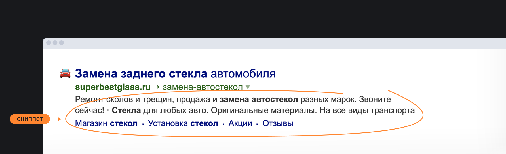

🛠 Если не задать описание для страницы при помощи `<meta name="description" content="...">`, то поисковые системы при добавлении сайта в свою базу возьмут первый попавшийся текст со страницы и составят из него так называемый сниппет — текст под заголовком сайта в поисковой выдаче.



Если хочется контролировать, что именно увидит пользователь в поиске — всегда заполняйте `description`.

🛠 Есть отдельная категория метаразметки — OG-разметка. OG расшифровывается как open graph. Такая разметка нужна для того, чтобы при вставке ссылки на ваш сайт в соцсетях в превью отображалась красивая карточка.


Стандартный набор метатегов для красивой карточки в Facebook:

```html
<meta property="og:title" content="Лучший сайт в интернете">
<meta
  property="og:description"
  content="Посетите лучший сайт в интернете и познайте тщетность бытия"
>
<meta property="og:image" content="http://best-site/thumbnail.jpg">
<meta property="og:url" content="http://best-site/index.htm">
```

Большинство соцсетей используют информацию, указанную в тегах из примера выше, для генерации превью ссылок.
