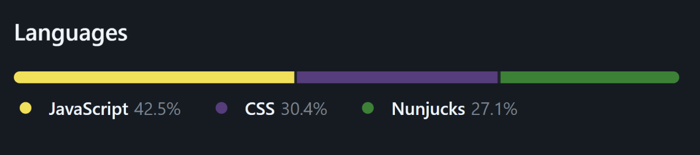

## Кратко

Тег `<meter>` нужен для визуального отображения числового значения в заданном диапазоне. Браузеры отрисовывают его в виде прогресс-бара.

У тега по умолчанию есть [роль `meter`](/a11y/role-meter/). Это делает его полезным для [скринридеров](/a11y/screenreaders/). Они будут рассказывать пользователям, что это за элемент, и какое у него текущее значение.

## Пример

```html
<p>
  Капибара победила в выборах с результатом
  <meter min="3" max="10" value="6"></meter>
</p>
```

<iframe title="Базовый пример с meter" src="demos/basic/" height="310"></iframe>

## Как пишется

`<meter>` — парный тег, который нужно закрывать. Внутрь тега можно вкладывать только текстовое содержимое. Это необязательно делать, но рекомендуется, если поддерживаете старые браузеры.

```html
<p>
  Капибара победила в выборах с результатом
  <meter min="3" max="10" value="6">
    60%
  </meter>
</p>
```

У тега может быть подпись. Лучше всего добавлять её с помощью старого-доброго [`<label>`](/html/label/).

```html
<label for="temp">Температурный рекорд в Сеуле:</label>
<meter id="temp" min="10" max="29.6" value="29.6">+ 29.6°С</meter>
```

`<meter>` визуально заполняется в зависимости от значения атрибута `value`. По умолчанию раскрашен в системные цвета Windows, macOS и других операционных систем.

Хотя `<meter>` визуально похож на [`<progress>`](/html/progress/), его используют для других целей:

- доступное место на диске;
- результаты голосования;
- распределение других результатов.

Реальный пример, где хорошо подошёл бы `<meter>`, — шкала с используемыми в проекте языками на GitHub.



Имейте в виду, что в случае `<meter>` всегда известны минимальное и максимальное значения. Так что не стоит использовать тег для диапазонов с неизвестным `max`.

<aside>

⏳ Для индикатора загрузки используйте `<progress>`, а не `<meter>`.

</aside>

### Атрибуты

У `<meter>` есть несколько атрибутов. Все значения числовые и могут быть целыми (1), дробными (0.1 или .1), положительными (2) и отрицательными (-2).

- `value` — текущее значение. По умолчанию `0`.  Должно быть в диапазоне между значениями `min` и `max`.
- `min` — нижняя граница диапазона. По умолчанию `0`. Должно быть ниже значения `max`.
- `max` — верхняя граница диапазона. По умолчанию `1`. Должно быть выше значения `min`.
- `low` — определяет, что считать нижним значением. По умолчанию равно значению `min`. Должно быть выше или равно значению `min` и меньше `high` и `max`.
- `high` — определяет, что считать высшим значением. По умолчанию равно значению `max`. Должно быть меньше или равно значению `max` и выше `low` и `min`.
- `optimum` — оптимальное значение. Должно быть в диапазоне между значениями `min` и `max`.
- `form` — дополнительный атрибут для связи формы со счётчиком, когда он не вложен внутрь [`<form>`](/html/form/).

В демке собраны разные варианты стилей `<meter>` по умолчанию.

```html
<meter class="meter" min="1" max="10">
</meter>

<meter class="meter" min="1" max="10" low="2" value="3">
</meter>

<meter class="meter" min="1" max="10" low="2" high="5" optimum="8" value="3">
</meter>

<meter class="meter" min="1" max="10" value="5">
</meter>

<meter class="meter" low=".25" optimum=".15" high=".75" value=".5">
</meter>

<meter class="meter" low=".25" optimum=".2" high=".75" value=".8">
</meter>

<meter class="meter" value="1">
</meter>
```

<iframe title="Базовый пример с meter" src="demos/default-styles/" height="910"></iframe>

Попробовать как изменяется внешний вид тега в зависимости от выбранных значений можете в этой песочнице. По мотивам примера «[HTML5 Meter Element](https://codepen.io/pankajparashar/pen/GnFpA)» <!-- yaspeller ignore:start -->Панкаджа Парашара<!-- yaspeller ignore:end -->.

<iframe title="Варианты значения атрибутов тега meter" src="demos/meter-values-sandbox/" height="710"></iframe>

### Стили

Чтобы стилизовать `<meter>` так, как требует душа художника, понадобятся [вендорные префиксы](/css/vendor-prefixes/).

- `::-webkit-meter-bar` — стили самого `<meter>`. Для Firefox можно просто стилизовать `<meter>` без префиксов.
- `::-moz-meter-bar` — стили для индикаторов внутри `<meter>`.
- `::-webkit-meter-optimum-value` — цвет фона для значения внутри диапазона `low` и `high`. По умолчанию красится в зелёный.
- `::-webkit-meter-suboptimum-value` — цвет фона для положительного значения за пределами диапазона `low` и `high`. По умолчанию жёлтый.
- `::-webkit-meter-even-less-good-value` — цвет фона для отрицательного значения за пределами диапазона `low` и `high`. По умолчанию красный.

Давайте поиграем с цветами 👨‍🎨 К сожалению, в Firefox не получится навести красоту.

```css
meter {
  width: 400px;
  height: 50px;
}

meter::-webkit-meter-bar {
  background: transparent;
  border: 0;
}

meter::-webkit-meter-optimum-value {
  background-image: linear-gradient(
    90deg,
    #FF8630 55%,
    #2E9AFF 55%
  );
}
```

<iframe title="Стилизованный тег meter" src="demos/custom-styles/" height="200"></iframe>
