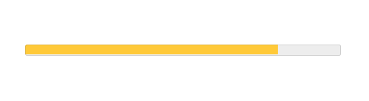

## Кратко

Тег `<meter>` используется для визуального отображения числового значения в заданном диапазоне. Браузеры, поддерживающие этот тег, отрисовывают его в виде прогресс-бара, заполненного в зависимости от значения атрибута `value` и раскрашенного в системные цвета.

## Как пишется

Возможные атрибуты:

- `value` — текущее числовое значение. По умолчанию равно `0`.
- `min` — нижняя граница диапазона. По умолчанию равно `0`.
- `max` — верхняя граница диапазона. По умолчанию равно `1`.
- `low` — определяет, что считать «низким значением». По умолчанию равно значению `min`.
- `high` — определяет, что считать «высоким значением». По умолчанию равно значению `max`.
- `optimum` — определяет оптимальное значение.

<iframe title="Разные варианты заполнения атрибутов" src="demos/every/" height="500"></iframe>
