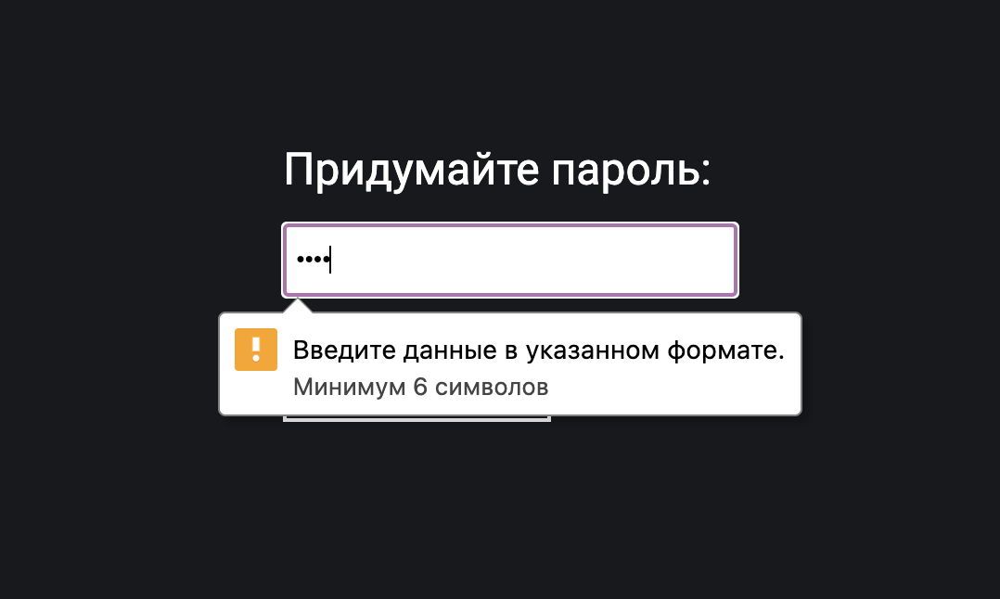

## Кратко

В атрибуте `pattern` пишется регулярное выражение, которому должно соответствовать введённое в [`<input>`](/html/input/) значение.

## Пример

В этом примере браузер проверит перед отправкой формы, что пароль не меньше 6 символов в длину:

```html
<form>
  <input type="password" pattern=".{6,}">
  <button>Отправить</button>
<form>
```

## Как пишется

Атрибут `pattern` можно применить только к тегам `<input>` и только со следующими значениями атрибута `type`:

- `text`;
- `tel`;
- `email`;
- `url`;
- `password`;
- `search`.

Значением должно быть [регулярное выражение](https://developer.mozilla.org/ru/docs/Web/JavaScript/Guide/Regular_Expressions), по которому браузер перед отправкой формы будет проверять то, что введено в поле. Если значение не соответствует регулярному выражению браузер покажет всплывающую подсказку с ошибкой. Механизм с ошибкой сработает только при отправке поля из «настоящей» формы с тегом `<form>`, без формы вам придётся проверять поле самостоятельно.

Текст всплывающей подсказки можно дополнить при помощи атрибута `title`. Большинство браузеров покажут этот текст вместе с ошибкой. В примере ниже в подсказке помимо стандартного текста будет написано «Минимум 6 символов».

```html
<label>
  Придумайте пароль:
  <input type="password" pattern=".{6,}" title="Минимум 6 символов">
</label>
```


