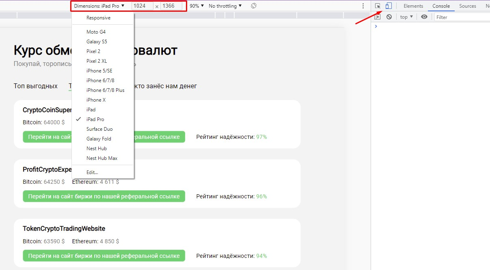

## Кратко

Pixel Perfect — это подход в вёрстке, когда итоговый результат максимально точно, пиксель в пиксель, совпадает с дизайнерским макетом. Для этого макет сайта сохраняется как обычная картинка, после чего эта картинка накладывается поверх свёрстанного сайта при помощи специальных инструментов, например, браузерных расширений. После наложения становится очевидной разница, если она есть, между тем как нарисовал дизайнер, и тем, что получилось в итоге.

## Пример

Допустим, дизайнеры подготовили нам такой макет:

Мы его сверстали, получилось вот так:

<iframe title="Результат вёрстки" src="demos/incorrect" height="400"></iframe>

Видите ли вы отличия с первого взгляда?

Давайте их найдём. Для этого есть несколько способов:

1. Можно сделать скриншот сайта и загрузить в графический редактор, после чего сравнить скриншот и исходный макет в режиме наложения. Это удобно для дизайнеров, когда нужно быстро проверить совпадение, а под рукой как раз есть открытый фотошоп. Но весьма неудобно для разработчика, потому что после каждого минимального изменения придётся делать новый скриншот и заменять им старый.
1. Можно сохранить макет картинкой, добавить её в документ с помощью тега [``](/html/img) и [разместить](/css/position/#fixed) в центре страницы. После чего можно изменить прозрачность картинки с помощью [`opacity`](/css/opacity), и отличия сразу будут видны. Это удобно при правке вёрстки, так как при изменении стилей сразу видно, насколько новая вёрстка совпадает с макетом. Однако у этого есть минус — нужно на каждую страницу сначала добавить картинку, затем написать для неё стили, а в конце не забыть её удалить. Было бы удобнее, если бы был способ это автоматизировать.
1. И такой способ есть. Браузерные расширения, такие как [PerfectPixel](https://www.welldonecode.com/perfectpixel/) берут эту рутину на себя. PerfectPixel доступен для установки в Chrome, Opera, Edge, Firefox (там доступна только платная версия), и ведётся разработка версии для Safari.

## Расширения помогают найти неточности

Для начала возьмём наш дизайн (первая картинка в этой статье) и откроем демо. Если вызвать интерфейс расширения (это можно сделать нажав на иконку расширения в списке расширений рядом с поисковой строкой браузера), то мы увидим приблизительно такой интерфейс:

В рамках этой статьи мы не будем подробно разбирать, что делает каждая кнопка. Давайте лучше отметим, что у хорошего расширения должны быть следующие функции:

1. Показать/скрыть накладываемую картинку.
1. Показывать картинку «инвертированно» — чтобы цвета заменялись на противоположные (так проще заметить отличия).
1. Возможность не блокировать картинкой выбор элементов через инспектор элементов.
1. Возможность задавать положение картинки — например, отцентрировать её по горизонтали.

Итак, давайте наложим наш дизайн на вёрстку и выберем инвертированные цвета. В итоге мы получим такой результат:

Мы сразу видим отличия:

- Съехали заголовки на карточках и цена биткоина и эфира.
- Съехало значение рейтинга надёжности.
- Кнопка «Загрузить ещё» имеет другой размер.

### Нужно ли учитывать все отличия?

Если внимательно присмотреться, то _единственным_ элементом, который расположен точно в нужном месте, является список карточек. Всё остальное хотя бы на 1 пиксель, но различается с макетом. Получается, мы только что сделали нашу работу плохо? К счастью, всё не так печально:

- Во-первых, хотя практически весь текст немного смещён, в этом нет ничего криминального. Дело в том, что в графических редакторах, в которых создаётся дизайн, процесс рендеринга шрифтов может отличаться от браузерного. Из-за этого и разъехались заголовки карточек — хотя  в дизайне мы не меняли им межбуквенное расстояние. Поэтому некоторые различия в текстовых блоках допустимы.
- Во-вторых, основной целью Pixel Perfect подхода является, как бы это парадоксально не звучало, не идеальная, а _приемлемая_ точность. Нам не нужно добиваться полного совпадения, нам нужно добиваться такого результата, при котором отличия от изначального макета будут незаметны глазу пользователя. Сейчас у большинства людей стоят мониторы размером 1920 на 1080 пикселей — если наш заголовок займёт, допустим, не 187, а 189 пикселей в ширину, абсолютно никто этого даже не заметит. Поэтому нужно критически воспринимать только серьёзные расхождения — отступы между блоками, выравнивание, размеры иконок и так далее.

## Исправляем недостатки

Когда мы заметили все отличия, давайте теперь устраним их. Для большей наглядности также слегка сожмём заголовки при помощи [`letter-spacing`](/css/letter-spacing/) — как упоминалось ранее, это абсолютно не критично, но в презентационных целях будет полезно.

В итоге получим такой результат:

<iframe title="исправленная вёрстка" src="demos/correct" height="400"></iframe>

Получилось практически идеально:

## Работа с адаптивными макетами

Зачастую наш сайт должен адаптироваться под разные разрешения — обычно это мобильные экраны (шириной до 480px), планшеты (до 1024px), ноутбуки (до 1400px) и десктопы. В таком случае дизайнер делает несколько макетов — по одному на каждое необходимое разрешение. Для того, чтобы проверить нашу вёрстку в разных разрешениях, нам помогут инструменты разработчика. Их можно открыть с помощью:

- <kbd>Control + Command + I</kbd> — на OS X
- <kbd>F12</kbd> — на Windows
- <kbd>Control + Shift + I</kbd> — на Linux

Затем нам нужно установить необходимое разрешение. Можно задать его вручную или выбрать один из предустановленных шаблонов.

После чего делаем всё так же, как раньше. Открываем расширение и добавляем картинку для соответствующего разрешения, после чего ищем отличия в вёрстке.
## Всегда ли нужен Pixel Perfect

Требования к вёрстке зависят от задачи и от того, кто её поставил. Если заказчик требуется вёрстки по Pixel Perfect — придётся соблюдать это требование. Если же заказчик не требует идеальной вёрстки (или он не знает что такое бывает), то можно придерживаться следующего алгоритма.

Верстать по Pixel Perfect нужно в том случае, если:

- Мы делаем презентационный вау-проект, когда положение каждого элемента выверено до миллиметра.
- Мы вносим изменения в сложную систему с кучей элементов. Тогда поехавшую вёрстку можно даже не заметить, а вот при использовании Pixel Perfect изменения сразу бросятся в глаза.
- Если все участники процесса понимают, для чего нужен Pixel Perfect и чего с его помощью мы пытаемся добиться. Иногда бывает, что у дизайнера дрогнула рука, и один элемент в списке случайно подвинулся на 1 пиксель. Затем макет прошёл цепочку согласований, и любая правка в нём — это недели бюрократических процессов. И тогда сплошь и рядом появляется ужасный код вида `.list-item:nth-child(4) { margin-left: 1px; }`, потому что вёрстка по Pixel Perfect — один из критериев приёмки работы заказчиком. Таких ситуаций стоит по возможности избегать, потому что подобный код лишь делает сайт тяжелее и медленнее, необходимо выстраивать более гибкие бизнес-процессы.

Но можно пренебречь идеальной вёрсткой в следующих случаях.

- Если скорость разработки сильно важна. Например, мы делаем стартап, и если завтра не выйдем на рынок, то это сделают конкуренты. В таком случае _какая-нибудь_ вёрстка, но сделанная быстро, гораздо лучше идеальной, на полировку которой ушли драгоценные часы.
- Если точность вёрстки не важна вообще. Например, мы делаем прототип продукта, который потом будет ещё 10 раз переделываться, или панель администрирования, которой будут пользоваться технические специалисты, а не пользователи. Безусловно, это не значит что мы можем в таком случае верстать как угодно, но и идеала добиваться не стоит.
- Если точная вёрстка в принципе недостижима. Например, у графических редакторов, таких как фотошоп, рендеринг шрифтов может отличаться от браузерного. И тогда мы не сможем _адекватно_ добиться, чтобы текст в браузере выглядел в точности так, как в фотошопе — придётся играться с [`letter-spacing`](/css/letter-spacing/), разделять текст на лишние блоки и заниматься прочей уличной магией. Таких манипуляций стоит избегать.

### Если вы новичок

Когда вы только начинаете путь в веб-разработке и вёрстке, использование Pixel Perfect подхода крайне желательно. Это поможет вам развить очень важные качества:

- Глазомер. После получения определённого опыта вы сможете буквально с одного взгляда замечать неточности в вёрстке.
- Чувство визуального ритма. Дизайнеры выбирают отступы между элементами, размеры шрифтов и иконок и т. д., основываясь на определённых критериях визуального ритма, которые помогают сделать сайт более приятным для глаза. Если вы будете постоянно следовать макетам дизайнеров, чувство визуального ритма разовьётся и у вас.
- Внимательность и дотошность. Один из основных критериев хорошего программиста или верстальщика — способность внимательно и сфокусированно выполнять свою работу, не допуская неточностей.

## Итог

1. Используйте Pixel Perfect подход, чтобы найти отличия получившейся вёрстки от исходного макета.
1. Не страдайте излишним перфекционизмом — обращайте внимание только на значимые отличия.
1. Обговорите требования к точности перед началом работы. При необходимости объясните коллегам, почему абсолютное совпадение макета и вёрстки не всегда достижимо, и что в этом нет ничего сильно страшного.
