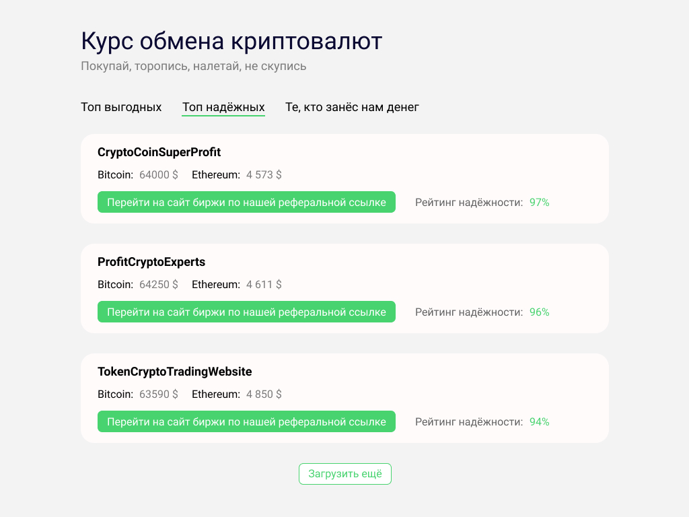
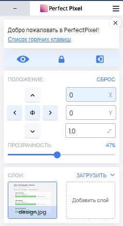
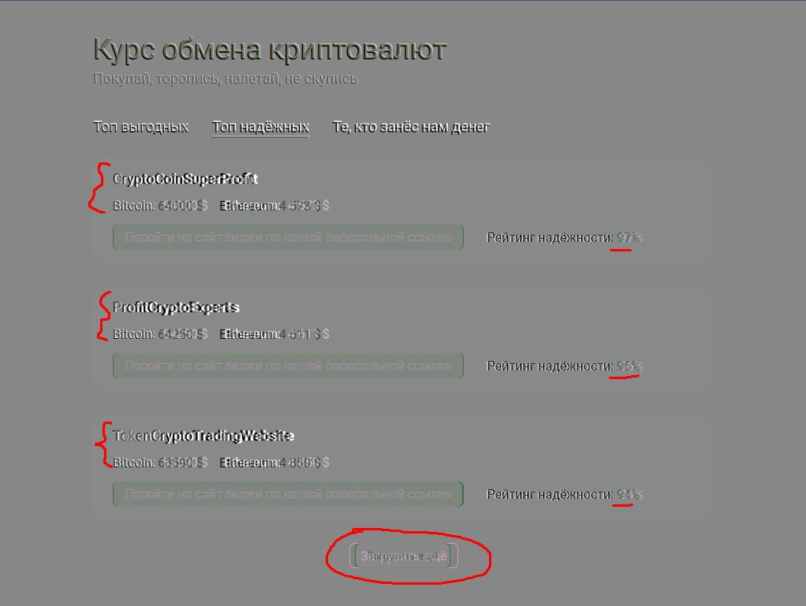
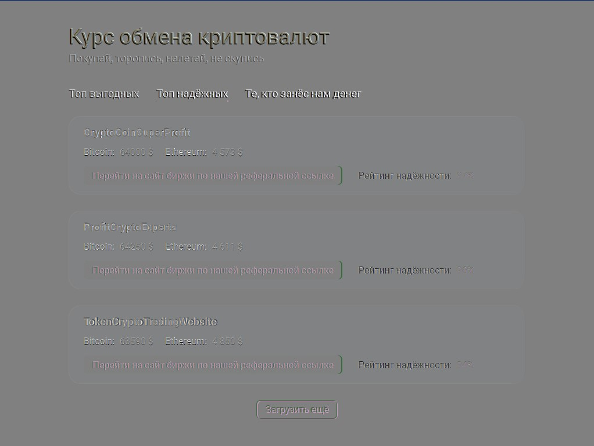
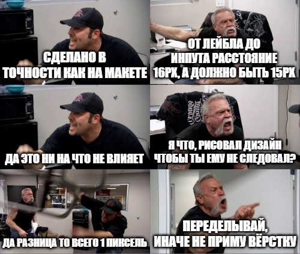

## Кратко

Pixel Perfect — это подход в вёрстке, когда итоговый результат максимально точно, пиксель в пиксель, совпадает с дизайнерским макетом. Для этого макет сайта сохраняется как обычная картинка, после чего эта картинка накладывается поверх свёрстанного сайта при помощи специальных инструментов, например, браузерных расширений. После наложения становится очевидной разница, если она есть, между тем как нарисовал дизайнер, и тем, что получилось в итоге.

## Пример

Допустим, дизайнеры подготовили нам такой макет:

Мы его сверстали, получилось вот так:

<iframe title="Результат вёрстки" src="demos/incorrect" height="400"></iframe>

Видите ли вы отличия с первого взгляда?

Давайте их найдём. Для этого нам помогут браузерные расширения, такие как [PerfectPixel](https://chrome.google.com/webstore/detail/perfectpixel-by-welldonec/dkaagdgjmgdmbnecmcefdhjekcoceebi).

## Расширения помогают найти неточности

Для начала возьмём наш дизайн (первая картинка в этой статье) и откроем демо. Если вызвать интерфейс расширения (это можно сделать нажав на иконку расширения в списке расширений рядом с поисковой строкой браузера), то мы увидим приблизительно такой интерфейс:

В рамках этой статьи мы не будем подробно разбирать, что делает каждая кнопка. Давайте лучше отметим, что у хорошего расширения должны быть следующие функции:

1. Показать/скрыть накладываемую картинку.
1. Показывать картинку «инвертированно» — чтобы цвета заменялись на противоположные (так проще заметить отличия).
1. Возможность не блокировать картинкой выбор элементов через инспектор элементов.
1. Возможность задавать положение картинки — например, отцентрировать её по горизонтали.

Итак, давайте наложим наш дизайн на вёрстку и выберем инвертированные цвета. В итоге мы получим такой результат:

Мы сразу видим отличия:

- Съехали заголовки на карточках и цена биткоина и эфира.
- Съехало значение рейтинга надёжности.
- Кнопка «Загрузить ещё» имеет другой размер.

### Нужно ли учитывать все отличия?

Если внимательно присмотреться, то _единственным_ элементом, который расположен точно в нужном месте, является список карточек. Всё остальное хотя бы на 1 пиксель, но различается с макетом. Получается, мы только что сделали нашу работу плохо? К счастью, всё не так печально:

- Во-первых, хотя практически весь текст немного смещён, в этом нет ничего криминального. Дело в том, что в графических редакторах, в которых создаётся дизайн, процесс рендеринга шрифтов может отличаться от браузерного. Из-за этого и разъехались заголовки карточек — хотя  в дизайне мы не меняли им межбуквенное расстояние. Поэтому некоторые различия в текстовых блоках допустимы.
- Во-вторых, основной целью Pixel Perfect подхода является, как бы это парадоксально не звучало, не идеальная, а _приемлемая_ точность. Нам не нужно добиваться полного совпадения, нам нужно добиваться такого результата, при котором отличия от изначального макета будут незаметны глазу пользователя. Сейчас у большинства людей стоят мониторы размером 1920 на 1080 пикселей — если наш заголовок займёт, допустим, не 187, а 189 пикселей в ширину, абсолютно никто этого даже не заметит. Поэтому нужно критически воспринимать только серьёзные расхождения — отступы между блоками, выравнивание, размеры иконок и так далее.

## Исправляем недостатки

Когда мы заметили все отличия, давайте теперь устраним их. Для большей наглядности также слегка сожмём заголовки при помощи [`letter-spacing`](/css/letter-spacing/) — как упоминалось ранее, это абсолютно не критично, но в презентационных целях будет полезно.

В итоге получим такой результат:

<iframe title="исправленная вёрстка" src="demos/correct" height="400"></iframe>

Получилось практически идеально:

## Всегда ли нужен Pixel Perfect

А нужно ли вообще постоянно стремиться к идеалу? Вопрос достаточно холиварный. Есть два противоположных мнения — кто-то считает, что любая вёрстка должна идеально совпадать с макетом, а иначе какой смысл был отрисовывать весь макет (обычно это дизайнеры), а кто-то считает, что излишний перфекционизм ни к чему хорошему не приводит и главное, чтобы итоговый результат выглядел _почти_ как на макете (обычно это верстальщики/разработчики).

Когда люди из этих лагерей встречаются, у них обычно происходит следующий диалог:

Чтобы такого не было, лучше установить правила. Лучше всегда верстать по Pixel Perfect — да, это может занимать больше времени, но потратив немного времени на подгонку вёрстки по макету, мы сэкономим гораздо больше времени, которое ушло бы на споры о том, допустимо ли вот эту конкретную кнопку сделать шириной не 15, а 20 пикселей.

### Только ситхи всё возводят в абсолют

Если есть два противоположных мнения — обычно истина находится посередине. Да, нужно стремиться максимально соответствовать макету, но есть некоторые случаи когда этими правилами можно пренебрегать:

- Если скорость разработки сильно важна. Например, мы делаем стартап, и если завтра не выйдем на рынок, то это сделают конкуренты. В таком случае _какая-нибудь_ вёрстка, но сделанная быстро, гораздо лучше идеальной, на полировку которой ушли драгоценные часы.
- Если точность вёрстки не важна вообще. Например, мы делаем прототип продукта, который потом будет ещё 10 раз переделываться. Если на каждой итерации вылизывать вёрстку до идеала, то мы потратим кучу времени, которое могло бы пойти на разработку нового функционала.
- Если все участники процесса понимают, для чего нужен Pixel Perfect и чего с его помощью мы пытаемся добиться. Иногда бывает, что в макете случайно съехал в сторону один из пунктов меню, и от разработчиков требуют добавлять отступ, чтобы было «в точности как на макете». И тогда появляется ужасный код вида `.list-item:nth-child(4) { margin-left: 1px; }` — так делать, конечно, не стоит.
- Если точная вёрстка в принципе достижима. Например, у графических редакторов, таких как фотошоп, рендеринг шрифтов может отличаться от браузерного. И тогда мы не сможем _адекватно_ добиться, чтобы текст в браузере выглядел в точности так, как в фотошопе — придётся играться с [`letter-spacing`](/css/letter-spacing/), разделять текст на лишние блоки и заниматься прочей уличной магией. Таких манипуляций тоже стоит избегать.

## Итог

1. Используйте Pixel Perfect подход, чтобы найти отличия получившейся вёрстки от исходного макета.
1. Не страдайте излишним перфекционизмом — обращайте внимание только на значимые отличия.
1. Обговорите требования к точности перед началом работы. При необходимости объясните коллегам, почему абсолютное совпадение макета и вёрстки не всегда достижимо, и что в этом нет ничего сильно страшного.
