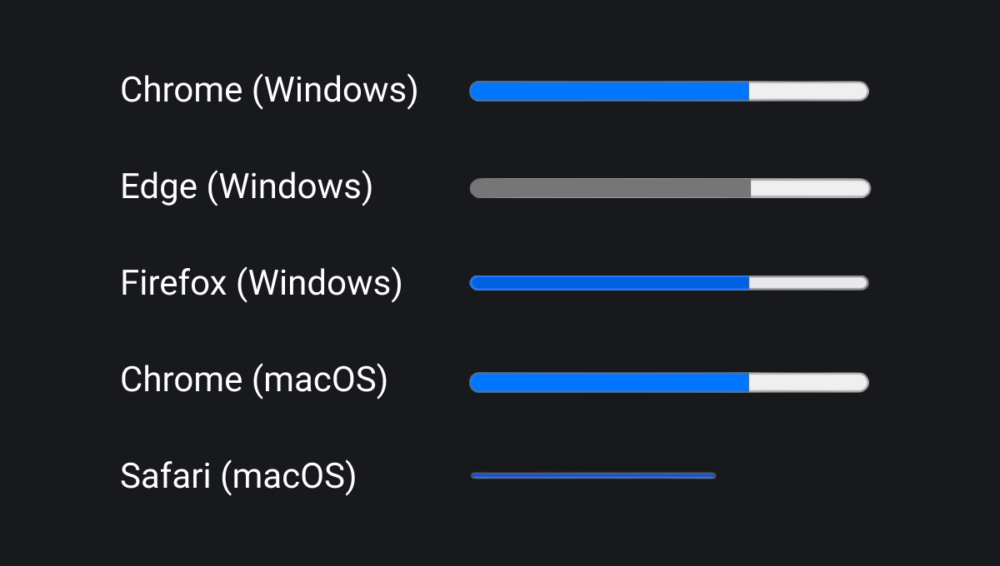

🛠 Внешний вид элемента `<progress>` может быть разным — это зависит от браузера и операционной системы устройства пользователя. Вот так стандартный прогресс-бар будет выглядеть на устройствах с macOS и Windows:



Если надо чтобы прогресс-бар выглядел везде одинаково, то нужно стилизовать его. Например, следующее правило убирает границу элемента, которая есть по умолчанию, и меняет цвет фона:

```css
progress {
  border: none;
  background-color: #5068f6;
}
```

Но в Firefox эти стили не затронут бегунок, поэтому дополнительно потребуется использовать [вендорный префикс](/css/vendor-prefixes/) `-moz`. А вот для стилизации в Chrome и Safari как самого элемента, так и его бегунка, необходимо использовать префиксы `-webkit`.

Поэтому для того, чтобы прогресс-бар и бегунок выглядели одинаково во всех основных браузерах, нам потребуется добавить следующие правила:

```css
progress::-moz-progress-bar {
  border: none;
  background-color: #5068f6;
}

progress::-webkit-progress-bar {
  border: none;
  background-color: #5068f6;
}

progress::-webkit-progress-value {
  background-color: #5068f6;
}
```

<iframe title="Пример индикатора загрузки" src="../demos/basic/" height="190"></iframe>
