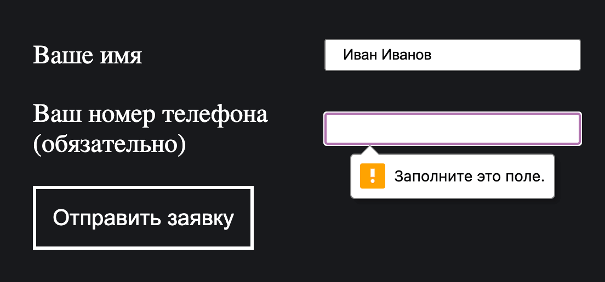

## Кратко

Атрибут `required` добавляется обязательным полям формы. Если поле с таким атрибутом не заполнено, то при отправке формы браузер покажет предупреждение и отменит отправку.

## Пример

В примере ниже поле для телефона является обязательным:

```html
<form>
  <label>
    Ваше имя:
    <input type="text">
  </label>
  <label>
    Ваш номер телефона (обязательно):
    <input type="tel" required>
  </label>
  <button type="submit">Отправить заявку</button>
</form>
```

## Как пишется

Достаточно написать атрибут `required` без значения, ведь он булевый: если он есть — поле обязательное, а если нет — не обязательное. Если вам по какой-то причине нельзя использовать булевы атрибуты (например, в XML-разметке), напишите `required="required"`.

Атрибут `required` можно использовать для [`<select>`](/html/select/), [`<textarea>`](/html/textarea/), а также для [`<input>`](/html/input/) со следующими типами:

- `text`,
- `search`,
- `url`,
- `tel`,
- `email`,
- `password`,
- `date`,
- `month`,
- `week`,
- `time`,
- `datetime-local`,
- `number`,
- `checkbox`,
- `radio`,
- `file`.

Если в группе радиокнопок с одинаковым значением атрибута `name` хотя бы у одной указан атрибут `required`, то вся группа будет считаться обязательной. Поэтому лучше явно прописывать `required` всем радиокнопкам в группе. При этом для чекбоксов с одинаковыми именами это не работает. Обязательным будет только тот чекбокс, у которого прописан атрибут.

Атрибут не сработает для любых кнопок, а также для полей ввода с типами `color` и `range`. Причина в том, что у таких полей существует значение по умолчанию, даже если оно явно не прописано в атрибуте `value`. У `<input type="color">` это `#000000`, а у `<input type="range">` это среднее значение между `min` и `max`. Так что браузер посчитает их заполненными в любом случае и не покажет предупреждение.

Кроме того, атрибут `required` не работает для скрытых полей `type="hidden"` и для полей с атрибутом `readonly`.

## Как понять

В момент отправки формы браузер выполняет валидацию введённых данных. Если поле, у которого есть атрибут `required`, не заполнено, то браузер не позволит отправить форму и покажет сообщение. Внешний вид и текст сообщения может отличаться в разных браузерах. Сообщение в Google Chrome:



## Подсказки

💡 Поля с атрибутом `required` можно стилизовать при помощи псевдокласса [`:required`](/css/required/). Поля, у которых нет этого атрибута, стилизуются псевдоклассом `:optional`.
