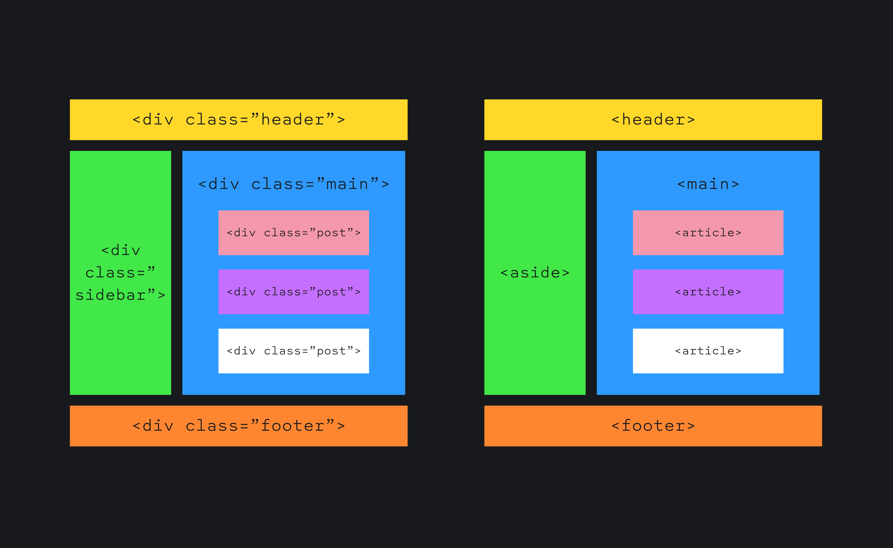
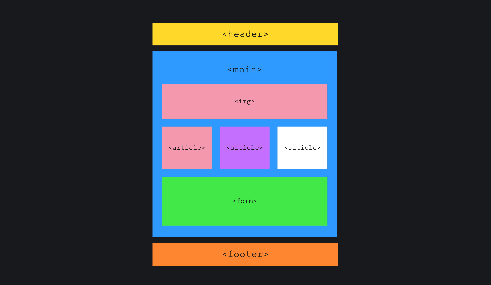
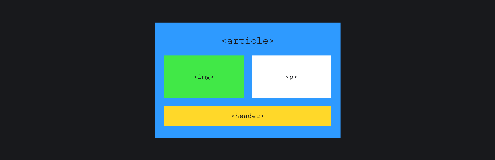

## Кратко

Семантическая вёрстка — стандартный подход к написанию HTML-разметки страниц. При этом подходе описывают смысл элементов интерфейса и их взаимосвязи не только визуально, но и на уровне разметки. Это делают с помощью семантических HTML-тегов и атрибутов.

В семантические теги уже встроены [роли](/a11y/aria-roles/), а ещё [состояния и свойства](/a11y/aria-attrs/). Роли как раз описывают смысл элемента, а состояния и свойства дают дополнительную информацию: выбран или не выбран чекбокс, активно или неактивно поле в форме и так далее.

## Семантические теги и атрибуты

Для простоты условно разделим семантические теги на две большие группы — секционные и контентные. Полный список элементов найдёте [в HTML Living Standard](https://html.spec.whatwg.org/multipage/).

Секционные теги делят HTML-документ на большие логические блоки (секции):

- [`<article>`](/html/article/) — самостоятельный блок контента, например, превью поста в блоге, карточка товара или рекламный баннер.
- [`<aside>`](/html/aside/) — дополнительный, менее важный контент, например, боковая плавающая навигация (сайдбар) или врезка в тексте.
- [`<nav>`](/html/nav/) — основная или дополнительная навигация со ссылками на другие страницы или отдельные разделы.
- [`<section>`](/html/section/) — блок, который объединяет содержимое по смыслу; используют для отделения одной смысловой части от другой.
- [`<main>`](/html/main/) — основное содержимое страницы.
- [`<header>`](/html/header/) — вводное содержимое или навигация. Не привязан к конкретному месту страницы и отдельной секции, но традиционно используется для создания основной навигации по сайту — шапки (хедера). Также можно использовать для оборачивания оглавления раздела, заголовка статьи с вводной информацией о ней и т. д.
- [`<footer>`](/html/footer/) — дополнительная информация о сайте или части одной страницы. Тоже не привязан к части страницы или отдельной секции. Например, подвал (футер) может быть у превью поста и содержать информацию о дате публикации и авторе.

В этом примере карточки у `<article>` есть дата начала курса, которую удобно поместить в футер:

```html
<article>
  <header>
    <h2>SEO для начинающих</h2>
    <span class="author">Иван Иванович</span>
  </header>

  <p>
    Благодаря этому курсу вы научитесь задавливать конкурентов
    с помощью ссылочной массы, а не качественного контента.
  </p>

  <footer>
    <time datetime="2023-02-13">
      13 февраля 2023
    </time>
  </footer>
</article>
```

Контентные теги точечно описывают смысл частичек и типов содержимого — контента. Перечислим только некоторые теги, на самом деле их гораздо больше:

- [`<h1>`-`<h6>`](/html/h1-h6/) — для определения заголовков на странице. `<h1>` используют для основного заголовка документа или раздела. Остальные нужны для подзаголовков; они описывают структуру и иерархию текстового содержимого.
- [`<button>`](/html/button/) — для кнопок. Используют для отправки форм и выполнения других команд.
- [``](/html/img/) — для картинок.
- [`<table>`](/html/tables/) — для таблиц. Состоят из нескольких элементов для структурирования табличных данных: строк `<tr>`, заголовочных ячеек `<th>` и ячеек с данными `<td>`.
- [`<ul>`](/html/ul/) — неупорядоченный маркированный список.
- [`<a>`](/html/a/) — для ссылок, с помощью которых пользователи переходят от одной страницы к другой.
- [`<p>`](/html/p/) — для абзацев текста. Это основные блоки текста в HTML; логически разграничивают части текста с общей мыслью или идеей.

С семантическими тегами вы тоже, скорее всего, знакомы. Это [глобальные атрибуты](/html/global-attrs/) `title` для дополнительной информации об элементе, `lang` для языка текстового содержимого, `translate` для перевода с одного языка на другой и `dir` для направления письма.

## Зачем нужна семантика

Кто-то может подумать, что расставлять теги кнопок, изображений, ссылок, видео, таблиц и списков слишком долго и бессмысленно. Проще сверстать всё на [`<div>`](/html/div/) и [`<span>`](/html/span/). Чтобы это опровергнуть, обсудим преимущества семантической вёрстки и чем она лучше «дивной».

### Поддержка и читаемость кода

Исходный код проекта с вниманием к семантике легче поддерживать. В нём проще ориентироваться, а любой член команды сразу видит логику отдельных элементов и общую структуру интерфейса. Польза семантики особенно заметна, когда проект постоянно развивается и обзаводится новыми компонентами. В такой код проще и быстрее вносить изменения.

Семантическая вёрстка экономит время разработчиков и уменьшает количество строчек кода. Например, у `<button>` и [`<input>`](/html/input/) уже есть стили по умолчанию и встроены обработчики событий: их не нужно писать руками. Чтобы воспроизвести нативное поведение кнопки, нужно слушать события `keydown` при нажатии на <kbd>Enter</kbd> и `keyup` для пробела и <kbd>Enter</kbd>. Размеры файлов со стилями и скриптами напрямую влияют на _производительность сайта (perfomance)_. Чем больше вес файлов, тем дольше грузится страница. Подробнее о производительности позже.

Отдельная статья расходов времени при переписывании кода (рефакторинге) — внедрение доступности. Плохой код приводит ко многим проблемам с доступностью. Если команда не подумала о семантической разметке с самого начала, время на внедрение доступности в проект увеличивается в несколько раз.

### UX, юзабилити и доступность

Семантика — основа хорошего пользовательского опыта или UX (user experience). Хороший UX складывается из лёгкого и успешного взаимодействия с интерфейсами (юзабилити), полезного содержимого, доступности для пользователей с инвалидностью и общей удовлетворённости от всего процесса.

Поговорим подробнее про пользу семантики для доступности. Зрячим пользователям обычно легче ориентироваться на сайте, чем тем, кто его не видит. Люди со слепотой и слабовидящие используют [скринридеры](/a11y/screenreaders/), экранные лупы и другие вспомогательные технологии для взаимодействия со страницами.

Логичная HTML-разметка улучшает опыт пользователей вспомогательных технологий и устраняет барьеры, из-за которых невозможно пользоваться сайтом. К примеру, скринридер расскажет пользователям, что `<button>` — это кнопка. Пользователи голосового управления могут кликнуть по элементу `<button>` с помощью команды «кнопка, клик». У чекбоксов есть состояния `checked` и `unchecked`. Благодаря им люди могут услышать, какой чекбокс выбран, а какой нет. В `<h1>`−`<h6>` встроено свойство для уровня заголовка — `level`. Скринридеры зачитывают уровень заголовка вместе с ролью: заголовок первого уровня или заголовок четвёртого уровня. Так структуру страницы смогут представить те, кто слушает интерфейсы.

Другой плюс продуманной HTML-разметки — навигация для скринридеров. Теги вроде `<header>` и `<footer>` — ориентиры. Это значит, что пользователи могут перемещаться по отдельным блокам страницы с помощью горячих клавиш.

<aside>

☝️ `<header>`, `<footer>`, `<section>` и другие элементы становятся доступными для навигации, если они напрямую вложены в [`<body>`](/html/body/).

</aside>

Скринридеры могут перемещаться и по заголовкам, а это самый популярный [метод поиска информации по странице](https://webaim.org/projects/screenreadersurvey10/#finding).

Другая неочевидная польза семантической вёрстки — вам не придётся стилизовать сайт отдельно под [режим принудительных цветов](/a11y/forced-colors/), например, режим высокой контрастности в Windows. В его случае количество цветов ограничивается до небольшой палитры. Если кнопка свёрстана на [`<div>`](/html/div/), система не заменит цвет элемента на системный.

### Поисковая оптимизация

Поисковики стерпят всё и поймут вас в любом случае, даже если общаетесь с ними на языке дивов. Однако семантика упрощает им работу и позитивно влияет на поисковую оптимизацию сайтов — SEO (search engine optimization), а именно:

- улучшает точность индексации страниц;
- повышает показатели производительности сайта;
- увеличивает органический трафик и количество кликов;
- гарантирует ~~спокойную старость~~ спокойное будущее.

**Более точная индексация**. Семантическая вёрстка дружит с поисковыми движками, например, Google и Bing. Если коротко, то за попадание сайта в выдачу (да повыше) отвечают поисковые роботы. Они трудятся как пчёлки: ходят по страницам и индексируют их день и ночь 🐝 Такие роботы стали «умнее» из-за бума искусственного интеллекта и конкретно из-за больших лингвистических моделей. Теперь поисковые роботы быстрее и точнее индексируют страницы, но всё равно не всегда понимают контекст.

Семантика дополняет другие факторы ранжирования и раскрывает больше информации о структуре сайта, темах страниц и связях между разными видами контента. Поисковые роботы точнее определяют главную тему страницы по заголовку `<h1>` и атрибуту [`title`](/html/title/). Ряд семантических тегов наводит мосты между типами контента. Например, между видео [`<video>`](/html/video/) и скрытыми субтитрами в `<track>` .

<details>
  <summary>Основные факторы ранжирования</summary>

В первую очередь поисковые движки смотрят на микроразметку. Все хоть раз слышали о [Schema.org](https://schema.org). _Микроразметка (microdata)_ состоит из дополнительных тегов и атрибутов. Благодаря им поисковые роботы узнают, какой контент индексируют.

На положение сайта в выдаче влияет и само содержимое. Тот же Google собирает не только информацию о технической оптимизации, но и привлекает людей для [оценки качества страниц](https://services.google.com/fh/files/misc/hsw-sqrg.pdf). Оценка складывается из _E-E-A-T_: опыта (experience), экспертизы (expertise), авторитетности (authoritativeness) и надёжности (trustworthiness) контента. Поэтому сайты с уникальным, понятным, достоверным, актуальным содержимым попадают на первую страницу поиска.

</details>

Графика индексируется наравне с другим контентом, и изображения, бережно описанные в атрибуте `alt`, с большей вероятностью попадут в выдачу по картинкам. Хотя Google и Bing используют компьютерное зрение для создания автоматических описаний, ручные альтернативные описания всё равно предпочтительнее сгенерированных искусственным интеллектом. Это снова связано с пониманием контекста: в отличие от роботов, вы точно знаете, что передавали картинкой с мемом про собаку на фоне пожара 🐕

В [документации Google по SEO](https://developers.google.com/search/docs/) есть [предупреждение о неправильном использовании `alt`](https://developers.google.com/search/docs/appearance/google-images/). В атрибут нельзя добавлять много ключевых слов, особенно продающих. Если нарушить правило, сайт потенциально понизится в выдаче или отметится как спам.

**Лучшая производительность**. Производительность — ключевой фактор ранжирования. Браузеры лучше работают с чистым и хорошо организованным кодом. Семантическая разметка как раз избавляет от лишнего JavaScript и CSS, а это ускоряет загрузку страниц.

<aside>

🐳 У производительности сайтов много метрик, но для ранжирования Google оценивает [три ключевых показателя (Core Web Vitals)](https://web.dev/articles/defining-core-web-vitals-thresholds). Это скорость загрузки основного контента (LCP), скорость реакции страницы на действия пользователей (INP) и скорость, с которой элементы занимают свои места в загружающемся интерфейсе (CLS).

</aside>

**Рост органического трафика**. Органический трафик (organic traffic) — это количество пользователей, которые перешли на сайт из поисковой выдачи, а не по рекламным ссылкам и баннерам.

Один из источников органического трафика — [сниппеты](https://developers.google.com/search/docs/appearance/featured-snippets) на первой странице с выдачей. К примеру, в Google под название страницы попадают заголовки второго уровня `<h2>` и ссылки из основной навигации `<nav>`. Ещё больше смысла добавляет простое и ёмкое описание из атрибута [`description`](/html/meta/). Пользователи больше доверяют сайтам, которые прозрачны и заранее предупреждают, чего от них ждать.

Другой сниппет Google, «Пользователи также ищут», ещё один способ привести больше пользователей. Чем прозрачнее тематика и структура сайта для поисковых роботов, тем проще попасть в этот блок на главной поиска.

С пользовательским трафиком связаны _показатели кликабельности (click-through rate, CTR)_. Это общее количество кликов по ссылкам. Когда на страницу переходит много людей, это хороший знак для поисковиков. Значит, содержимое сайта релевантно поисковым запросам пользователей. Благодаря кликам страницы повышаются в выдаче.

**Вклад в будущие поисковые алгоритмы**. Всё течёт, всё меняется, и SEO тоже. Компании разрабатывают новые алгоритмы поиска, основанные на искусственном интеллекте. Например, Microsoft уже запустила [поумневший движок Bing](https://blogs.microsoft.com/blog/2023/02/07/reinventing-search-with-a-new-ai-powered-microsoft-bing-and-edge-your-copilot-for-the-web/). Google работает над новым движком [«Проект "Маги"»](https://seo.ai/blog/google-project-magi) 🧙‍♂️

Основные отличия новых алгоритмов поиска от старых — естественный диалог с уточнениями вместо перечисления ключевых слов. Задача будущих поисковых систем не перечислить все более-менее подходящие ссылки, а отдать персонализированный набор цитат и их источников.

Ключевыми факторами могут стать качественные клики (qualified clicks), качество и актуальность контента, и UX в целом. UX подразумевает юзабилити и доступность, а они в хороших отношениях с семантикой. Так что семантическая вёрстка может оказаться важнее микроразметки и производительности.

## Как семантически разметить страницу

**Первый шаг**. Смотрим на крупные логические блоки страницы и выбираем подходящие теги. Например, `<header>`, `<footer>`, `<main>`, `<nav>` или `<aside>`.

Можете использовать такое правило при выборе тега. Если задаёте дивам классы вроде `header`, `sidebar`, `content`, `post` и `footer`, подумайте, не подходят ли больше элементы `<header>`, `<aside>`, `<main>`, `<article>` и `<footer>`. Из любого правила есть исключение: контекст интерфейса и содержимого важнее.


Сравнение несемантической и семантической структуры сайта.

Предыдущая схема — один из многих вариантов раскладки. Обычно на страницах повторяются только `<header>`, `<footer>` и `<main>`. В этой схеме, к примеру, есть хедер, основная часть с картинкой ``, с несколькими превью `<article>` и формой `<form>`, а также футер.



Приблизим карточку с превью поста. В блоке `<article>` размещаются картинка, параграф текста `<p>` и хедер с заголовком и другой информацией о посте.



**Второй шаг**. Смотрим на содержимое всей страницы и отдельных, более мелких блоков на ней. Расставляем заголовки [`<h1>`-`<h6>`](/html/h1-h6/). Хороший тон использовать один `<h1>`. После в правильном порядке располагаем заголовки других уровней.

Представим, что на странице есть заголовок первого уровня и несколько подзаголовков второго и третьего уровней. После `<h1>` идёт `<h2>`, после — пара `<h3>`, которые находятся в том же блоке. Следующая секция опять начинается с `<h2>`.

```html
<main>
  <section>
    <h1></h1>
    <p></p>
  </section>

  <section>
    <h2></h2>
    <p></p>

    <h3></h3>
    <p></p>

    <h3></h3>
    <p></p>
  </section>

  <section>
    <h2></h2>
    <p></p>
  </section>
</main>
```

**Третий шаг**. Переходим к небольшим смысловым блокам. Это списки, таблицы, примеры кода, цитаты и похожие элементы.

**Четвёртый шаг**. Разбираемся с самыми мелкими частями содержимого: параграфами, кнопками, ссылками, временем, изображениями, видео и т. д.

## Примеры

### Вёрстка с `<div>` и `<span>`

Сверстаем страницу вымышленного сайта про SEO двумя способами: с семантикой и без.

Начнём с примера без семантики:

<iframe title="Несемантическая вёрстка" src="demos/bad-markup/" height="1210"></iframe>

Заглянем в HTML-код из демо:

```html
<div class="container">
  <div class="header">
    <div class="nav">
      <a href="#" class="nav__item">Главная</a>
      <a href="#" class="nav__item">Блог</a>
      <a href="#" class="nav__item">Контакты</a>
    </div>
  </div>
  <div class="main">
    <span class="heading">Курсы компании «Гарцующий пони»</span>
    <div class="wrapper">
      <div class="card">
        <div class="card__header">
          <span class="card__heading">SEO для начинающих</span>
          <span class="card__author">Иван Иванович</span>
        </div>
        <div class="card__content">
          
          <span class="card__description">
            Благодаря этому курсу вы научитесь задавливать конкурентов
            с помощью ссылочной массы, а не качественного контента.
          </span>
        </div>
        <div class="card__footer">
          <span>13 февраля 2023</span>
        </div>
      </div>

      <div class="card">
        <div class="card__header">
          <span class="card__heading">
            WordPress разработка
          </span>
          <span class="card__author">Ольга Ольгина</span>
        </div>
        <div class="card__content">
          
          <span class="card__description">
            WordPress — топ за свои деньги. Изучите его, чтобы стать
            востребованным фрилансером.
          </span>
        </div>
        <div class="card__footer">
          <span>23 октября 2023</span>
        </div>
      </div>

      <div class="card">
        <div class="card__header">
          <span class="card__heading">JavaScript для чайников</span>
          <p class="card__author">М. Михайловских</p>
        </div>
        <div class="card__content">
          
          <span class="card__description">
            Курс подойдёт для любых чайников: электрических, газовых
            и даже для кастрюлек, временно подменяющих сломанный чайник.
          </span>
        </div>
        <div class="card__footer">
          <span>30 ноября 2023</span>
        </div>
      </div>
    </div>
  </div>
  <div class="footer">
    <span class="copyright">
      2023. Разработано компанией
      <a class="copyright__link" href="#">«Гарцующий пони»</a>
    </span>
  </div>
</div>
```

В предыдущем примере мы избегали семантических элементов и рассчитывали только на `<div>` и [`<span>`](/html/span/). Заменим ничего не значащие `<div>` и `<span>` на подходящие элементы. Хедер, футер, ссылки, заголовки — всё, наконец, обрело смысл.

<iframe title="Семантическая вёрстка" src="demos/good-markup/" height="1210"></iframe>

Посмотрим на улучшенный код:

```html
<header class="header">
  <nav class="nav">
    <a href="#" class="nav__item">Главная</a>
    <a href="#" class="nav__item">Блог</a>
    <a href="#" class="nav__item">Контакты</a>
  </nav>
</header>
<main class="main">
  <h1 class="heading">Курсы компании «Гарцующий пони»</h1>
  <div class="wrapper">
    <article class="card">
      <header class="card__header">
        <h2 class="card__heading">SEO для начинающих</h2>
        <p class="card__author">Иван Иванович</p>
      </header>
      <div class="card__content">
        
        <p class="card__description">
          Благодаря этому курсу вы научитесь задавливать конкурентов
          с помощью ссылочной массы, а не качественного контента.
        </p>
      </div>
      <footer class="card__footer">
        <time
          class="card__date"
          datetime="2023-02-13"
        >
          13 февраля 2023
        </time>
      </footer>
    </article>

    <article class="card">
      <header class="card__header">
        <h2 class="card__heading">WordPress разработка</h2>
        <p class="card__author">Ольга Ольгина</p>
      </header>
      <div class="card__content">
        
        <p class="card__description">
          WordPress — топ за свои деньги. Изучите его,
          чтобы стать востребованным фрилансером.
        </p>
      </div>
      <footer class="card__footer">
        <time
          class="card__date"
          datetime="2023-10-23"
        >
          23 октября 2023
        </time>
      </footer>
    </article>

    <article class="card">
      <header class="card__header">
        <h2 class="card__heading">JavaScript для чайников</h2>
        <p class="card__author">М. Михайловских</p>
      </header>
      <div class="card__content">
        
        <p class="card__description">
          Курс подойдёт для любых чайников: электрических, газовых
          и даже для кастрюлек, временно подменяющих сломанный чайник.
        </p>
      </div>
      <footer class="card__footer">
        <time
          class="card__date"
          datetime="2023-11-30"
        >
          30 ноября 2023
        </time>
      </footer>
    </article>
  </div>
</main>
<footer class="footer">
  <p class="copyright">
    2023. Разработано компанией
    <a class="copyright__link"href="#">«Гарцующий пони»</a>
  </p>
</footer>
```
