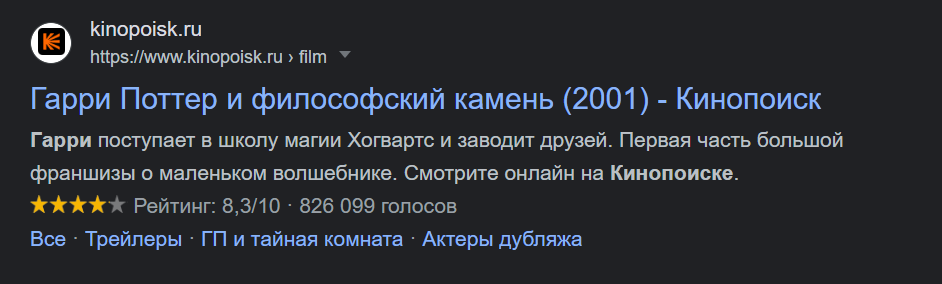

## Кратко

Поисковая оптимизация, SEO (Search Engine Optimization) — это комплекс работ по улучшению позиций сайта в поисковой выдаче. Поисковой выдачей называют результаты поиска по запросу, который пользователь вводит в поисковике.

Цель поисковой оптимизации — увеличение количества посетителей сайта.

## Зачем нужна оптимизация?

Конечной целью поисковой оптимизации является привлечение большего количества органического трафика (естественных пользователей) на свой сайт.

Многие сайты размещают у себя рекламу и их заработок зависит от количества посетителей сайта. Сайты услуг зарабатывают на заказах. Чем выше они находятся в поисковой выдаче, тем больше к ним приходит клиентов.

Вся суть поискового продвижения зачастую заключается в большем заработке на собственном сайте.

## Издержки поисковой оптимизации

Основной проблемой продвижение сайтов является отсутствие чёткого и стабильного результата.

Во-первых, поисковые системы часто перемешивают поисковую выдачу по одним и тем же ключевым словам.

Во-вторых, поисковых фраз, подходящих под контент вашего сайта, бесчисленное количество и гарантировать точно позицию по каждой из них никто не может.

Вы можете найти большое количество руководств от SEO-специалистов, но у вас никогда не будет чёткого списка факторов ранжирования Google и Яндекс. Поисковики не раскрывают подробностей работы внутренних механизмов. Во многом вам придётся действовать вслепую, постоянно внося различные правки на свой сайт.

## Что влияет на позицию в поиске?

Относительно самого сайта, факторы, по которым он ранжируется в поисковых системах можно разделить на **внутренние** и **внешние**. Ранжирование — сортировка сайта в результатах поисковой выдачи.

Под **внутренними факторами** понимается техническая реализация сайта, качество контента, адаптивность сайта под мобильные устройства и его [доступность](/a11y/chto-takoe-a11y/). Можно сказать, что к внутренним факторам относится всё то, с чем взаимодействует человек, когда пользуется вашим сайтом. То, на что вы можете влиять напрямую, внося изменения на сайте.

**Внешние факторы** — это всё, что не может контролировать разработчик или SEO-специалист напрямую. В пример можно привести возраст домена, количество переходов на сайт из поисковой выдачи, количество переходов по прямой ссылке на домен.

### Внутренние факторы

Внутренних факторов ранжирования достаточно много, вот наиболее важные из них:

- **Удобный UI и UX**. Очень важным аспектом продвижения сайта являются поведенческие факторы. Интерфейс (_UI_, _user interface_) и пользовательский опыт (_UX_, _user experience_) непосредственно влияют на то, захочет ли пользователь остаться на вашем сайте надолго или быстро уйдёт с него. Сайт должен привлекать к себе внимание, вести пользователя туда, куда ему нужно, а не быть набором разрозненной информации, в которой пользователю будет сложно ориентироваться.
- **Оптимизация загрузки**. Чем быстрее сайт загружается, тем быстрее пользователь получит нужную информацию. Оптимизировать загрузку сайта можно как со стороны сервера, так и со стороны фронтенда. На скорость загрузки влияет скорость ответа от сервера, размер картинок, запрашиваемых с сервера, количество подключённых CSS и JavaScript файлов и многое другое, вплоть до количества HTML-разметки.
- **Индексация**. На правильную индексацию сайта влияет наличие файлов _robots.txt_ и _sitemap.xml_. Первый отвечает за то, чтобы дать инструкции поисковому роботу, на какие файлы сайта смотреть он не должен (например, файлы относящиеся к админ-панели сайта). _sitemap.xml_ это навигация по вашему сайту для ботов, по сути полный список ссылок, которые должны попасть в базу данных поиска.
- **Семантическая вёрстка**. Семантическая вёрстка позволяет более качественно разбивать контент вашего ресурса. Благодаря семантическим тегам браузер, поисковая система и [скринридеры](/a11y/screenreaders/) могут понимать, какой контент за что отвечает.
- **Контент сайта**. Любые медиа материалы и текстовая информация — это то, за чем на ваш сайт зашёл пользователь. Если контент вашего сайта будет качественный, пользователю захочется сидеть на вашем сайте больше, возвращаться к нему. Также, поисковые системы проверяют содержимое сайта на плагиат и отдают приоритет уникальному контенту или первоисточникам, в случае наличия одинакового контента на разных ресурсах.
- **Адаптив под разные устройства**. Большое количество пользователей сидят с мобильных устройств. Именно поэтому в сервисах от Google и Яндекс для веб-мастеров есть проверки на мобильную адаптацию вашего сайта. Адаптив сайта является важной частью современного веба и UI и UX дизайна и очень сильно влияет на ранжирование сайта в поисковой системе.

Статистика интернет-трафика по устройствам на январь 2022 года.

- **Доступность (a11y)**. Чем больше людей сможет посещать ваш сайт, комфортно его использовать, тем лучше и для пользователей, и для вашего сайта. Более подробно о доступности можно прочитать в статье «[Что такое доступность](/a11y/chto-takoe-a11y/)».
- **Мета-разметка**. Теги [`<title>`](/html/title/), [`<meta content="description">`](/html/meta/), `<meta content="keywords">` и другие мета-теги помогают и пользователям, и поисковикам. Часть мета-тегов отображается в карточке сайта в поисковой выдаче. Часть данных помогает поисковым системам ранжировать сайт лучше.
- **Open Graph разметка**. Open Graph — это разметка страницы для красивого превью в социальных сетях. Она позволяет сделать карточку вашего сайта красивой и продуманной, привлекающей внимание.

Open Graph разметка в Твиттере на примере Доки.

- **Schema.org разметка**. Она же микроразметка, которая уже отображается в карточке вашего сайта, когда он попадает в поисковую выдачу. Видов такой микроразметки много и под каждый тип страниц на вашем сайте можно подобрать свою, которая будет лучше вписываться в тематику страниц.

Рейтинг «звёздочками» с помощью Schema.org в выдаче Google.

### Внешние факторы

К внешним факторам относятся ссылки с других ресурсов на ваш сайт и частота переходов на ваш сайт по ссылкам или из поисковой выдачи.

Обычно на такие факторы повлиять разработчик или SEO-специалист не может. Хотя есть площадки, на которых можно купить рекламные ссылки на ваш сайт и таким образом увеличить ссылочную массу сайта, одновременно привлекая внимание посетителей тех ресурсов.

Многие SEO-специалисты делают так, но стоит помнить о том, что в поисковых системах реализованы алгоритмы борьбы со спамом ссылок и прочими попытками раскрутить сайт агрессивными методами. В случае, если поисковик посчитает купленные ссылки слишком «ненастоящими», он может понизить рейтинг вашего сайта. У Яндекса, например, для этого существует алгоритм [Минусинск](https://yandex.com/support/webmaster/yandex-indexing/algorithm-minusinsk.html?lang=ru).

## Что уже не работает?

Поисковые системы существуют очень давно. Их алгоритмы не стоят на месте. Разработчики поисковых систем постоянно модифицируют их, стараясь сделать поиск более релевантным для пользователя. Благодаря постоянным модификациям в SEO-оптимизации появляются способы, которые уже устарели и не являются актуальными. О них стоит поговорить по двум причинам: во-первых,  экскурс в историю расширит ваш кругозор, а во-вторых, чтобы знать, что действительно полезно, а что нет. Что же уже устарело?

- **Keywords**. Meta-тег [`<meta name="keywords" content="">`](/html/meta/#atributy) часто использовался для поискового продвижения сайтов. Сейчас он является одним из реликтов SEO-продвижения. Поисковые системы давно убрали его из факторов ранжирования, так как этот мета-тег являлся одним из самых очевидных и простых способов использовать весь список ключевых слов подходящих странице. Это создавало очевидные проблемы: связь ключевых слов с контентом могла быть очень маленькой, спам.

Наглядный пример спама в ключевых словах. Видимо, некоторые SEO-специалисты делают так до сих пор.

- **Количество текста**. Долгое время SEO-специалисты гнались за тем, чтобы на продвигаемых ими сайтах было как можно больше текстов. При этом в текстах учитывалась плотность ключевых слов и уникальность. Это действительно работало довольно долгое время, но, к счастью, осталось в прошлом. В современных реалиях писать текст на 30 000 символов, который ориентирован только на поисковую систему — не актуально. Поисковые системы больше стали уделять внимания поведенческим фактором и тому, читают ли пользователи эти тексты. Поэтому качество текста стало важнее всех остальных метрик текстов.

Пример того, какие тексты раньше делали для SEO-продвижения. Только прямых «ключей» — 4, а уж столько тут слов «палатка»…

- **Временные ссылки**. Методика продвижения ссылками актуальна и до сих пор, но раньше часто использовалась и другая методика — временные ссылки. Можно было арендовать у других сайтов места в сайдбарах, подвале или других статичных частях сайта, которые не менялись между страницами и платить за ссылку каждый месяц. Как правило, такая ссылка соседствовала с несколькими другими такими же ссылками на другие ресурсы. Выгодным было то, что многие сайты делались из расчёта на доход «здесь и сейчас», существовали они максимум год и в таком случае временные ссылки выходили дешевле.

## «Чёрное» SEO

Чёрное SEO — запрещённые методы поисковой оптимизации. Они весьма эффективны, если использовать их с умом, но зачастую дают хороший результат лишь на короткое время, после чего сайт попадает под санкции от поисковых систем. Что же входит в чёрное SEO?

- **Private Blog Network (BPN)** — закрытая сеть ресурсов, которая может состоять из нескольких десятков сайтов одной тематики, направленных на то, чтобы продвигать один главный ресурс. Продвижение идёт через ссылки и упоминания главного ресурса. Основная сложность и особенность построения такой сети сайтов кроется в названии — Private. Такую сеть максимально маскируют, чтобы поисковые системы «думали», что сайты принадлежат разным людям.
- **Накрутка поведенческих факторов**. Поведенческие факторы являются одним из самых сильных факторов ранжирования для поисковых систем. Исходя из этого были придуманы способы их накрутки. Это может происходить в автоматизированном режиме с реальных устройств, благодаря различным сервисам и скриптам. Но, к счастью, поисковые системы умеют понимать настоящих пользователей и ботов, поэтому при не аккуратном накручивании поведенческих факторов поисковая система быстро понимает, что пользователи не настоящие и сайт попадает под санкции.

## Про что SEO на самом деле?

На самом деле, SEO про продвижение сайта только на первый взгляд. SEO — это про то, как сделать сайт удобным и хорошим. Все пункты, которые были приведены в списке внутренних факторов ранжирования, направлены на улучшение пользовательского опыта или упрощение работы поисковой системы. В итоге, чтобы продвинуться в выдаче поисковиков, нужно сделать качественный сайт с технической точки зрения и наполнить его качественным и уникальным контентом.

## Документация Google и Яндекс

- Рекомендации по созданию сайтов от [Яндекс](https://yandex.kz/support/webmaster/recommendations/intro.html).
- [Документация](https://developers.google.com/search/docs/essentials?hl=ru) по Google Поиску.
