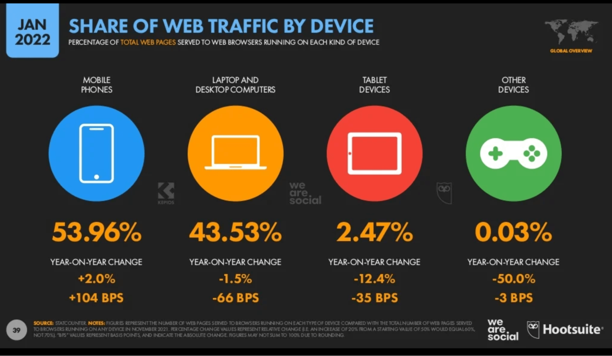
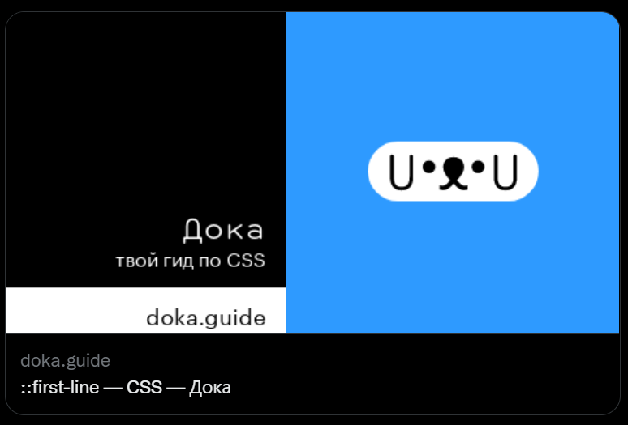

## Кратко

Поисковая оптимизация, SEO (Search Engine Optimization) — это комплекс различных работ, направленных на улучшение позиций сайта в поисковой выдаче.

Цель поисковой оптимизации — увеличение количества посетителей сайта.

## Зачем нужна оптимизация?

Конечной целью поисковой оптимизации является привлечение большего количества органического трафика (естественных пользователей) на свой сайт.

Многие сайты размещают у себя рекламу и их заработок зависит от количества посетителей сайта. Сайты услуг зарабатывают на заказах. Чем выше они находятся в поисковой выдаче, тем больше к ним приходит клиентов.

Вся суть поискового продвижения зачастую заключается в большем заработке на собственном сайте.

## Издержи поисковой оптимизации

Основной проблемой продвижение сайтов является отсутствие чёткого и стабильного результата.

Во-первых, поисковые системы часто перемешивают поисковую выдачу по одним и тем же ключевым словам.

Во-вторых, поисковых фраз, подходящих под контент вашего сайта, бесчисленное количество и гарантировать точно позицию по каждой из них никто не может.

Вы можете найти большое количество руководств от SEO-специалистов, но у вас никогда не будет чёткого списка факторов ранжирования Google и Яндекс. Поисковики не раскрывают подробностей работы внутренних механизмов. Во многом вам придётся действовать вслепую, постоянно внося различные правки на свой сайт.

## Что влияет на позицию в поиске?

Факторы, влияющие на позицию сайта в поисковой выдаче, можно разделить на **внутренние** и **внешние** факторы.

Под **внутренними факторами** понимается техническая реализация сайта, качество контента, адаптивность сайта под мобильные устройства и его [доступность](/a11y/chto-takoe-a11y/). Можно сказать, что к внутренним факторам относится всё то, с чем взаимодействует человек, когда пользуется вашим сайтом. То, на что вы можете влиять напрямую, внося изменения на сайте.

**Внешние факторы** — это всё, что не может контролировать разработчик или SEO-специалист напрямую. В пример можно привести количество ссылок на сторонних ресурсах на ваш сайт, так называемую «ссылочную массу».

### Внутренние факторы

Внутренних факторов ранжирования достаточно много, я расскажу лишь о некоторых наиболее важных.

- **Удобный UI и UX**. Очень важным аспектом продвижения сайта являются поведенческие факторы. UI и UX непосредственно влияют на то, захочет ли пользователь остаться на вашем сайте надолго или уйдёт с него очень быстро. Сайт должен привлекать к себе внимание, вести пользователя туда, куда ему нужно, а не быть просто свалкой информации, в которой пользователю придётся ориентироваться самостоятельно.
- **Оптимизация загрузки**. Чем быстрее сайт загружается, тем приятнее будет человеку, попавшему на него. Оптимизировать загрузку сайта можно как со стороны сервера, так и со стороны фронтенда. На скорость загрузки влияет скорость ответа от сервера, размер картинок, запрашиваемых с сервера, количество подключённых CSS и JavaScript файлов и многое другое, вплоть до количества HTML-разметки.
- **Индексация**. На правильную индексацию сайта влияет наличие файлов _robots.txt_ и _sitemap.xml_. Первый отвечает за то, чтобы дать инструкции поисковому роботу, на какие файлы сайта смотреть он не должен (например, файлы относящиеся к админке сайта). _sitemap.xml_ это навигация по вашему сайту для ботов, по сути полный список доступных для пользователям ссылок.
- **Семантическая вёрстка**. Семантическая вёрстка позволяет более качественно разбивать контент вашего ресурса. Благодаря семантическим тегам браузер, поисковая система и [скринридеры](/a11y/screenreaders/) могут понимать, какой контент за что отвечает.
- **Контент сайта**. Любые медиа материалы и текстовая информация — это то, за чем на ваш сайт зашёл пользователь. Если контент вашего сайта будет качественный и уникальный, пользователю захочется сидеть на вашем сайте больше, возвращаться к нему. Также, поисковые системы проверяют уникальность контента и отдают приоритет уникальному контенту или первоисточникам.
- **Адаптив под разные устройства**. Большое количество пользователей сидят с мобильных устройств. Именно поэтому в сервисах от Google и Яндекс для веб-мастеров есть проверки на мобильную адаптацию вашего сайта. Адаптив сайта является важной частью современного веба и UI\UX дизайна и очень сильно влияет на ранжирование сайта в поисковой системе.

Статистика интернет-трафика по устройствам на январь 2022 года.

- **Доступность (a11y)**. Чем больше людей сможет посещать ваш сайт, комфортно его использовать, тем лучше и для пользователей, и для вашего сайта. Более подробно о доступности можно прочитать в статье «[Что такое доступность](/a11y/chto-takoe-a11y/)».
- **Мета-разметка**. Теги [`<title>`](/html/title/), [`<meta content="description">`](/html/meta/), `<meta content="keywords">` и другие мета-теги помогают и пользователям, и поисковикам. Часть мета-тегов отображается в карточке сайта в поисковой выдаче. Часть данных помогает поисковым системам ранжировать сайт лучше.
- **Open Graph разметка**. Open Graph — это разметка страницы для красивого превью в социальных сетях. Она позволяет сделать карточку вашего сайта красивой и продуманной, привлекающей внимание.

Open Graph разметка на примере Доки.

- **Schema.org разметка**. Она же микроразметка, которая уже отображается в карточке вашего сайта, когда он попадает в поисковую выдачу. Видов такой микроразметки много и под каждый тип страниц на вашем сайте можно подобрать свою, которая будет лучше вписываться в тематику страниц.

Рейтинг «звёздочками» с помощью Schema.org.

### Внешние факторы

К внешним факторам относятся ссылки с других ресурсов на ваш сайт и частота переходов на ваш сайт по ссылкам или из поисковой выдачи.

Обычно на такие факторы повлиять разработчик или SEO-специалист не может. Хотя есть площадки, на которых можно купить рекламные ссылки на ваш сайт и таким образом увеличить ссылочную массу сайта, одновременно привлекая внимание посетителей тех ресурсов.

Многие SEO-специалисты делают так, но стоит помнить о том, что в поисковых системах реализованы алгоритмы борьбы со спамом ссылок и прочими попытками раскрутить сайт агрессивными методами. В случае, если поисковик посчитает купленные ссылки слишком «ненастоящими», он может понизить рейтинг вашего сайта.

## Про что SEO на самом деле?

На самом деле, SEO про продвижение сайта только на первый взгляд. SEO — это про то, как сделать сайт удобным и хорошим. Все пункты, которые были приведены в списке внутренних факторов ранжирования, направлены на улучшение пользовательского опыта или упрощение работы поисковой системы. В итоге, чтобы продвинуться в выдаче поисковиков, нужно сделать качественный сайт с технической точки зрения и наполнить его качественным и уникальным контентом.
