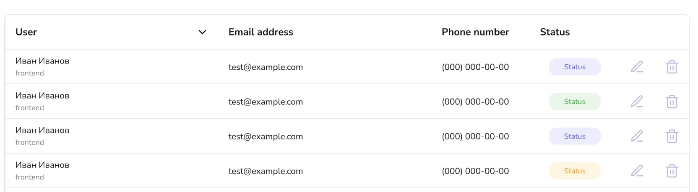

## Кратко

SVG-спрайт — это файл, получаемый в результате объединения нескольких [файлов SVG](/html/svg/). Файл-спрайт используется для сокращения количества запросов к сети — вместо загрузки нескольких файлов, грузится только один. Также для уменьшения размеров и читаемости HTML-кода при многократном использовании векторной графики в разметке.

## Что такое SVG-спрайт?

Спрайт это метод, который помогает уменьшить количество запросов сети к графическим ресурсам. В давние времена спрайты применялись для растровой графики, так как грузить большое количество изображений (обычно это были иконки) было накладно из-за особенностей протокола [HTTP/1](/tools/http-protocol/). Для каждого запроса необходимо было открывать своё соединение и дожидаться его закрытия, и только после этого можно было переходить к загрузке следующего файла. При такой реализации тратилось много времени и ресурсов на установку и закрытие соединения. Чтобы сократить накладные расходы и был придуман способ объединения нескольких файлов в один.

В настоящее время в сети используется протокол HTTP/2, который позволяет открывать несколько параллельных соединений и снизить накладные расходы. Но всё равно важно следить за нагрузкой на сеть, так как пользователи могут столкнуться с ситуацией когда их интернет-соединение является медленным и скорость загрузки ресурсов может быть критичной.

Часто SVG-графика используется для создания системы иконок и её последующего использования на сайте. Можно по-разному добавлять [SVG-иконки](/html/svg/#kak-podklyuchat) на сайт, но наиболее распространённым способом является добавление иконок прямо в разметку страницы, так как это позволяет стилизовать SVG при помощи CSS. При таком подходе можно столкнуться с ситуацией когда на одной или нескольких страницах приходится дублировать разметку вставляя одну и те же SVG-иконку (например, иконку удаления или редактирования данных).


Таблица пользователей с набором повторяющихся иконок

Использование спрайтов в данном случае позволит избежать дублирования кода и уменьшить вес HTML-файла. К тому же, если потребуется внести изменения, нужно будет изменить только один файл.

## Как создать SVG-спрайт

Предположим что уже имеется подготовленный набор отдельных SVG-иконок. Перейдём к формированию SVG-спрайта.

Для начала создадим отдельный файл с расширением `.svg`. Внутрь созданного файла добавим обёртку для SVG-файла состоящую из тега [`<svg>`](/html/svg/) и атрибута `xmlns`, указывающего используемый диалект [XML](/tools/xml/#konflikty-imenovaniya-tegov).

```xml
<svg xmlns="http://www.w3.org/2000/svg">
  ...
</svg>
```

Далее каждая SVG-иконка помещается внутрь тега [`<symbol>`](https://developer.mozilla.org/en-US/docs/Web/SVG/Element/symbol), который предоставляет возможность группировать элементы. При этом данные объекты не отображаются до тех пор, пока на них не будут ссылаться при помощи тега [`<use>`](https://developer.mozilla.org/en-US/docs/Web/SVG/Element/use).

Код ниже сокращён для удобства чтения.

```xml
<svg xmlns="http://www.w3.org/2000/svg">
  ...
  <symbol id="social-facebook" viewBox="0 0 6 12">
    <path d="M1.09903 2.72854C1.09903 ..."/>
  </symbol>

  <symbol id="social-twitter" viewBox="0 0 16 11">
    <path d="M13.3758 4.62011C14.2231 ..."/>
  </symbol>
  ...
</svg>
```

Каждый элемент `<symbol>` содержит атрибут `id` с уникальным идентификатором, который будет использоваться для ссылки на иконку в HTML. Также, каждая иконка содержит атрибут [`viewBox`](/html/svg/#atributy), который определяет размеры окна отображения. Управляя данным атрибутом, можно указать в какой части холста находится конкретная иконка. Это позволяет использовать в спрайте иконки разных размеров и масштабировать их.

Чтобы использовать иконку из спрайта на странице, нужно добавить внутрь тега [`<svg>`](/html/svg/) тег `<use>` с обязательным атрибутом `href`. Данный атрибут должен ссылаться на файл спрайта с указанием `id` символа, содержащего нужное изображение.

```html
<svg class="social-icon" viewBox="0 0 24 24" width="24" height="24">
  <use href="sprite.svg#social-vk" x="0" y="0"></use>
</svg>
```

Полученные таким образом элементы можно стилизовать с помощью CSS, как и обычные HTML-элементы. Вот пример:

```css
.social-icon {
  background-color: black;
  fill: white;
  transition: fill 0.3s ease-in-out;
}

.social-icon:hover,
.social-icon:focus {
  fill: rgb(160 123 80);
}
```

Откройте демо в новой вкладке и проверьте что иконки грузятся как спрайт в одном файле.

<iframe title="Простой svg-спрайт" src="demos/sprite/" height="250"></iframe>

Преимущества данного метода:

- Сокращение количества HTTP-запросов;
- Возможность стилизации иконок с помощью CSS;
- Адаптивность и масштабируемость изображений без потери качества.

Недостатки:

- Нельзя использовать как фоновое изображение.

## SVG-спрайт для фона

Чтобы использовать SVG из спрайта как фоновое изображение, придётся сформировать иконки в спрайте друг за другом (или по сетке).

Изменение фона будет происходить при помощи сдвига области просмотра SVG. Делается это с помощью тега [`<view>`](https://developer.mozilla.org/en-US/docs/Web/SVG/Element/view). Этот тег связывает иконку со специальным идентификатором и определяет её область просмотра.

Область просмотра - это ограниченный прямоугольник, который определяет какая часть холста видна пользователю в данный момент.

В [спецификации SVG](https://www.w3.org/TR/SVG/linking.html#SVGFragmentIdentifiers) такой способ называется именованными фрагментами.

```xml
<svg
  width="24"
  height="72"
  viewBox="0 0 24 72"
  fill="none"
  xmlns="http://www.w3.org/2000/svg"
>
  <view id="icon-first-view" viewBox="0 0 24 24"/>
  <path d="M4 12V20C4 20.5304 ..."/>

  <view id="icon-second-view" viewBox="0 24 24 24"/>
  <path d="M4 12V20C4 20.5304 ..."/>

  <view id="icon-third-view" viewBox="0 48 24 24"/>
  <path d="M4 12V20C4 20.5304 ..."/>
</svg>
```

Атрибут `viewBox` здесь работает так же, как для [`<svg>`](/html/svg/). Первые два значения определяют сдвиг области просмотра по осям _x_ и _y_, следующие два — размер иконки. В нашем примере мы имеем три иконки размером 24 на 24 пикселя, расположенные друг за другом по вертикали. Подробнее об атрибуте `viewBox` можно узнать в [статье](https://www.sarasoueidan.com/blog/svg-art-direction-using-viewbox/).

Для дальнейшего использования в CSS или HTML необходимо указать путь к файлу и идентификатор конкретного изображения.

```css
.image {
  background-image: url('fragments.svg#icon-first-view');
}
```

Также можно воспользоваться альтернативным синтаксисом. Вместо того чтобы задавать внутри спрайта каждой иконке именованный фрагмент с использованием тега `<view>`, можно сразу при подключении файла указать область, которую хотите просмотреть. Для этого после адреса файла необходимо воспользоваться параметрами `svgView` и `viewBox`, в котором указать желаемую область просмотра.

```css
.image {
  background-image: url('fragments.svg#svgView(viewBox(0, 0, 24, 48))');
}

.image:hover,
.image:focus {
  background-image: url('fragments.svg#svgView(viewBox(0, 24, 24, 48))');
}
```

При наведении курсора на иконку происходит смена области видимости внутри SVG-спрайта.

Недостатком является невозможность стилизовать иконку при помощи CSS.

<iframe title="Именованные фрагменты" src="demos/fragments/" height="150"></iframe>

## SVG-спрайт как стек

Данный способ также использует именованные фрагменты, но в отличие от предыдущего способа иконки в спрайте располагаются не последовательно друг за другом, а одна под другой. Каждая иконка скрыта по умолчанию и становится видна, при ссылке на неё через именованный фрагмент.

Как и в случае с `<symbol>`, значки не занимают своё место, поскольку они наложены друг на друга. Но они не скрыты по умолчанию, в отличие от `<symbol>`. Вот почему нужно скрыть их с помощью `display: none;`, но не все, а только те, на которые не нацелен идентификатор в URL-адресе спрайта.

```xml
<svg xmlns="http://www.w3.org/2000/svg">
  <defs>
    <style>
      g {
        display: none;
      }
      g:target {
        display: inline;
      }
    </style>
  </defs>

  <g id="cat">
    <path d="M9 13.125C9 13.3475 ..." fill="black"/>
  </g>

  <g id="dog">
    <path d="M22.4728 11.7187L20.9334 ..." fill="black"/>
  </g>
</svg>
```

<iframe title="Стек изображений" src="demos/stack/" height="150"></iframe>

Существуют разные способы использования SVG-спрайтов, каждый из которых имеет свои преимущества и недостатки. В одних случаях можно использовать иконки как фоновые изображения, но нельзя стилизовать их. В других наоборот. Важно знать различные способы применения SVG-спрайтов и их особенности, а также правильно применять их в той или иной задаче.

## Подсказки

💡 Если использовать иконку из SVG-спрайта как фоновое изображение и при этом нужно при каком-либо взаимодействии изменить её стили (например, при наведении курсора изменить цвет), можно создать копию необходимой иконки с нужными стилями и при взаимодействии менять одну иконку на другую.
