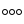

## Кратко

SVG — векторный формат графики, доступный в вебе. Формат основан на технологии XML.

До появления SVG мы могли использовать только растровые изображения: форматы JPG, PNG. Но растровые изображения имеют ряд недостатков:

- Растровые изображения плохо поддаются масштабированию. Это стало особенно актуальным с появлением ретина экранов.
- Растровые изображения, как правило, весят существенно больше, чем их svg-собратья.
- Растровые изображения можно редактировать только при помощи графических редакторов, в то время как svg-изображения представляют собой читаемый код.
- Растровые изображения статичны. SVG внутри себя может содержать CSS-стили или JS-скрипты.

## Пример

Для сравнения посмотрим на PNG и SVG версии одного и того же изображения:

<figure>
  
  <figcaption>Увеличенное в масштабе png-изображение</figcaption>
</figure>

<figure>
  
  <figcaption>Увеличенное в масштабе svg-изображение</figcaption>
</figure>

Как вы видите, второй вариант выглядит великолепно в отличие от первого. Это нам на руку при работе с адаптивными сайтами и с сайтами, которые должны круто смотреться на экранах с повышенной плотностью пикселей (так называемые ретина-экраны).

Заглянем в исходный код svg-картинки:

```html
<svg
  xmlns="http://www.w3.org/2000/svg"
  fill-rule="evenodd"
  clip-rule="evenodd"
  viewBox="0 0 24 24"
>
  <path
    d="M16 12a3.001 3.001 0 016 0 3.001 3.001 0 01-6 0zm1 0a2 2 0
      114.001.001A2 2 0 0117 12zm-8 0a3.001 3.001 0 016 0 3.001 3.001 0
      01-6 0zm1 0a2 2 0 114.001.001A2 2 0 0110 12zm-8 0a3.001 3.001 0 016
      0 3.001 3.001 0 01-6 0zm1 0a2 2 0 114.001.001A2 2 0 013 12z"
  />
</svg>
```

Не пугайтесь большому количеству странных цифр. Это описание координат каждой из точек изображения. Если вам нет необходимости редактировать SVG, то не обязательно понимать эти цифры.

## Как пишется

Чаще всего svg-иконки или изображения вам будет предоставлять дизайнер или вы сможете найти их на различных стоках:

- [icomoon.io](http://icomoon.io/app/#/select)
- [flaticon.com](http://www.flaticon.com/)
- [iconmonstr.com](http://iconmonstr.com/)

Вам редко придётся писать или менять файл с SVG руками, поэтому тут мы рассмотрим только те обязательные части, с которыми вы должны будете взаимодействовать при необходимости.

### Контейнер `svg`

SVG не может быть записано без оборачивающего парного тега `svg`. Так браузер поймёт, что читать этот код нужно по особым правилам и отрисует картинку на странице.

### Обводка `stroke`

Мы можем управлять толщиной и цветом линии, которая будет соединять все перечисленные точки svg-изображения. Причём можно задать один общий атрибут `stroke` для контейнера `<svg>`, а можно задавать его каждому отдельному вложенному элементу, сделав обводку разных частей картинки разного цвета.

Подробнее об атрибуте [stroke](/css/stroke/)

### Заливка `fill`

Мы можем задать заливку нарисованной фигуры или оставить её прозрачной, только с обводкой. Если решите залить фигуру, то для этого используйте атрибут `fill`.

Подробнее об атрибуте [fill](/css/fill/)

## Как подключать

Есть несколько способов подключения svg-изображения к веб-странице. Каждый из них имеет свои преимущества и недостатки.

### ``

Самый простой способ — использовать тег `` и указать путь до svg-картинки в значении атрибута `src`.

```html

```

При таком способе мы можем легко управлять размерами картинки на странице. Но есть и минусы — не получится изменить цвет фона или заливки у самого SVG при помощи CSS.

### `background-image`

Если svg-картинка не является контентной, то её без особого труда можно подключить в виде фона для элемента

```html
<a href="https://facebook.com" class="icon fb"> Facebook </a>
```

```css
.icon {
  display: block;
  width: 28px;
  height: 28px;
  background-repeat: no-repeat;
  background-position: center;
  background-size: contain;
}

.fb {
  background-image: url(../img/svg/fb.svg);
}
```

В этом случае мы также не имеем возможности управлять стилями SVG через CSS.

### Вставка в HTML

Код SVG можно вставить прямо в HTML-разметку станицы.

```html
<div class="dots">
  <svg
    xmlns="http://www.w3.org/2000/svg"
    fill-rule="evenodd"
    clip-rule="evenodd"
    viewBox="0 0 24 24"
    class="dots-icon"
  >
    <path
      d="M16 12a3.001 3.001 0 016 0 3.001 3.001 0 01-6 0zm1 0a2 2 0
        114.001.001A2 2 0 0117 12zm-8 0a3.001 3.001 0 016 0 3.001 3.001 0
        01-6 0zm1 0a2 2 0 114.001.001A2 2 0 0110 12zm-8 0a3.001 3.001 0 016
        0 3.001 3.001 0 01-6 0zm1 0a2 2 0 114.001.001A2 2 0 013 12z"
    />
  </svg>
</div>
```

При таком способе подключения мы можем управлять стилями SVG через стили. Это даёт возможность даже анимировать векторное изображение! 🎉

```css
.dots-icon {
  animation: animation 3s infinite alternate;
}

@keyframes animation {
  from {
    fill: red;
  }
  to {
    fill: green;
  }
}
```

<iframe title="Анимация SVG" src="demos/svg-animation/" height="260"></iframe>

Неприятная особенность: если одна и та же SVG-картинка используется в нескольких местах на сайте, и в какой-то момент вы захотите в ней что-то изменить, то нужно будет найти все вставки и вносить исправления в код. При вставке SVG при помощи `` или `background-image` достаточно будет внести изменения в svg-файл и правки применяться ко всем картинкам.

## Атрибуты

- `fill` — отвечает за заливку фигуры. Может использоваться как для всего контейнера `svg`, так и для отдельных частей. Более подробно тут → [fill](/css/fill/).
- `stroke` — отвечает за обводку фигуры. Может использоваться как для всего контейнера `svg`, так и для отдельных частей. Более подробно тут → [stroke](/css/stroke/).
- `viewBox` — атрибут, отвечающий за размеры окна отображения. Значением будет 4 цифры: `min-x`, `min-y`, `width` и `height`. В примере выше у контейнера `svg` указано следующее `viewBox="0 0 24 24"`. Значит окно отображения будет начинаться в координатах 0 по оси x и 0 по оси y, а по ширине и высоте будет 24 пикселя. Может указываться как для отдельных элементов, так и для всего контейнера. При помощи этого атрибута можно кадрировать изображение, указывая нужные значения.
- `width` и `height` — атрибуты, указывающие размеры svg-элемента. Значением может быть число без указания единиц измерения, тогда браузер будет воспринимать его как пиксели: `width="100" height="100"`. Можно указать в процентах: `width="100%" height="100%"`. Могут указываться как оба сразу, так и по отдельности. Если планируете вставлять SVG в HTML кодом, то отдайте предпочтение атрибуту `viewBox` вместо указания ширины и высоты. Тогда при изменении размеров через CSS картинка будет подстраиваться под размеры с сохранением пропорций.
- `preserveAspectRatio` — атрибут, значение которого указывает браузеру нужно ли сохранять пропорции при масштабировании изображения. Если значение отличается от `none`, то состоит из двух частей: первая отвечает за выравнивания, вторая отвечает за пропорции.

Значения для выравнивания:

- `xMinYMin`, `xMidYMid`, `xMaxYMax` — выравнивает изображение по левому верхнему углу, по центру по обеим осям или по правому нижнему углу.

Значения для обрезки:

- `meet` — картинка стремиться уместиться целиком с сохранением пропорций. Чем-то похоже на поведение `background-size: contain` для фона.
- `slice` — изображение пытается заполнить собой всё доступное пространство. Похоже на `background-size: cover`.

## Подсказки

💡 Если захотите внести какие-то сложные правки в SVG, а дизайнера под рукой нет, то можно использовать [SVG-Edit](https://github.com/SVG-Edit/svgedit), [SVG-Edit Online](https://svgedit.netlify.app/editor/index.html), [inkscape](https://inkscape.org/) или Adobe Illustrator.

💡 Всегда перед использованием SVG в проекте прогоняйте его через оптимизатор [SVGO](https://jakearchibald.github.io/svgomg/). Он удалит всё ненужное, код станет приятнее и будет меньше весить.

💡 С SVG можно взаимодействовать при помощи JavaScript 🤟

## Документация и руководство по SVG

### Учебные руководства

- Перевод руководства от MDM Web Docs — [SVG — учебное руководство](https://developer.mozilla.org/ru/docs/Web/SVG/Tutorial);
- Руководство от W3C с отличными иллюстрациями — [An SVG Primer for Today's Browsers.](https://www.w3.org/Graphics/SVG/IG/resources/svgprimer.html).

### Документация MDM Web Docs

- [Справочник SVG элементов](https://developer.mozilla.org/ru/docs/Web/SVG/Element);
- [Справочник SVG атрибутов](https://developer.mozilla.org/ru/docs/Web/SVG/Attribute);
- Общий список ссылок на ресурсы по SVG от MDM Web Docs  [SVG.  Документация MDM Web Docs]( https://developer.mozilla.org/ru/docs/Web/SVG).
