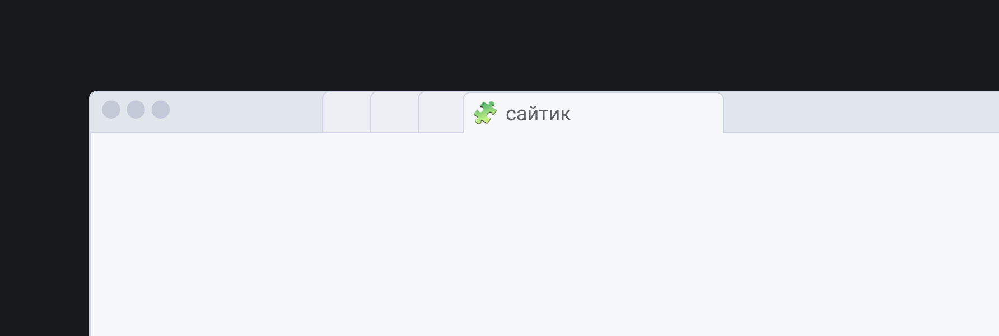

## Кратко

Чтобы дать документу название, используй элемент `<title>`. Название, или заголовок документа, будет видно только в строке заголовка браузера или на вкладке страницы.

Из названия страницы `<title>` пользователь узнаёт, что на ней находится. Если он захочет добавить страницу в избранное, то браузер предложит `<title>` в качестве названия закладки.

## Как пишется

Тег `<title>` прописывается в контейнере [`<head>`](/html/head/) и может содержать только текст.

```html
<head>
  <title>Заголовок твоей страницы</title>
</head>
```

<details>
  <summary>🧩 На самом деле смайлики и служебные символы тоже можно 😉 Но осторожно!</summary>



</details>

## Подсказки

💡 Когда пользователь гуглит твой сайт, то `<title>` страницы отображается в результатах поиска. Поэтому лучше сделать заголовок ёмким, понятным и цепляющим.

💡 Не путай `<title>` с тегом [`<h1>`](/html/h1-h6/), который создаёт заголовок уже на странице.

💡 Если не закрыть тег `</title>`, то браузер не покажет остальное содержимое страницы.

💡 Если пользователь решит добавить твою страницу в закладки или сохранить её у себя на компьютере, то эти символы из вашего `<title>` — \, /, :, *, ?, ", <, >, | — будут заменены автоматически на допустимые для имени файла. Поэтому их лучше не использовать.
