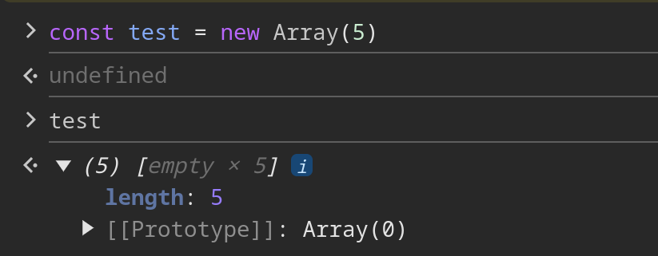

В JavaScript массивы — это не отдельный тип данных, а [обычные объекты](/js/objects-objects-everywhere/). Они просто имеют немного «сахара», например, создание через `[]`.

А значит, заполненые значения хранятся по ключам в виде чисел, а пустые слоты вообще не хранятся. Когда мы видим отображение `empty` в Chrome Dev Tools или `empty items` в Node.js, — это просто абстрактное представление, когда поле `.length` массива больше, чем количество заполненных ячеек.



Чтобы проверить наличие значения по ключу, можно использовать оператор `in` или метод `.hasOwnProperty()`:

```js
const test = new Array(5)
test[2] = 42

2 in test // true
test.hasOwnProperty(2) // true

0 in test // false
test.hasOwnProperty(0) // false
```

То есть, мы можем пройтись по массиву от `0` до `length` и проверить отсутвие текущего индекса в качестве ключа. Однако есть способ ещё проще: [итератор](/js/iterator/) массива и методы, поверх него, используют только существующие ключи:

```js
const test = new Array(5)
test[2] = 42

test.forEach(console.log)
// 42 2 (5) [empty × 2, 42, empty × 2]

// консоль вывела значение только один раз, потому что ключ `2` заполнен
```

Таким образом, чтобы найти количество пустых слотов, достаточно от длины массива отнять число заполненных значений:

```js
const calcExist = (items) => items.reduce(amount => ++amount, 0)
const calcEmpty = (items) => items.length - calcExist(items)

const test = new Array(5)

test[2] = 42
calcEmpty(test) // 4

test[10] = 2
calcEmpty(test) // 9
```
