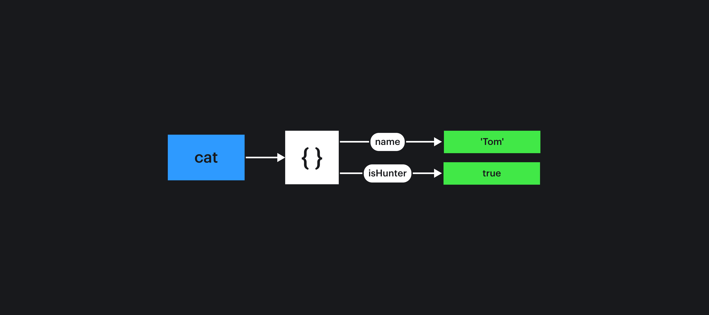
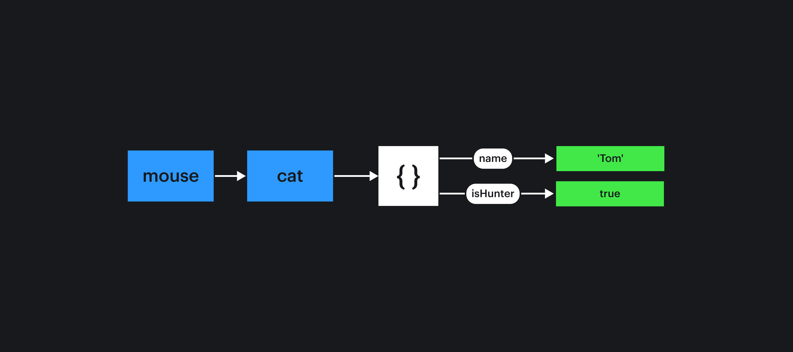

**Что проверяют:**

Это часто встречающаяся группа вопросов на собеседовании. Отличить её можно по таким признакам: вам предлагают два и более JS-объекта, в которых программно меняют свойства по ключам. Спрашивают, что в результате попадёт в консоль при вызове какого-то определённого ключа.

Так проверяют ваше знание того, что значения объектов передаются по ссылке и что ключи в объекте — это способ построить связь с конкретными данными.

**Ответ:**

Обычно перед вами будет пример, вроде такого:

```js
let cat = {
  name: 'Tom',
  isHunter: true
}

let mouse = {
  name: 'Jerry',
  isHunter: false
}

mouse = cat;
cat.isHunter = false;
mouse.isHunter = undefined;

console.log(mouse.isHunter);
```

Разберёмся, как выполняется этот код.

1. В начале переменные `mouse` и `cat` указывают на собственные объекты.
1. В строке `mouse = cat` мы присваиваем переменной mouse ссылку на объект cat. Можно рассматривать это как "связывание" переменных. Теперь обе переменные указывают на один и тот же объект `{ name: 'Tom', isHunter: true}`.
1. Теперь `mouse.name` и `cat.name` будут менять значения свойства одного и того же объекта.
1. Последнее изменение в этом объекте происходит присваиванием значения `undefined` ключу `isHunter`.
1. Выводя в консоль значение ключа `isHunter`, получим последнее его обновление — `undefined`.

Такой способ рассуждения классно описан в книге "[Just JavaScript](https://justjavascript.com/)" Дэна Абрамова. Он предлагает метафору, где имена переменных связываются проводами с данными в них, а ключи в объектах представляются как провода с подписями. Когда вы меняете значения в объектах или переназначаете связи объектов и переменных, вы просто переключаете провода из одного штекера в другой.

`let cat = { name: 'Tom', isHunter: true}`



`mouse = cat`



Такие же рассуждения подходят и для более сложных случаев:

```js
let cat = {
  name: 'Tom',
  isHunter: true
}

let mouse = {
  name: 'Jerry',
  isHunter: false
}

cat.isHunter = mouse.isHunter;
mouse.isHunter = undefined;
mouse = cat;

console.log(mouse.isHunter);
```

В этом примере в консоли будет `false`, ведь данные в объекте, который выводится в консоль, изменены только однажды в строке `cat.isHunter = mouse.isHunter`. После переменная `mouse` была «подключена» к тому же объекту, на который указывает переменная `cat`.
