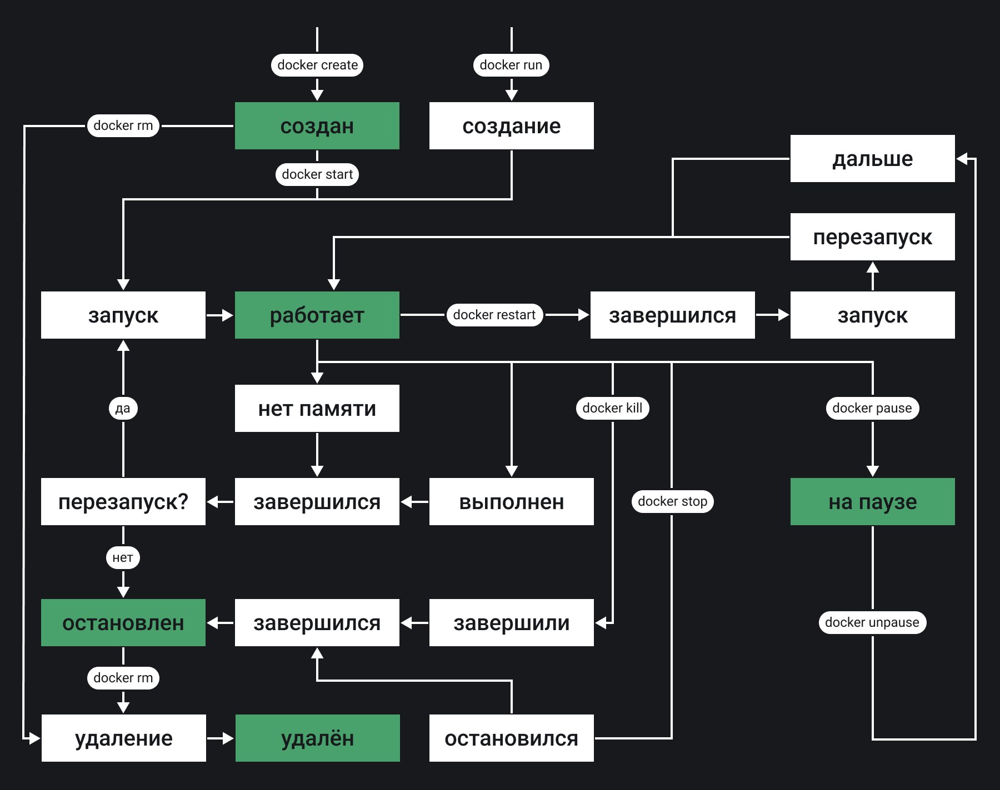

---
excluded:
  - tools/docker-data-management
---
Обычно жизненный цикл контейнера состоит из следующей последовательности состояний:

1. Создание контейнера
1. Работа контейнера
1. Приостановка контейнера
1. Возобновление работы контейнера
1. Запуск контейнера
1. Остановка контейнера
1. Перезапуск контейнера
1. Принудительная остановка контейнера
1. Удаление контейнера

На практике встречаются и более сложные случаи, поэтому жизненный цикл контейнера лучше представить с помощью диаграммы:

На этой диаграмме показаны не только состояния и пути перехода из одного состояния в другое, но и команды, которые позволяют пользователю их менять.
