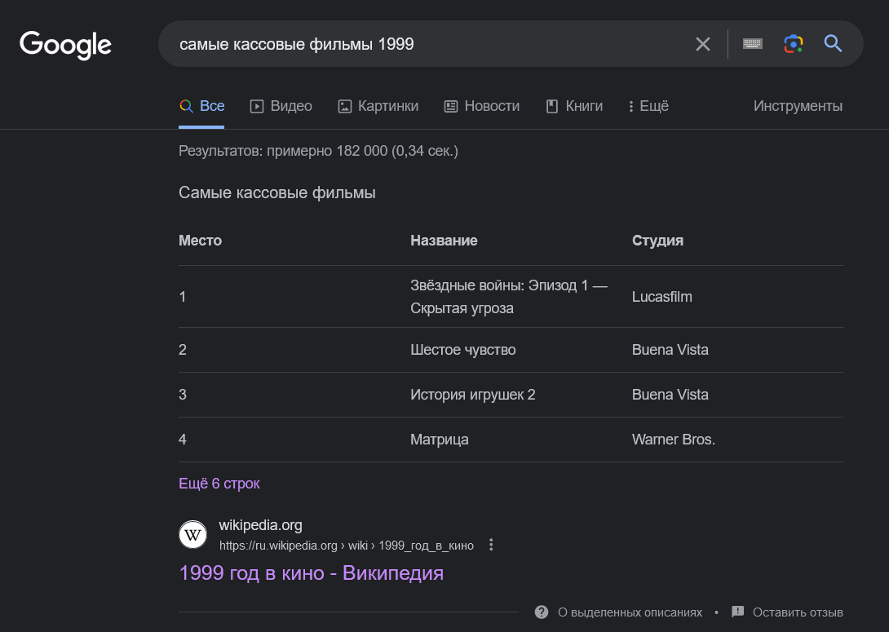

Заголовки важно использовать, по крайне мере, по двум причинам: SEO и доступность.

В первом случае поисковые роботы используют заголовки `<h1>`...`<h6>`, чтобы понять структуру и смысл содержимого на странице. А это один из факторов ранжирования в поисковой выдаче. К примеру, Google может определить, когда уместно отображать страницу в ответ на запрос пользователя и тем самым делать страницу доступной для **избранных фрагментов**. Избранные фрагменты — это быстрые ответы, отображаемые Google на поисковые запросы пользователей. 

Если зайти по ссылке, то можно увидеть, что заголовок «Самые кассовые фильмы» обёрнут в тег `<h2>`. Так что правильное структурирование контента на сайте, включая теги заголовков — это то, что помогает Google с этой задачей.

Во втором случае заголовки `<h1>`...`<h6>` позволяют иметь удобную навигацию по сайту для пользователей со скринридерами. Распространённая техника — быстро перепрыгивать с заголовка к заголовку для общего понимания содержимого на странице.

Поэтому важно не пропускать уровни заголовков, иначе пользователь со скринридером может остаться в недоумении, где находится отсутствующий заголовок.