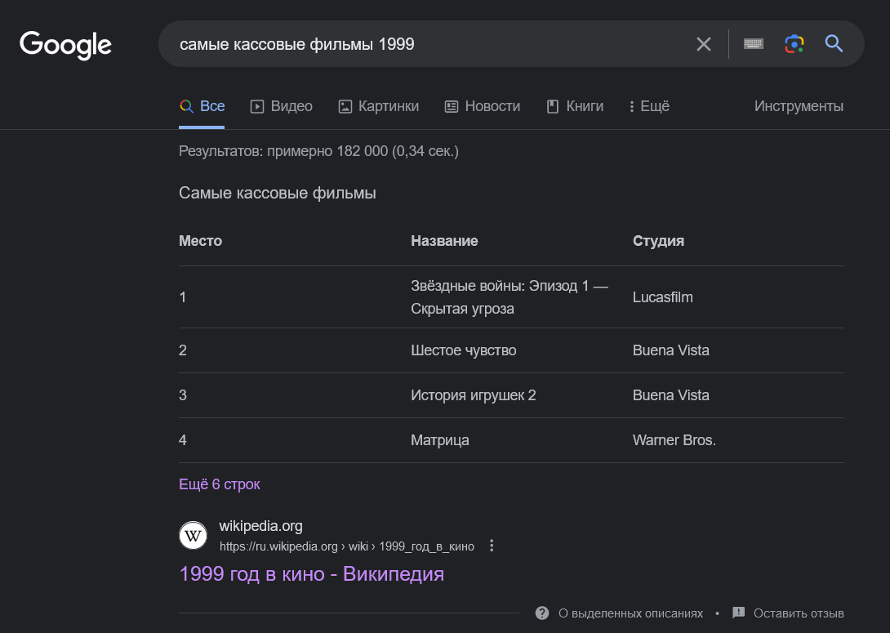

Заголовки важно использовать по крайне мере по двум причинам — SEO и доступность.

В первом случае поисковые роботы используют заголовки `<h1>`–`<h6>`, чтобы понять структуру и смысл содержимого на странице. Это один из факторов ранжирования в поисковой выдаче. К примеру, Google может определить, когда уместно отображать страницу в ответ на запрос пользователя, и делать страницу доступной для **избранных фрагментов**. Избранные фрагменты — это быстрые ответы на поисковые запросы пользователей Google.

Если заглянуть в код страницы, то можно увидеть, что заголовок «Самые кассовые фильмы» обёрнут в тег `<h2>`. Так что правильное структурирование контента на сайте, включая теги заголовков, — это то, что помогает Google с этой задачей.

Во втором случае заголовки `<h1>`–`<h6>` делают удобной навигацию по сайту для пользователей, особенно для тех, кто пользуется [скринридерами](/a11y/screenreaders/). Распространённая техника — быстро перемешаться с заголовка к заголовку для общего понимания содержимого страницы.

Важно не пропускать уровни заголовков, так как это запутает пользователя скринридера. Он может даже попытаться найти, где находится отсутствующий заголовок.
