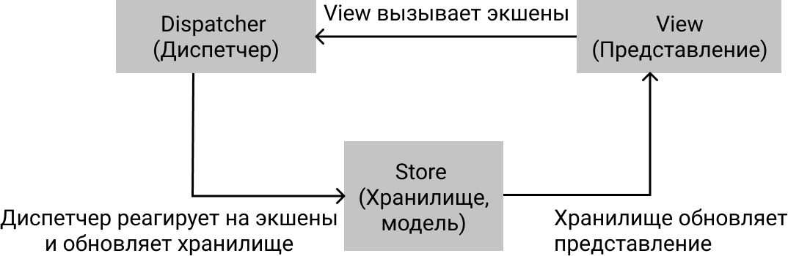
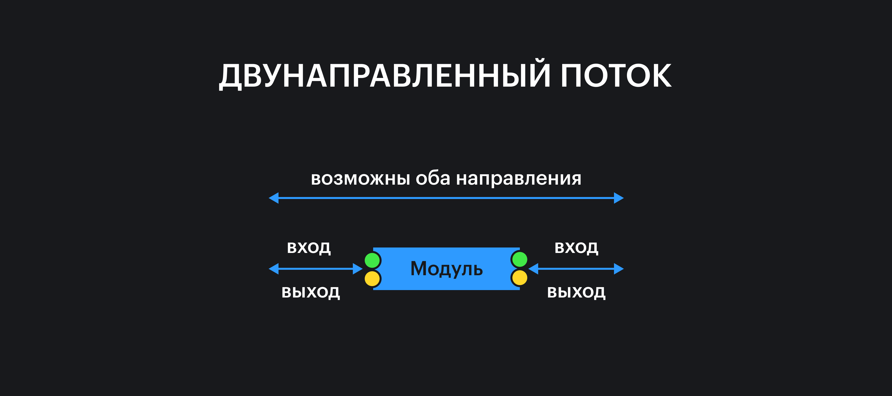
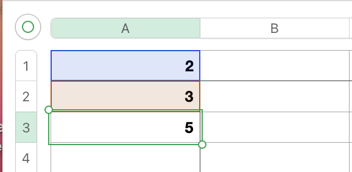

Программы — это преобразователи данных. Мы даём программе задачу: вводим начальные данные и ожидаем получить какой-то результат после их преобразования.

Сложные программы делят исходную задачу на задачи поменьше. За разные подзадачи отвечают разные части программы — функции, классы, модули.

Чтобы программа выполнила исходную задачу целиком, её части должны работать сообща. Они общаются друг с другом с помощью промежуточных результатов работы — тоже данных.

То, как одна часть программы получает и передаёт данные другим, называется **потоком данных** (data flow) и может определить архитектурное устройство всей системы.

## Виды потоков данных

В целом, потоки данных могут быть организованы огромным количеством способов, но чаще всего на практике во фронтенде встречаются два:

- однонаправленный (one-way).
- двунаправленный (two-way).

## Однонаправленный поток

В однонаправленном потоке данных каждая часть программы от другой части может либо получить данные, либо передать. Направление такого потока не меняется.

Однонаправленный поток можно схематично представить, как водопровод, а модуль — как часть трубы:


В таком потоке данные «текут» от одного модуля к другому, а выходные данные предыдущего становятся входными следующего:


### Flux / Redux

Самый известный пример архитектуры с однонаправленным потоком данных — это [Flux](https://facebook.github.io/flux/) и, как его реализация, [Redux](https://redux.js.org).

Во Flux приложение состоит из 3 главных компонентов:

- хранилище данных или стор, store;
- диспетчер, dispatcher;
- представление или вью, view.

Задача стора похожа на задачу модели из [MVC](/js/architecture-mvc/) — он хранит в себе данные. Изменение данных в сторе влечёт за собой изменение представления, то есть перерисовку пользовательского интерфейса.

<aside>

⚛️ Отметим, что стор сам по себе не перерисовывает интерфейс, это не его задача. Обычно на изменение данных в сторе реагирует UI-фреймворк, например, React.

</aside>

Задача представления — показать данные в понятном для пользователя виде, нарисовать пользовательский интерфейс.

Когда пользователи совершают какие-то действия, например, нажимают на кнопки, представление вызывает экшен (action) — объект-команду, который говорит, что произошло.

<aside>

🤖 Иногда во Flux выделяют 4-й компонент — создатель экшенов (action creator). Он освобождает представление от необходимости знать, как именно нужно создавать объекты-экшены.

</aside>

Экшен попадает в диспетчер, он распространяет этот экшен всем модулями, которые знают, как обработать его. (В Redux такие модули называются редьюсеры, reducers.) Эти модули преобразовывают данные в хранилище. Обновление данных влечёт перерисовку представления, и цикл замыкается.



Такой поток данных похож на [классический MVC](/js/architecture-mvc/#vzaimodeystvie-komponentov).

## Двунаправленный поток

Данные в двунаправленном потоке могут передаваться между частями программы в обе стороны.



Чаще всего это используется для связывания модели и представления, чтобы обновление, например, текста в поле ввода сразу обновило данные в модели — это называется **двунаправленным связыванием данных** (two-way data binding).


У такого «среза углов» есть и плюсы, и минусы. Из плюсов:

- Меньше кода, потому что не надо писать экшен и обработчик для него.
- Работает как магия, если фреймворк делает всё автоматически за разработчиков.

Из минусов:

- Труднее отлаживать, когда двойное связывание используется для чего-то сложнее, чем обновление текста в поле ввода.
- Это работает как магия, если фреймворк делает всё автоматически :–)

### Реактивность

Фреймворки, которые используют двунаправленное связывание, часто реактивные — то есть применяют изменения мгновенно не только к UI, но и к вычисляемым данным.

Представьте, что мы используем Excel. Запишем в двух ячейках численные значения, а в следующей — функцию подсчёта их суммы:


В третьей ячейке будет посчитанное значение:



Если мы теперь изменим значение первой ячейки, значение суммы пересчитается _автоматически_.


Это автоматическое изменение значения в третьей ячейке — и есть реактивность. Кажется, что это ничем не отличается от простого двойного связывания, но разница есть.

Представим, что мы пишем код, который должен делать то же самое:

```js
function sum(a, b) {
  return a + b
}

let a1 = 2
let a2 = 3
let a3 = sum(a1, a2)
// 5
```

Если мы изменим значение `a1`, значение `a3` не поменяется:

```js
a1 = 22
console.log(a3)
// 5
```

Чтобы значение реактивно отреагировало (to _re-act_) на изменение, нам нужно перезапустить его подсчёт:

```js
a3 = sum(a1, a2)
// 25
```

Фреймворки типа Vue [берут на себя](https://v3.vuejs.org/guide/reactivity.html#how-vue-knows-what-code-is-running) заботу о реактивности значений.

## Что выбрать

Зависит от задачи :–)

Нет строгих рекомендаций к выбору способа организации потоков данных. Можно учитывать, насколько будет удобно писать код и отлаживать его.

Например, в больших или сложных приложениях или больших командах хочется меньше «магии», чтобы чётко понимать, что и при каких условиях происходит — однонаправленный поток может это обеспечить.

В небольших приложениях двунаправленный поток может сэкономить много времени, потому что заменяет собой однотипный код, который бы пришлось писать в случае с однонаправленным потоком.
