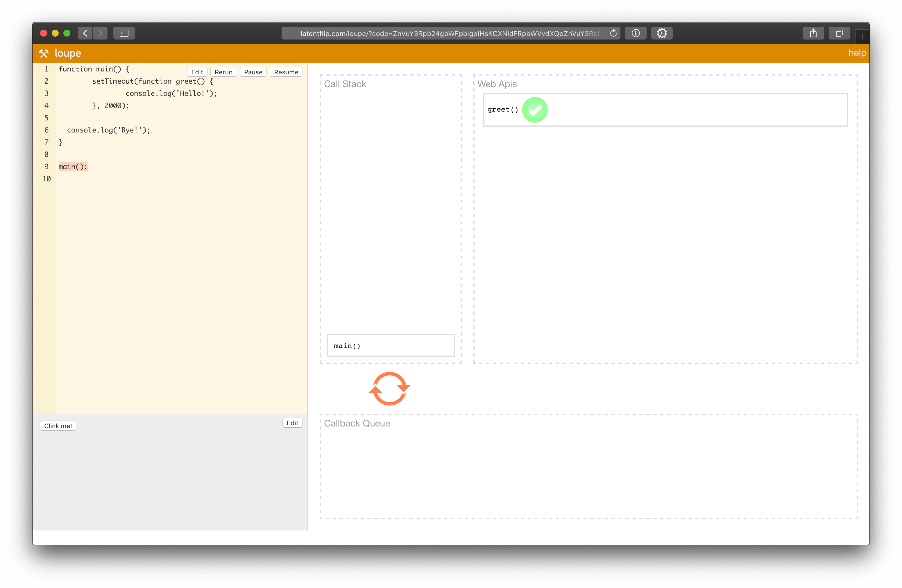

## Кратко

Чтобы понять, что такое асинхронность, сперва поговорим о синхронном коде и том, как в принципе JavaScript выполняет код.

Чтобы выполнить код, нам нужен _JavaScript Engine (движок)_ — программа, которая «читает и выполняет» то, что мы написали. Самый распространённый движок среди всех — это V8, он используется в Google Chrome и Node.js.

Выполнение JS-кода — однопоточное. Это значит, что в конкретный момент времени движок может выполнять _не более одной_ строки кода. То есть, вторая строка не будет выполнена, пока не выполнится первая.

Такое выполнение кода (строка за строкой) называется синхронным.

## Синхронный код и его проблемы

Синхронный код понятный, его удобно читать, потому что он выполняется ровно так, как написан:

```js
console.log("A")
console.log("B")
console.log("C")
```

Выведется:

```
A
B
C
```

Никаких сюрпризов: в каком порядке команды указаны — в таком они и выполнились.

Однако с ним могут возникать некоторые проблемы. Представим, что нам нужно выполнить какую-то операцию, требующую некоторого времени — например, напечатать в консоли приветствие, но не сразу, а через 5 секунд. Ниже псевдокод — синхронная функция задержки `delay()` вымышленная:

```js
function greet() {
  console.log("Hello!")
}

delay(5000)
greet()
```

Через 5 секунд бездействия вывелось бы:

```
Hello!
```

И всё вроде хорошо, приветствие бы действительно напечаталось спустя 5 секунд, однако проблема здесь в другом.

Если бы мы запустили _синхронную функцию задержки_ `delay()`, то движок бы ничем другим заниматься в это время не мог.

Мы помним, что выполнение _синхронного_ кода — строка за строкой. То есть, пока `delay()` не выполнится до конца, к следующей строке интерпретатор не перейдёт.

А это значит, что пока не пройдёт 5 секунд, и `delay()` не выполнится, мы вообще ничего сделать не сможем: ни вывести что-то в консоль ещё, ни выполнить другие функции, в особо тяжёлых случаях — даже передвинуть курсор.

Такие операции, которые не дают выполнять ничего кроме них самих, пока они не завершатся, называются _блокирующими выполнение_.

## Асинхронный код

Теперь попробуем решить эту же задачу, но так, чтобы наш код не блокировал выполнение. Для этого мы воспользуемся функцией [`setTimeout()`](/js/settimeout):

```js
setTimeout(function greet() {
  console.log("Hello!")
}, 5000)
```

5 секунд молчания, и выведется _«Hello!»_

Задача решена. В этот раз, однако, в эти «5 секунд молчания» мы можем выполнять другие действия.

```js
setTimeout(function greet() {
  console.log("Hello!")
}, 5000)

consloe.log(`I'm being called before greet function.`)
```

Сначала выведется: «I'm being called before greet function», а через 5 секунд — «Hello!»

Возникает несколько вопросов:

1. Почему вторая строка кода выполнилась до первой, если JS однопоточный?
1. Куда девается `setTimeout()` на время, пока выполняется другой код?
1. Как движок понимает, что пора выводить `Hello!`?

Чтобы с этим разобраться, нам надо понять, как функции вызываются «под капотом».

## Стек вызовов

При вызове какой-то функции она попадает в так называемый стек вызовов.

**[Стек](https://ru.wikipedia.org/wiki/Стек)** — это структура данных, в которой элементы упорядочены так, что последний элемент, который попадает в стек, выходит из него первым _(LIFO: last in, first out)._ Стек похож на стопку книг: та книга, которую мы кладём последней, находится сверху.

В стеке вызовов хранятся функции, до которых дошёл интерпретатор, и которые надо выполнить.

```js
function outer() {
  function inner() {
    // Функция 3
    console.log("Hello!")
  }

  // Функция 2
  inner()
}

// Функция 1
outer()
```

Вызываем функцию 1 — `outer()`, она попадает в стек:

```js
outer;
```

Вызываем функцию 2 — `inner()`, теперь в стеке 2 функции, потому что первая ещё не выполнилась до конца:

```js
inner;
outer;
```

Вызываем `console.log()`, теперь в стеке 3 функции:

```js
console.log;
inner;
outer;
```

Как только `console.log()` выполнится, она уйдёт из стека, там останется 2 функции:

```js
inner;
outer;
```

Выполнившись, функция `inner` тоже уйдёт из стека, в нём останется лишь одна:

```js
outer;
```

После выполнения всего блока стек станет пустым.

В синхронном коде в стеке хранится вся цепочка вызовов. Поэтому, например, [рекурсия](/js/recursion/) без базового случая может приводить к переполнению стека — в нём скапливается слишком большое количество вызовов.

Теперь посмотрим, как ведёт себя стек вызовов при работе с асинхронным кодом:

```js
function main() {
  setTimeout(function greet() {
    console.log("Hello!")
  }, 2000)

  console.log("Bye!")
}

main()
```

Вызываем функцию `main()`. Стек:

```js
main;
```

Вызываем `setTimeout()`. Стек:

```js
setTimeout;
main;
```

`setTimeout` завершился, он выходит из стека:

```js
main;
```

Вызываем `console.log('Bye!')`:

```js
console.log('Bye!');
main;
```

Его вызов завершён, он выходит из стека:

```js
main;
```

Вызов `main` тоже завершён, стек становится пуст.

Проходит около 2 секунд, вызывается функция `greet`, она попадает в стек:

```js
greet;
```

Она вызывает `console.log('Hello!')`:

```js
console.log('Hello!');
greet;
```

Отработав, она уходит из стека:

```js
greet;
```

После выполнения всего блока стек снова становится пустым.

Первое, что бросается в глаза — `setTimeout()` завершается сразу, хотя колбэк внутри него ещё не отработал, более того, он даже ещё не был вызван! Здесь нам понадобится ещё одно понятие — цикл событий.

## Цикл событий

Сперва откроем страшную правду, `setTimeout()` — это не JavaScript! 😱

Ну... не совсем так, конечно. Функция `setTimeout()` не является частью JavaScript-движка, это по сути _Web API,_ включённое в среду браузера как дополнительная функциональность.

Эта дополнительная функциональность (Web API) берёт на себя работу с таймерами, интервалами, обработчиками событий. То есть, когда мы регистрируем обработчик клика на кнопку — он попадает в окружение Web API. Именно оно знает, когда обработчик нужно вызвать.

Управление тем, как должны вызываться функции Web API, берёт на себя _цикл событий_ (Event loop).

**[Цикл событий](https://developer.mozilla.org/ru/docs/Web/JavaScript/EventLoop#Цикл*событий)** отвечает за выполнение кода, сбор и обработку событий и выполнение подзадач из очереди.

Именно цикл событий ответственен за то, что `setTimeout()` пропал из стека в прошлом примере. Чтобы увидеть картину целиком, давайте включим в нашу схему все недостающие части. Возьмём тот же самый пример:

```js
function main() {
  setTimeout(function greet() {
    console.log("Hello!")
  }, 2000)

  console.log("Bye!")
}

main()
```

Но теперь у нас будет не только стек вызовов — также мы включим Web API и очередь задач, которую Web API использует для хранения того, что нужно выполнить.

Вызов `main`:

|  Стек  | Web API | Очередь задач |
| ------ | ------- | ------------- |
| `main` |         |               |

В Web API и очереди задач пока пусто.

Вызов `setTimeout`:

| Стек         | Web API | Очередь задач |
| ------------ | ------- | ------------- |
| `setTimeout` |         |               |
| `main`       |         |               |

Когда `setTimeout` исчезает из стека, он попадает в видимость Web API, где интерпретатор понимает, что внутри него есть функция `greet`, которую надо выполнить через 2 секунды:

| Стек         | Web API             | Очередь задач |
| ------------ | ------------------- | ------------- |
| `main`       | `setTimeout(greet)` |               |

После этого Web API отправляет функцию `greet` в очередь задач, ждать времени, когда ей нужно будет выполниться:

| Стек         | Web API | Очередь задач |
| ------------ | ------- | ------------- |
| `main`       |         | `greet`       |

Далее выполняется вызов консоли `console.log("Bye!")`, в очереди задач в это время всё ещё находится функция `greet`. Она будет там до тех пор, пока не истечёт 2 секунды:

| Стек          | Web API | Очередь задач |
| ------------- | ------- | ------------- |
| `console.log` |         | `greet`       |
| `main`        |         |               |

Отработал `console.log`, заканчивается работа `main`:

| Стек         | Web API | Очередь задач |
| ------------ | ------- | ------------- |
| `main`       |         | `greet`       |

Даже когда стек опустеет, очередь задач ещё не пуста:

| Стек         | Web API | Очередь задач |
| ------------ | ------- | ------------- |
|              |         | `greet`       |

И вот, когда 2 секунды прошли, цикл событий проталкивает функцию `greet` из списка задач в вызов:

| Стек         | Web API | Очередь задач |
| ------------ | ------- | ------------- |
| `greet`      |         |               |

Затем вызов `console.log("Hello!")`:

| Стек          | Web API | Очередь задач |
| ------------- | ------- | ------------- |
| `console.log` |         |               |
| `greet`       |         |               |

И наконец стек пуст.

Заметьте, что стек вызовов и очередь задач называются именно стеком и очередью. Потому что вызовы из стека работают по принципу _«последний зашёл, первый вышел»_ (LIFO: last in, first out), а в очереди — по принципу _«первый зашёл, первый вышел»_ (FIFO: first in, first out).

**[Очередь](<https://ru.wikipedia.org/wiki/Очередь_(программирование)>)** — структура данных, в которой элементы упорядочены так, что первый попавший в очередь элемент покидает её первым.

Таким образом цикл событий работает с асинхронным кодом — то есть таким, который выполняется не построчно.

Очень хорошо работу цикла событий иллюстрирует [инструмент Loupe](http://latentflip.com/loupe/) Филипа Робертса, а также его доклад «[What the heck is the event loop anyway?](https://www.youtube.com/watch?v=8aGhZQkoFbQ)».

[Loupe](http://latentflip.com/loupe/) интерактивный, попробуйте ввести какой-нибудь код в поле слева, и справа будет показываться, что и в какой момент попадает в стек вызовов и очередь событий:



## Колбэки

Пример с `setTimeout`, который мы рассмотрели, показывает, как работают функции обратного вызова — колбэки.

**[Callback](<https://ru.wikipedia.org/wiki/Callback_(программирование)>)** (колбэк, функция обратного вызова) — функция, которая вызывается в ответ на совершение некоторого события.

В нашем случае таким событием было срабатывание таймера через 2 секунды, а колбэком — функция `greet()`. В целом, событием может быть что угодно:

- ответ от сервера;
- завершение какой-то длительной вычислительной задачи;
- получение доступа к каким-то API устройства, на котором выполняется код.

Таким образом _колбэк_ — это первый способ обработать какое-либо асинхронное действие.

Изначально колбэки были единственным способом работать с асинхронным кодом в JavaScript. Большая часть асинхронного API Node.js была написана именно на колбэках и создана для использования с колбэками.

Это, в принципе, логично — ментальная модель достаточно простая: _«выполни эту функцию, когда случится это событие»_.

Однако у колбэков есть неприятный минус, так называемый _ад колбэков_ (callback hell).

### Ад колбэков (Callback-hell)

Нагляднее всего его можно показать на примере.

Допустим, у нас есть ряд асинхронных задач, которые зависят друг от друга: то есть первая задача запускает по завершении вторую, вторая — третью и т. д.

```js
setTimeout(() => {
  setTimeout(() => {
    setTimeout(() => {
      setTimeout(() => {
        console.log("Hello!")
      }, 5000)
    }, 5000)
  }, 5000)
}, 5000)
```

Если одна задача запускает другую, та — третью, и так далее, мы можем получить вот такую «башню» из обратных вызовов.

И такая башня может получиться где угодно. Если мы делаем несколько последовательных запросов к серверу, зависящих друг от друга, то это может выглядеть вот так:

```js
function request(url, onSuccess) {
  /*...*/
}

request("/api/users/1", function (user) {
  request(`/api/photos/${user.id}/`, function (photo) {
    request(`/api/crop/${photo.id}/`, function (response) {
      console.log(response)
    })
  })
})
```

Читать такое сложно, не говоря уже о тестировании, которое здесь становится очень накладным.

Решить эту проблему были призваны Промисы (Promise).

## Промисы (Promise)

**[Промис](/js/promise/)** — это объект-обёртка для асинхронного кода. Он содержит в себе состояние: вначале `pending` («ожидание»), затем — одно из: `fulfilled` («выполнено успешно») или `rejected` («выполнено с ошибкой»).

В понятиях цикла событий промис работает так же, как колбэк: функция, которая должна выполниться (`resolve` или `reject`), находится в окружении Web API, а при наступлении события — попадает в очередь задач, откуда потом — в стек вызова.

В асинхронных задачах есть [разделение между макрозадачами и микрозадачами](https://medium.com/javascript-in-plain-english/javascript-event-loop-y-promises-951ba6845899). Колбэки в промисах попадают в очередь микрозадач, тогда как колбэк в `setTimeout` — в очередь макрозадач. Но здесь и сейчас мы в такие детали уходить не будем.

Промисы придумали, чтобы организовывать асинхронный код последовательно.

Та же последовательность запросов из прошлого примера, но переписанная с использованием промисов.

```js
function request(url) {
  return new Promise(function (resolve, reject) {
    let responseFromServer
    /*...*/
    resolve(responseFromServer)
  })
}

request("/api/users/1")
  .then((user) => request(`/api/photos/${user.id}/`))
  .then((photo) => request(`/api/crop/${photo.id}/`))
  .then((response) => console.log(response))
```

Код избавился от лишней вложенности, стал плоским и более тестируемым.

Дополнительным плюсом стала возможность обрабатывать ошибки от цепочки промисов в одном месте — последним `catch`:

```js
request("/api/users/1")
  .then((user) => request(`/api/photos/${user.id}/`))
  .then((photo) => request(`/api/crop/${photo.id}/`))
  .then((response) => console.log(response))
  .catch((error) => console.error(error))
```

Если что-то пошло не так, то программа не упадёт, а управление мгновенно перейдёт к последней строчке с `catch`, причём независимо от того, в каком из запросов ошибка появится.

Промисы оказались удобными, и появился даже такой термин как «[промисификация](https://nodejs.org/dist/latest-v8.x/docs/api/util.html#util_util_promisify_original)» — когда асинхронную функциональность на колбэках превращали в промисы.

Однако промисы — это тоже не серебряная пуля. У них есть несколько недостатков:

- Код не такой лаконичный, как мог быть.
- В цепочке промисов, как на примере (со стрелочными функциями), невозможно выставить брейкпоинт, потому что нет тела функции. Приходится раскрывать функцию.
- Стек ошибок может содержать в себе `then.then.then.then...`.
- Вложенные условия сильно увеличивают количество кода и ухудшают читаемость.

Для решения этих проблем придумали асинхронные функции.

## Асинхронные функции

Если коротко, **[асинхронные функции](/js/async-await/)** — функции, которые возвращают промисы.

Асинхронная функция помечается специальным ключевым словом `async`:

```js
async function request() {}
const req = async () => {}

class SomeClass {
  async request() {}
}
```

Они _всегда_ возвращают Промис. Даже если мы явно этого не указывали, как в примерах выше, при вызове они всё равно вернут промис.

```js
async function request() {}

// Сработает:
request().then(() => {})
```

Однако с асинхронными функциями можно не обращаться с `then` — есть более изящное решение.

### Связка `async/await`

Внутри асинхронных функций можно вызывать другие асинхронные функции, без каких-либо `then` или колбэков, с помощью ключевого слова `await`.

```js
async function loadPosts() {
  const response = await fetch(`/api/posts/`)
  const data = await response.json()
  return data
}
```

В примере выше мы используем [`fetch`](/js/fetch/) внутри функции `loadPosts`.

Все асинхронные функции внутри мы вызываем с `await` — таким образом промис, который функция возвращает, автоматически разворачивается, и мы получаем значение, которое внутри промиса было.

### Плюсы `async/await`

**Код чище и короче.** У нас больше нет цепочек из `then`, вместо этого мы получаем плоскую структуру, которая по виду похожа на синхронный код.

Условия и вложенные конструкции становятся чище и проще читаются.

**Мы можем обрабатывать ошибки с `try-catch`.** Как и с синхронным кодом, обработка ошибок сводится к оборачиванию опасных операций в `try-catch`:

```js
async function loadPosts() {
  try {
    const response = await fetch(`/api/posts/`)
    const data = await response.json()
    return data
  } catch (e) {
    console.log(e)
  }
}
```

При этом, в отличие от `.catch()` промисов, try-catch поймает не только ошибки, которые были внутри асинхронных функций, но также и ошибки, которые возникли во время обычных синхронных операций.

**Нам не нужно промисифицировать промежуточные значения.** Если, например, мы хотели сделать цепочку из `then`, чтобы красиво обработать какие-то операции, но одна из операций промис не возвращала...

```js
function request(url) {
  return new Promise(function(resolve, reject) {
    let responseFromServer;
    /*...*/
    resolve(responseFromServer);
  });
}

function findId(user) {
  let id;
  /* ... */
  return id;
}
```

...то вызывать цепочку просто так у нас бы уже не получилось:


```js
request('/api/users/1')
  .then(user => findId(user)
  // Упс, функция findId Промис не возвращает, так нельзя.
  .then(user => request(`/api/photos/${user.id}/`))
  .then(photo => request(`/api/crop/${photo.id}/`))
  .then(response => console.log(response))
  .catch(error => console.error(error));
```

Нам бы приходилось делать нечто вроде:

```js
request('/api/users/1')
  .then(user => Promise.resolve(findId(user))
  // ...
```

А если операция включала бы в себя обработку ошибок, то возможно, и...

```js
request('/api/users/1')
  .then(user => {
    return new Promise(function(resolve, reject) {
      /* ... */
    });
  })
  // ...
```

С асинхронными функциями такой проблемы нет, `await` автоматически разворачивает значение сам.

**Можно ставить брейкпоинты.** Для отладки мы можем поставить брейкпоинт куда угодно, он сработает.
