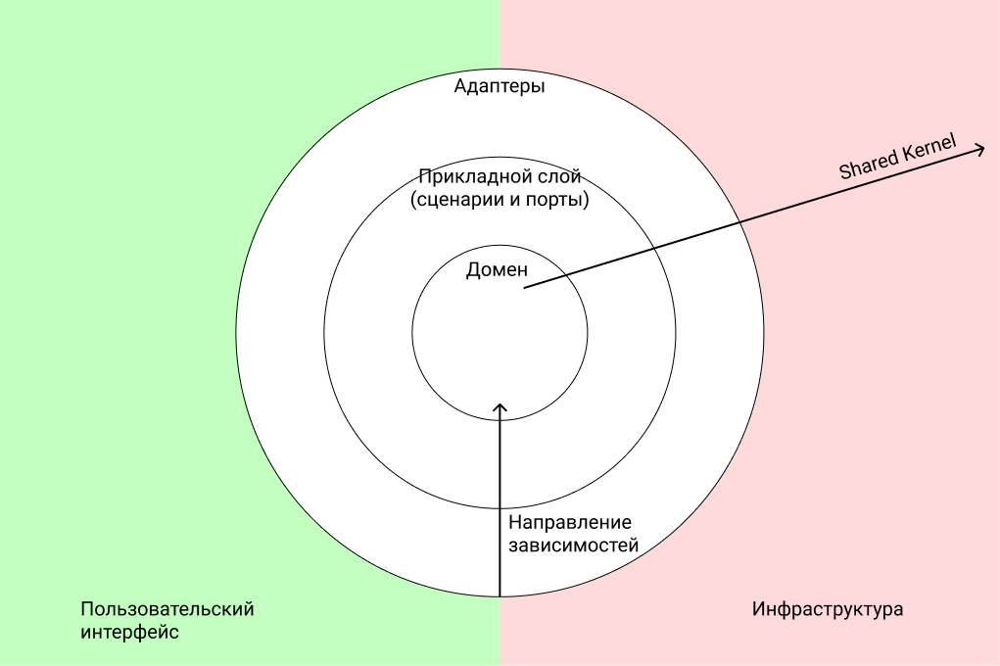
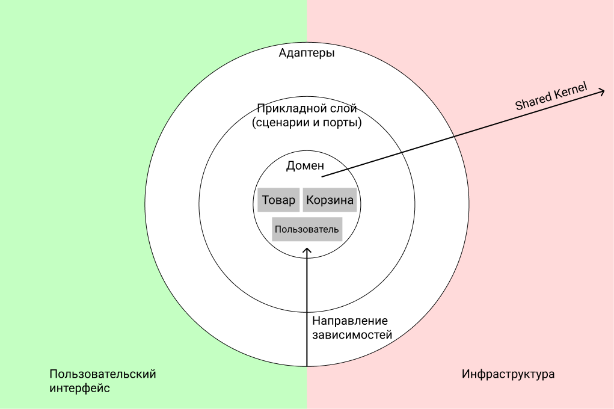
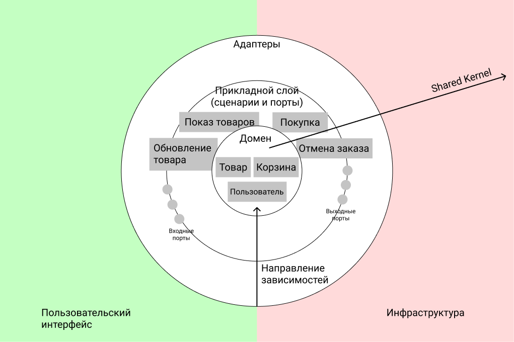
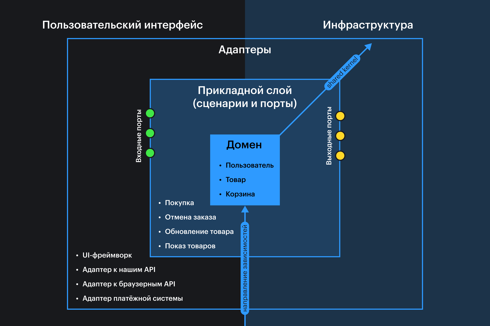

Трёхслойная архитектура (она же чистая) предполагает разделение кода приложения на «слои» с чётко разграниченными обязанностями.

Трёхслойная архитектура напоминает луковичную, но немного отличается в деталях. Для маленьких приложений эти отличия несущественны, и мы можем считать эти понятия синонимами. Но для лучшего понимания разницы советуем прочесть статью «[Onion Architecture](https://herbertograca.com/2017/09/21/onion-architecture/)» 🧅

<aside>

🏛 Это статья из цикла об [архитектуре и шаблонах проектирования](/js/architecture-and-design-patterns/). Их необходимость и пользу мы рассматриваем в первой статье цикла. В этой и других статьях — рассматриваем каждый подход отдельно.

</aside>

## Слои приложения

Трёхслойная архитектура подразумевает разделение кода на 3 слоя:

- домен;
- прикладной слой;
- слой адаптеров и портов.

На схемах слои обычно вкладывают друг в друга:



Рассмотрим каждый слой в отдельности и определим, по каким признакам код относят к одному из слоёв.

### Доменный слой

В доменном слое находятся код и данные из _предметной области_ приложения. Код доменного слоя — это самое важное, что отличает одно приложение от другого. Иногда доменный слой (или просто домен) ещё называют бизнес-логикой.

Например, в интернет-магазине в домен могут попасть сущности пользователя, товара, корзины и заказа. Код для создания нового пользователя или заказа, функции подсчёта итоговой цены корзины и скидки на товары, функция для добавления и удаления товара из корзины — это всё домен.

А вот код для общения с базой данных или для отрисовки интерфейса, например, к домену не относится. Он не попадает в предметную область приложения, он скорее её «обслуживает», чтобы преобразованные доменом данные можно было сохранить в БД или чтобы их увидели пользователи.



На схеме домен расположен в центре, потому что именно он определяет, как будет организован остальной код приложения.

Домен определяет:

- В каком виде ему необходимо передать данные из внешнего мира.
- С помощью каких методов и функций к нему можно обращаться.
- В каком виде он предоставит результат.

<aside>

😎 Можно сказать, что весь остальной код _служит_ домену и удовлетворяет его потребности.

</aside>

В JavaScript данные домена, как правило, представляются в виде структур: [объектов, массивов, встроенных примитивов](/js/typecasting/).

```js
const user = {
  name: "Alex",
  email: "say-hi@alex.com",
};
```

Схематичное описание структуры данных называется _типом_. В типах указывают, какие поля и значения должна содержать структура. Типы данных домена называются _доменными типами_.

Удобнее всего для описания типов данных [использовать TypeScript](/tools/static-types/). С его помощью можно описать схему данных для какой-то сущности так:

```ts
type User = {
  name: string;
  email: string;
};
```

Код выше можно прочитать так: «Данные типа `User` обязаны содержать 2 поля: `name` и `email`. Значения обоих полей должны быть строками».

JavaScript же для описания типов может предложить разве что классы.

```js
class User {
  constructor(name, email) {
    this.name = name
    this.email = email
  }
}
```

### Прикладной слой

Вокруг домена находится прикладной слой. Он содержит код сценариев и юзкейсов приложения.

Обычно это обработчики команд, которые выполняют пользовательский сценарий. Ещё слой содержит _интерфейсы_ портов и адаптеров.

<aside>

🧩 Интерфейс — это контракт на поведение модуля. Он описывает, какие поля и методы этого модуля могут использовать другие модули.

</aside>

В случае с нашим магазином в прикладном слое было бы описано, как проходит процесс покупки и оплаты, какие заказы может видеть пользователь, что может видеть продавец или администратор магазина. А также здесь находились бы интерфейсы модулей, которые получают данные от внешних сервисов (но не сами эти модули).



Как правило, код прикладного слоя по большей части состоит из:

- получения нужных данных;
- вызова доменного кода, чтобы преобразовать данные в соответствии со сценарием;
- сохранения или отправки результата.

Прикладной слой реализует [функциональную архитектуру](https://blog.ploeh.dk/2020/03/02/impureim-sandwich/), где получением и отправкой данных занимаются функции с сайд-эффектами, а преобразованием данных занимаются чистые функции.

<aside>

🧼 Чем больше логики написано на чистых функциях, тем проще будет тестировать код и отлаживать его.

</aside>

Разделение на слои побуждает оставлять в домене функции, которые занимаются только преобразованием данных. Они ничего не хранят, ничего сами не запрашивают — они зависят лишь от аргументов. Из-за этого их проще тестировать и изменять.

Прикладной слой может выполнять роль «нечистого» контекста, который заботится о том, чтобы передать доменному слою данные в нужном ему виде и обработать результат.

```js
import { source } from 'ports/input'
import { target } from 'ports/output'
import { updateProduct } from 'domain/product'

function renameProductHandler(command) {
  // Получаем продукт из внешнего сервиса через порт (сайд-эффект):
  const product = source.getProductById(command.productId)

  // Вызываем доменную функцию обновления (чистая функция):
  const updated = updateProduct(product, { name })

  // Сохраняем продукт во внешнем сервисе через порт (сайд-эффект):
  target.saveProduct(updated)
}
```

Важно отметить, что прикладной слой _никогда не вызывает_ внешние сервисы напрямую. Также он не содержит _кода_ портов и адаптеров, а только их _интерфейсы_ — то есть прикладной слой диктует спецификации, контракты, по которым с нашим приложением должны работать внешние сервисы.

Реализация этих интерфейсов находится в наружном слое — слое портов и адаптеров.

### Слой портов и адаптеров

Этот слой содержит код для связи приложения с внешним миром.

Порт — это спецификация, как сторонний сервис _может_ общаться с нашим приложением, или как наше приложение _хочет_, чтобы с ним общались сторонние сервисы.

Например, мы можем заявить, как нам хочется общаться с хранилищем данных. Пусть нашему приложению будет удобно, чтобы хранилище предоставляло метод для сохранения товара `saveProduct` и метод для получения товара по его ID `getProductById`.

```ts
interface ProductsStorage {
  saveProduct(product: Product): void;
  getProductById(id: UniqueId): Product;
}
```

Тогда внешний сервис, который будет реализовывать хранилище данных, будет обязан содержать эти два метода. Если у внешнего сервиса API не соответствует нашим пожеланиям, мы напишем адаптер.

Адаптер — переходник, который делает несовместимый интерфейс внешнего сервиса совместимым с тем, который _требует наше приложение_. Например, если API отдаёт данные в виде `snake_case`, а мы хотим `camelCase`, заниматься переводом будут адаптеры.

```js
// Адаптер к сервису получения данных (браузерному fetch):
function fetchUser(id) {
  return fetch(`/users/${id}`)
}

// Адаптер данных пользователя, приводит названия полей в нужный вид:
function fromResponse(serverUser) {
  const { Name, Email } = serverUser
  return { name: Name, email: Email }
}
```

<aside>

🔌 Адаптеры делают внешний мир совместимым с нашим приложением, порты делают наше приложение доступным внешнему миру.

</aside>

Во фронтенде входной порт — чаще всего интерфейс пользователя. Обработка пользовательских событий, перерисовка экрана — это всё задачи как раз для слоя адаптеров и портов. Выходными портами можно назвать те интерфейсы, которые общаются, например, с бэкенд-сервером.



Если мы пишем какой-то консольный сервис или сервер API, то входными портами в этих случаях будут соответственно консоль и [эндпоинты API](/js/api/).

### Инфраструктура и Shared Kernel

Кроме слоёв в концепции трёхслойной архитектуры ещё можно встретить понятия инфраструктуры и «общего ядра» (shared kernel).

Под **инфраструктурой** понимают код, который соединяет приложение с базой данных, внешними сервисами типа отправки SMS, рассылки писем и т. п. Во фронтенде чаще всего инфраструктура — это бэкенд-сервер и сторонние API типа систем оплаты.

**Shared Kernel** — это код, который доступен любому модулю, но зависимость от которого не повышает их [зацепление](<https://ru.wikipedia.org/wiki/Зацепление_(программирование)>). В фронтенде к shared kernel можно отнести, например, глобально доступные объекты типа `window`. В каких-то случаях к нему относят и сам язык программирования.

Иногда shared kernel и слои могут переходить друг в друга — это зависит от глубины проектирования. Если код, например, запускается и в браузере, и на сервере, то от глобальных объектов зависеть напрямую уже нельзя, и надо использовать адаптеры.

### Плюсы разделения на слои

Выделение домена, прикладного слоя и адаптеров с портами позволяет нам:

- Разделить зоны ответственности между модулями по их предназначению.
- Организовать код так, чтобы модули было проще заменять и тестировать.
- Собирать и доставлять приложение не только целиком, но отдельными фичами.
- Абстрагировать код и переиспользовать модули в разных проектах.

В целом, степень проработки и проектирования зависит от требований к приложению. Одно дело, когда у нас небольшой интернет-магазин, который работает только в браузере, и другое — когда у нас React-приложение, которое должно работать в браузере, рендериться на сервере и иметь общий код с проектом на React Native.

Спроектированное под разные окружения приложение проще изменять и поддерживать, но реализация будет дороже.

## Взаимодействие слоёв

Трёхслойная архитектура не только определяет сами слои, но и регламентирует их взаимодействие. Например, она строго определяет направление зависимостей.

### Направление зависимостей

В трёхслойной архитектуре _все зависимости направлены к домену_. Это значит, что внешние слои могут зависеть от внутренних, но не наоборот.

<aside>

🪢 Под _зависимостью от другого слоя_ мы понимаем использование кода, данных или сущностей из этого слоя. Зависящий слой использует данные, код или сущности зависимого.

</aside>

В классических реализациях домен не зависит ни от чего — это «голые» спецификации бизнес-логики, их данные и код для их обработки.

Прикладной слой зависит только от домена. Он может использовать код и сущности из доменного слоя и свои сущности и данные.

Внешний слой может зависеть от чего угодно.

Такое направление зависимостей заставляет нас программировать «под домен» и держать код каждого из слоёв чистым. Мы как бы напоминаем себе, что спецификацию поведения диктует _наше приложение_, а внешние сервисы мы _адаптируем_ под его нужды.

<aside>

⬇️ Именно поэтому _интерфейсы_ портов и адаптеров находятся в прикладном слое, а реализация — в слое портов и адаптеров. Внешний слой _зависит_ от внутреннего.

</aside>

Может показаться странным и неудобным, что прикладной слой включает в себя интерфейсы портов и адаптеров, но это противоречие решается с помощью [внедрения зависимостей](https://ru.wikipedia.org/wiki/Внедрение_зависимости).

К сожалению, в JavaScript нет нативного способа реализовать внедрение зависимостей, но есть библиотеки типа _inversify_ или _inject-js_.

### Управляемые и управляющие адаптеры

На наших схемах выделено две «зоны»: зелёная слева и красная справа. Они подсказывают, в какую сторону направлено действие адаптеров и портов, попадающих в эту зону.

Слева — _управляющие адаптеры_ (driving adapters). Это те адаптеры, которые принимают сигналы от пользователей и говорят нашему приложению, что надо сделать.

К управляющим адаптерам можно отнести адаптеры над пользовательским интерфейсом, UI. Например, фреймворк для обработки пользовательских событий и отрисовки интерфейса вполне можно включить в эту категорию.

Справа — _управляемые адаптеры_ (driven adapters). Эти адаптеры получают сигналы от нашего приложения, оно говорит им, что надо сделать. Управляемые адаптеры _реализуют интерфейсы портов прикладного слоя_, становятся обёрткой над инфраструктурой — внешними сервисами, — адаптируя их под нужды приложения.

## Уменьшаем издержки

Архитектура — это в первую очередь инструмент, а при выборе инструмента следует изучить не только их пользу, но и издержки, которые ему присущи.

Пользу и выгоды трёхслойной архитектуры мы уже рассмотрели, поглядим теперь на издержки:

- Трёхслойная архитектура требует больше времени на проектирование и реализацию.
- Она повышает порог входа в проект.
- Она может увеличить количество кода, который браузеру придётся парсить.

Рассмотрим способы, как мы можем эти издержки уменьшить.

### Начинаем с домена

На деле далеко не каждому проекту нужна точная и полная реализация трёхслойной архитектуры. Зачастую мы можем ограничиться выделением доменного слоя, а остальные слои выделять по мере необходимости.

Выделить именно домен стоит, потому что это самая важная часть приложения, ядро. В коде доменного слоя находятся самые важные правила преобразования данных, которыми пользуется весь остальной код.

Чем чище, понятнее и проще домен, тем легче разобраться, что в приложении в принципе происходит. Выделенный домен проще [тестировать](/js/how-to-test-and-why/), а значит, вероятность написать код без ошибок выше. Он также напомнит о направлении зависимостей в проекте и поможет сохранить кодовую базу более чистой.

<aside>

🦄 Выделение домена — минимально необходимое количество усилий, которые стоит приложить при проектировании системы.

</aside>

### Удовлетворяем нужды приложения

При написании адаптеров стоит помнить, что мы не «адаптируем наше приложение ко внешнему миру», а наоборот — адаптируем внешний мир под нужды нашего приложения.

Если внешний сервис предоставляет неудобное API, нам стоит подумать, как написать адаптер, который сделает интерфейс удобным.

<aside>

⚠️ Написать обёртку над методом — ещё не значит написать адаптер.

</aside>

Адаптер должен позволить нам заменить внешний сервис на другой без изменения кода прикладного слоя. Поэтому сперва нам следует спроектировать интерфейс для порта или адаптера, и только потом писать реализацию, «клей» между интерфейсом и внешним миром.

## Пример приложения

В качестве примера приложения можно привести [генератор Canvas-картинок деревьев](https://github.com/bespoyasov/treees). Это приложение рисует на Canvas изображения с фракталами, похожими на деревья.


- В доменном слое у него находятся модули, отвечающие за построение фрактала и за работу с 2D-геометрией.
- В прикладном слое — модуль, который «переводит» фрактал в команды для рисования на Canvas.
- В наружном слое — адаптеры для работы с DOM и Canvas.

В деталях устройство проекта можно изучить на [Гитхабе](https://github.com/bespoyasov/treees).
