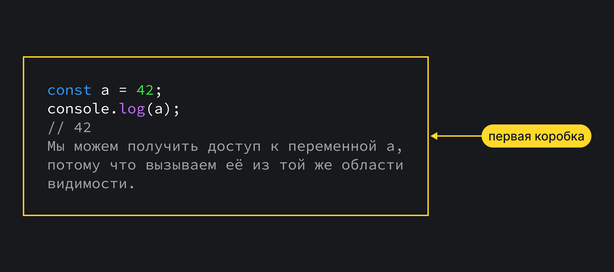
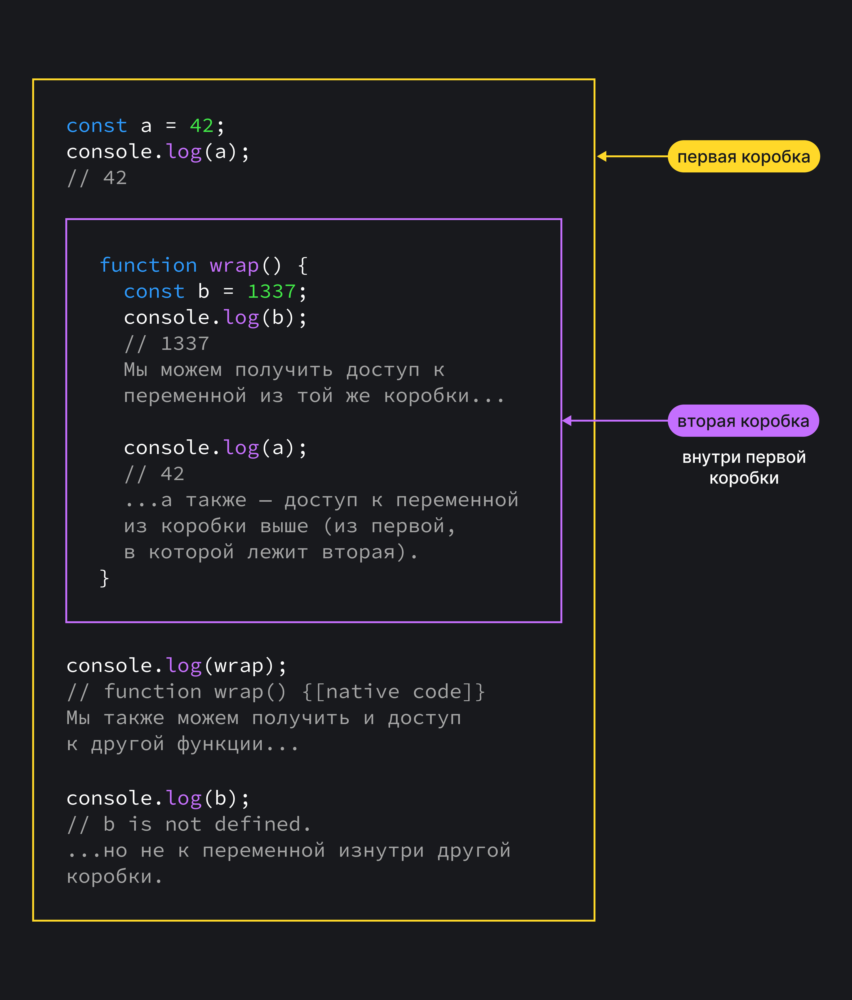

## Кратко

Мы используем переменные, чтобы хранить в них временные значения, а потом получать к ним доступ в нужный момент.

Но в нашем коде не все переменные одинаково доступны. Области видимости определяют, доступна ли переменная и как получить к ней доступ.

_Область видимости_ — это часть программы, в которой мы можем обратиться к переменной, функции или объекту. Этой частью может быть функция, блок или вся программа в целом — то есть мы всегда находимся как минимум в одной области видимости.

Области видимости можно представить как коробки, в которые мы кладём переменные. Переменные, которые лежат в одной коробке, могут общаться друг с другом.



Переменные также могут получить доступ к переменным из коробки, в которой лежит их коробка.



Области видимости помогают скрывать переменные от нежелательного доступа, управлять побочными эффектами и разбивать код на смысловые блоки.

Но прежде чем мы рассмотрим, как их использовать, разберёмся с тем, какие области видимости в JS вообще есть.

## Глобальная область видимости

_Глобальная область видимости_ — это самая внешняя коробка из всех. Когда мы «просто объявляем переменную», вне функций, вне модулей, то эта переменная попадает в область видимости.

```js
const a = 42
// Эта переменная сейчас находится
// в глобальной области видимости.
```

Глобальная она потому, что доступ к переменным в ней будет у всех внутренних областей.

```js
const a = 42
console.log(a) // 42

function wrap() {
  const b = a
  // Без проблем, a доступна в этой функции.
}

const c = {
  d: a,
  // Хорошо, a доступна и здесь.
}

function wrap() {
  const e = {
    f: a,
    // И тут ок, a всё ещё доступна.
  }
}
```

Переменные в глобальной области видимости называются глобальными переменными и доступны везде.

Самый знакомый пример глобальной переменной — это `console`.

```js
console.log(console)
// Console {debug: function, error: function, log: function, info: function, warn: function, …}
```

В браузерах JS так устроен, что глобальные переменные попадают в объект `window`. Если очень грубо, то можно сказать, что `window` в случае браузера — это и есть глобальная область видимости.

```js
console.log(console)
// Console {debug: function, error: function, log: function, info: function, warn: function, …}

console.log(window.console)
// Console {debug: function, error: function, log: function, info: function, warn: function, …}
// То же самое, потому что это один и тот же объект.
```

Глобальный объект `window` — это глобальный объект, который даёт доступ к WebAPI браузера. Он сам по себе тоже глобальный, то есть находится внутри объекта `window`:

```js
console.log(window)
// Window {0: Window, ...}
// Глобальный объект window рекурсивно «содержит сам себя»,
// потому что все глобальные объекты находится в window.
```

Мы также можем определить глобальные переменные сами. Например, если в консоли браузера мы создадим какую-то переменную, а потом попробуем получить к ней доступ через `window`:


(Это сработает только с `var`, но не с `let/const` почему — мы узнаем чуть позже.)

## Блочная область видимости

_Блочная область видимости_ ограничена программным блоком, обозначенным через `{` и `}`. Простейший пример такой области — это выражение внутри скобок:

```js
const a = 42
console.log(a) // 42

if (true) {
  const b = 43
  console.log(a) // 42
  console.log(b) // 43
}

console.log(b)
// ReferenceError: Can't find variable: b
// Переменная b скрыта внутри области видимости
// блока внутри скобок и доступна только
// внутри этого блока, но не снаружи.
```

Скобки могут, однако, не только отделять тело условия. Ими можно обрамлять и другие части кода. Это, например, бывает очень полезно в сложных `switch`-конструкциях. Например:

```js
switch (animalType) {
  case "dog": {
    // Если здесь нам надо выполнить несколько строчек,
    // удобно обернуть все операции в блок из {...}.
    // Тогда все переменные и операции
    // будут ограничены этим блоком —
    // блочной областью видимости.
    const legs = 4
    const species = "mammal"
    // ...
  }

  case "fish": {
    const legs = 0
    const swims = true
    // ...
  }
}
```

## Функциональная область видимости

_Функциональная область видимости_ — это область видимости в пределах тела функции. Можно сказать, что она ограничена `{` и `}` функции.

```js
const a = 42

function scoped() {
  const b = 43
}

console.log(a) // 42
console.log(b) // Reference error.

// К переменной b есть доступ
// только внутри функции scoped.
```

Функциональная область видимости — очень мощный инструмент для разделения кода. Во-первых, используя её, мы можем не опасаться за «пересечение имён» переменных:

```js
// В одной области видимости
// объявить дважды let или const нельзя:

const a = 42
const a = 43 // SyntaxError: Cannot declare a const variable twice: 'a'.

// Но функции создают собственные области видимости,
// которые не пересекаются, поэтому в этом случае
// ошибки не будет:

function scope1() {
  const a = 42
}

function scope2() {
  const a = 43
}
```

Так как области видимости у функций не пересекаются и не связаны, первая функция не может обратиться к «внутренностям» соседней или вложенной функции:

```js
// Внутренности соседней функции
// скрыты в её области видимости
// и недоступны вне:

function scope1() {
  const a = 42
}

function scope2() {
  console.log(a) // Reference error.
}

// То же и с дочерними областями:

function outer() {
  function inner() {
    const a = 42
  }

  console.log(a) // Reference error.
}
```

Функциям доступны лишь переменные в её собственной области видимости (всё, что внутри её тела) и в родительских областях:

```js
function outer() {
  const a = 42

  function inner() {
    console.log(a) // 42
    // Здесь ошибки нет,
    // потому что функции доступна
    // своя область видимости,
    // а также — область видимости
    // функции outer.
  }
}

// Такое поведение, когда переменные родительских
// областей становятся доступны в дочерних,
// называется наследованием областей видимости.
```

Заметим, что у функции `inner` никаких локальных переменных нет — она работает только с локальной переменной функции `outer`.

Такой особенный доступ к локальным переменным родительской функции часто называют _лексической областью видимости_.

Сокрытие «внутренностей» позволяет создавать независимые друг от друга блоки кода. Это, например, полезно, когда мы хотим запустить какой-то модуль в браузере, будучи уверенными, что он никак не повлияет на другой код.

### IIFE

_Immediately Invoked Function Expression, IIFE_ — это функция, которая выполняется сразу же после того, как была определена.

```js
// Записывается IIFE так:

;(function () {
  // ...Тело функции
})()

// Разберём по частям.
//
// 1. Сама функция внутри:
// function () { ... }
//
// Это обычная функция, которая описывается
// и ведёт себя по всем правилам функций в JS.
//
// 2. Скобки вокруг функции:
// (function() { ... });
//
// Скобки превращают функцию в выражение,
// которое можно вызвать.
// То есть если до этого шага мы функцию объявили,
// то на это шаге мы приготовили её к мгновенному вызову.
//
// 3. Скобки вызова:
// (function() { ... })();
//
// Последняя пара скобок вызывает выражение,
// то есть вызывает функцию, которую мы создали на 1-м шаге
// и подготовили на 2-м.
```

Так как функция внутри скобок — это обычная функция, она точно так же создаёт внутри себя область видимости, доступ к которой есть только у неё. То есть всё, что внутри функции, остаётся внутри.

Так мы можем использовать одинаковые названия переменных, не боясь, что они случайно перезапишут значения переменных из чужих модулей, если мы не контролируем кодовую базу полностью сами.

```js
;(function module1() {
  const a = 42
  console.log(a)
})()
;(function module2() {
  const a = "43!"
  alert(a)
})()

// Никаких конфликтов имён!
```

### Функции внутри функций и замыкания

Как мы видели выше, у дочерней функции есть доступ к области видимости родительской функции:

```js
function outer() {
  let a = 42

  function inner() {
    console.log(a)
  }

  inner()
}

outer()
// 42
```

Всё так же у функции `inner` локальных переменных нет, она лишь использует локальные переменные родительской функции `outer`. И всё так же у кода снаружи `outer` нет никакого доступа к её внутренностям.

Но что, если мы вернём из функции `outer` функцию `inner`?

```js
function outer() {
  let a = 42

  function inner() {
    console.log(a)
  }

  return inner
}

// Теперь мы можем не просто вызывать функцию outer,
// но присвоить результат вызова какой-то переменной:

const accessToInner = outer()

// Теперь в переменной accessToInner находится
// функция inner, у которой всё ещё есть доступ
// к *локальной переменной a* функции outer!

accessToInner()
// 42
```

То есть мы смогли «обойти» область видимости? Не совсем.

Мы действительно получили доступ к переменной `a` через функцию `inner`, но только в том виде и с такими ограничениями, которые описаны при создании функции `inner`.

У нас всё ещё нет прямого доступа к переменной `a`. Мы, например, не можем её поменять — только вывести в консоль.

Грубо говоря, мы создали функцию, которая даёт нам _читать_ переменные, но _не изменять_ их. Это полезно, если мы хотим дать ограниченный доступ к внутренностям модуля.

Допустим, мы хотим сделать счётчик, который можно увеличивать и уменьшать только на единицу:

```js
function counter() {
  // Начальное значение счётчика будет 0.
  // Мы используем let, потому что будем менять значение,
  // const не подойдёт.
  let state = 0

  // Функция increase будет увеличивать счётчик на единицу.
  function increase() {
    state++
  }

  // Функция decrease будет уменьшать счётчик на единицу.
  function decrease() {
    state--
  }

  // Функция valueOf будет выводить значение.
  function valueOf() {
    console.log(state)
  }

  // А наружу мы дадим только лишь доступ к этим функциям.
  // Вернём объект, значениями полей которого будут функции
  // increase и decrease.
  //
  // Прямого доступа к переменной state всё ещё нет,
  // но внешний код может изменять её состояние опосредованно —
  // через функции increase и decrease.
  return {
    increase,
    decrease,
    valueOf,
  }
}

const ticktock = counter()
ticktock.increase()
ticktock.valueOf() // 1
ticktock.increase()
ticktock.valueOf() // 2
ticktock.decrease()
ticktock.valueOf() // 1
```

Такое контролируемое сокрытие доступа с помощью области видимости называется _замыканием_.

Замыкания удобны тем, что _каждый новый вызов создаёт отдельную область_, где значения абсолютно независимы друг от друга:

```js
const tick1 = counter()
const tick2 = counter()

tick1.valueOf() // 0
tick2.valueOf() // 0

tick1.increase()
tick1.valueOf() // 1
tick2.valueOf() // 0

tick1.increase()
tick1.valueOf() // 2
tick2.valueOf() // 0

tick2.increase()
tick1.valueOf() // 2
tick2.valueOf() // 1

tick2.decrease()
tick1.valueOf() // 2
tick2.valueOf() // 0

// Состояния обоих счётчиков друг от друга не зависят,
// хотя они создаются одной и той же функцией.
```

## «Поднятие» переменных (Hoisting)

Выше, когда мы экспериментировали с `window` и глобальными переменными, мы обговорили, что запись:

```js
var hi = "Hello world!"
console.log(window.hi)
// Hello world!
```

...Сработает только с `var`, но не с `let` или `const`. Дело здесь в «поднятии» переменных (_hoisting_).

Для начала посмотрим на такой код:

```js
function scope() {
  a = 42
  var b = 43
}

scope()

console.log(a) // 42
console.log(b) // Reference error.

// WTF?
```

Чтобы понять, почему доступ к переменной `a` не вызывал ошибки, разберёмся, как работает `var` и объявление переменных.

JS при использовании `var` для объявления переменных всегда сначала объявляет их, а потом инициализирует. То есть грубо говоря предыдущий пример на самом деле выглядит так:

```js
// Объявление переменной a «поднялось» наверх,
// потому что была объявлена внутри функции без var.
var a

// По умолчанию переменным без значения присваивается undefined.
console.log(a) // undefined

function scope() {
  a = 42
  // Переменная b осталась тут, так как была объявлена с var
  var b = 43
}

// А здесь уже переменной a лишь присвоилось значение 42:
scope()
console.log(a) // 42
```

Более того, переменные «поднимаются» и внутри блоков и функций:

```js
console.log(hello) // undefined

var hello = "Hello"
console.log(hello) // Hello

// Потому что на самом деле код превращается вот в это:

var hello
console.log(hello) // undefined

hello = "Hello"
console.log(hello) // Hello
```

В браузере глобальные переменные находятся в области `window`, поэтому трюк с `window.hi` сработал — JS «поднял» переменную до глобальной области, а мы потом установили ей значение.

### `use strict`

На самом деле это большая проблема, потому что о «поднятии» легко забыть и случайно перезаписать значение переменной в ненужный момент.

```js
a = 42

function shouldNotAffectOuterScopeButDoes() {
  a = 43
  console.log(a) // 43
}

shouldNotAffectOuterScopeButDoes()

console.log(a) // 43 (Хотя должно было быть 42.)
```

Первым оружием против этой проблемы стал строгий режим.

Он запрещает объявлять переменные без `var`, что не позволит случайно перезаписать необъявленную переменную или переменную из внешней области.

### `let` и `const`

В принципе, механизм «поднятия» даже внутри блока достаточно непредсказуемый. Идеально было бы, если бы переменные объявлялись и инициализировались там, где это указано в коде.

И именно это делают `let` и `const`. Они _никогда не выходят из области видимости_, где были определены и _всегда инициализируются там, где указано_.

```js
// С var прокатит:
console.log(hello) // undefined
var hello = "Hello"

// C let и const — нет:
console.log(hello) // Reference error
let hello = "Hello"

console.log(bye) // Reference error
const bye = "Bye"
```
