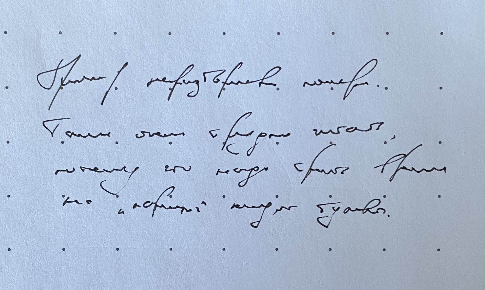

## Кратко

Единый стиль написания кода избавляет команду от лишней работы и позволяет сосредоточиться на сути задачи вместо синтаксиса кода. Если единого стиля нет, то работа над теми же задачами начинает занимать в среднем больше времени.

Давайте разберём, какие именно преимущества даёт единый стиль и каким образом его можно обеспечить в вашей кодовой базе.

## Что такое стиль кода

Когда мы работаем над проектом, мы сталкиваемся с проблемами и задачами разного уровня. Самые очевидные из них — это продуктовые задачи, когда нам надо сверстать продающую страницу, добавить аналитику, настроить процессы поставки кода на продакшен, написать тесты.

Кроме таких задач мы сталкиваемся и с низкоуровневыми проблемами: как назвать функцию или переменную, куда положить файл, как разбить модуль на несколько, табы или пробелы в конце концов :–)

Решение второго набора задач — и есть стиль кода.

<aside>

💡 Стиль кода (code style) — это набор правил, как писать код в проекте. Они могут включать прямые рекомендации, примеры кода, ссылки на лучшие практики, «рецепты», что делать в спорных ситуациях.

</aside>

В работе можно встретить разные стили от больших компаний типа Google или Airbnb. Вот несколько примеров:

- [Google JavaScript Style Guide](https://google.github.io/styleguide/jsguide.html)
- [Airbnb JavaScript Style Guide](https://airbnb.io/javascript/)
- [Principles of Writing Consistent, Idiomatic JavaScript](https://github.com/rwaldron/idiomatic.js)

В проекте могут быть приняты собственные правила и договорённости. Можем считать, что стиль кода может быть разным у разных проектов.

## Преимущества единого стиля кода

Единый стиль кода помогает избавиться от низкоуровневых проблем, оставляя больше ресурсов на решение проблем высокого уровня. Стиль можно применять автоматически, что тоже облегчает работу. Рассмотрим основные плюсы единого стиля.

### Уменьшается разнобой в коде

Когда код набран в разных стилях, мы прилагаем больше усилий на его чтение. Это очень похоже на приём шумного сигнала или чтение неразборчивого почерка — нам нужно сперва разобрать конкретную букву, потом найти их соединение, и только потом мы сможем прочесть всё слово целиком.



Пример неразборчивого почерка. Такое читать очень трудно, потому что надо тратить время на «парсинг» каждой буквы.

Так же трудно читать и код, написанный в нескольких стилях одновременно:

```js
const ThisIsExample=42
class someclass{constructor(a,b,anotherArgument){this.a=a; this.b=   b;
this.c =anotherArgument}
}  function another_style_name(butArguments,ForSomeReason,
are_written_alternatively){
// отступов нет
let a = butArguments
  - are_written_alternatively;
}
```

Когда имена набраны по-разному, трудно понять, какую сущность отражает каждое имя. Если же код написан в одном стиле, в именах переменных и функций проявляется структура и система:

```js
const thisIsExample = 42

class SomeClass {
  constructor(mass, acceleration, force) {
    this.mass = mass
    this.acceleration = acceleration
    this.force = force
  }
}

function anotherStyleName(
  allTheArguments,
  forThisTime,
  areWrittenCorrectly
) {
  let a = allTheArguments - areWrittenCorrectly
}
```

Это позволяет читать код быстрее; мы как будто прочитываем сразу всё слово в разборчивом тексте. Также это добавляет больше информации о контексте:

```js
const justVariable = 'Просто переменная, функция или локальная константа'
const justFunction = () => {}

class SomeClass {
  // Сущности, которые ведут себя как классы
  // или функции-конструкторы, мы можем определить
  // по прописной букве в начале.
}

function ConstructorFunction() {
  // А это — функция-конструктор,
  // мы определяем её тоже по прописной букве в начале.
}

const SOME_CONFIGURATION_CONSTANT = 'Глобальная константа'
```

### Уменьшается количество ошибок по неосторожности

Частый спор в JS-сообществе: ставить точки с запятыми или нет 😃

Однако точка с запятой — это не только дело вкуса. Отсутствие `;` в некоторых местах может сильно изменить поведение кода. К примеру, у нас есть вот такой вызов функции и какая-то работа с массивом сразу после:

```js
console.log(2)
[1, 2].map(num => num * 2)
```

Из-за отсутствия `;` на 1-й строке этот код на самом деле становится таким:

```js
console.log(2)[1, 2].map(num => num * 2)
```

Что приводит к ошибке:

```
Uncaught TypeError: Cannot read property '2' of undefined.
```

Также при отсутствии точки с запятой мы можем случайно вернуть [`undefined`](/js/undefined/) вместо нужного результата из функции:

```js
function theMeaningOfLife() {
  return
  42
}

theMeaningOfLife() // undefined
```

Функция `theMeaningOfLife()` возвращает не `42`, а `undefined`, потому что перенос после `return` рассматривается, как конец строки. Заданный и единый стиль кода позволяет избежать подобных ошибок.

### Ревью проходит быстрее

[Код-ревью](/tools/code-review/) — важная часть процесса работы и гигиены кода. На ревью выявляются ошибки, дыры в безопасности и обсуждаются потенциально лучшие решения.

Без единого стиля участники начинают обсуждать на ревью синтаксис, а не задачу. Ставить ли точку с запятой и использовать ли пробелы вместо табов. Это не несёт полезной нагрузки, но отнимает силы и время участников, из-за чего ревью не выявит по-настоящему серьёзных проблем.

Такое ревью будет казаться участникам бессмысленным, перестанет быть приоритетной задачей, что ещё сильнее замедлит процесс — не все люди готовы заниматься чем-то, что кажется им бесполезным. Самое серьёзное — подобные ревью могут привести к конфликту в команде.

Единый стиль кода исключает ревью в таком тоне.

### Код во всей кодовой базе становится одинаковым

Отсутствие разнобоя не заканчивается на кусочках кода, которые мы рассматривали. Единый стиль позволяет быть уверенными, что _какой бы файл мы ни открыли, везде код будет написан по одинаковым правилам_.

Когда код написан одинаково во всём проекте, нам проще переключаться между модулями, файлами, целыми сервисами и частями проекта. Чем проще работать с разными частями, тем проще и быстрее мы можем работать с проектом в целом.

И, наконец, когда весь код написан по единым правилам...

### Кодовая база лишается «личности»

Автором кода становятся не конкретные люди, программисты, разработчики, а команда, проект.

Если код, который мы пишем «не лично наш», у нас меньше причин его «защищать» на ревью. Это уменьшает вероятность конфликтов и упрощает поиск ошибок. Мы всё ещё можем отстаивать свои решения, но мы чувствуем меньше трения, если надо их поменять.

В обезличенном коде, как правило, меньше сложных и заумных конструкций. Такой код проще читать начинающим разработчикам, что уменьшает автобусный фактор (bus factor), а это делает проект более живучим.

<aside>

🚌 Автобусный фактор — количество разработчиков, которые знают несравненно много о проекте. Сколько человек должен «сбить автобус», чтобы проект развалился. Под «автобусом» можно подразумевать увольнение, болезнь, декрет, отпуск, несчастный случай.

</aside>

## Автоматизация

Правила оформления кода упрощают чтение, но это не поможет, если за выполнением правил надо следить вручную. Чтобы не отвлекаться на проверку стиля кода, сообщество придумало инструменты для автоматизации таких проверок.

### Автоформатирование при сохранении

Первая группа инструментов автоматизации — это форматтеры для редакторов кода и IDE. Они указывают на ошибки по мере ввода, некоторые автоматически форматируют код при сохранении изменений в файле.

Одни из самых популярных среди JS-разработчиков — это [EditorConfig](https://editorconfig.org), [StandardJS](https://standardjs.com) и [Prettier](https://prettier.io). Последний можно даже [попробовать онлайн](https://prettier.io/playground/)!

Prettier при сохранении превращает «сырой» код (1 на примере ниже) в код с форматированием (2):

```js
// 1) Такой код:
console.log(2)
[1,2].map(num => num*2)

// 2) Мгновенно станет таким:
console.log(2)[(1, 2)].map((num) => num * 2);
```

Такое изменение обращает на себя внимание при наборе, подсказывая, что с этим кодом что-то не в порядке — он ведёт себя не так, как ожидалось.

В случае с корректным синтаксисом автоматические форматтеры снимают с разработчиков головную боль форматирования кода:

```js
// 1) Такой код:
class SomeClass {constructor(mass,acceleration,force) {this.mass = mass
this.acceleration = acceleration;this.force = force}
}

// 2) Станет таким:
class SomeClass {
  constructor(mass, acceleration, force) {
    this.mass = mass;
    this.acceleration = acceleration;
    this.force = force;
  }
}
```

В итоге с форматтерами:

- нам не требуется руками расставлять точки с запятой;
- не нужно заменять вручную одни кавычки на другие;
- не за чем спорить о табах и пробелах ;–)

### Линтеры

Форматтеры по сути следят за синтаксисом (точки с запятой, кавычки, табы). Для более высокоуровневых правил есть [статические анализаторы кода](/tools/static-analysis/) — линтеры.

<aside>

💡 Статический анализатор кода, линтер — программа, которая проверяет код на соответствие стандартам или каким-то правилам.

</aside>

Если нам нужно проследить, чтобы названия переменных были написаны в `camelCase`, мы используем линтер. При неправильном написании линтер подсветит название переменной, а при наведении скажет, в чём проблема.


Если мы укажем в правилах, что нам нужен `camelCase` в названии, линтер [найдёт неправильные написания](https://eslint.org/demo#eyJ0ZXh0IjoidmFyIHNvbWVfZXhhbXBsZSA9ICdiYXInOyIsIm9wdGlvbnMiOnsicGFyc2VyT3B0aW9ucyI6eyJlY21hVmVyc2lvbiI6NSwic291cmNlVHlwZSI6InNjcmlwdCIsImVjbWFGZWF0dXJlcyI6e319LCJydWxlcyI6eyJjb25zdHJ1Y3Rvci1zdXBlciI6MiwiZm9yLWRpcmVjdGlvbiI6MiwiZ2V0dGVyLXJldHVybiI6Miwibm8tYXN5bmMtcHJvbWlzZS1leGVjdXRvciI6Miwibm8tY2FzZS1kZWNsYXJhdGlvbnMiOjIsIm5vLWNsYXNzLWFzc2lnbiI6Miwibm8tY29tcGFyZS1uZWctemVybyI6Miwibm8tY29uZC1hc3NpZ24iOjIsIm5vLWNvbnN0LWFzc2lnbiI6Miwibm8tY29uc3RhbnQtY29uZGl0aW9uIjoyLCJuby1jb250cm9sLXJlZ2V4IjoyLCJuby1kZWJ1Z2dlciI6Miwibm8tZGVsZXRlLXZhciI6Miwibm8tZHVwZS1hcmdzIjoyLCJuby1kdXBlLWNsYXNzLW1lbWJlcnMiOjIsIm5vLWR1cGUtZWxzZS1pZiI6Miwibm8tZHVwZS1rZXlzIjoyLCJuby1kdXBsaWNhdGUtY2FzZSI6Miwibm8tZW1wdHkiOjIsIm5vLWVtcHR5LWNoYXJhY3Rlci1jbGFzcyI6Miwibm8tZW1wdHktcGF0dGVybiI6Miwibm8tZXgtYXNzaWduIjoyLCJuby1leHRyYS1ib29sZWFuLWNhc3QiOjIsIm5vLWV4dHJhLXNlbWkiOjIsIm5vLWZhbGx0aHJvdWdoIjoyLCJuby1mdW5jLWFzc2lnbiI6Miwibm8tZ2xvYmFsLWFzc2lnbiI6Miwibm8taW1wb3J0LWFzc2lnbiI6Miwibm8taW5uZXItZGVjbGFyYXRpb25zIjoyLCJuby1pbnZhbGlkLXJlZ2V4cCI6Miwibm8taXJyZWd1bGFyLXdoaXRlc3BhY2UiOjIsIm5vLW1pc2xlYWRpbmctY2hhcmFjdGVyLWNsYXNzIjoyLCJuby1taXhlZC1zcGFjZXMtYW5kLXRhYnMiOjIsIm5vLW5ldy1zeW1ib2wiOjIsIm5vLW9iai1jYWxscyI6Miwibm8tb2N0YWwiOjIsIm5vLXByb3RvdHlwZS1idWlsdGlucyI6Miwibm8tcmVkZWNsYXJlIjoyLCJuby1yZWdleC1zcGFjZXMiOjIsIm5vLXNlbGYtYXNzaWduIjoyLCJuby1zZXR0ZXItcmV0dXJuIjoyLCJuby1zaGFkb3ctcmVzdHJpY3RlZC1uYW1lcyI6Miwibm8tc3BhcnNlLWFycmF5cyI6Miwibm8tdGhpcy1iZWZvcmUtc3VwZXIiOjIsIm5vLXVuZGVmIjoyLCJuby11bmV4cGVjdGVkLW11bHRpbGluZSI6Miwibm8tdW5yZWFjaGFibGUiOjIsIm5vLXVuc2FmZS1maW5hbGx5IjoyLCJuby11bnNhZmUtbmVnYXRpb24iOjIsIm5vLXVudXNlZC1sYWJlbHMiOjIsIm5vLXVudXNlZC12YXJzIjoyLCJuby11c2VsZXNzLWNhdGNoIjoyLCJuby11c2VsZXNzLWVzY2FwZSI6Miwibm8td2l0aCI6MiwicmVxdWlyZS15aWVsZCI6MiwidXNlLWlzbmFuIjoyLCJ2YWxpZC10eXBlb2YiOjIsImNhbWVsY2FzZSI6Mn0sImVudiI6e319fQ==").

Самый популярный линтер JS-кода сейчас — это [ESLint](https://eslint.org/docs/user-guide/configuring/). Его можно интегрировать с IDE или редактором, чтобы узнавать об ошибках мгновенно при наборе текста. Кроме этого ESLint умеет встраиваться в процесс проверки и тестирования кода так, что если в коде есть ошибки, новый релиз или сборка будут отменены, а некоторые ошибки линтер может даже починить самостоятельно.

### Человеческий фактор

Хорошим тоном считается использовать подобные инструменты на протяжении всего процесса разработки: от написания кода до отправки его в репозиторий. Самое главное преимущество такой автоматизации — исключение человеческого фактора из проверки стиля кода:

- ошибки по неосторожности в таком случае исключаются;
- количество конфликтов в ревью на почве разногласий в форматировании уменьшается;
- бас-фактор, хоть и опосредованно, снижается;
- код становится однообразнее, читать его становится проще.

## Недостатки единого стиля кода

Недостатков у единого стиля мало и они достаточно субъективны, но они всё же есть.

### Надо договориться о стиле 🤷‍♀️

Договариваться о стиле кода — это спорить о вкусах. Не всегда можно привести объективные аргументы в пользу любимого стиля. Точка с запятой влияет на интерпретацию, а вот табы или пробелы — нет. В любом случае лучше один раз договориться на старте проекта, чем потом каждый раз спорить в комментариях к ревью.

### Приходится переучиваться, если стиль не совпадает с вашим

Если стиль в проекте отличается от того, к которому привыкли вы, то придётся переучиваться или заново привыкать.

Большую часть проблем снимают линтеры и форматтеры — они укажут на ошибки или даже сами их исправят. Если в проекте автоматизация не настроена, то лучше не тратить время на форматирование кода, а настроить инструменты для этого.

### Приходится настраивать новые инструменты автоматизации

Настраивать инструменты не всегда весело, но чаще всего это задача на один раз. Однако следует сперва обсудить новый инструмент с командой, чтобы стиль кода не стал сюрпризом.

## Заключение

Единый стиль код позволяет ускорить процесс разработки и сделать его более приятным. Современное сообщество предлагает несколько инструментов для автоматизации проверки стиля. Недостатки у единого стиля есть, но их можно назвать субъективными и пренебречь ими.
