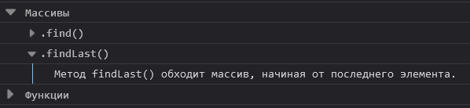
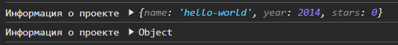

## Кратко

`console` — это объект, предоставляющий доступ к методам отладки и логирования.

Методы `Console API` можно разделить на несколько категорий:
- логирование;
- функции подсчёта;
- функции группировки;
- таймеры.

Реализация и поведение методов консоли зависит от среды выполнения.
Объект `console` доступен в коде как свойство глобального объекта: в браузере - `window`, в Node.js - `global`.

Когда JavaScript-код выполняется в браузере, взаимодействие с консолью осуществляется с помощью инструментов разработчика.

Консоль имеет несколько уровней логирования (log levels). Количество и именование уровней логирования зависит от реализации.

К основным уровням относятся:
- ошибка (_error_);
- предупреждение (_warning_);
- информация (_info_);
- отладка (_debug_ или _verbose_).

Такое разделение позволяет визуально выделять сообщения в зависимости от их важности.

## Методы логирования

К методам логирования относятся: `assert()`, `clear()`, `debug()`, `dir()`, `dirxml()`, `error()`, `info()`, `log()`, `table()`, `trace()`, `warn()`.


**console.assert(assertion, message [, param1, ..., paramN])**

Выводит сообщение об ошибке если утверждение (assertion) ложно.

Сообщение будет отображено только в случае если результат выражения, переданного в качестве первого аргумента - `false`. Остальные аргументы будут использованы для формирования сообщения консоли.

```js
function checkNumber(num) {
  const value = Number(num)
  console.assert(!Number.isNaN(value), 'это не число. Аргумент:', num)
  return value
}

checkNumber('a')
// Assertion failed: это не число. Аргумент: a
```
С помощью метода `console.assert()` можно предупреждать о неожиданных результатах вычислений и упрощать поиск ошибок.


**console.clear()**

Очищает консоль от ранее выведенных сообщений.
```js
console.debug('На старт!')
console.info('Внимание!')

console.clear()
```
В браузерах очистка консоли может быть также выполнена с помощью инструментов разработчика.


**console.debug([param1, ..., paramN])**

Выводит сообщение с уровнем логирования 'отладка' (_debug_ или _verbose_).

```js
function calc(...args) {
  console.debug('Аргументы:', args)
  return Math.max(...args)
}

calc(4, 8, 12, 2)
// Аргументы: [ 4, 8, 12, 2 ]
```

Метод `console.debug()` обычно используют для выделения отладочной информации в общем потоке сообщений консоли. B браузерах сообщения отладки могут быть скрыты с помощью инструментов разработчика.


**console.dir(obj)**

Отображает объект в виде списка свойств. В отличии от других методов логирования, `console.dir()` не поддерживает никакие дополнительные текстовые сообщения.

```js
const obj = {a: { b: [1, 2, 3], c: {d: true}}, e: 'E'}

console.dir(obj)
// { a: { b: [ 1, 2, 3 ], c: { d: true } }, e: 'E' }

```
В браузерах этот метод позволяет отображать DOM-элементы в виде интерактивного дерева.

[Node.js](/tools/nodejs/) или [Deno](/tools/deno/) поддерживают дополнительные параметры, позволяющие изменять отображение свойств объекта:
  - depth — количество уровней вложенности свойств;
  - showHidden — флаг, отвечающий за отображение невидимых при перечислениях (non-enumerable) свойств и свойств с типом [`Symbol`](/js/symbol/).

Пример выполнения в Node.js
```js
const obj = {a: { b: [1, 2, 3], c: {d: true}}, e: 'E'}

console.dir(obj, {depth: 0})
// { a: [Object], e: 'E' }

```


**console.dirxml(element)**

Отображает элемент XML/HTML в виде интерактивного дерева или JavaScript-объект в виде списка свойств.

При использовании в среде Node.js, результат работы метода не отличим от использования `console.log()`


**console.error([param1, ..., paramN])**

Выводит сообщение с уровнем логирования 'ошибка' (_error_).
В браузерах сообщения об ошибках дополнительно отображают информацию о стеке вызовов (перечень вызванных функций)

```js
try {
  const value = 'тест'.sort()
} catch (error) {
  console.error('Ошибка:', error)
}
// Ошибка: TypeError: "тест".sort is not a function
```
Как и большинство методов логирования `console.error()` может принимать множество аргументов для формирования сообщения:

```js
function getDelta(a, b) {
  if ( a < b ) {
    console.error('Внимание! Аварийная ситуация:', 'a =', a, ', b =', b )
    return 0
  }

  return a - b
}

getDelta(2, 4)
// Внимание! Аварийная ситуация: a = 2 , b =  4
```
Метод `console.error()` применяется для выделения информации об ошибках в общем потоке сообщений консоли.


**console.info([param1, ..., paramN])**

Выводит сообщение с уровнем логирования 'информация' (_info_).

Покажем на примере метода `console.info()` как быстро отобразить значение нескольких переменных, так чтобы не путаться в значениях и не тратить время на формирование сообщения. Для этого достаточно объединить их в объект:

```js
let isAuthorized = true
let hasMessages = true
let isAdmin = false

console.info({ isAuthorized, hasMessages, isAdmin })
// { isAuthorized: true, hasMessages: true, isAdmin: false }
```
Firefox и Safari выделяют сообщения `console.info()` c помощью значка `(i)`

**console.log([param1, ..., paramN])**

`console.log()` наиболее известный и часто используемый метод консоли.
Подробнее о `console.log()` можно почитать в [одноимённой статье](/js/console-log/).
В Chrome поведение методов `console.log()` и `console.info()` идентично.


**console.table(data, [columns])**

Выводит информацию об объекте или массиве в табличном виде. Для объекта строками таблицы будут имена свойств, а для массива его элементы.

```js
const project = {
  name: 'jQuery',
  stars: 59275,
  version: '3.7.1',
  date: '28.08.2023'
}
// ┌─────────┬──────────────┐
// │ (index) │ Values       │
// ├─────────┼──────────────┤
// │ name    │ 'jQuery'     │
// │ stars   │ 59275        │
// │ version │ '3.7.1'      │
// │ date    │ '28.08.2023' │
// └─────────┴──────────────┘

console.table(project)
```

Опциональный параметр `columns` используется для указания какие свойства должны отображаться в столбцах:

```js
const jQuery = {
  name: 'jQuery',
  stars: 59275,
  version: '3.7.1',
  date: '28.08.2023'
}

const react = {
  name: 'React',
  stars: 230732,
  version: '19.0.0',
  date: '5.12.2024'
}

console.table([jQuery, react], ['name', 'version'])
// ┌─────────┬──────────┬──────────┐
// │ (index) │ name     │ version  │
// ├─────────┼──────────┼──────────┤
// │ 0       │ 'jQuery' │ '3.7.1'  │
// │ 1       │ 'React'  │ '19.0.0' │
// └─────────┴──────────┴──────────┘
```


**console.trace([param1, ..., paramN])**

Выводит сведения о стэке вызовов для текущей функции. Информация о каждой функции будет включать имя функции и номер строки. Стэк вызовов может пригодится для понимания порядка выполнения программы.

```js
function func() {
  console.trace()
}

function foo() {
  func()
}

function bar() {
  foo()
}

foo()
// console.trace() стэк:
// func :2
// foo :6
// <anonymous> :13

bar()
// console.trace() стэк:
// func :2
// foo :6
// bar :10
// <anonymous> :15
```

☝️ При использовании в среде Node.js, результат работы метода будет включать информацию о вызываемых внутренних модулях.`


**console.warn([param1, ..., paramN])**

Выводит сообщение с уровнем логирования 'предупреждение' (_warning_).

```js
function checkNumber(number) {
  const valid = Number.isInteger(number) && number >= 0 && number < 128
  if ( !valid ) {
    console.warn('Ожидается: 0 <= число <= 127, получено:', number)
  }

  return valid
}

checkNumber(-5)
// Ожидается: 0 <= число <= 127, получено: -5
```

Метод `console.warn()` обычно применяется для показа предупреждений и сообщений о некритичных ошибках.

## Методы подсчёта

К методам подсчёта относятся: `count()` и `countReset()`


**console.count([label])**

Подсчитывает и выводит информацию о количестве раз, когда метод был вызван. Метод `console.count()` пригодится при отладке, например когда необходимо подсчитать сколько раз выполняется функция:

```js
function fibonacci(num) {
  console.count()
  if (num <= 1) return 1
  return fibonacci(num - 1) + fibonacci(num - 2)
}

fibonacci(3)
// default: 1
// default: 2
// default: 3
// default: 4
// default: 5
```

Используя аргумент `label` можно подсчитать сколько раз метод был вызван с определённым параметром:

```js
function getReadyStatus(connectId = '?') {
  const status = `${connectId}: установлен`
  console.count(connectId)
  return status
}

getReadyStatus('основной')
getReadyStatus('резервный')
getReadyStatus('основной')

// основной: 1
// резервный: 1
// основной: 2
```

**console.countReset([label])**

Вспомогательный метод подсчёта, выполняющий сброс счётчика. Если значение параметра `label` не указано будет очищен `default` счётчик:

```js
function getReadyStatus(connectId = '?') {
  const status = `${connectId}: установлен`
  console.count(connectId)
  return status
}

getReadyStatus('основной')
getReadyStatus('резервный')
console.countReset('основной')
getReadyStatus('основной')

// основной: 1
// резервный: 1
// основной: 0
// основной: 1
```
☝️ При использовании в среде Node.js, при выполнении метода `countReset()` в консоли не будет отображаться подтверждающее сообщение.

## Методы группировки

Методы группировки позволяют выводить сообщения в виде иерархической структуры. Каждая группа сообщений имеет горизонтальный сдвиг относительно предыдущей группы. Такое представление информации помогает визуально определить источник сообщений. В консоли браузера можно также сворачивать и раскрывать группы сообщений.

**console.group([label])**

Создаёт новую группу (уровень) для сообщений. При создании группы можно указать заголовок `label`, который служит для описания группы:

```js
function showItems(name, items) {
  console.group(name)
  items.forEach(item => console.info(item))
}

console.log('100 вопросов по JS')

console.group()
console.log('Вопрос 1')

showItems(
  'Найди ключевые слова JS:',
  ['null', 'delete', 'instanceOf', 'this', 'debug', 'super', 'wait']
)
// 100 вопросов по JS
//   Вопрос 1
//   Найди ключевые слова JS:
//     null
//     delete
//     instanceOf
//     this
//     debug
//     super
//     wait
```

**console.groupEnd()**

Прекращает группировку сообщений текущей группы (уровеня). Последующие сообщения будут отображаться с отступом предыдущей группы:

```js
console.group('Массивы')
console.group('.find()')
console.log('Метод массива find() вернёт первый найденный в массиве элемент.')
console.groupEnd()
console.group('.findLast()')
console.log('Метод findLast() обходит массив, начиная от последнего элемента.')
console.groupEnd()
console.groupEnd()
console.group('Функции')

// Массивы
//  .find()
//    Метод массива find() вернёт первый найденный в массиве элемент.
//  .findLast()
//    Метод findLast() обходит массив, начиная от последнего элемента.
//Функции
```

**console.groupCollapsed([label])**

Создаёт новую группу (уровень) для сообщений. В отличии от метода `group()` при использовании консоли браузера, группа отображается свёрнутой.

```js
console.groupCollapsed('Массивы')
console.groupCollapsed('.find()')
console.log('Метод массива find() вернёт первый найденный в массиве элемент.')
console.groupEnd()
console.groupCollapsed('.findLast()')
console.log('Метод findLast() обходит массив, начиная от последнего элемента.')
console.groupEnd()
console.groupEnd()
console.groupCollapsed('Функции')
```



## Методы таймеров

Методы таймеров применяются для подсчёта и отображения времени затраченного на выполнение операций. Каждый таймер имеет уникальное имя. Одновременно может использоваться множество (до 10000) таймеров.

**console.time([label])**

Создаёт новый таймер. При этом консоль не отображает никаких сообщений. Если не указать имя `label`, будет использован таймер по умолчанию:

```js
console.time('time')
console.time()
```

При попытке создать таймер с тем же именем, консоль отобразит предупреждение:

```js
console.time('time')
const a = 2
console.time('time')

// Timer “time” already exists.
```

**console.timeEnd([label])**

Останавливает ранее созданный таймер и отображает имя таймера и количество миллисекунд прошедших от момента создания таймера:

```js
function makeLoop(size) {
  let number = 0
  for (let i = 0; i < size; i++) {
    for(let j = 0; j < size; j++) {
      number++
    }
  }
}

console.time('function time')
makeLoop(1000)
console.timeEnd('function time')
// function time: 2.571ms

console.time()
makeLoop(10000)
console.timeEnd()
// default: 89.854ms
```

**console.timeLog([label])**

Отображает имя таймера и текущее количество миллисекунд прошедших от момента создания таймера. Таймер при этом не останавливается:

```js
function makeLoop(size) {
  let number = 0
  for (let i = 0; i < 5; i++) {
    for(let j = 0; j < size; j++) {
      number++
    }
    console.timeLog('loop')
  }
}

console.time('function time')
console.time('loop')
makeLoop(1000)
console.timeLog('function time')
// loop: 0.059ms
// loop: 6.786ms
// loop: 7.105ms
// loop: 7.289ms
// loop: 7.511ms
// function time: 7.707ms
```

## Использование спецификаторов форматирования

Большинство методов логирования поддерживают дополнительный способ форматирования сообщений — спецификаторы форматирования (string substitutions). С их помощью можно указать необходимый тип отображаемых данных.

```js
const temperature = 15700000
const destination = 1496
const name = 'Солнце'

console.log('Звезда по имени %s с температурой ядра %d K, находится на расстоянии около %f млн км от Земли', name, temperature, destination)
// Звезда по имени Солнце с температурой ядра 15700000 K, находится на расстоянии 149.6 млн км от Земли
```

Такой способ формирования сообщений консоли особенно удобен в случае, когда в одной строке необходимо объединить вывод нескольких переменных и текста.

Для отображения объектов используются спецификаторы `%o` и `%O`. В среде `Node.js` они работают идентично. В консоли браузера Chrome: `%O` — отображает свойства объекта как при использовании `console.dir()`

```js
const project0 = {
  name: 'hello-world',
  year: 2014,
  stars: 0
}

console.info('Информация о проекте %o', project0)
console.info('Информация о проекте %O', project0)
```



