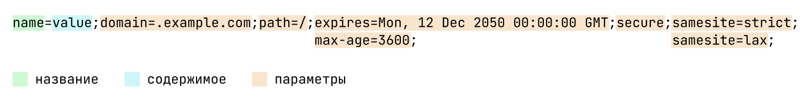

Cookie — один из способов хранить данные в браузере. Обзор всех способов хранения описан в статье «[Хранение данных в браузере](/tools/browsers-storages/)».

## Кратко

При разработке сайтов часть информации (например, токен авторизации или данные пользователя) нужно хранить и читать как в браузере, так и на сервере. Для этого используют **Cookie** (произносится «куки»).

<aside>

💡 Куки передаются в виде HTTP-заголовка, это накладывает на них ограничения. Например, максимальный размер куки в 4096 байт или отсутствие в содержимом пробелов или запятых. Чтобы обезопасить содержимое, можно закодировать его с помощью функции `encodeURIComponent()`.

</aside>

## Как пользоваться

Все куки хранятся в свойстве `document.cookie`. Это свойство представляет собой [строку](/js/string/) в формате `имя=значение`, где пары имён и значений разделяются знаком `; `. При этом взаимодействие с полем весьма необычное — если присвоить `document.cookie` новое значение, то оно не заменит полностью старую строку, а добавит или изменит значение по ключу.

### Запись

Запись в cookie работает с помощью присвоения значения новой куки в поле `document.cookie`. За один раз можно записать лишь одно значение.

Вот так можно добавить значение 1 по ключу _counter_:

```js
document.cookie = 'counter=1'
console.log(document.cookie)
// 'counter=1'
```

При присвоении свойству куки с другим именем, получим два записанных значения:

```js
document.cookie = 'sidebar=false'
console.log(document.cookie)
// 'counter=1; sidebar=false;'
```

При повторной записи в то же поле другого значения оно будет перезаписано.

```js
document.cookie = 'sidebar=true'
console.log(document.cookie)
// -> 'counter=1; sidebar=true;'
```

При установке кук можно указывать не только её название и значение, но и другие параметры. Все они являются необязательными и разделяются точкой с запятой `;`.

- `path` — определяет путь, по которому будет доступна кука. Он должен быть абсолютным, то есть начинаться с `/`. Если параметр не передан, то кука будет доступна на всех страницах сайта;
- `domain` — определяет домен, для которого указана кука. Если не указано, то будет использоваться текущий домен (без поддоменов). Если домен указан явно, по умолчанию кука будет доступна и для поддоменов;
- `max-age` и `expires` — определяет время жизни куки.`max-age` указывает, через сколько секунд, а `expires` указывает точное время, когда кука станет недействительна. Время для `expires` можно отформатировать с помощью встроенного метода даты `Date.toUTCString()`;
- `secure` — указывает, что данная кука может быть передана только при запросах по защищённому протоколу HTTPS;
- `samesite` — определяет, может ли данная кука быть отправлена при кроссдоменном запросе. Значение параметра `strict` будет предотвращать отправку на другие домены, а `lax` разрешит отправлять куки с GET-запросами.

Есть пара ограничений при специфичных названиях кук. Если название куки начинается с `__Secure-`, то обязательно должен быть передан параметр `secure`. При этом мы должны находиться на странице, которая была получена по HTTPS-протоколу. Если название куки начинается с `__Host-`, то обязательно должны быть переданы параметры `path=/` и `secure` (страница также должна быть открыта по HTTPS-протоколу), а атрибут `domain` должен отсутствовать для снижения кроссдоменных уязвимостей.

Запись куки с разрешением передавать её только по HTTPS и только для текущего домена, со временем жизни в 1 час будет выглядеть так:

```js
document.cookie = 'sidebar=true;secure;samesite=strict;max-age=3600'
```



### Чтение

Для получения значений, записанных в куки, можно просто вывести содержимое `document.cookie`:

```js
console.log(document.cookie)
```

Учитывая, что мы уже дважды записывали куки, при вызове команды выше в консоли выведется `counter=1; sidebar=true;`.

Чтобы получить значение конкретной куки, нам нужно будет прочитать строки и разобрать её по значениям. Например, так:

```js
function getCookie() {
  return document.cookie.split('; ').reduce((acc, item) => {
    const [name, value] = item.split('=')
    acc[name] = value
    return acc
  }, {})
}

const cookie = getCookie()

console.log(cookie.counter)
// 1
console.log(cookie.sidebar)
// true
```

### Удаление

Для кук не предусмотрено специального метода удаления, поэтому для этого используется трюк с установкой кук с параметром `expires` который указывает на дату в прошлом. Браузер сразу же считает такую куку устаревшей и удаляет её:

```js
document.cookie = `sidebar=;expires=${new Date(0)}`
```

В этом примере, передав число 0 в конструктор `Date` мы получаем время на начало [эпохи Unix](https://ru.wikipedia.org/wiki/Unix-%D0%B2%D1%80%D0%B5%D0%BC%D1%8F), а именно 1 января 1970 года. Поскольку эта дата из прошлого, то кука будет удалена моментально.
