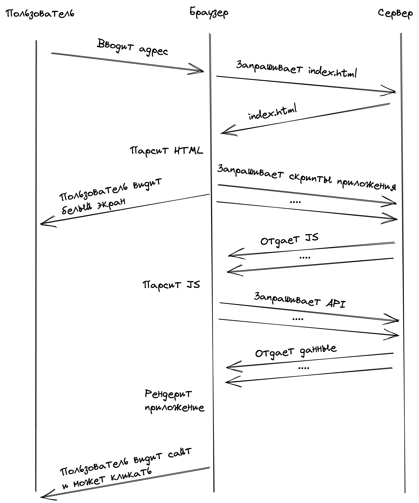
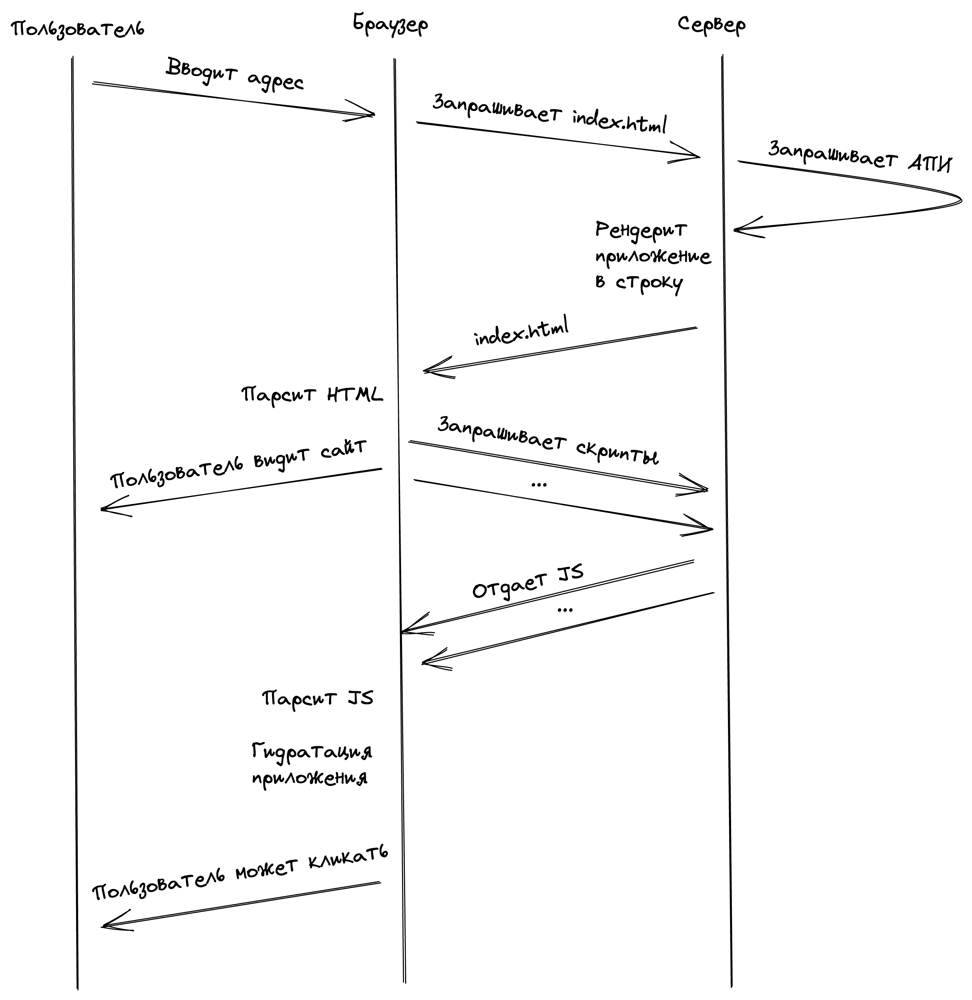
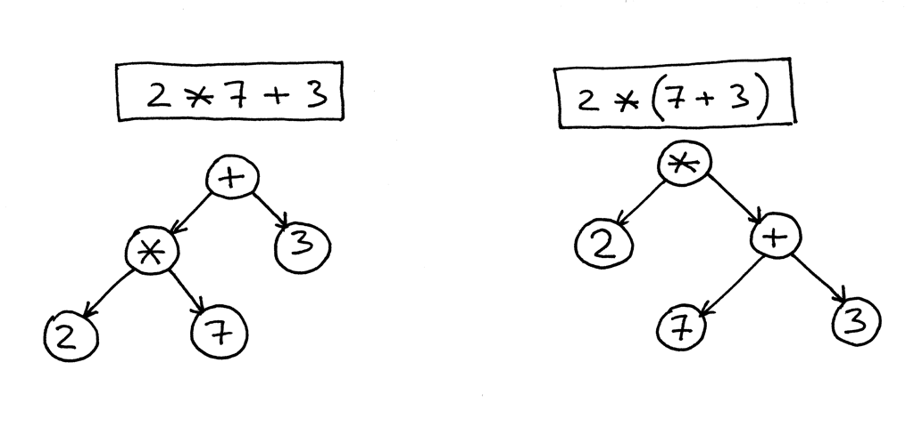
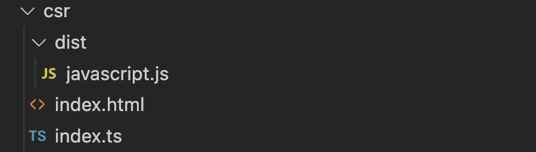
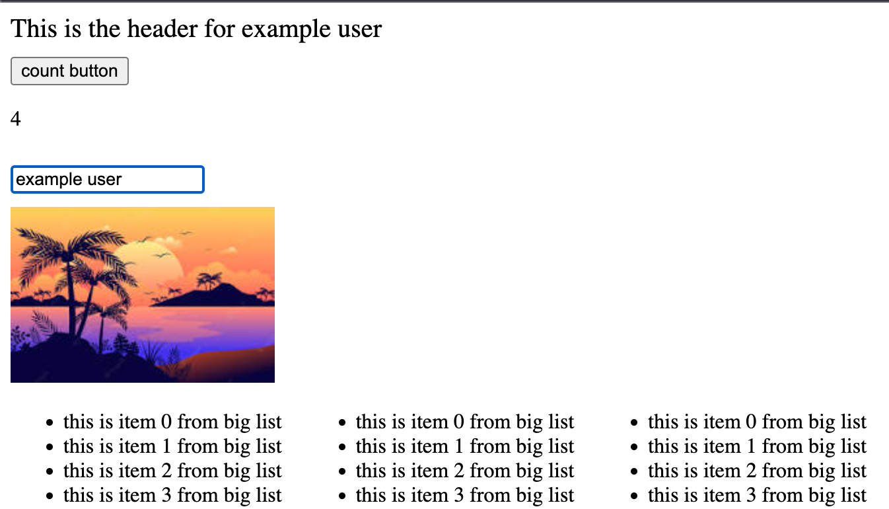
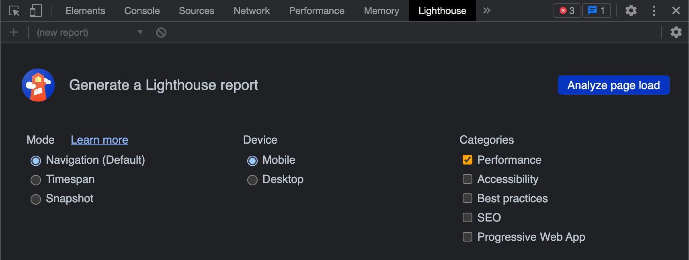
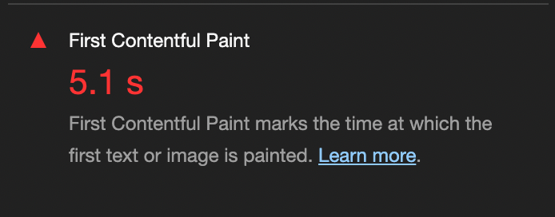
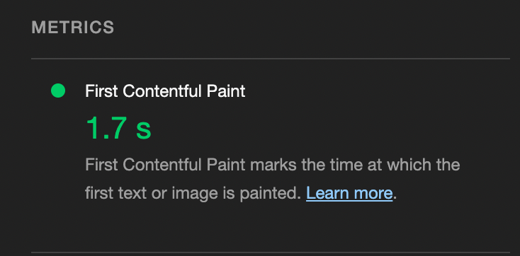

## Краткая история возникновения

Фронтенд бросает в разные стороны последние лет 10, что нельзя охарактеризовать как плохо или хорошо. Доступность образования в сфере IT и в частности веб разработки повысило число желающих принять активное участие в развитии этой сферы. За последнее десятилетие родилось и уже умерло огромное количество различных инструментов. Но некоторые продолжают жить и помогать разработчикам в их ежедневной рутине.

С первой волной веб-фреймворков, начавшейся в 2010 году и подарившей нам Ember, Knockout, Backbone и AngularJS, разработчики плотно познакомились с новой концепцией - Client Side Rendering.

До 2010 года практически не было инструментов, которые бы позволяли добавлять абстракции поверх обычных HTML страниц. Количество кода на клиентской стороне было минимально и служило лишь для того чтобы добавлять интерактивности при работе с приложением. Вся работа с отображением контента происходила на сервере. Бэкенд имел набор темплейтов, вьюшек, которые он отдавал на определенный запрос с фронтенда.

Такую расстановку сил называли "тонкий клиент", имея в виду, что на клиентской стороне практически ничего не было. Самыми популярными решениями в то время были ASP.NET Web Forms, перекочевавший потом в ASP.NET MVC, фреймворки на PHP и Ruby on Rails. Они и послужили стандартом для написания первых фронтенд фреймворков, предлагая проверенную годами [модель MVC](https://habr.com/ru/post/215605/) (Model-View-Controller).

Как видно, одной из базовых составляющих MVС, является управление представлениями, вьюшками (от слова View). Поэтому, с этого момента приложения на новых фронтенд фреймворках начали называть приложениями с "толстым клиентом", имея в виду, что код загружаемый на клиентскую часть теперь сам знает что и когда нужно показать пользователю, ориентируясь на браузерную строку. Соответственно, сам процесс построения DOM дерева для разных состояний приложения на клиентской стороне и называется CSR (Client Side Rendering). 

## CSR под капотом

Из каких этапов состоит клиентский рендеринг?

1. Пользователь хочет открыть приложение и вводит его адрес в строке браузера.
2. Браузер делает запрос на серверную часть.
3. Сервер отдает файл index.html, который содержит ссылки на скрипты с основным кодом приложения, кодом фреймворка и прочие скрипты, необходимые для корректной работы приложения. Причем сам документ пустой. В теле страницы ничего нет.
4. Браузер парсит полученный HTML файл и делает запросы на получение javascript файлов.
5. После получения и парсинга javascript файлов, происходят возможные API запросы на получение данных и пользователь начинает видеть страницу, которую отрендерил фреймворк. 

Всегда лучше визуализировать то о чем читаешь, поэтому схема ниже должна лучше раскрыть все шаги CSR. 


Последовательность шагов при клиентском рендеринге

Данный подход имел один большой плюс. При такой расстановке сил была возможна параллельная разработка приложения. Можно было собрать две команды и начать делать приложение с разных концов, согласовывая постепенно место, в котором они в итоге должны были сойтись. 

Но это был организационный момент. С технической же стороны, данный подход приносил больше минусов чем плюсов. 

- Поскольку клиент брал на себя больше обязанностей, нужно было грузить больше кода и первоначальная загрузка скриптов блокировала дальнейшую загрузку данных и собственно отображение контента. Пользователь сидел и смотрел на белый экран, пока все загрузится и он сможет использовать приложение. Или еще хуже смотрел на бесконечный спиннер. 
- Поскольку теперь фронтенд и бэкенд делали отдельно друг от друга, их также деплоили отдельно. Запросы к серверному АПИ могли быть очень долгими и нужно было отдельно решать эту задачу. 
- Также, поскольку клиент делал все сам, то это больно било по SEO оптимизации. Роботы и веб пауки, которые пытались прочитать странички приложения, на все запросы получали просто index файл без какого-либо полезного контента, потому что тот появлялся только после загрузки всех остальных ресурсов. Без браузера это конечно не возможно, а пауки и роботы браузерами не пользуются.

Поделав приложения в таком состоянии еще 5-6 лет, разработчики пришли к мысли что это можно исправить, вернув все как было 🤡 Но к тому моменту фронтенд и бэкенд уже сильно обособлились друг от друга, поэтому фронтендеры придумали свой бэкенд ([для фронтенда](https://doka.guide/tools/gateway-bff/))

## SSR под капотом

Одной из задач, которую была призвана решить данная прослойка (BFF - backend for frontend), была реализация серверного рендеринга.

Как теперь выглядят шаги? 

1. Пользователь хочет открыть приложение и вводит его адрес в строке браузера.
2. Браузер делает запрос на серверную часть.
3. Сервер делает необходимые АПИ запросы и рендерит приложение в виде строки. Наполняет index.html необходимым контентом (сгенерированная строка приложения), вставляет ссылки на дополнительные скрипты и отправляет в ответ на запрос браузера.
4. Браузер получает готовый HTML файл и показывает его пользователю, при этом запрашивая дополнительные скрипты и сам код приложения. В этот момент пользователь видит контент, но еще не может пользоваться приложением, потому что это просто статика. Но это влияет на субъективную оценку скорости работы приложения, так как пользователь видит контент намного раньше чем при CSR. 
5. Браузер получает запрашиваемые скрипты, парсит их и фреймворк производит _гидратацию_ приложения. Наполняет приложение интерактивностью. Чаще всего это означает, что фреймворк навешивает обработчики событий на нужные элементы, чтобы пользователь мог с ними взаимодействовать.

Взглянем также на схему. 


Последовательность шагов при серверном рендеринге

Какие плюсы мы получаем при этом?

- Первый и самый очевидный - пользователь видит контент раньше чем при CSR. 
- Роботы и пауки могут прочитать наш сайт и понять как его нужно индексировать, поскольку главный контент отдается сразу.

## Как понять

Дочитав до этого момента можно вспомнить анекдот. 

```txt
- Привет! Хочешь расскажу как построить архитектуру фронтенд приложения?
- Рассказать и я могу, ты построить можешь?
```

Поэтому удовлетворив потребность в теории давайте перейдем к практике.

Вообще, самый лучший способ в чем-то разобраться, это сломать то, в чем ты пытаешься разобраться. Но в программировании делают по-другому. Программисты просто пишут свой велосипед, переизобретая уже существующие инструменты. Так поступим и мы.

Мы не будем использовать готовые инструменты так как мы знаем что они имеют свойство заканчиваться, а нам нужно разобраться именно в концепции, без привязки к конкретному решению, поэтому инструмент тоже напишем с нуля. Наш псевдофреймворк. Это может показаться супер сложной и плохой идеей, но на практике это не так, иначе бы фреймворки не появлялись каждый месяц 🙃

Что вообще должен уметь делать современный фреймворк? Как минимум он должен уметь оперировать компонентами и строить из них страницы, которые нам потом покажет браузер.

На помощь всем фреймворкам с этой задачей приходят другие инструменты, например [babel](https://babeljs.io/) или [swc](https://swc.rs/). 

Данные инструменты, получив на вход код, написанный на некотором фреймворке, преобразуют его в [AST (Abstract Syntax Tree)](https://en.wikipedia.org/wiki/Abstract_syntax_tree). Абстрактное синтаксическое дерево. Структура данных, которая представляет входной код в виде, непосредственно, дерева. С такой структурой легко работать и преобразовывать входные данные. 


Пример синтаксического дерева

Так вот, почему бы нам сразу не взять некоторое подобие такого дерева и сказать, что это уже синтаксис нашего псевдофреймворка, если в итоге все всегда к этому и сводится?

```ts
// app.ts - описание приложения одним файлом

export const app = {
  header: {
    style: "font-size: 20px",
    children: "This is the header for User",
  },
  main: {
    children: [
      {
        button: {
          id: "button-count",
          children: "count button",
          style: "margin-top: 10px",
          click: function () {
            const p = document.querySelector("p.count");

            if (p) {
              const count = +(p?.innerHTML || 0);
              p.innerHTML = String(count + 1);
            }
          },
        },
      }
      // ... more tags
    ]
    // ... more attributes
  }
}
```

Мы описываем наше приложение через обычный js объект. Все внутренние элементы описываются через _children_, а остальные атрибуты просто в виде свойств нашего объекта.

Пример приложения и реализация псевдофреймворка доступна [по этой ссылке](./demo.zip). Нужно распаковать архив и установить пакеты командой `pnpm i`. Для этого, конечно, нужно чтобы [пакетный менеджер pnpm](https://pnpm.io/ru/) уже был у вас установлен.

## Переизобретаем CSR

Для приложения с клиентским рендерингом нам потребуется всего два файла. Страница index.html и сам код нашего приложения. Мы будем использовать _dist/javascript_ файл для создания псевдонагрузки, поскольку наш фреймворк весит всего несколько сотен байт.


Файлы необходимые для реализации CSR

Готовим наши ингредиенты:

```ts
import { app } from "../app";
import { render } from "../render";

render(app, document.querySelector("#csr-root"));
```

Согласитесь, код выглядит знакомо? Давайте теперь реализуем функцию _render()_. 

```ts
export const render = (component, node) => {
  const tags = Object.keys(component);

  tags.forEach((tag) => {
    const { children, ...props } = component[tag];
    const element = document.createElement(tag);

    const propNames = Object.keys(props);

    propNames.forEach((name) => {
      if (typeof props[name] === "function") {
        element.addEventListener(name, props[name]);
      } else {
        element.setAttribute(name, props[name]);
      }
    });

    render(children, element); // рекурсивно рендерим элементы

    node.appendChild(element);
  });
};
```

В функции _render()_ воспользуемся старой доброй рекурсией, чтобы пробежать все узлы нашего дерева и создать из них DOM элементы, после чего на финальном этапе, добавим нашу структуру в главный элемент указаный в _index.ts_ файле. 

Рекурсия здесь, возможно не самый оптимальный алгоритм, поскольку вложенности дерева могут быть очень большими, поэтому приводится просто в качестве демонстрации.

На этом наше приложение закончено. Из корня скачанной директории запускаем команду `pnpm csr`, переходим на `localhost:8080` и видим наше рабочее приложение. Все события работают и приложение функционирует.


Пример работы приложения при CSR

## Переизобретаем SSR

Теперь очередь серверного рендеринга. Для этого напишем небольшой сервер на [fastify](https://www.fastify.io/), который будет отдавать нам верстку в виде строки и соотвественно нам также понадобится функция _renderToString()_

```ts
import Fastify from "fastify";

import { renderToString } from "../renderToString";
import { app } from "../app";

const fastify = Fastify();

fastify.get("/", (req, reply) => {
  reply.type("text/html").send(renderToString(app));
});

fastify.listen({ port: 4321 }, (err, address) => {
  if (err) throw err;
  console.log(`Server is now listening on ${address}`);
});
```

Изначально ни _document_ ни _window_ на NodeJs не реализованы, поэтому если мы запустим просто _render()_ функцию и попытаемся получить из этого строку, у нас ничего не выйдет.

На помощь нам придет [JSDOM](https://github.com/jsdom/jsdom) - имплементация АПИ DOM для NodeJs. И поэтому наша функция станет выглядеть следующим образом. 

```ts
export const renderToString = (component) => {
  const dom = new JSDOM(`<div id="ssr-root"></div>`);

  const { document } = dom.window;

  render(component, document.querySelector("#ssr-root"), () => document); // указываем третьим параметром какой document можно использовать

  return dom.serialize();
};
```

Также мы немного модифицировали саму функцию _render()_, добавив возможность динамически запрашивать текущую имплементацию _document_. Такой код будет работать на любой платформе.

Теперь, если запустить команду `pnpm ssr` и перейти на `localhost:4321` то мы снова увидим наше приложение, но оно потеряло интерактивность. Все дело в том, что нам нужно провести гидратацию приложения на стороне клиента. Завести интерактивность заново. Для этого напишем функцию _hydrate()_.

```ts
export const hydrate = (component) => {
  const tags = Object.keys(component);

  tags.forEach((tag) => {
    const { children, ...props } = component[tag];

    const propNames = Object.keys(props);

    propNames.forEach((name) => {
      if (typeof props[name] === "function") {
        const element = document.querySelector("#" + props.id); // находим элементы на которые нужно вернуть интерактивность
        element?.addEventListener(name, props[name]);
      }
    });

    hydrate(children); // рекурсивно возвращаем интерактивность
  });
};
```

Функция похожа на _render()_, только теперь мы не занимаемся созданием самих DOM элементов из компонентов, мы берем только часть отвечающую за интреактивность и возвращаем ее приложению. Здесь стоит заметить, что мы немного схитрили, заранее раздав ID тем компонентам, которые должны быть интерактивными. В реальном фреймворке нужно также решать эту проблему, генерируя специальный ID для компонентов, чтобы версия полученная на серверной стороне совпадала с вариантом на клиентской. 

Теперь в _index.html_ подключаем немного другой файл.

```ts
import { app } from "../app.js";
import { hydrate } from "../hydrate.js";

hydrate(app);
```

Перезапускаем приложение и видим, что интерактивность вернулась.

## Как проверить

Далее, чтобы убедиться, что SSR действительно нам помогает раньше увидеть контент, запустим проверку _Lighthouse_ из Google Chrome DevTools и сравним метрику FCP (First Contentful Paint) между разными режимами. Метрика показывает какое время требуется на отрисовку первой картинки или текста на странице.


Вкладка Lighthouse


FCP метрика для CSR


FCP метрика для SSR

Видим что метрика FCP для SSR ниже, соответственно пользователи будут более счастливы при работе со второй версией приложения.

Но другие практики оптимизации, конечно, никто не отменял. Если не следить за другими частями приложения, не делать [Tree Shaking](https://webdevblog.ru/chto-takoe-tree-shaking-i-kak-eto-rabotaet/), не откладывать загрузку неважного контента, то SSR может и навредить. Потому что хуже бесконечного спиннера может быть только то, что ты уже видишь контент, но не можешь с ним взаимодействоать, о чем нам может сказать метрика TTI (Time To Interactive - время за которое приложение становится интерактивным). Поскольку для того чтобы гидратация произошла, нам также нужно загрузить некоторые важные скрипты.