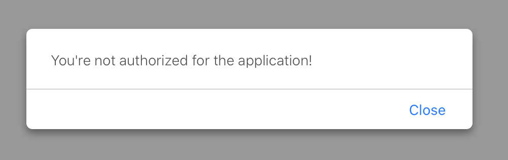
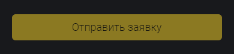

## Кратко

Помимо стандартных средств работы с [формами](/html/form/) можно использовать JavaScript, чтобы проверять формы на валидность, получать доступ к значениям и отправлять информацию на сервер.

Трюки для работы с формами в JS проще всего показать на примере. В этой статье мы соберём форму заявки на участие в миссии по колонизации Марса. В этой форме мы немножко приправим стандартные HTML-атрибуты динамикой на JS.

## Разметка и требования

Наша форма заявки на участие в миссии «Mars Once» будет состоять из шести полей. В форме мы собираем следующие данные:

- Имя, чтобы знать, как обращаться в ответном письме.
- Почту, чтобы знать, куда это письмо слать.
- Возраст — нужны только молодые 🤷‍♂️
- Специализацию — инженеры и учёные пригодятся для основной работы, а психологи нужны, чтобы команда друг друга не перегрызла за десятилетнюю колонизаторскую миссию.
- Работал ли человек в NASA — это большой плюс.
- Фотография, чтобы использовать в печатных материалах.

```html
<form id="mars-once" action="/apply/" method="POST">
  <label>
    Ваше имя:
    <input type="text" name="name" id="name" placeholder="Илон Маск" required autofocus>
  </label>

  <label>
    Почта:
    <input type="email" name="email" id="email" placeholder="elon@musk.com" required>
  </label>

  <label>
    Возраст:
    <input type="number" name="age" required>
  </label>

  <label>
    Профессия:
    <select name="specialization" required>
      <option value="engineer" selected>Инженер</option>
      <option value="scientist">Учёный</option>
      <option value="psychologist">Психолог</option>
      <option value="other">Другая</option>
    </select>
  </label>

  <label>
    Я работал в NASA
    <input type="checkbox" name="nasa-experience" value="1">
  </label>

  <label>
    Фото:
    <input type="file" accept="image/jpeg" name="photo" required>
  </label>

  <button type="submit">Отправить заявку</button>
</form>
```

<iframe title="Форма заявки на Mars Once" src="demos/mars-form/" height="550" sandbox="allow-scripts allow-forms"></iframe>

В целом форма рабочая: обязательные поля не пропустят пустые значения, атрибут `type` проследит, чтобы вместо почты нам не прислали номер телефона, а по нажатию на кнопку валидная форма отправит все данные.

Но нам кроме всего этого хочется:

- чтобы страница при отправке не перезагружалась;
- чтобы во время запроса показывался лоадер, при успешной отправке — поздравление, а при ошибке — причина ошибки;
- чтобы кнопка была заблокирована до тех пор, пока форма не валидна.

Приступим.

## Отправка без перезагрузки

Первым делом настроим отправку формы без перезагрузки страницы.

Перезагрузка страницы — это поведение по умолчанию для отправки формы. Чтобы его предотвратить, нам нужно «перехватить» управление в момент отправки и сказать форме, что делать вместо этого.

### Предотвращаем отправку данных

Для «предотвращения» срабатывания событий мы можем использовать метод `preventDefault()` на объекте события. В нашем случае событием будет отправка формы — `submit`.

Если наше событие находится в переменной [`event`](/js/event/), то для предотвращения поведения по умолчанию мы можем вызвать `event.preventDefault()`.

Чтобы «соединить» форму с нашей будущей собственной отправкой данных, мы напишем функцию, которая будет «слушать» событие отправки и реагировать на него.

Найдём форму на странице, с помощью [`getElementById`](/js/getelementbyid/) и подпишемся на событие `submit` с помощью [`addEventListener`](/js/element-addeventlistener/). Пока мы не будем отправлять форму, а просто напечатаем в консоль строку «Отправка!» и убедимся, что механизм работает:

```js
function handleFormSubmit(event) {
  // Просим форму не отправлять данные самостоятельно
  event.preventDefault()
  console.log('Отправка!')
}

const applicantForm = document.getElementById('mars-once')
applicantForm.addEventListener('submit', handleFormSubmit)
```

Мы можем просто передать функцию `handleFormSubmit()` как второй аргумент в `addEventListener()`, так как он автоматически передаст событие в качестве аргумента для `handleFormSubmit()`.

Получится, что при отправке формы сработает событие `submit`, которое запустит наш обработчик `handleFormSubmit()`.

В этот обработчик как аргумент `event` будет передано событие отправки. Мы вызовем `event.preventDefault()`, и форма не отправится самостоятельно.

### Собираем данные из формы

Следующий шаг — собрать всё, что необходимо отправить.

Нам не хочется собирать каждое значение отдельно.

- Это может быть долго: если форма состоит из 10 полей, это уже требует достаточно много кода.
- Это не масштабируется: если мы захотим добавить ещё пару полей, нам придётся писать код и для этих полей тоже.

Вместо этого мы будем использовать возможности языка, чтобы достать все поля и элементы управления из формы. Напишем функцию `serializeForm`:

```js
function serializeForm(formNode) {
  console.log(formNode.elements)
}

function handleFormSubmit(event) {
  event.preventDefault()
  serializeForm(applicantForm)
}

const applicantForm = document.getElementById('mars-once')
applicantForm.addEventListener('submit', handleFormSubmit)
```

Аргумент функции `serializeForm` — это элемент формы. Именно элемент — не селектор, а конкретный узел в DOM-дереве.

У форм есть свойство `elements`, которое содержит в себе все элементы управления и поля этой формы. Именно этим свойством мы воспользуемся, чтобы получить все данные из формы.

Если сейчас мы вызовем эту функцию, передав туда нашу форму как аргумент, то в консоли появится список всех элементов:

```
HTMLFormControlsCollection
  0 <input type="text" name="name" id="name" placeholder="Илон Маск" autofocus>
  1 <input type="email" name="email" id="email" placeholder="elon@musk.com">
  2 <input type="number" name="age">
  3 <select name="specialization">
  4 <input type="checkbox" name="nasa-experience" value="1">
  5 <input type="file" accept="image/jpeg" name="photo">
  6 <button type="submit">Отправить заявку</button>
```

Обратите внимание, что тип этого набора элементов — `HTMLFormControlsCollection`. Это не массив и, чтобы пройтись циклом по списку элементов, нужно превратить его в массив с помощью вызова `Array.from()`.

Нам останется собрать имя и значение каждого из полей. Для начала, выведем имя и значение каждого элемента в консоль:

```js
function serializeForm(formNode) {
  const { elements } = formNode

  Array.from(elements)
    .forEach((element) => {
      const { name, value } = element
      console.log({ name, value })
    })
}
```

Мы получили список элементов, преобразовали его в массив и прошлись по каждому элементу. У каждого элемента получили поля `name` и `value` и вывели их в консоль.

В консоли после запуска получим вывод по каждому из полей:

```
1 {name: 'name', value: 'Alex'}
2 {name: 'email', value: 'some@mail.com'}
3 {name: 'age', value: '24'}
4 {name: 'specialization', value: 'engineer'}
5 {name: 'nasa-experience', value: '1'}
6 {name: 'photo', value: 'C:\\fakepath\\image.jpg'}
7 {name: '', value: ''}
```

Заметим, что последняя строчка не имеет ни названия, ни значения. Это потому, что последний элемент, который мы проверяли — это кнопка.

Чтобы элементы без названия нам не мешались, мы отфильтруем наш набор. Воспользуемся методом [`filter`](/js/array-filter/), чтобы отбросить элементы с пустым именем. Также заменим метод `forEach` на [`map`](/js/array-map/) — он соберёт нам массив, который хранит объект с именем и значением каждого отфильтрованного элемента.

```js
function serializeForm(formNode) {
  const { elements } = formNode
  const data = Array.from(elements)
    .filter((item) => !!item.name)
    .map((element) => {
      const { name, value } = element

      return { name, value }
    })

  console.log(data)
}
```

На выходе в консоли получится массив из объектов с `name` и `value`:

```js
[
  {name: 'name', value: 'Alex'},
  {name: 'email', value: 'some@mail.com'},
  {name: 'age', value: '24'},
  {name: 'specialization', value: 'engineer'},
  {name: 'nasa-experience', value: '1'},
  {name: 'photo', value: 'C:\\fakepath\\image.jpg'}
]
```

### Значения чекбоксов

Сейчас можно заметить, что `nasa-experience` имеет значение `"1"`. Это неправильно:

- мы не отмечали чекбокс, а значение почему-то `"1"`;
- в целом хотелось бы, чтобы значение этого поля было булевым.

Для этого мы можем использовать особое свойство `checked`, которое есть у чекбоксов.

```js
const isOn = someCheckboxInput.checked
```

Значение этого поля как раз булево, и мы можем использовать это в нашей функции `serializeForm`.

Но это свойство мы хотим использовать только на чекбоксе, а не на остальных полях. Это тоже можно сделать. Прочитаем тип элемента и, если он `"checkbox"`, то возьмём в качестве значения поле `checked`:

```js
function serializeForm(formNode) {
  const { elements } = formNode

  const data = Array.from(elements)
    .map((element) => {
      const { name, type } = element
      const value = type === 'checkbox' ? element.checked : element.value

      return { name, value }
    })
    .filter((item) => !!item.name)

  console.log(data)
}
```

Теперь значение поля `nasa-experience` будет `true`, если чекбокс отмечен, и `false`, если пропущен. Увидим такой вывод:

```js
[
  {name: 'name', value: 'Alex'},
  {name: 'email', value: 'some@mail.com'},
  {name: 'age', value: '24'},
  {name: 'specialization', value: 'engineer'},
  {name: 'nasa-experience', value: false},
  {name: 'photo', value: 'C:\\fakepath\\image.jpg'}
]
```

### Формат данных

В целом, нынешний формат данных в виде массива объектов нам может и подойти, но мы с вами используем кое-что лучше — [`FormData`](/js/form-data/).

`FormData` — это особый тип данных, который можно использовать для отправки данных формы на сервер.

Мы воспользуемся им, чтобы сохранить данные из формы. Создадим экземпляр с помощью `new FormData()`, откажемся от массива со значениями и будем добавлять имена полей и их значения в `FormData` с помощью вызова функции `append`:

```js
function serializeForm(formNode) {
  const { elements } = formNode

  const data = new FormData()

  Array.from(elements)
    .filter((item) => !!item.name)
    .forEach((element) => {
      const { name, type } = element
      const value = type === 'checkbox' ? element.checked : element.value

      data.append(name, value)
    })

  return data
}
```

Но так как тип `FormData` специально создан для работы с формами, можно сделать гораздо проще 🙂

```js
function serializeForm(formNode) {
  return new FormData(formNode)
}
```

Стоит отметить, что `nasa-experience` в таком случае попадёт в финальные данные, только если чекбокс отметили. Если его не отметить, то в финальных данных он не окажется.

Когда чекбокс `nasa-experience` выделен, получим такой вывод:

```js
[
  ['name', 'Alex'],
  ['email', 'example@test.com'],
  ['age', '24'],
  ['specialization', 'engineer'],
  ['nasa-experience', '1'],
  ['photo', File],
]
```

Когда чекбокс не выделен — такой:

```js
[
  ['name', 'Alex'],
  ['email', 'example@test.com'],
  ['age', '24'],
  ['specialization', 'engineer'],
  ['photo', File],
]
```

В первом случае чекбокс был отмечен, поэтому в списке есть элемент `nasa-experience`, во втором случае чекбокс был пропущен, поэтому такого элемента в списке данных нет.

Чтобы проверить, какие данные в себе содержит переменная типа `FormData`, можно использовать метод `.entries()`, он выведет список с данными, как в примере выше.

```js
console.log(Array.from(data.entries()))
```

### Отправка на сервер

Теперь нам надо данные из формы отправить на сервер. Представим, что наш бэкенд предоставляет [API-эндпоинт](/tools/api/) для сохранения данных. Попробуем отправить их.

Функция будет асинхронной, потому что работает с сетевыми запросами. В качестве аргумента она принимает `FormData` и отправляет запрос с помощью вызова [`fetch`](/js/fetch/). Нам нужно указать правильный заголовок `Content-Type` у запроса, для формы он `'multipart/form-data'`:

```js
async function sendData(data) {
  return await fetch('/api/apply/', {
    method: 'POST',
    headers: { 'Content-Type': 'multipart/form-data' },
    body: data,
  })
}
```

Функция вернёт результат запроса к серверу, который мы сможем проверить на ошибки.

Теперь используем эту функцию в обработчике события отправки. Сериализуем форму и передадим её в функцию отправки. Вместо обращения напрямую к форме, будем читать её из объекта события. Форма в объекте события `submit` будет храниться в свойстве `target`:

```js
async function handleFormSubmit(event) {
  event.preventDefault()

  const data = serializeForm(event.target)
  const response = await sendData(data)
}
```

Обратите внимание, что функция `handleFromSubmit()` стала асинхронной, так как она вызывает другую асинхронную функцию и дожидается её результата. Внутри `response` будет поле `status`, по которому мы сможем определить, успешно ли прошёл запрос и вывести соответствующее сообщение пользователю.

## Обработка загрузки и вывод сообщения о результате

Теперь немножко улучшим UX нашей формы. Сейчас она просто отправляет данные и ничего не сообщает пользователям. Это не круто, потому что отправителю будет непонятно, получилось ли записаться в «Mars Once» или нет.

Мы хотим:

- при отправке формы показывать лоадер, пока идёт запрос;
- при успешной отправке показать сообщение, что форма отправлена, и спрятать форму;
- при ошибке указать пользователю, где именно была ошибка.

Начнём с лоадера.

### Показываем лоадер во время отправки

У нас вместо лоадера будет просто показываться строка «Sending...»

Добавим его после кнопки и спрячем:

```html
<style>
  .hidden {
    display:none;
  }
</style>
<form id="mars-once" action="/apply/" method="POST">
  <!-- Код остальной формы -->

  <button type="submit">Отправить заявку</button>
  <div id="loader" class="hidden">Отправляем...</div>
</form>
```

Прячем мы его, потому что хотим показать только во время запроса. Для этого напишем функцию, которые будут управлять его состоянием — делать лоадер видимым, если он не виден сейчас, и скрывать, если он виден. Так как технически это добавление и удаление класса `hidden`, то можно воспользоваться функцией `toggle` из [`classList` API](/js/element-classlist/):

```js
function toggleLoader() {
  const loader = document.getElementById('loader')
  loader.classList.toggle('hidden')
}
```

Вызовем эту функцию до отправки запроса, чтобы показать лоадер, и после запроса, чтобы скрыть. Лоадер будет виден до тех пор, пока запрос не завершится:

```js
async function handleFormSubmit(event) {
  event.preventDefault()
  const data = serializeForm(event.target)

  toggleLoader()

  const response = await sendData(data)

  toggleLoader()
}
```

### Обрабатываем успешную отправку

Давайте теперь проверять ответ сервера. Допустим, нам хочется, чтобы при успешной отправке мы показывали [`alert()`](/js/alert/) с сообщением об успешной отправке и прятали форму:

```js
function onSuccess(formNode) {
  alert('Ваша заявка отправлена!')
  formNode.classList.toggle('hidden')
}
```

Мы должны вызвать `onSuccess`, только если форма была отправлена успешна. Для этого добавим проверку на статус ответа сервера — он должен быть 200 в случае успеха (статусы ответа разобраны в [статье про HTTP протокол](/tools/http-protocol/)):

```js
// Вызовем её вот так:
async function handleFormSubmit(event) {
  event.preventDefault()
  const data = serializeForm(event.target)

  toggleLoader()
  const { status } = await sendData(data)
  toggleLoader()

  if (status === 200) {
    onSuccess(event.target)
  }
}
```


При успешной отправке покажется это сообщение, а форма пропадёт.

### Обрабатываем ошибки

Если что-то пошло не так, то мы хотим сказать пользователям об этом. Напишем функцию, которая будет вызывать `alert()` с сообщением, которое пришлёт сервер в случае ошибки:

```js
function onError(error) {
  alert(error.message)
}
```

Мы могли бы вызвать `alert` сразу на месте, но лучше вынести обработку ошибки в отдельную функцию. Так, если нам захочется добавить какие-то действия по обработке ошибок, нам будет проще ориентироваться в коде.

Вместе со статусом будем получать информацию об ошибке из поля `error`. Если запрос был успешным, то `error` будет пустым, но в случае ошибки там будет лежать сообщение:

```js
async function handleFormSubmit(event) {
  event.preventDefault()
  const data = serializeForm(event.target)

  toggleLoader()

  const { status, error } = await sendData(data)
  toggleLoader()

  if (status === 200) {
    onSuccess(event.target)
  } else {
    onError(error)
  }
}
```



Если что-то пошло не так, мы увидим причину. Форма останется на месте.

## Блокируем кнопку отправки на невалидной форме

Сейчас кнопку отправки можно нажать в любой момент, даже если форма невалидна. И хоть пользователь не сможет отправить форму из-за HTML-валидации, было бы неплохо предупредить, что кнопку нажимать пока рано.

Давайте будем её блокировать до тех пор, пока не будут заполнены все поля, которые требуется заполнить.

Напишем функцию, которая будет проверять валидность формы и блокировать кнопку, если требуется. Аргументом она будет принимать событие ввода с клавиатуры на полях ввода.

Так как событие ввода будет происходить на полях, а не на самой форме, то значение `event.target` — это поле. Чтобы получить форму, воспользуемся свойством `form`, значением которого является ссылка на родительскую форму.

Проверять валидность формы будем с помощью метода `checkValidity()` формы. Он запускает стандартные проверки. Результат проверки будем использовать, для того чтобы установить свойство `disabled` кнопки в значение `true`, если нужно заблокировать, и `false`, если кнопка должна быть доступна.

```js
function checkValidity(event) {
  const formNode = event.target.form
  const isValid = formNode.checkValidity()

  formNode.querySelector('button').disabled = !isValid
}

applicantForm.addEventListener('input', checkValidity)
```



Теперь, пока форма не будет заполнена, кнопка будет заблокирована.

## Что у нас получилось

Мы сделали форму, которая отправляет данные без перезагрузки страницы, показывает сообщение об ошибке или успешной отправке и блокирует кнопку, пока не введены значения.


Для всего этого мы использовали методы HTML-элементов и элементов форм, которые нам предоставляет браузер и веб-платформа.

Конечно, этим работа с формами не заканчивается. Ещё можно сделать валидацию каждого поля в отдельности, загрузку картинок с возможностью их редактирования, добавить всякие комбо-боксы и нестандартные элементы.

Но для первой формы, с которой мы работали в JS, этого достаточно 🙂
