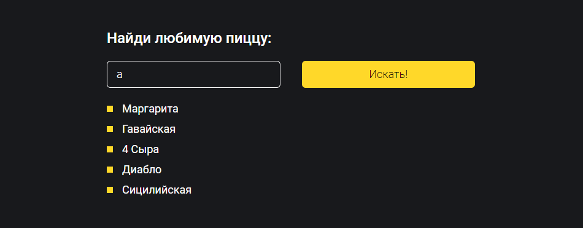
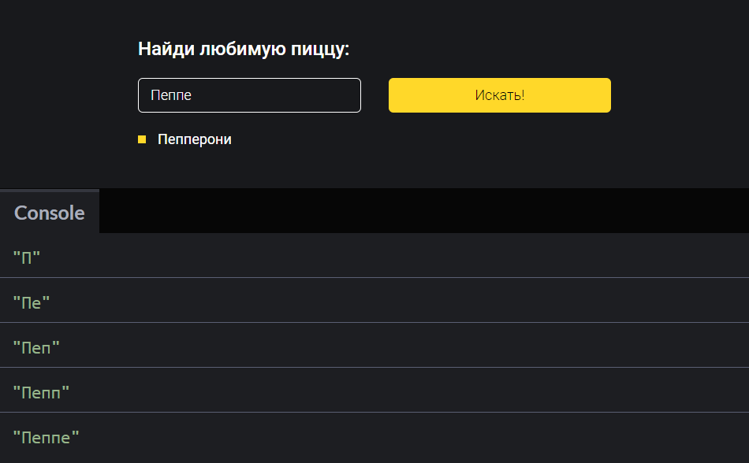
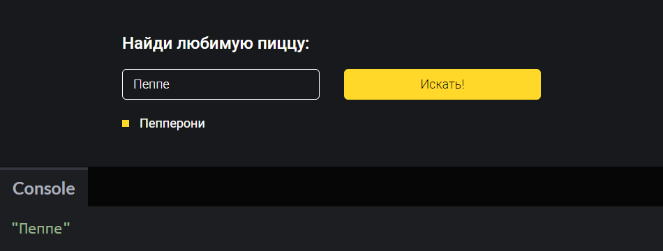

## Кратко

Работа с формами не всегда настолько проста, насколько может показаться. В этой статье мы разберём, как сделать поле поиска, которое будет подсказывать варианты запросов, и при этом не положить свой сервер миллионом запросов в секунду.

`debounce()` — это функция, которая «откладывает» вызов другой функции до того момента, когда с последнего вызова пройдёт определённое количество времени.

<video controls width="580" height="335" poster="images/poster-debounce.png">
  <source src="videos/debounce.mp4" type="video/mp4">
  <source src="videos/debounce_safari.mp4" type="video/mp4">
</video>

Такую функцию используют, чтобы не бомбардировать сервер кучей запросов на каждый чих, а подождать, когда пользователь закончит или приостановит ввод, и только после этого отправить запрос на сервер.

Это бывает нужно в не только в формах поиска, как у нас, но и если мы пишем:

- скрипт аналитики, который что-то считает после события прокрутки — если нам не хочется ничего считать до тех пор, пока пользователь не закончит прокручивать страницу;
- модуль, который ждёт окончания некоторого повторяющегося действия, чтобы выполнить свою работу.

## Разметка

Начнём с разметки формы. У нас будет сама форма `#search` и список ссылок, данные для которых мы будем получать в ответ:

```html
<!-- У формы есть атрибут action, который будет работать,
    если пользователи отключили скрипты. -->
<form action="/some-route" method="GET" id="search">
  <label>Найди любимую пиццу:</label>

  <!-- Используем input с типом search,
      чтобы браузеры делали дополнительную магию
      с автозаполнением и подходящими кнопками
      на телефонных клавиатурах. -->
  <input type="search" name="query" placeholder="Маргарита" />

  <!-- У кнопки тип проставлять необязательно,
      так как submit — это тип кнопки по умолчанию. -->
  <button>Искать!</button>
</form>

<ul class="search-results"></ul>
```

Форма будет выглядеть незамысловато и будет работать стандартным образом. Мы будем обрабатывать форму с помощью JavaScript. Чтобы узнать больше о том, как это работает, читайте статьи [«Валидация форм»](/css/invalid-valid/) и [«Работа с формами в JS»](/js/forms/).


Просто форма 🙂

## Фейковый сервер для запросов

Следующим шагом мы подготовим «сервер», на который будем отправлять запросы из формы.

Так как это всего лишь пример, мы не будем поднимать «настоящий сервер™». Вместо этого мы напишем «заглушку» для сервера, который будет делать всё, что нам потребуется.

<aside>

💡 Такие заглушки, которые имитируют какое-то поведение, называются [мок-объектами](/js/testing-and-fake-objects/#moki).

</aside>

Нам потребуется, чтобы «сервер» на запрос отвечал массивом названий видов пиццы, которые мы потом будем преобразовывать в ссылки и выводить в списке под формой.

Сперва приготовим список названий (так сказать базу данных 😃):

```javascript
// По этому массиву мы будем искать названия,
// которые содержат пользовательский запрос.
const pizzaList = [
  'Маргарита',
  'Пепперони',
  'Гавайская',
  '4 Сыра',
  'Диабло',
  'Сицилийская'
]
```

А дальше создадим объект, который будет имитировать асинхронный ответ (Посмотрите статью [про асинхронность в JS](/js/async-in-js/), если это понятие вам не знакомо).

```javascript
// В функции contains мы будем проверять,
// содержится ли пользовательский запрос
// в каком-либо из названий:
function contains(query) {
  return pizzaList.filter((title) =>
    title.toLowerCase().includes(query.toLowerCase())
  )
}

// Мок-объект сервера будет содержать метод search:
const server = {
  search(query) {
    // Этот метод будет возвращать промис,
    // таким образом мы будем эмулировать «асинхронность»,
    // как будто мы «сходили на сервер, он подумал и ответил».
    return new Promise((resolve) => {
      // Таймаут нужен исключительно для того,
      // чтобы иметь возможность настраивать время задержки 🙂
      setTimeout(
        () =>
          resolve({
            // В качестве ответа будем отправлять объект,
            // значением поля list которого
            // будет наш отфильтрованный массив.
            list: query ? contains(query) : [],
          }),
        150
      )
    })
  },
}
```

Мы сможем вызывать этот метод вот так:

```javascript
(async () => {
  const response = await server.search('Peppe')
})()
```

Или так:

```javascript
server.search('Peppe').then(() => {
  /*...*/
})
```

## Первая версия обработчика

Сперва напишем основу для обработки формы без `debounce()`, убедимся, что всё работает, увидим причину, зачем нам `debounce` вообще нужен, а потом напишем его.

Получим ссылки на все элементы, с которыми будем работать:

```javascript
const searchForm = document.getElementById('search-form');
const searchInput = searchForm.querySelector('[type="search"]');
const searchResults = document.querySelector('.search-results');
```

Затем напишем обработчик события ввода с клавиатуры в поле поиска:

```javascript
searchInput.addEventListener('input', (e) => {
  // Получаем значение в поле,
  // на котором сработало событие:
  const { value } = e.target

  // Получаем список названий пицц от сервера:
  server.search(value).then(function (response) {
    const { list } = response

    // Проходим по каждому из элементов списка,
    // и составляем строчку с несколькими <li> элементами...
    const html = list.reduce((markup, item) => {
      return `${markup}<li>${item}</li>`
    }, ``)

    // ...которую потом используем как содержимое списка:
    searchResults.innerHTML = html
  })
})
```

Проверим, что при вводе какой-то строки, например `a`, мы видим список на странице.



Работает 💥

Теперь вернёмся к проблеме, с которой мы начали. Сейчас каждое нажатие клавиши в поле отправляет запрос на сервер. Мы это можем проверить, если добавим лог в метод `search()` на сервере:

```javascript
const server = {
  search(query) {
    // Поставим логер, который будет выводить
    // каждый принятый запрос:
    console.log(query)

    return new Promise((resolve) => {
      setTimeout(
        () =>
          resolve({
            list: query ? contains(query) : [],
          }),
        100
      )
    })
  },
}
```

Теперь введём название пиццы:



Мы быстро ввели 5 букв, а из-за этого улетело 5 запросов. Это расточительно.

Для того, чтобы не дёргать сервер на каждое изменение ввода, мы хотим «отложить» запрос до момента, когда пользователь приостановит ввод.

К тому же, если бы наш сервер был реальным, мы бы не могли гарантировать, что ответы от него приходили бы в порядке, в котором были отправлены запросы.

В такой ситуации могло бы получиться, что на ответ на более ранний запрос пришёл бы позже всех.

<aside>

💡 Ситуация, когда неправильный порядок может что-то поломать, называется _race condition_.

</aside>

## Пишем `debounce()`

Хорошо, мы определились с проблемой, как теперь её решить?

Первая мысль, которая приходит в голову — изменить обработчик события, чтобы он следил за тем, когда ему отправлять запросы, а когда нет. Но это не очень удачная мысль.

- Это смешение ответственностей, обработчику лучше обрабатывать события, а не заниматься чем-то параллельно, иначе он быстро станет нечитаемым.
- Если у нас появится похожая форма, то придётся реализовать ту же фичу ещё раз.

Нам нужно написать функцию, которая будет знать, когда надо вызывать другую функцию.

<aside>

💡 Такие функции, которые принимают другие функции как аргументы или возвращают функцию как результат, называются функциями высшего порядка.

</aside>

<aside>

☝️ ...А иногда такой приём ещё называют декорированием, а функции высшего порядка — [декораторами](/js/design-patterns-structural/).

</aside>

Итак, `debounce()` — это функция высшего порядка, которая будет принимать аргументом функцию, которую надо «отложить».

Поехали:

```javascript
// Аргументами функции будут:
// - функция, которую надо «откладывать»;
// - интервал времени, спустя которое функцию следует вызывать.
function debounce(callee, timeoutMs) {
  // Как результат возвращаем другую функцию.
  // Это нужно, чтобы мы могли не менять другие части кода,
  // чуть позже мы увидим, как это помогает.
  return function perform(...args) {
    // В переменной previousCall мы будем хранить
    // временную метку предыдущего вызова...
    let previousCall = this.lastCall

    // ...а в переменной текущего вызова —
    // временную метку нынешнего момента.
    this.lastCall = Date.now()

    // Нам это будет нужно, чтобы потом сравнить,
    // когда была функция вызвана в этот раз и в предыдущий.
    // Если разница между вызовами меньше, чем указанный интервал,
    // то мы очищаем таймаут...
    if (previousCall && this.lastCall - previousCall <= timeoutMs) {
      clearTimeout(this.lastCallTimer)
    }

    // ...который отвечает за непосредственно вызов функции-аргумента.
    // Обратите внимание, что мы передаём все аргументы ...args,
    // который получаем в функции perform —
    // это тоже нужно, чтобы нам не приходилось менять другие части кода.
    this.lastCallTimer = setTimeout(() => callee(...args), timeoutMs)

    // Если таймаут был очищен, вызова не произойдёт
    // если он очищен не был, то callee вызовется.
    // Таким образом мы как бы «отодвигаем» вызов callee
    // до тех пор, пока «снаружи всё не подуспокоится».
  }
}
```

Использовать такой `debounce()` мы можем так:

```javascript
// Функция, которую мы хотим «откладывать»:
function doSomething(arg) {
  // ...
}

doSomething(42)

// А вот — та же функция, но обёрнутая в debounce:
const debouncedDoSomething = debounce(doSomething, 250)

// debouncedDoSomething — это именно функция,
// потому что из debounce мы возвращаем функцию.

// debouncedDoSomething принимает те же аргументы,
// что и doSomething, потому что perform внутри debounce
// прокидывает все аргументы без изменения в doSomething,
// так что и вызов debouncedDoSomething будет таким же,
// как и вызов doSomething:
debouncedDoSomething(42)
```

## Применяем `debounce()`

Теперь мы можем применить `debounce()` в нашем обработчике. Сперва немного порефакторим:

```javascript
// Вынесем обработчик события в отдельную функцию.
// Внутри она будет такой же,
// но так нам будет удобнее оборачивать её в debounce.
function handleInput(e) {
  const { value } = e.target

  server.search(value).then(function (response) {
    const { list } = response

    const html = list.reduce((markup, item) => {
      return `${markup}<li>${item}</li>`
    }, ``)

    searchResults.innerHTML = html
  })
}

searchInput.addEventListener('input', handleInput)
```

Теперь обернём вынесенную функцию и обновим `addEventListener`:

```javascript
function handleInput(e) {
  // ..
}

// Указываем, что нам нужно ждать 250 мс,
// прежде чем запустить обработчик:
const debouncedHandle = debounce(handleInput, 250)

// Передаём новую debounced-функцию в addEventListener:
searchInput.addEventListener('input', debouncedHandle)
```

И теперь, если мы быстро напишем несколько символов, мы отправим лишь один запрос:



Вместо пяти запросов теперь отправляем всего один!

Обратите внимание, что API функции не поменялось. Мы как передавали [`event`](/js/event/), так и передаём. То есть для внешнего мира debounced-функция ведёт себя точно так же, как и простая функция-обработчик.

Это удобно, потому что меняется лишь одна небольшая часть программы, не затрагивая системы в целом.

### Результат

Полный пример строки поиска у нас получится такой:

<iframe title="Откладывание запросов при поиске — Debounce на примере формы поиска — Дока" src="demos/debounced-search/" height="280"></iframe>
