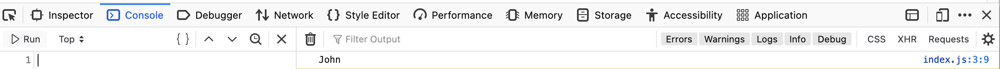

## Кратко
Отладка программы (выяснение причины ошибки и ее устранение) или "Дебаг" от английского слова [debug](https://ru.wikipedia.org/wiki/Debug) — важнейшее умение разработчика,
так как обычно на выявление неисправности и исправление кода тратится значительно больше времени, чем на его написание и эффективность программиста во многом зависит от навыков отладки.
Самый простой дебаг — угадывание потенциальных мест ошибки и вывод переменных до/после кода с ошибкой в консоль с помощью `console.log`.
Отладка с помощью `console.log` не очень эффективный метод, например, если нужно вывести несколько переменных и/или переменные на разных этапах выполнения программы — консоль превращается в сложночитаемый список строк.
В этой статье мы рассмотрим дебаг с помощью `console.log` и более продвинутые способы — остановка и пошаговое выполнения кода.

## Основы отладки
Сначала определимся с тем, что мы ищем в коде.
Баги в программе могут быть двух видов – запуск программы аварийно завершается ошибкой или программа выдает неверные результаты.

- В первом случае достаточно открыть консоль браузера и вы увидите название ошибки и строку кода, где произошло исключение (exception), вызвавшее остановку выполнения кода. Подробнее такие ошибки описаны в [Error и стандартные ошибки](/js/errors/)
- Во втором случае причина неправильного результата может быть в ошибочном алгоритме, неявном приведении типов, случайном использовании присваивания `=` вместо сравнения `==`/`===` и тд.

Такие ошибки сложнее обнаружить, так как программа выполняется, не падает в процессе, выдает какой-то результат но результат неверный.

Отладку значительно ускоряют и облегчают [тесты](/js/how-to-test-and-why/).

### Локализация ошибки
Первый шаг отладки — поиск возможных участков кода, где вероятно есть неисправности.

Определить точное место неисправного кода помогает разделение программы на части и проверка каждой части.

Для этого нужно:
- определить начало работы программы, откуда поступают данные;
- проследить методы/функции, которые обрабатывают эти данные;
- до и после этих методов/функций узнавать текущие значения переменных;
- не забыть учесть обработку условий if/else.


## Отладка с помощью консоли
Подавляющее большинство браузеров позволяет выводить данные в панель инструментов разработчика "Console".
Для вывода переменной, функции, класса нужно передать эти данные в фунцию `console.log`, например так:

```js
let name = 'John'

console.log(name)
```

Метод `log` выведет обычное сообщение в devtools. Кроме обычных сообщений можно вывести:
* `console.warn(name)` предупреждение. Текст будет желтого цвета
* `console.error(name)` ошибка. Текст будет красного цвета
* `console.table(name)` лог табличных данных (например, массива)

## Инструменты devtools
Современные инструменты разработчика в браузерах позволяют остановить и пошагово выполнить код  — во вкладке devtools "Oтладка кода".
В Chrome она называется "Sources", а в Firefox — "Debugger".

В этой вкладке отображается весь загруженный JS код для страницы. Если у сайта включены source maps, то будут доступен исходный код до транспиляции и сжатия для просмотра и выставления точек отстановки кода.


### Примеры

#### Chrome


#### Firefox


### Оставнока и продолжение выполнения кода
В devtools можно проставить точки остановки выполнения программы. Движок браузера встретив такую точку поставит выполнение кода на паузу и даст доступ к просмотру текущих значений переменных.
Этот способ отладки намного мощнее вывода в консоль, так как позволяет посмотреть все значения переменных без использования console.log а также делать остановку выполения кода по условию.

Для указания точек остановки нужно открыть sources в devtools


#### Просто остановка
Для остановки выполенния кода есть два способа:
- указать в коде программы `debugger`
- открыть в devtools вкладку Sources и кликнуть на левой части окна с кодом на номере строки


#### Остановка по условию
Добавленную в devtools точку остановки можно редактировать — задать остановку по условию: в поле ввода ввести выражение, возвращаемое значение true или false будет определять, останавливать или нет выполнение программы в этом месте.


#### Продолжнение выполнения кода после остановки
После остановки есть возможность пошагово продолжить выполнение кода.
Существует несколько вариантов продолженения выполнения:

##### Step over line of code

##### Step into line of code

##### Step out of line of code

##### Run all code up to a certain line


#### Слежение за переменными (Watch expressions)

### Вывод переменных текущей области видимости в консоль
Вкладка отладки кода позволяет открыть консоль. В этой консоли будет доступ ко всем переменным текущей области видимости (текущего участка выполнения кода).

### Пример — отладка калькулятора дней
<iframe title="Отладка кода — Калькулятор дней — Дока" src="demos/days-calc/" height="280"></iframe>

