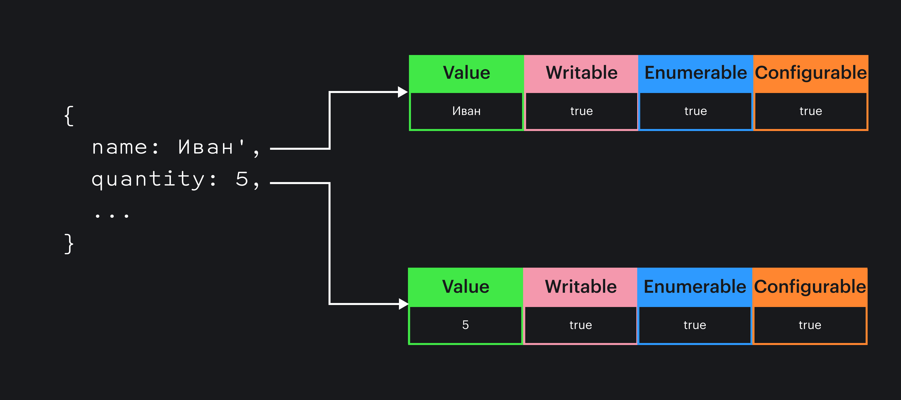

## Кратко

[Объекты](/js/object/), как мы знаем, содержат свойства. У каждого из свойств объекта, кроме значения, есть ещё три флага конфигурации, которые могут принимать значения `true` или `false`. Эти флаги называются _дескрипторами_:

- `writable` — доступно ли свойство для записи;
- `enumerable` — является ли свойство видимым при перечислениях (например, в цикле [`for..in`](/js/for-in/));
- `configurable` — доступно ли свойство для переконфигурирования.

Когда мы создаём свойство объекта «обычным способом», эти три флага устанавливаются в значение `true`.

Для изменения значений дескрипторов применяется статический метод `Object.defineProperty()`, а для чтения значений — `Object.getOwnPropertyDescriptors()`.

Другими словами, дескрипторы — это пары ключ-значение, которые описывают поведение свойства объекта при выполнении операций над ним (например, чтения или записи).


К каждому свойству объекта под капотом привязан набор дескрипторов.

## Пример

Создадим объект и добавим в него свойство ОС для ноутбука. Сделаем это с помощью дескрипторов и статического метода `Object.defineProperty()`.

Передаём в метод:

- объект, которому добавляем свойство;
- название свойства строкой;
- объект со значениями дескрипторов и ключом `value`, содержащим значение свойства.

```js
const laptop = {}

Object.defineProperty(laptop, 'os', {
  value: 'MacOS',
  writable: false,
  enumerable: true,
  configurable: true
})
```

Свойство `os` будет недоступно для перезаписи, но будет видно при перечислении и доступно для переконфигурирования.

Попробуем перезаписать свойство `os` и выведем полученный результат:

```js
laptop.os = 'Windows'

console.log(laptop)
// { 'os': 'MacOS' }
```

## Как пишется

```js
Object.defineProperty(объект, имяСвойства, дескрипторы)
```

Функция принимает следующие параметры:

- `объект` — объект, свойство которого изменяем или добавляем;
- `имяСвойства` — свойство, для которого нужно применить дескриптор;
- `дескриптор` — дескриптор, описывающий поведение свойства.

Если свойство уже существует, `Object.defineProperty()` обновит флаги.
Если свойство не существует, метод создаёт новое свойство с указанным значением и флагами. Если какой-либо флаг не указан явно, ему присваивается значение `false`.

## Как понять

Дескрипторы, которые мы можем передать в `Object.defineProperty()` могут быть двух типов — дескриптор данных и дескриптор доступа. Каждый тип дескриптора имеет свой набор свойств.

В обоих типах можно использовать общие свойства `configurable` и `enumerable`.

Дескриптор, передаваемый в `Object.defineProperty()` может быть только одним типом дескриптора. Он не может быть одновременно обоими! Если передать в `Object.defineProperty()` объект, содержащий и свойства дескриптора данных, и свойства дескриптора доступа, то метод выбросит ошибку _Invalid property descriptor. Cannot both specify accessors and a value or writable attribute_.

### Дескриптор данных

Дескриптор данных — это дескриптор, который определяет значение свойства и возможность изменить это значение.

- `value` — значение свойства, по умолчанию `undefined`.
- `writable` — можно ли изменить значение с помощью оператора присваивания.

#### `value`

Свойство `value` дескриптора данных отвечает за значение свойства объекта.

Добавим ноутбуку свойство «Размер экрана»:

```js
Object.defineProperty(laptop, 'displaySize', {
  value: '15'
})
```

Выведем полученные данные:

```js
const descriptor = Object.getOwnPropertyDescriptor(laptop, 'displaySize')
console.log(descriptor)
```

Мы не указали остальные свойства явно, поэтому дескриптор имеет следующие значения:

```json
{
  "value": "15",
  "writable": false,
  "enumerable": false,
  "configurable": false
}
```

#### `writable`

Свойство `writable` дескриптора определяет, можно ли изменить значение свойства с помощью оператора присваивания. По умолчанию устанавливается в `false` для свойств, созданных через `Object.defineProperty()` и в `true`, если свойство добавлено через оператор `.`.

Изменим значение `writable`:

```js
const laptop = {}

Object.defineProperty(laptop, 'displaySize', {
    value: '15',
    writable: false, // не перезаписываемо!
    configurable: true,
    enumerable: true
})

laptop.displaySize = '18'

console.log(laptop.displaySize)
// { 'displaySize': '15' }
```

[В строгом режиме](/js/use-strict/) мы получим ошибку `TypeError`, которая говорит о том, что мы не можем изменить неперезаписываемое свойство.

### Дескриптор доступа

Дескриптор доступа — это дескриптор, который определяет работу свойства через функции чтения и записи свойства (геттера и сеттера).

`get` — функция, используемая для получения значения свойства, возвращает значение или `undefined`.

`set` — функция, используемая для установки значения свойства. Принимает единственным аргументом новое значение, присваиваемое свойству.

<aside>
🧐 Можно заметить, что два типа дескрипторов конфликтуют друг с другом. Они описывают одно и то же — работу свойства, но делают это разными способами. Поэтому и нельзя использовать дескриптор со свойствами обоих типов.
</aside>

Сравним простой объект с полем `name` и объект с геттером `name`, созданным через `Object.defineProperty()`:

```js
const animal = { _hiddenName : 'Кот' }
Object.defineProperty(animal, 'name', {
    get: function() { return this._hiddenName }
})

const animal2 = {
  name: 'И здесь тоже кот',
}

console.log(animal.name)
// Кот
console.log(animal2.name)
// И здесь тоже кот
```

Оба объекта имеют одинаковое поведение. Стоит только сказать, что за свойством в первом случае стоит функция, которая вызывается автоматически. Достаточно написать `animal.name`.

Если нам понадобится изменить значение свойства `name`, мы выполним `animal.name = 'Серый кот'`, ничего не произойдёт. Дело в том, что с ключом `name` не связана функция-сеттер, поэтому значение этому свойству установить невозможно.

Добавим сеттер:

```js
const animal = { _hiddenName : 'Кот' }
Object.defineProperty(animal, 'name', {
    get: function() { return this._hiddenName },
    set: function(value){ this._hiddenName = value }
})

animal.name = 'Собака'
console.log(animal.name)
// Собака
```

По сути, мы можем регулировать возможность читать и получать значение свойства, как и в дескрипторе данных, только более тонко. Такой подход используется часто, поэтому для объявления геттеров и сеттеров придумали синтаксис без вызова `Object.defineProperty()`:

```js
const animal = {
  get name() {
    return this._name
  },
  set name(value) {
    this._name = value
  }
}

console.log(animal.name)
// undefined

animal.name = 'Кот'
console.log(animal.name)
// Кот
```

Сеттеры могут понадобиться, например, для модификации значения при записи свойств. В примере ниже мы модифицируем дату и записываем в нужном формате.

```js
const updatedAt = {
  get date() {
    return this._date
  },

  set date(value) {
    this._date = new Intl.DateTimeFormat('en-US').format(value)
  }
}
```

Запишем дату и время в поле `date`:

```js
updatedAt.date = new Date(2030, 11, 12)
console.log(updatedAt.date)
// 12/12/2030
```

И получим дату в нужном формате: `12/12/2030`.

Свойства с методами доступа дают нам все возможности обработки данных с помощью функций и простоту, характерную для работы с обычными свойствами.

### Общие свойства

Общие свойства можно указывать в обоих типах дескрипторов.

#### `enumerable`

Свойство определяет, является ли создаваемое свойство объекта видимым при перечислениях.

Создадим два свойства у объекта `laptop` — одно будет перечисляемым, а другое — нет:

```js
const laptop = {}

Object.defineProperty(laptop, 'processor',
    // сделаем `processor` перечисляемым, как обычно
    { enumerable: true, value: 'Intel Core' }
)

Object.defineProperty(laptop, 'touchID',
    // сделаем `touchID` НЕперечисляемым
    { enumerable: false, value: true }
)

console.log(laptop.touchID)
// true
console.log(('touchID' in laptop))
// true
console.log(laptop.hasOwnProperty('touchID'))
// true


for (let key in laptop) {
  console.log(key, laptop[key])
}
// 'processor': 'Intel Core'
```

Заметьте, что `laptop.touchID` существует и имеет значение, но не отображается в цикле `for..in` (при этом, оно существует, если воспользоваться оператором `in`). «Перечислимое» означает: «будет учтено, если пройти перебором по свойствам объекта».

#### `configurable`

Свойство `configurable` определяет, доступно ли создаваемое свойство объекта для переконфигурирования.

Изменим значение `configurable`:

```js
const laptop = {}

Object.defineProperty(laptop, 'processor', {
    value: 'Intel Core',
    writable: true,
    configurable: false, // запрещаем переконфигурирование!
    enumerable: true
})

console.log(laptop.processor)
// Intel Core
laptop.processor = 'M1'
console.log(laptop.processor)
// 'M1'

Object.defineProperty(laptop, 'processor', {
    value: 'M1 TOP',
    writable: true,
    configurable: true,
    enumerable: true
})
// TypeError: Cannot redefine property: processor
```

Попытка переписать дескриптор свойства `processor` приводит к ошибке `TypeError`, даже если вы находитесь не в строгом режиме.

<aside>
☝️ Будьте осторожны, изменение `configurable` на `false` необратимо и его нельзя отменить.
</aside>

Если для свойства уже задано `configurable: false`, то `writable` может быть изменено с `true` на `false` без ошибки, но не обратно в `true` если оно уже `false`.

А ещё `configurable: false` препятствует возможности использовать оператор `delete` для удаления существующего свойства. Ошибки не случится, но и свойство не удалится:

```js
delete laptop.processor
console.log(laptop)
// { processor: 'M1' }
```

Периодически разработчику нужно защищать объекты от вмешательства извне. По ошибке легко изменить свойство объекта. Для защиты объектов от подобных изменений и управления их иммутабельностью предлагается использовать дескрипторы, такие как `writable` и `configurable`, сеттеры, а также методы `Object.preventExtensions()`, `Object.seal()`, и `Object.freeze()` для ограничения доступа к объекту целиком.
