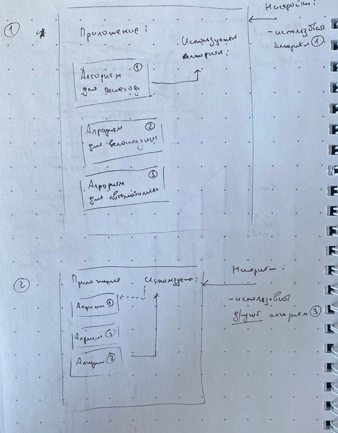
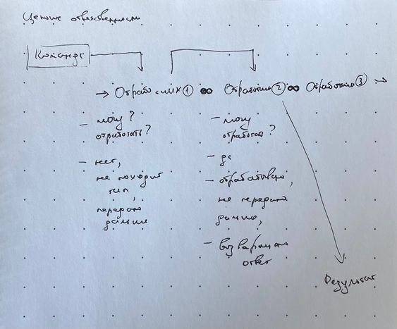
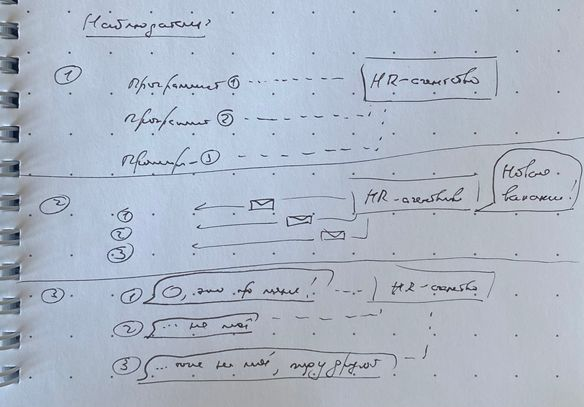

Программирование — это решение задач. Часть задач в повседневной работе повторяется от проекта к проекту. У таких задач, как правило, уже есть решения — такие решения называются паттернами или шаблонами проектирования.

<aside>

🙃 Это статья из цикла об [архитектуре и шаблонах проектирования](/js/architecture-and-design-patterns/). Их необходимость и пользу мы рассматриваем в первой статье из цикла. В этой и других статьях — рассматриваем самые частые шаблоны проектирования.

</aside>

Поведенческие паттерны распределяют ответственности между модулями и определяют, как именно будет происходить общение. Простыми словами — они отвечают на вопрос «Как организовать поведение программного компонента и его общение с другими?».

Среди поведенческих паттернов можем выделить:

- Стратегию.
- Цепочку ответственности.
- Команду.
- Наблюдателя.

## Стратегия

Стратегия (англ. _strategy_) позволяет выбирать и даже менять алгоритм работы в зависимости от ситуации.

### Пример

Допустим, мы пишем приложение-навигатор. Когда оно будет прокладывать путь между точками, ему надо будет знать, для кого этот путь: пешехода, велосипедиста, автомобилиста. В зависимости от ситуации мы будем использовать разные алгоритмы и маршруты на карте.



Для использования стратегии мы объявляем интерфейс, который описывает алгоритмы, из которых мы будем выбирать:

```ts
interface RouteStrategy {
  findRoute(from: Point, to: Point): Instruction[];
}
```

Создаём различные варианты построения маршрутов:

```ts
const pedestrianRoute: RouteStrategy = {
  findRoute(from, to) {
    // ...Логика построения маршрута для пешехода.
    return [
      /*...*/
    ]
  },
}

const cyclistRoute: RouteStrategy = {
  findRoute(from, to) {
    // ...Логика построения маршрута для велосипедиста.
    return [
      /*...*/
    ]
  },
}

const automobileRoute: RouteStrategy = {
  findRoute(from, to) {
    // ...Логика построения маршрута для автомобилиста.
    return [
      /*...*/
    ]
  },
}
```

Чтобы использовать какой-либо из алгоритмов, нам нужен контекст, для которого мы укажем одну из стратегий:

```ts
class Context {
  // При создании укажем стратегию, которую будем использовать:
  constructor(private routeFinder: Strategy) {}

  // Иногда полезно менять стратегию во время работы,
  // сделаем метод для этого
  public use(routeFinder: Strategy) {
    this.routeFinder = routeFinder
  }

  public routeFromHomeToWork(): Instruction[] {
    const home: Point = {
      /*...*/
    }
    const work: Point = {
      /*...*/
    }
    return this.routeFinder.findRoute(home, work)
  }
}
```

Теперь, чтобы построить маршрут от дома до работы на велосипеде, мы укажем:

```ts
const strategyContext = new Context(cyclistRoute)
strategyContext.routeFromHomeToWork()
```

Также мы можем поменять стратегию уже во время выполнения программы (в рантайме), если пользователь, например, слез с велосипеда и пошёл пешком. Метод для построения маршрута останется тем же:

```ts
strategyContext.use(pedestrianRoute)
strategyContext.routeFromHomeToWork()
```

### Когда использовать

Используйте стратегию, когда приложение может использовать разные алгоритмы для решения задачи. Особенно полезно использовать её, когда алгоритм может поменяться прямо в рантайме приложения.

## Цепочка ответственности

Цепочка ответственности (англ. _chain of responsibility_) подразумевает перебор объектов до тех пор, пока не найдётся нужный для решения задачи.

В цепочке сигнал, который нужно обработать, переходит от одного объекта к другому по очереди. Когда находится подходящий обработчик, он обрабатывает сигнал, а цепочка в этом месте обрывается.



### Пример

Допустим, мы хотим списать деньги с аккаунта пользователя. Если у нас несколько валют, то нам надо выбрать подходящий счёт, мы можем использовать цепочку ответственности, чтобы списать деньги с нужного счёта.

Сперва укажем интерфейс обработчика для списания денег. В нём укажем метод для обработки запроса `handle()`, а также метод для указания следующего обработчика, если этот не подходит `setNext()`:

```ts
interface Handler {
  setNext(handler: Handler): Handler;
  handle(request: string, amount: number): void;
}
```

В абстрактном классе укажем общую для всех обработчиков функциональность, чтобы не повторять её в самих обработчиках:

```ts
abstract class AbstractHandler implements Handler {
  private nextHandler: Handler

  public setNext(handler: Handler): Handler {
    this.nextHandler = handler

    // Возвращаем переданный обработчик,
    // чтобы их можно было соединять в «паровозик»:
    // handler1.setNext(handler2).setNext(handler3)
    return handler
  }

  // Если обработчик не знает, как обработать запрос,
  // он вызовет метод абстрактного класса:
  public handle(request: string, amount: number): void {
    if (this.nextHandler) {
      return this.nextHandler.handle(request)
    }

    // Если ни один из обработчиков не знает,
    // как обработать запрос, то сработает эта строка:
    console.log('No handler found!')
  }
}
```

Теперь создадим обработчики под каждый тип валюты:

```ts
class UsdHandler extends AbstractHandler {
  public handle(request: string, amount: number): void {
    if (request === 'USD') {
      console.log(`You've been charged with ${number}$!`)
      return
    }

    super.handle(request)
  }
}

class EurHandler extends AbstractHandler {
  public handle(request: string, amount: number): void {
    if (request === 'EUR') {
      console.log(`You've been charged with ${number} euros!`)
      return
    }

    super.handle(request)
  }
}

class RubHandler extends AbstractHandler {
  public handle(request: string, amount: number): void {
    if (request === 'RUB') {
      console.log(`У вас списали ${number}₽!`)
      return
    }

    super.handle(request)
  }
}
```

Теперь мы можем выстроить цепочку из обработчиков, которые будут реагировать на запросы:

```ts
const usdHandler = new UsdHandler()
const rubHandler = new RubHandler()
const eurHandler = new EurHandler()

rubHandler.setNext(usdHandler).setNext(eurHandler)
```

А чтобы отправить запрос в цепочку мы напишем:

```ts
function handlePurchase(
  handler: Handler,
  currency: string,
  amount: number
): void {
  handler.handle(currency, amount)
}

handlePurchase(rubHandler, 'USD', 20)
// You've been charged with 20$!

handlePurchase(rubHandler, 'RUB', 20)
// У вас списали 20₽!
```

Мы можем передать любой обработчик, не обязательно первый в цепочке, так как они связаны через `setNext()`:

```ts
handlePurchase(usdHandler, 'EUR', 20)
// You've been charged with 20 euros!

handlePurchase(usdHandler, 'USD', 20)
// You've been charged with 20$!
```

### Цепочка ответственности или перебор

Кажется, что цепочка ответственности — это просто переусложнённый перебор вариантов:

```ts
function handlePurchase(currency: string, amount: number): void {
  switch (currency) {
      case 'USD':
          return usdHandler(currency, amount);
      case 'RUB':
          return rubHandler(currency, amount);
      case 'EUR':
          return uerHandler(currency, amount);
      default:
          console.log('No handler found!')
  }
}
```

Но у них есть важное отличие — при использовании цепочки ответственности функции `handlePurchase()` не требуется знать все возможные варианты, а также не требуется знать и ссылаться на каждый обработчик.

Перебор сложно адаптировать к ситуации, когда заранее нам не известны все обработчики, их порядок или все возможные варианты значений переменной, по которой мы хотим перебирать варианты.

В простых случаях перебор — вполне рабочий вариант. Тот же [Redux](/js/architecture-data-flow/) использует [`switch`](/js/switch/), чтобы определить, как обработать экшен. Но это увеличивает зацепление кода, потому что управляющему коду `handlePurchase()` теперь надо знать больше об устройстве других модулей.

### Null-object

Вместе с цепочкой ответственности и перебором можно использовать Null-object для обработки случая, когда подходящий обработчик не был найден.

Null-object (или нуль-объект, пустой объект) — это объект, который реализует такой же интерфейс, как обработчик запроса, но ничего не делает.

В случае с цепочкой при использовании абстрактного класса обработчика он чаще всего не требуется, потому что абстрактный класс отвечает за обработку крайнего случая. В случае с перебором его можно использовать в `default` кейсе.

### Когда использовать

Используйте цепочку ответственности, когда заранее неизвестно количество, порядок или все возможные варианты обработчиков. В простых случаях обычно хватает перебора вариантов.

### С чем нельзя путать

Мидлвар (англ. _middleware_) концептуально похож на цепочку ответственности, но всё же отличается от неё.

В мидлварах запрос переходит от одного контроллера к другому, и запрос может обработать _каждый из них_. В цепочке, как правило, запрос обрабатывает лишь один контроллер.

## Команда

Команда (англ. _command_) инкапсулирует действия и нужные данные для обработки этих действий в объекты.

### Пример

Самый распространённый пример команды — это [экшен в Redux](/js/architecture-data-flow/). Экшен — это объект, который содержит название действия и данные:

```js
const updateUserAction = {
  type: 'UPDATE_USER',
  payload: {
    name: 'Alex',
    email: 'hi@site.com',
  },
}
```

Обработчик в этом случае проверит, какое действие было вызвано и обработает его:

```js
function userReducer(state, action) {
  switch (action.type) {
    case 'UPDATE_USER':
      return { ...state /*...*/ }
  }
}
```

Единственное отличие от канонической команды в том, что этот самый обработчик находится снаружи. В классической реализации команды обработчик находится в самой команде.

```ts
interface Command<TPayload> {
  execute(payload: TPayload): void;
}

const updateUser: Command = {
  execute(payload) {
    const { name, email } = payload
    // ...Логика обработки команды.
  },
}
```

В [ООП](/js/oop/) команды используют для расцепления кода и общения между разными модулями. При сочетании с [трёхслойной архитектурой](/js/clean-architecture/) команды могут использоваться в прикладном слое для описания пользовательских сценариев.

Но чаще от классической реализации отходят и разделяют команду и обработчик:

```ts
interface Command<TPayload> {
  name: string;
  payload: TPayload;
}

interface CommandHandler<TCommand, TResult, TError> {
  execute(command: TCommand): TResult;
}
```

В этом случае объект команды занимается инкапсуляцией данных, а обработчик — выполнением команды и обработкой ошибок и крайних случаев:

```ts
const userCommandHandler: CommandHandler = {
  execute(command) {
    try {
      // ...Пробуем выполнить команду,
      // возвращаем результат, если всё хорошо:
      return new Result('ok')
    } catch (e) {
      // Или возвращаем ошибку:
      return new Result('error', e)
    }
  },
}

const updateUserCommand = {
  type: 'UPDATE_USER',
  payload: {
    /*...*/
  },
}

userCommandHandler.execute(updateUserCommand)
```

### Когда использовать

Используйте команды в следующих случаях:

- Для выполнения операций, которым нужны дополнительные данные при обработке.
- Для создания буфера, очереди или истории команд.
- Для обработки отменяемых действий.

## Наблюдатель

Наблюдатель (англ. _observer_) — шаблон, который создаёт механизм подписки, когда некоторые сущности могут реагировать на поведение других.



### Пример

Допустим, нам требуется уведомить всех соискателей о появлении новой вакансии.

Интерфейс наблюдателя описывает метод, который будет вызываться наблюдаемым объектом при наступлении события:

```ts
interface PositionObserver {
  update(position: string): void;
}
```

Соискатели указывают своё имя и желаемую позицию. Каждый соискатель реализует интерфейс наблюдателя. Когда он получает уведомление о новой позиции, он проверит, совпадает ли вакансия с желаемой, и если да — ответит на неё:

```ts
class SoftwareEngineerApplicant implements PositionObserver {
  name: string
  position: string

  constructor(name: string, position: string) {
    this.name = name
    this.position = position
  }

  update(position: string) {
    if (position !== this.position) {
      return
    }

    console.log(
      `Привет! Меня зовут ${this.name}. Вот моё резюме на позицию ${position}.`
    )
  }
}
```

Наблюдаемый (англ. _observable_) объект позволяет подписываться на свои изменения:

```ts
interface Observable {
  subscribe(observer: Observer): void;
  unsubscribe(observer: Observer): void;
  notify(data: any): void;
}
```

Список подписчиков мы будем хранить в приватном поле. При подписке будем добавлять нового наблюдателя в список подписчиков. Когда произойдёт новое событие мы уведомим всех подписчиков:

```ts
class HrAgency implements Observable {
  private listeners: PositionObserver[] = []

  subscribe(applicant: PositionObserver): void {
    this.listeners.push(applicant)
  }

  unsubscribe(applicant: PositionObserver): void {
    this.listeners = this.listeners.filter(
      (listener) => listener.name !== applicant.name
    )
  }

  notify(position: string): void {
    this.listeners.forEach((listener) => {
      listener.update(position)
    })
  }
}
```

Теперь управлять уведомлениями мы сможем в одном месте кода:

```ts
const agency = new HrAgency()

const mark = new SoftwareEngineerApplicant('Марк', 'архитектор')
const alice = new SoftwareEngineerApplicant('Алиса', 'тимлид')

agency.subscribe(mark)
agency.subscribe(alice)

agency.notify('архитектор')
// Привет! Меня зовут Марк. Вот моё резюме на позицию архитектор.

agency.notify('тимлид')
// Привет! Меня зовут Алиса. Вот моё резюме на позицию тимлид.

agency.notify('cto')
// На эту вакансию никто не подписывался.
```

### Когда использовать

Используйте наблюдателя, когда вы не знаете заранее, сколько и какие объекты надо будет обновить при возникновении события, а также когда подписка на событие временная или может быть отменена.

## Другие паттерны

Мы рассмотрели самые частые из поведенческих паттернов проектирования. Их немного [больше](https://ru.wikipedia.org/wiki/Поведенческие_шаблоны_проектирования), но остальные используются реже.

Кроме поведенческих также существуют и другие виды паттернов проектирования:

- [Порождающие](/js/design-patterns-creational/) — помогают решать задачи с созданием сущностей или групп похожих сущностей, убирают лишнее дублирование, делают процесс создания объектов короче и прямолинейнее.
- [Структурные](/js/design-patterns-structural/) — помогают решать задачи с тем, как совмещать и сочетать сущности вместе, заботятся о том, как сущности могут использовать друг друга.
