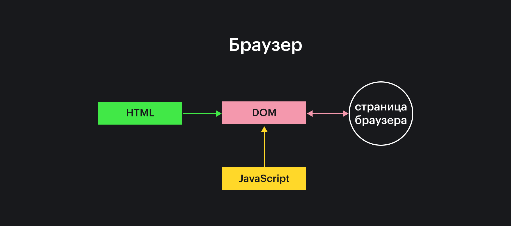
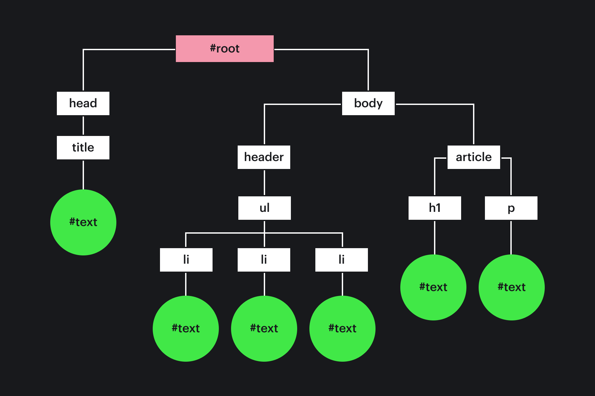

## Кратко

DOM (Document Object Model) — это специальная древовидная структура, которая позволяет управлять HTML-разметкой из JavaScript-кода. Управление обычно состоит из добавления и удаления элементов, изменения их стилей и содержимого.

Браузер создаёт DOM при загрузке страницы, складывает его в переменную `document` и сообщает, что DOM создан, с помощью [события](/js/events/) [`DOMContentLoaded`](/js/event-load-and-domcontentloaded/). С переменной `document` начинается любая работа с HTML-разметкой в JavaScript.

## Как пишется

Объект `document` содержит большое количество свойств и методов, которые позволяют работать с HTML. Чаще всего используются методы, позволяющие найти элементы страницы.

### Свойства

- `title` — заголовок документа. Браузер обычно показывает его на вкладке.

```js
console.log(document.title) // напечатать в консоль текущее называние страницы
document.title = "Мое название документа" // установить свое название
```

- `forms` — получить список форм на странице. Свойство только для чтения, напрямую перезаписать его нельзя.
- `body` — получить `body` элемент страницы
- `head` — получить `head` элемент страницы

### Методы

- [`getElementById`](/js/getelementbyid/) — поиск элемента по идентификатору;
- [`getElementsByClassName`](/js/getelementsbyclassname/) — поиск элементов по названию класса;
- [`getElementsByTagName`](/js/getelementsbytagname/) — поиск элементов по названию тега;
- [`querySelector`](/js/query-selector/) — поиск первого элемента, подходящего под CSS-селектор;
- [`querySelectorAll`](/js/query-selector-all/) — поиск всех элементов подходящих под CSS-селектор.

## Как это понять

Браузер создаёт DOM на основе HTML-кода страницы. Затем на основе DOM и других структур, браузер рисует страницу пользователю. При изменении DOM, браузер анализирует это и обновляет страницу.

DOM и страница, которую видит пользователь, связаны. Если изменишь одно, то изменится и второе:

- пользователь заполняет форму — можно прочитать введённые значения в DOM;
- при выборе страны, мы заполняем список городов в DOM — пользователь видит список.

Высокоуровневая схема такого взаимодействия:



### Из чего состоит DOM

HTML страница — это теги, вложенные друг в друга. Например:

```html
<!DOCTYPE html>
<head>
  <title>Личный кабинет</title>
</head>
<body>
  <header>
    <ul class="menu">
      <li>Главная</li>
      <li>Статьи</li>
      <li>Контакты</li>
    </ul>
  </header>
  <article id="12">
    <h1>Как выучить джаваскрипт?</h1>
    <p>Нужно начать учиться.</p>
  </article>
</body>
```

Браузер превращает эту разметку в JavaScript представление, сохраняя при этом вложенность и свойства каждого HTML-элемента. Этого удаётся достичь с помощью специальной структуры данных — дерева.

Каждый тег представляет из себя узел дерева. У каждого узла могут быть дочерние узлы — таким образом сохраняется информация о вложенности тегов. Правда, слово тег в этом контексте не используют и говорят _элемент_. Например, HTML-код выше превратится в такое дерево:



Дерево состоит из обычных и текстовых узлов. Обычные узлы — это HTML-теги, а текстовые узлы — текст внутри тегов.

Обычный узел называется `Element`, и он содержит в себе описание тега, атрибутов тега и обработчиков. Изменишь описание — изменится и HTML-код этого элемента (возможно что-то даже изменится на экране. Например, если поменяешь цвет шрифта). Читай [раздел `Element`](/js/element/), чтобы знать все необходимое об описании элементов.

_У любого узла есть один родительский узел и дочерние_. Родительский узел — элемент, в который вложен текущий узел, он может быть только один. Дочерние — узлы, которые вложены в текущий узел.

Это правило не работает только в двух случаях:

- корневой узел — у такого узла нет родителя;
- текстовый узел — у таких узлов нет дочерних узлов, только родитель. Последний уровень любого DOM-дерева состоит из текстовых узлов.
