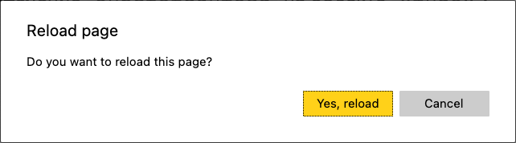

## Кратко

Когда пользователь уходит со страницы, мы можем спросить его, точно ли он хочет уйти. За это отвечает обработка события `beforeunload`.

Событие происходит перед [событием выгрузки страницы `unload`](/js/event-unload/).

## Как пишется

```js
window.addEventListener('beforeunload', function () {
  // ...
})
```

## Как понять

Мы все хотя бы раз теряли проделанную работу по какой-либо причине:

1. Нетленная классика с зависшим Word и несохранённой курсовой.
2. Случайный свайп влево на ноутбуках Apple, который вместо горизонтальной прокрутки возвращает на предыдущую страницу.
3. Автор этих строк однажды перепутал `git stash pop` с `git stash drop` 😰

Есть страницы, на которых выполняется некоторая работа. Если эта работа не сохраняется, например, в [localStorage](/js/local-storage/), стоит защитить пользователя от фрустрации при возможной потере. В этом нам поможет обработка события `beforeunload`.

Обработка с помощью [`addEventListener()`](/js/element-addeventlistener/):

```js
window.addEventListener('beforeunload', function (event) {
  // Отменяем поведение по умолчанию
  event.preventDefault()

  // Chrome требует наличия returnValue
  event.returnValue = ''
})
```

Обработка через определение `onbeforeunload` на объекте `window`:

```js
window.onbeforeunload = () => false
```

Во втором случае [необязательно](https://html.spec.whatwg.org/multipage/webappapis.html#handler-window-onbeforeunload) возвращать `false`, можно вернуть любое значение, кроме [`null`](/js/null-primitive/) и [`undefined`](/js/undefined/). Раньше браузеры использовали возвращаемое значение в качестве сообщения, но в [современной спецификации](https://html.spec.whatwg.org/#unloading-documents) данное поведение изменили. Встречали сайты, которые при попытке закрыть страницу показывали сообщения про нигерийских родственников или правоохранительные органы? Потому и изменили.

При обработке этого события браузер покажет всплывающее окно, в котором нужно будет подтвердить своё намерение покинуть страницу. В Яндекс Браузере, например, оно выглядит так:



Как оно выглядит в вашем браузере можно проверить с помощью демо ниже.

<iframe title="Демонстрация обработки события beforeunload" src="demos/beforeunload" height="350"></iframe>
