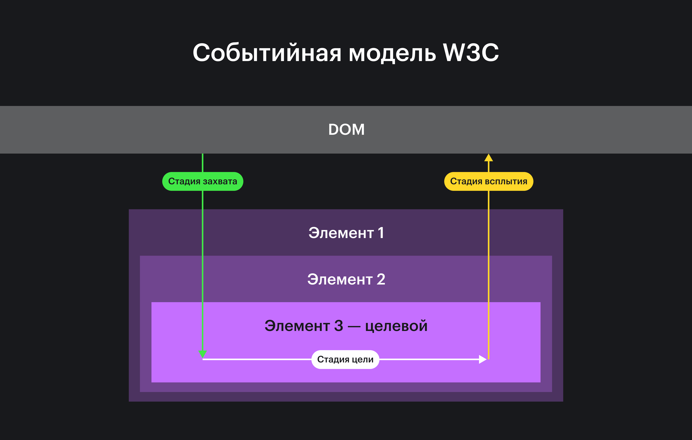

## Кратко

Чтобы приложение было интерактивным, нам нужно понимать, что пользователь совершил то или иное действие на странице. Браузер распознает действия пользователя и создаёт _событие_.

События — это сигналы, которые браузер посылает разработчику, а разработчик может на сигнал реагировать. По аналогии со светофором: видим зелёный свет, едем дальше 🚦

События бывают разных типов: клик, нажатие клавиши на клавиатуре, прокрутка страницы и так далее.

Происходящие события можно обрабатывать и выполнять код, когда нужное событие происходит. Например, при клике на кнопку показывать всплывающее окно.

## Как пишется

Существует два способа обработать события:

- с помощью `on`-свойств DOM-элементов;
- методом [`addEventListener()`](/js/element-addeventlistener/).

### `on`-свойства DOM-элементов

Большинство событий связаны с DOM-элементами. Если пользователь кликнул на кнопку, то событие `click` связано с конкретным DOM-элементом — кнопкой, на которой кликнул пользователь.

Каждый DOM-элемент имеет большой набор свойств, которые начинаются на `on`:

- `onclick`;
- `onscroll`;
- `onkeypress`;
- `onmouseenter`;
- и так далее.

Если в это свойство записать анонимную функцию, то эта функция будет вызываться каждый раз, когда браузер будет создавать событие, связанное с этим элементом. Такие функции называют функциями-обработчиками события.

```js
const buttonElement = document.getElementById('change')
const squareDiv = document.getElementById('square')

// Чтобы реагировать на нажатие кнопки, записываем функцию в свойство onclick.
// Эта функция будет вызываться при каждом нажатии на кнопку. Часто говорят,
// что эта функция обрабатывает событие
buttonElement.onclick = function() {
  squareDiv.style = `background-color: ${getColor()};`
}

function getColor() {
  const colors = [
    '#49A16C', '#064236',
    '#ED6742', '#F498AD',
    '#1A5AD7', '#AFC9DA',
    '#FFD829', '#282A2E',
    '#5E6064', '#E6E6E6'
  ]
  return colors[Math.floor(Math.random() * colors.length)]
}
```

<iframe title="Свойство DOM-элемента onclick" src="demos/onclick/" height="310"></iframe>

Чтобы перестать обрабатывать событие, нужно записать в свойство значение [`null`](/js/null-primitive/).

### Метод `addEventListener()`

🤖 Если обрабатывать события с помощью `on`-свойств, то получится добавить только одну функцию-обработчик на каждый элемент. Часто одного обработчика недостаточно. Чтобы не создавать ограничение на пустом месте, используют альтернативный метод подписки на события — метод `addEventListener()`.

Метод вызывается у DOM-элемента. Аргументами нужно передать тип события (справочная информация) и функцию, которую нужно выполнить:

```js
const buttonElement = document.getElementById('change')
const squareDiv = document.getElementById('square')

// Чтобы реагировать на нажатие кнопки, подписываемся
// на событие click и передаём функцию-обработчик.
// Эта функция будет вызываться при каждом нажатии на кнопку
buttonElement.addEventListener('click', function() {
  squareDiv.style = `background-color: ${getColor()};`
})
```

<iframe title="Как работает метод" src="demos/click/" height="310"></iframe>

## Как понять

### Функция-обработчик

Функция-обработчик, или просто обработчик, — это функция, которая вызывается браузером при наступлении события.

При вызове браузер передаёт в обработчик [объект события](/js/event/) с помощью аргумента.

Объект события — это JavaScript-объект с информацией о событии. В объекте события есть как общие свойства (тип события, время события), так и свойства, которые зависят от типа события (например, на какую кнопку нажал пользователь).

Чтобы работать с объектом события, нужно добавить параметр в объявление обработчика. Обработаем нажатие на кнопки клавиатуры и получим из объекта события информацию о нажатой кнопке:

```js
window.addEventListener('keydown', function (event) {
  // Используем объект события,
  // чтобы получить информацию о нажатой клавише
  alert(`Вы нажали на кнопку: ${event.key}`)
})
```

Помимо объекта события, внутри функции можно использовать ключевое слово [`this`](/js/function-context/). Оно позволяет получить DOM-элемент, на котором сработал обработчик. Это позволяет создать обработчик один раз, но привязать её к нескольким DOM-элементам.

Например, мы объявим обработчик в виде именованной функции и повесим её на нажатие нескольких кнопок. При клике на кнопку будем менять её цвет:

```js
function changeColor() {
  // Меняем цвет кнопки, на которой произошло событие.
  // Кнопка доступна с помощью ключевого слова this
  this.style = `background-color: ${getColor()};`
}

const buttons = document.getElementsByTagName('button')
for (let i = 0; i < buttons.length; ++i) {
  const button = buttons[i]
  // К каждой кнопке привязываем обработчик
  button.addEventListener('click', changeColor)
  // Обратите внимание, что мы не вызываем
  // функцию changeColor, а только пишем её имя
}
```

<iframe title="This в функции-обработчике" src="demos/this/" height="230"></iframe>

### Распространение событий

Важный аспект событийной модели — механизм _распространение событий (event propagation)_. Он определяет, как события взаимодействуют с узлами DOM при достижении целевого элемента.

Возникая, событие проходит через все родительские элементы (capturing phase), достигает целевого элемента (target phase), и затем вновь поднимается по иерархии родительских элементов (bubbling phase).



Обычно события обрабатывают на стадии достижения целевого элемента или всплытия.
### Всплытие событий

Рассмотрим пример. У нас есть [`<div>`](/html/div/) элемент, в который вложено видео. Мы подписались на события `click` как на `<div>`, так и на [`<video>`](/html/video/). Если событие происходит на `<div>`, то мы меняем его цвет на случайный из списка. Если событие происходит на `<video>`, то мы запускаем видео. Попробуйте кликнуть на коробку:

```js
const container = document.getElementById('container')
const video = document.getElementById('cat')

// Обрабатываем событие click на <div>
container.addEventListener('click', function() {
  const colors = [
    '#49A16C', '#064236', '#ED6742', '#F498AD',
    '#1A5AD7', '#AFC9DA', '#FFD829', '#282A2E', '#5E6064'
  ]
  const randomColorIndex = Math.floor(Math.random() * colors.length)
  container.style = `background-color: ${colors[randomColorIndex]}`
})

// Обрабатываем событие click на видео
video.addEventListener('click', function() {
  // Отматываем видео на начало
  this.currentTime = 0
  this.play()
})
```

<iframe title="Всплытие событий" src="demos/bubbling/" height="460"></iframe>

🤖 Обратите внимание, что событие срабатывает на обоих элементах — цвет фона меняется и запускается видео. Этому есть объяснение, оно называется _всплытие событий (event bubbling)_.

Когда пользователь совершает действие, браузер ищет самый вложенный элемент, к которому относится событие. Затем это событие передаётся родительскому элементу и так далее до самого корня DOM.

В нашем примере мы кликнули на `<video>`, это самый вложенный элемент. Браузер создал событие, и мы обработали его в коде. После этого браузер передаёт событие родителю `<video>` (то есть элементу, который содержит `<video>`) — элементу `<div>`. Мы получаем его и обрабатываем. И он всплывает дальше, пока не дойдёт до [`<body>`](/html/body/).

Обработчики сначала срабатывают на самом вложенном элементе, затем на его родителе, затем выше и так далее, вверх по цепочке вложенности.

Если кликнуть по блокам на демо, то можно увидеть, как событие всплывает вверх к родителям:

```js
let active
let counter = 0

// Обрабатываем событие click на всех <div>
let divs = Array.from(document.querySelectorAll('div')).reverse()
for (let i = 0; i < divs.length; ++i) {
  const isLast = (i + 1 === divs.length)
  divs[i].addEventListener('click', clickHandlerGenerator(isLast))
}

function clickHandlerGenerator(isLast = false) {
  return function() {
    let me = this
    setTimeout(function() {
      if (active) {
        active.classList.remove('active')
      }
      me.classList.add('active')

      active = me

      if (isLast) {
        setTimeout(function() {
          active.classList.remove('active')
          active = undefined
          counter = 0
        }, 300)
      }
    }, counter * 300)
    ++counter
  }
}
```

<iframe title=">Всплытие событий по цепочке вложенности" src="demos/bubbling-chain/" height="510"></iframe>

Всплытие события можно остановить с помощью метода `stopPropagation()` у объекта события:

```js
video.addEventListener('click', function (event) {
  event.stopPropagation()
  this.currentTime = 0
  this.play()
})
```

### Захват событий

При всплытии очерёдность обработки события направлена от дочерних элементов к родительским. Это не позволяет элементу получить полный контроль над событиями дочерних элементов. Например, обработчик, привязанный к элементу, может «узнать» о произошедшем событии дочерних элементов только если всплытие не было остановлено в одном из них.

Для решения некоторых задач требуется менять порядок обработки событий. Родительский элемент должен уметь отреагировать на событие ещё до того, как оно получено и обработано дочерним элементом. Например, это нужно при создании элементов-«обёрток», не зависящих от реализации логики дочерних элементов.

В качестве иллюстрации этого подхода рассмотрим предыдущий пример с котиком в коробке. Допустим, нужно воспроизводить видео только когда фон родительского элемента салатовый или голубой, при этом не меняя логику дочернего элемента. Для этого нам нужно слегка изменить обработчик клика по контейнеру:

```js
// Обрабатываем событие click на <div>
container.addEventListener('click', function(event) {
  const colors = [
    '#49A16C', '#064236', '#ED6742', '#F498AD',
    '#1A5AD7', '#AFC9DA', '#FFD829', '#282A2E', '#5E6064'
  ]
  const randomColorIndex = Math.floor(Math.random() * colors.length)
  container.style = `background-color: ${colors[randomColorIndex]}`

  // Если индекс цвета не соответствует условию (зелёный или голубой),
  // останавливаем распространение события
  if (randomColorIndex !== 0 && randomColorIndex !== 2 ) {
        event.stopPropagation()
  }
}, true) // Событие обработается на стадии захвата
```

<iframe title="Захват событий" src="demos/capturing/" height="460"></iframe>

Чтобы обработать событие на стадии захвата, добавьте `true` в вызов [`addEventListener()`](/js/element-addeventlistener/#kak-pishetsya) в качестве третьего параметра:

```js
element.addEventListener(
  'click', // Событие
  function (event) {
    // Код обработки
  },
  // Регистрация обработчика для срабатывания на стадии захвата
  true
)
```

Теперь событие будет обработано сначала родительским элементом `<div>`, а затем, если не будет остановлено, станет доступно целевому элементу `<video>`.

☝️ Обратите внимание, что обработка события происходит на стадии захвата. Из-за этого метод `stopPropagation()` останавливает распространение события от родительского элемента к дочерним, и целевой элемент не получает его.

А вот демонстрация распространения события на стадии захвата. Если кликнуть по блокам из демо, увидите, как событие достигает целевого элемента:

<iframe title="Захват событий по цепочке вложенности" src="demos/capturing-chain/" height="510"></iframe>
