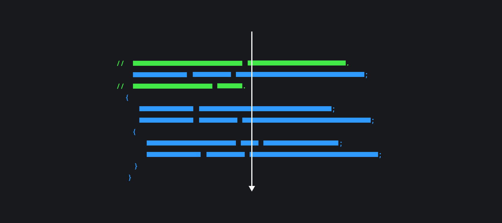
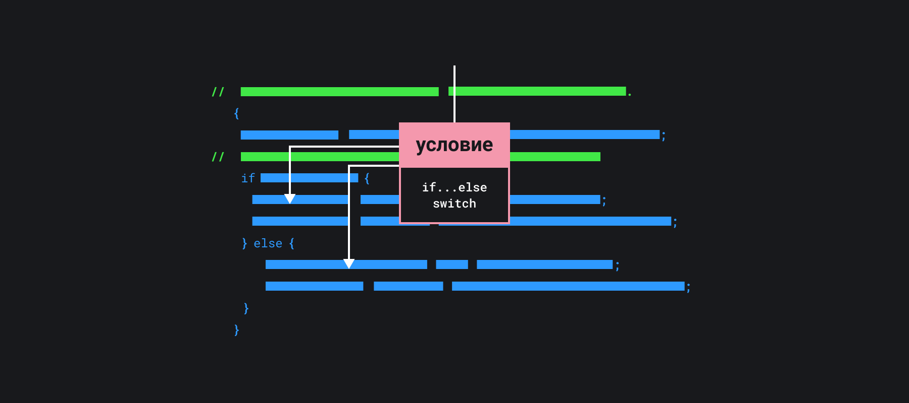
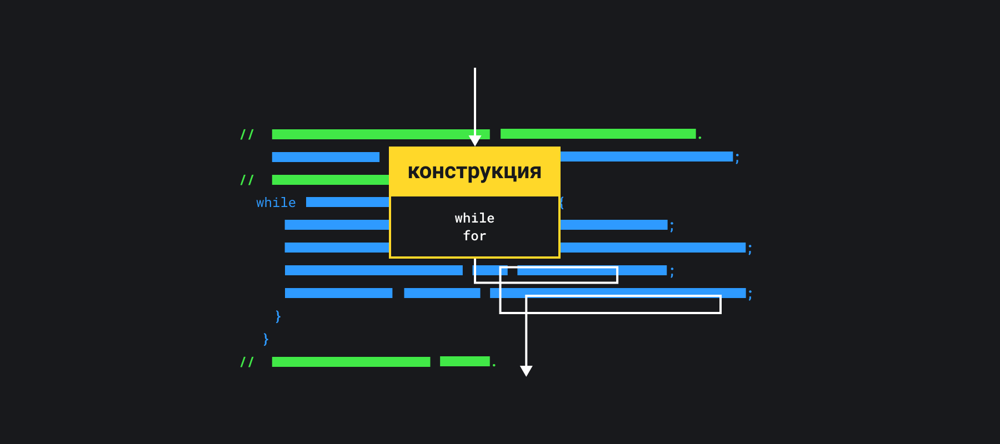

## Кратко

_Порядок выполнения_ или поток выполнения (англ. _control flow_) — это порядок, в котором интерпретатор JavaScript выполняет написанные в коде инструкции.

Стандартный порядок выполнения инструкций называют _последовательным_ — интерпретатор читает и выполняет инструкции построчно сверху вниз.

Порядок выполнения можно менять с помощью управляющих конструкций [`if...else`](/js/if-else/), [`while`](/js/while/), [`switch`](/js/switch/), [`for`](/js/for/) и других.

## Как понять

Последовательный поток выполнения программы интуитивно понятен:

```js
console.log('Привет')
console.log('Я — вторая строка')
```

Код выше всегда выведет на экран сначала строку «Привет», а затем «Я — вторая строка». Какие бы инструкции мы ни написали, сначала выполнится инструкция выше по тексту, а затем — следующая за ней. Получается такая картинка:



Последовательный порядок выполнения выполняет код строка за строкой сверху вниз.

Написать сложную программу, используя только последовательный порядок выполнения, невозможно:

- например, не получится напечатать разные сообщения залогиненным и незалогиненным пользователям — для этого нужно уметь выполнять разные блоки кода в зависимости от условия;
- не удастся напечатать список всех зарегистрированных пользователей — для этого нужно уметь выполнять одну и ту же операцию, но с разными данными.

Решать сложные задачи помогают управляющие конструкции. Они позволяют изменять порядок выполнения и получать другие результаты.

### Условный переход

_Условный переход_ или _ветвление_ позволяет выполнять одну либо другую инструкцию в зависимости от условия:



Для этого в JavaScript используются конструкции:

- [`if...else`](/js/if-else/)
- [`switch`](/js/switch/)

### Цикл

_Циклический порядок_ или цикл позволяет многократно выполнять одну и ту же инструкцию с разными данными.

Циклы настолько важный элемент программирования, что мы написали про них [отдельную статью 🔄](/js/loop/).



Организовать цикл можно с помощью конструкций:

- [`while`](/js/while/)
- [`for`](/js/for/)

При разработке веб-приложений стандартных конструкций бывает недостаточно: при взаимодействии с внешним API мы не хотим тратить впустую ресурсы компьютера на ожидание ответа. Такие проблемы решают с помощью [асинхронности](/js/async-in-js/), механизмы которой предоставляет браузер.
