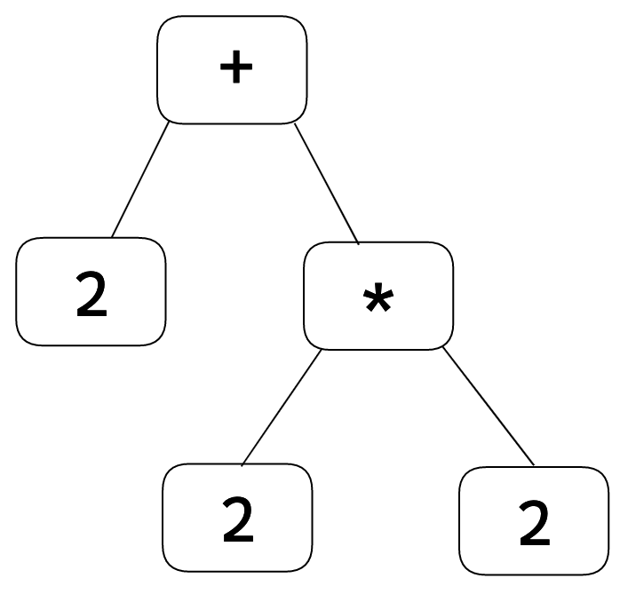
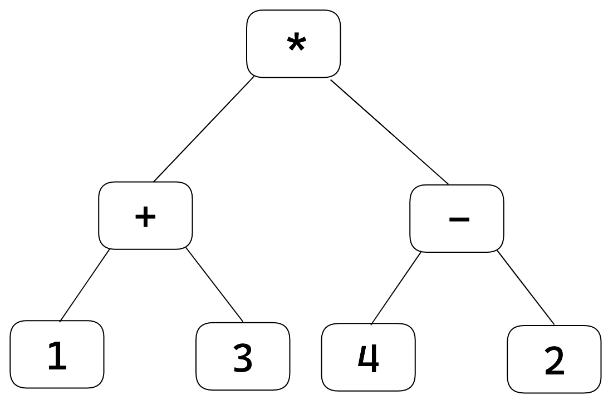
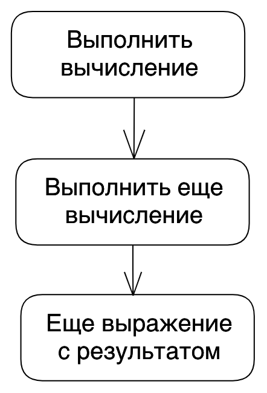
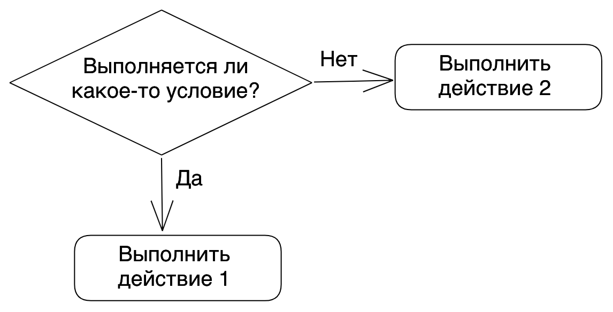
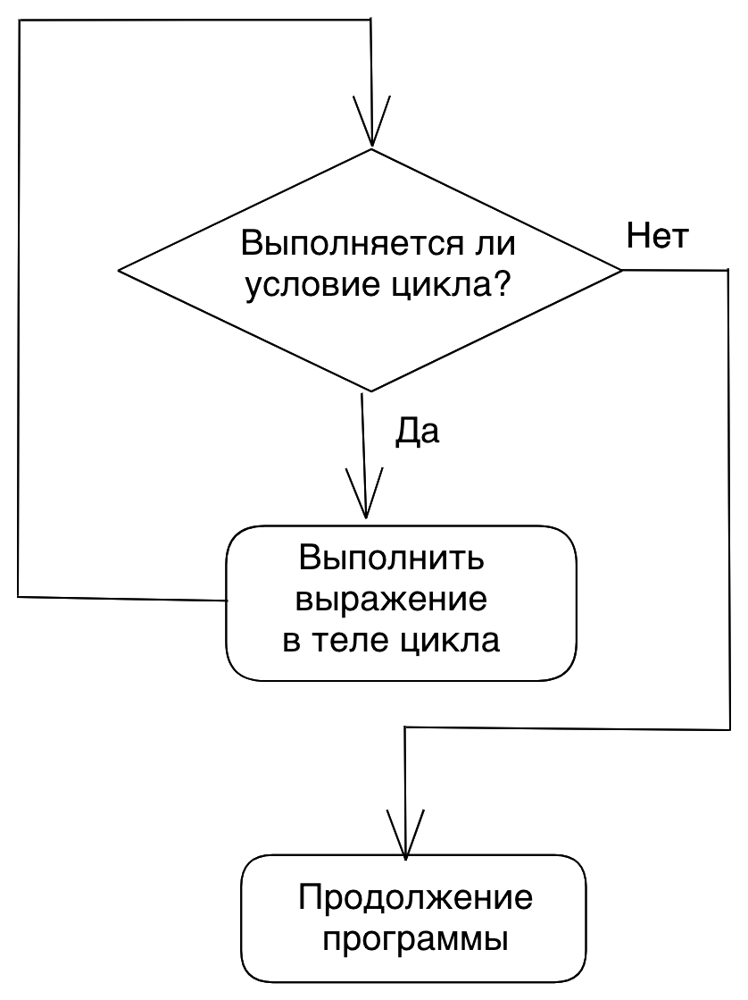

## Кратко

_Выражение_ (англ. expression) — это код, который после выполнения возвращает какое-либо значение. Например, `5 + 3` вернёт `8`, а [`Math.random()`](/js/math-random/) — случайное число.

_Инструкция_ (англ. statement) — это отдельная команда в коде, которая выполняет определённое действие. Например, [`if`](/js/if-else/) позволяет создать ветвление в программе, [`for`](/js/for/) позволяет повторять одно и то же действие.

## Как понять

### Выражения

Любая программа — это набор операций. Чтобы описать программу, разработчик пишет различные выражения на языке программирования. Посмотрим на самое простое выражение — откроем консоль любого браузера и введём туда элементарное выражение — число.

```js
123
```

Когда мы нажмём Enter, консоль ответит нам тем же самым числом. Поздравляю, это было самое простое выражение. Интерпретатор JavaScript выполнил его и вернул результат последней (в данном случае единственной) операции.


Усложним пример и добавим немного действий. Введём в консоль браузера классическую математическую задачку на внимательность:

```js
2 + 2 * 2
```

JavaScript разбирается в математике, и потому в результате выполнения такого выражения мы получим число `6`. Как JavaScript считал?

`2 + 2 * 2` – составное выражение. В нем есть как выражения, представляющие числа, так и выражения, представляющие операции с числами. Таких выражений можно быть много, с их помощью мы комбинируем и трансформируем значения.

Составные выражения лучше понимать в виде схемы:



Операциям сложения и умножения нужны два выражения – левое и правое, чтобы вычислить результат. В левой части сложения будет число 2, а в правой — составное выражение `2 * 2`, которое будет аналогично разбираться по частям.

Рассмотрим пример чуть сложнее. Введём в консоль:

<!-- чтобы не выставлял ; спереди -->
<!-- prettier-ignore  -->
```js
(1 + 3) * (4 - 2)
```

Схематично выражение можно представить так:



Как и в предыдущем примере, можно проследить из каких частей состоит выражение и как эти части связаны. В итоге мы получим ответ `8`.

Из всех перечисленных примеров можно сделать вывод, что выражения оперируют с данными — это могут быть не только числа, но и строки, и сложные структуры данных. Данные сочетаются с операциями над ними (например, сложение, вычитание, умножение), и программа выдаёт результат выражения. Удобно представлять выражение как наборы данных в сочетании с операциями, которые их обрабатывают. Схематично программу, состоящую из выражений, можно изобразить как последовательность блоков.



### Инструкция

Работа с данными — это ещё не все, что нужно для создания программы. Выражения не решают много вопросов: Как описать с помощью выражения действие по определённому условию? Да, у нас будут данные и можно написать выражение, чтобы вычислить условие, но как сказать программе делать то или иное действие? А если какое-то действие нужно повторить несколько раз?

Для этого в языках программирования существуют _инструкции_. Они не являются выражениями, но позволяют правильно настроить порядок их выполнения.

Например, используя инструкцию `if`, написать программу с условием:

```js
const someNumber = getSomeRandomNumber()

if (someNumber > 10) {
  console.log('Больше десяти')
} else {
  console.log('Меньше десяти')
}
```

Инструкции ничего не вычисляют и не возвращают результат, поэтому они не являются выражениями. Например, инструкция `if` позволяет описать несколько путей выполнения программы. Её условие будет вычислено с помощью выражения (`num > 10` является выражением и возвращает [булевый результат](/js/boolean/), а внутри условных веток так же будут присутствовать другие выражения (вызов функции – это выражение и оно возвращает результат).

Таким образом, объединяя всего одну инструкцию с выражениями мы получаем программу с ветвлением:



<aside>

💡 На самом деле, в JavaScript есть выражение, которое позволяет возвращать значение по условию. Таким выражением является тернарный оператор. Как любое выражение, он возвращает значение.

```js
const result = someNumber > 10 ? 'Больше десяти' : 'Меньше десяти'
```

</aside>

А используя инструкцию [`for`](/js/for/) или [`while`](/js/while/) можно зациклить какое-то действие:

```js
let sum = 0

// В этой строчке инструкцией является for и объявление переменной, а все остальное — выражения
for (let i = 1; i < 10; i++) {
  // Прибавляем значение, это является выражением
  sum = sum + 1
}
```

И точно так же, объединяя инструкцию с другими выражениями мы получаем более осмысленную программу.



В JavaScript все инструкции можно поделить на несколько категорий:

- управление потоком выполнения ([`if`](/js/if-else/) и [`else`](/js/if-else/), [`switch`](/js/switch/), `throw` и так далее);
- итерации ([`for`](/js/for/), [`while`](/js/while/) и так далее);
- объявление значений ([`var`](/js/var-let/), [`let`](/js/var-let/), [`const`](/js/const/));
- функции ([`function`](/js/function/), [`return`](/js/return/) и так далее);
- прочие (`debugger`, `import`, `export`).

Написать программу можно только совмещая выражения, которые работают с данными, и инструкции, которые позволяют управлять порядком выполнения.

Выражения + Инструкции = ❤️

## Как писать

🛠 С практической стороны стоит помнить главную особенность инструкций — их нельзя использовать в местах, где ожидается выражение. Чтобы понять о чем идёт речь, посмотрим на пример:

```js
getBioAbout(
  if (num > 10) { return 'Шерлок' }
  else { return 'Ватсон' }
) // Выведет ошибку: SyntaxError: Unexpected token 'if
```

Такой пример не будет работать. В качестве аргумента при вызове можно передавать простое выражение (например, конкретную строку `'Илон Маск'` или число `5`), либо составное выражение, которое вычислит и вернёт значение (например, вызов другой функции `getCurrentUser()`). Но передавать инструкцию в функцию нельзя.

```js
// Передаём составное выражение, которое вычислит и вернёт строку
getBioAbout('Илон Маск')
getBioAbout('Шерлок' + ' ' + 'Холмс')
getBioAbout(getCurrentUser())
```

🛠 Последовательные инструкции можно разделять оператором точка с запятой `;`.

<!-- prettier-ignore -->
```js
// Разделяем последовательные инструкции
const num = 5;

if (5 < 10) {};
if (5 > 10) {};
```

А вот выражения можно разделять через оператор запятая `,`. В этом случае все выражения выполнятся по порядку слева направо, но результат вернётся только от последнего в цепочке. Оператор запятая почти не используется, т.к его использование часто усложняет код.

```js
function x() {
  return 1
}
function z() {
  return 2
}

x(), z() // вернётся значение 2, потому что z() выполнился последним
```
