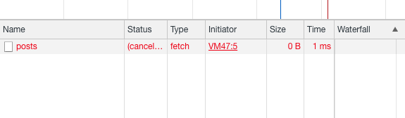

### Отмена запроса

Иногда может возникнуть необходимость прервать запрос, например когда авторизация пользователя просрочена или пользователь самостоятельно хочет отменить запрос (отменил скачивание файла).

```js
const controller = new AbortController()

function fetchData() {
  return fetch('http://jsonplaceholder.typicode.com/posts', {
    signal: controller.signal,
  })
    .then((response) => response.json())
    .catch((e) => {
      console.log(e)
    })
}

fetchData()

// Если запрос еще не выполнился, то он будет прерван
// прерванный fetch вернет Promise с ошибкой
controller.abort()
```

Запрос не выполнится, в консоли будет ошибка `The user aborted a request`. Если заглянуть в инструменты разработчика, то там можно увидеть отменённый статус у запроса.



### Загрузка файла на сервер

С помощью `fetch()` можно загружать файлы на сервер, например когда пользователь хочет загрузить свой аватар в профиль. Отправку файлов можно осуществлять с помощью специального объекта [`FormData`](/js/form-data/). Покажем на примере обработчика отправки формы:

```html
<form id="form">
  <input type="file" id="avatar">
  <button type="submit">Загрузить</button>
</form>
```

```js
// Находим элемент с файлом
const fileInput = document.getElementById('avatar')
const form = document.getElementById('form')

function handleSubmit(event) {
  event.preventDefault()

  const formData = new FormData()

  // Добавляем файлы из инпута к данным
  for (let i = 0; i < fileInput.files.length; i++) {
    const file = fileInput.files[i]
    formData.append('avatar', file, file.name)
  }

  // Отправляем файлы на сервер
  fetch('https://backend.com/api/upload', {
    method: "POST",
    body: formData,
  })
}

form.addEventListener('submit', handleSubmit)
```

### Скачивание данных с результатом прогресса

Чтобы получать текущий прогресс скачивания файла или любых других данных нам понадобится использовать свойство `body` объекта `Response`, который возвращается в `Promise` после вызова `fetch()`. Поле `body` является «потоком для чтения» (`Readable Stream`) — это специальный объект, который даёт возможность получать информацию по частям, по мере её поступления на клиент.

Попробуем таким образом загрузить милое видео как белый котик дружит с огромным псом.

```js
fetch('https://i.imgur.com/C5QXZ7u.mp4').then(async (response) => {
  let received = 0

  // Получаем поток в переменную
  const reader = response.body.getReader()

  // Считываем общую длину данных
  const contentLength = parseInt(response.headers.get('Content-Length'), 10)

  while (true) {
    // После вызова read() возвращается объект, в котором
    // done — boolean-значение о том закончилась ли информация
    // value — массив байт, которые пришли в этот раз
    const { done, value } = await reader.read()

    if (done) {
      console.log('Получено 100%')
      break
    }

    received += Math.ceil(contentLength / value.length)

    console.log(`Получено ${received}%`)
  }
})
```
