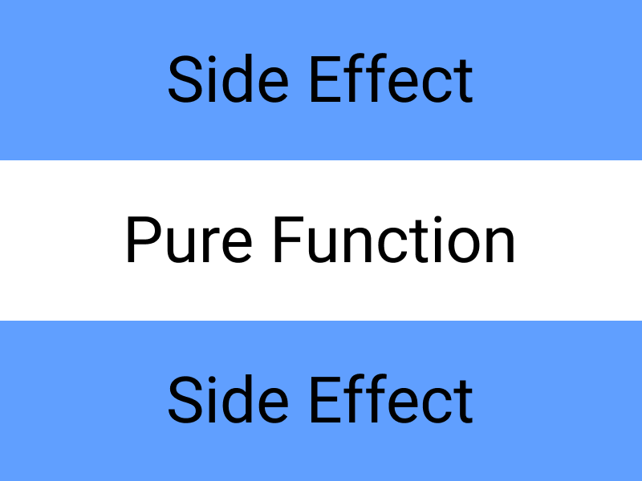

Программировать — сложно.

Хороший код адекватно отражает систему, которую описывает, он устойчив к изменениям в этой системе. Плохой код запутанный, хрупкий и непонятный — он замедляет разработку.

Код становится плохим, когда он перестаёт соответствовать реальности — бизнес-логике, правилам поведения частей системы, их отношениям друг с другом. Бизнес-логика — это территория. Код — [карта](https://www.lesswrong.com/tag/the-map-is-not-the-territory) этой территории. Чем точнее карта, тем проще справляться с изменениями в требованиях и даже предвидеть их.

Функциональное программирование — одна из парадигм, которые помогают спроектировать программу так, чтобы она верно отражала эти правила и была устойчивой к изменениям.

<aside>

📚 Прочитайте [обзор парадигм программирования](/js/programming-paradigms/), чтобы узнать про альтернативные подходы и разницу в декларативном и императивном стилях.

</aside>

## Функция как элемент композиции

Любая система состоит из частей. Программы — тоже системы со своими целями и средствами достижения этих целей. Сопоставление разных частей системы вместе называется _композицией_, а эти части — _элементами композиции_ (composition units).

<aside>

👾 Композиция — одна из важнейших проблем в программировании. Грамотное сопоставление частей делает программу расширяемой и отказоустойчивой.

</aside>

Добиться хорошей композиции трудно, потому что для этого нужно правильно провести границы между элементами. Правильные границы — очень размытое понятие, но в целом можно выделить несколько свойств и требований:

- Границы должны быть проведены так, чтобы элемент решал только одну проблему, а не несколько (принцип [разделения ответственности](https://ru.wikipedia.org/wiki/Разделение_ответственности)).
- Элементы ничего не должны знать об устройстве других элементов, а общаться они должны через данные ([закон Деметры](https://ru.wikipedia.org/wiki/Закон_Деметры)).
- Данные и настройки должны быть отделены от кода программы ([The Twelve-Factor App](https://12factor.net/ru/config)).

В функциональном программировании элемент композиции — это функция. Передача данных через несколько вызовов функций — их композиция. Например, если мы хотим к числу 10 прибавить 5, а потом умножить результат на 42, то последовательно вызовем функции `add` и `multiply`:

```js
function add(a, b) {
  return a + b
}

function multiply(a, b) {
  return a * b
}

const result = multiply(add(10, 5), 42)
```

Если разбить процесс на несколько шагов, то сперва мы получим результат сложения, а затем передадим его как аргумент умножения:

```js
const additionResult = add(10, 5)
const finalResult = multiply(additionResult, 42)
```

Такая последовательная передача данных на вход следующей функции и есть простейшая функциональная композиция.

У подобной передачи данных даже есть [математическая основа и нотация](https://ru.wikipedia.org/wiki/Композиция_функций), и в целом функциональное программирование очень близко к математике. Мы ещё поговорим об этом в конце статьи.

### Чистые функции и побочные эффекты

Чтобы композиция функций была проще и не вызывала проблем, эти функции должны быть чистыми (pure). _Чистая функция_ — это функция, которая не вызывает побочных эффектов (side effects), то есть никак не влияет на состояние внешнего мира.

Чистую функцию можно сравнить с понятием функции из математики: это нечто, что преобразует входные данные по заданным правилам.

<aside>

🧼 Чистые функции всегда при вводе одинаковых аргументов выдают одинаковый результат. По этому свойству легко отличить чистую функцию от нечистой.

</aside>

Например, `pureFn()` при вводе 10 и 20 всегда будет возвращать 15, значит она чистая:

```js
function pureFn(a, b) {
  return ((a + b) * a) / b
}
```

А `impureFn()` нечистая — она будет возвращать разные значения, потому что использует случайное число:

```js
function impureFn(a, b) {
  return ((a + b) * a) / Math.random()
}
```

И `alsoImpureFn()` тоже нечистая:

```js
function alsoImpureFn() {
  return Date.now()
}
```

В последних двух случаях функции производят побочные эффекты, потому что обращаются к глобальным объектам [`Math`](/js/math/) и `Date`. Да, _любое взаимодействие_ с чем-либо «снаружи» функции считается побочным эффектом, даже получение значений.

Дело в том, что мы не знаем, как именно устроены методы `random()` и `now()` в объектах снаружи. Они могут не только возвращать результат, но и менять состояние окружающего мира, например, меняя какую-то переменную.

В примере ниже мы обращаемся к методу `now()`, который всегда возвращает одно и то же значение, но попутно меняет значение переменной `counter`. Если мы не знаем, как устроен метод `now()`, мы не можем гарантировать, что `impureFn()` не имеет побочных эффектов, поэтому считаем её тоже нечистой:

```js
let counter = 0

const FakeDate = {
  now() {
    counter++
    return 42
  },
}

function impureFn() {
  return FakeDate.now()
}

impureFn()
// 42, counter === 1

impureFn()
// 42, counter === 2
```

### Рекурсия

Так как в функциональном программировании нельзя менять состояние, то для итеративных процессов мы не можем применять циклы. Вместо этого нам нужно использовать отображение ([`map()`](/js/array-map/)) и свёртку ([`reduce()`](/js/array-reduce/)) или [рекурсию](/js/recursion/).

Оба способа берут начало в математике. Рекурсия помогает даже выразить некоторые задачи в том виде, в котором они формулируются в математике. Вот, например, рекурсивное вычисление факториала:

```js
function factorial(n) {
  if (n <= 1) {
    return 1
  }

  return n * factorial(n - 1)
}
```

### Функции высших порядков

Иногда нам попадаются почти одинаковые задачи, которые отличаются только деталями. Например, нам может быть нужно достать из массива только отрицательные числа или только чётные числа. Мы могли бы написать нечто вроде:

```js
const list = [-1, 2, 5, -5, 6, 3]

const negative = []
for (const element of list) {
  if (element < 0) {
    negative.push(element)
  }
}

const even = []
for (const element of list) {
  if (element % 2 === 0) {
    even.push(element)
  }
}

// negative: [-1, -5]
// even: [2, 6]
```

Если приглядеться, станет видно, что _схема выполнения_ в обоих случаях одинаковая: «перебрать каждое значение и проверить его по условию». Меняется же лишь условие, по которому мы фильтруем массив:

```js
const filteredList = []

for (const element of someList) {
  if (someCondition) {
    filteredList.push(element)
  }
}
```

Мы бы могли перебор вариантов превратить в другую функцию, в которую бы передавали массив и условие проверки:

```js
const isNegative = (n) => n < 0
const isEven = (n) => n % 2 === 0

const negative = filter(list, isNegative)
const even = filter(list, isEven)
```

Здесь новая функция `filter()`, которая непосредственно перебирает значения. Она принимает на вход массив и функцию-предикат, которая проверяет каждое значение массива по своему условию.

Реализуем `filter()` самостоятельно, чтобы понять, как всё работает. Объявим функцию `filter()`, в которую передадим два аргумента: массив и функцию, проверяющую условие — предикат.

```js
function filter(list, predicate) {}
```

Внутри создадим пустой массив, который будем наполнять подходящими под условие элементами, а в конце — вернём как результат:

```js
function filter(list, predicate) {
  const result = []

  return result
}
```

Каждый элемент переданного массива мы передадим в функцию-предикат, и если она вернёт `true`, добавим этот элемент в массив-результат:

```js
function filter(list, predicate) {
  const result = []

  list.forEach((value) => {
    if (predicate(value)) {
      result.push(value)
    }
  })

  return result
}
```

Таким образом мы _абстрагируемся_ от деталей проверки каждого элемента. Вместо того, чтобы писать несколько почти одинаковых функций для фильтрации массивов мы написали один фильтр и несколько условий. Эти условия мы теперь можем передавать в `filter` как аргументы.

<aside>

📏 Такие функции, которые _принимают_ другие функции как аргументы или _возвращают_ функции как результат, называются _функциями высшего порядка_. Это один из главных способов _абстракции_ в функциональном программировании.

</aside>

<details>
  <summary>Небольшой рефакторинг 😃</summary>

Вообще, в JavaScript [`filter()`](/js/array-filter/) уже есть, поэтому мы можем переписать код вот так:

```js
const isNegative = (n) => n < 0
const isEven = (n) => n % 2 === 0

const negative = list.filter(isNegative)
const even = list.filter(isEven)
```

</details>

Функции высшего порядка часто используются как основа для [паттернов проектирования](/js/architecture-and-design-patterns/#patterny-proektirovaniya), например, для декорирования.

### Частичное применение

Хорошо, мы научились абстрагировать похожие задачи с разными аргументами. А что делать, если надо «запомнить» часть аргументов перед выполнением?

Например, есть функция умножения `multiply()`, но мы хотим дополнительно создать ещё и удвоитель `double()`. Например, потому что он используется в программе чаще другого умножения.

Решением в лоб было бы просто написать ещё одну функцию:

```js
function multiply(a, b) {
  return a * b
}

function double(x) {
  return x * 2
}
```

Но мы видим, что _схема выполнения_ обеих функций одинаковая. Просто в одном случае мы принимаем 2 аргумента, а в другом — 1, потому что второй аргумент «уже есть».

Функции высшего порядка могут помочь и в этой ситуации тоже. Мы можем превратить функцию `multiply()` в функцию, которая будет принимать лишь один аргумент и возвращать другую функцию:

```js
function multiply(a) {
  return function performWith(b) {
    return a * b
  }
}
```

Тогда создать удвоитель мы сможем, написав:

```js
const double = multiply(2)
```

Эта запись превратит `double()` в функцию `performWith()`, у которой аргумент `a` будет «заполнен заранее». То есть это:

```js
const double = multiply(2)
```

По сути равно этому:

```js
const double = function performWith(b) {
  return 2 * b
}
```

<aside>

🧠 Такое «запоминание» аргументов называется частичным применением функции. Мы как бы выполняем функцию «не до конца», а только ту часть, которая нам уже известна благодаря переданным аргумента.

</aside>

Таким же образом мы можем создать и утроитель и множитель на 10:

```js
const triple = multiply(3)
const tenTimes = multiply(10)
```

Однако пользоваться самой функций `multiply()` становится непривычно, приходится вызывать функцию сразу после вызова функции:

```js
const fifty = multiply(5)(10)
```

Поэтому чаще оригинальную функцию под частичное применение переделывают не руками, а каррируют.

### Каррирование

_Каррирование_ – это трансформация функций таким образом, чтобы они принимали аргументы не как `f(a, b, c)`, а как `f(a)(b)(c)`. То есть это буквально то же, что мы сделали с функцией `multiply()`, только автоматизировано.

Попробуем сделать это в лоб:

```js
function curry(fn) {
  return function rememberFirstArg(a) {
    return function rememberSecondArg(b) {
      return fn(a, b)
    }
  }
}

const curriedMultiply = curry(multiply)

// multiply(2, 10)
// curriedMultiply(2)(10)
```

Вроде просто, но если аргументов будет больше 2, то придётся добавлять ещё одну обёртку. Поэтому лучше посчитать количество аргументов и автоматизировать создание обёрток:

```js
function curry(func) {
  return function curried(...args) {
    if (args.length >= func.length) {
      return func.apply(this, args)
    }

    return function continueCurrying(...args2) {
      return curried.apply(this, args.concat(args2))
    }
  }
}
```

В примере выше мы проверяем, закончились ли аргументы. Если закончились, то передаём их все в оригинальную функцию и вызываем её. Если аргументы ещё есть, то используем [рекурсию](/js/recursion/), чтобы каррировать ещё раз.

Теперь мы можем как применить функцию частично, так и выполнить сразу, если потребуется:

```js
const curriedMultiply = curry(multiply)

const double = curriedMultiply(2)
// [Function: continueCurrying]

const result = curriedMultiply(2, 10)
// 20
```

<details>
  <summary>Также для частичного применения можно использовать `bind()`, хотя это и не очень «функционально».</summary>

  Например:

  ```js
  function multiply(a, b) {
    return a * b
  }

  const double = multiply.bind(null, 2)

  double(3)
  // 6
  ```

Особенность такого способа в том, что [контекст выполнения таких функций будет зафиксирован на `null`](/js/function-context/), а это не всегда удобно или даже применимо.

</details>

## Работа с побочными эффектами

В функциональном программировании не принято менять состояние. В самом пуристском смысле даже менять значения переменных считается неправильным. Вместо изменения переменной мы должны создать _новое значение_, как-то его преобразовав. Это не труъ:

```js
let a = 1

const update = (value) => {
  a = 2 * value
}

update(2)
```

А вот это уже труъ:

```js
const a = 1
const update = (original, value) => original * value
const changedA = update(a, 2)
```

Такое неизменяемое состояние называется _иммутабельным_ (immutable). В функциональном программировании любое значение считается неизменяемым и чтобы его поменять, нужно создать «копию с изменениями».

С одной стороны, это удобно, потому что всегда можно сделать слепок состояния и исследовать его. Можно даже путешествовать во времени, перебирая слепки состояния по очереди.

С другой стороны, это делает взаимодействие с реальностью несколько затруднительным, потому что реальность _вся_ состоит из побочных эффектов. Например, это всё побочные эффекты:

- Запись данных в базу;
- Получение данные от API;
- Запрос к сети за картинкой...

Эту проблему решают по-разному в зависимости от того, насколько строго хотят придерживаться функциональной парадигмы.

### Функциональное ядро в императивной оболочке

Самый простой и нестрогий способ — использовать чистые функции внутри [нечистого контекста](https://blog.ploeh.dk/2020/03/02/impureim-sandwich/). Нечистый контекст (он же императивная оболочка) занимается общением со внешним нечистым миром, а функциональное ядро — только преобразованием данных.

На примере обновления данных в базе это может выглядеть так:

- сперва мы запрашиваем и получаем данные из базы, то есть производим побочный эффект;
- затем преобразовываем данные с помощью чистой функции;
- после записываем данные в базу, то есть снова производим побочный эффект.

Получается такой сэндвич: побочный-эффект, чистое преобразование, побочный-эффект:



Этот способ подходит для проекта, построенном по нестрогой функциональной парадигме. Там мы можем использовать нечистые функции сами и общаться с помощью них с внешним миром. Самое главное — соблюдать ограничение, что только _нечистые функции могут вызывать чистые_, и никогда не наоборот.

<details>
  <summary>В строгой парадигме всё несколько сложнее</summary>

Если мы работаем в строгой парадигме, нам придётся использовать [функтор State](https://blog.ploeh.dk/2021/07/19/the-state-functor/).

Мы не будем вдаваться в подробности этого подхода, потому что с наскока это будет сделать трудно. Основная его идея в том, что состояние — это не «что-то снаружи», а аргумент. Функция, которая принимает состояние и возвращает возможно изменённое состояние и будет функтором State.

</details>

### Контейнеры результатов

Обычно в JavaScript ошибки обрабатывают императивно с помощью [`try-catch`](/js/try-catch/):

```js
try {
  performDangerousOperation()
} catch (e) {
  console.log('Что-то пошло не так!')
}
```

В функциональном программировании для их обработки используют _контейнеры_.

Контейнер в общем смысле можно представить как «коробку», в которой может лежать значение. Основной смысл таких контейнеров в том, чтобы облегчить нам доступ и передачу значения внутри контейнера, а также упростить композицию трансформаций.

Сравним два способа обрезать строку, привести её к числу и прибавить единицу:

```js
const withoutContainer = (str) => Number(str.trim()) + 1

const withContainer = (str) =>
  [str]
    .map((s) => s.trim())
    .map((s) => Number(s))
    .map((n) => n + 1)
    [0]
```

Обе функции делают одно и то же, но во второй функции операция разбита на чёткие шаги. Сперва мы помещаем значение в массив — «контейнер». Затем мы используем [`map()`](/js/array-map/), чтобы преобразовать каждое значение из этого массива по некоторым правилам. В конце достаём из массива единственное значение, которое там было, но уже преобразованное.

Такой поток выполнения _линейный_, в нём значение переходит от одного преобразования к следующему. Заметьте, что композиция этих преобразований у нас строится на поочерёдном вызове `map()` на контейнере. Сейчас «контейнер» — это массив, но это совсем не обязательно.

Мы можем реализовать собственный контейнер, операции с которым тоже можно будет компоновать с помощью `map()`.

```js
const Box = (x) => ({
  map: (f) => Box(f(x)),
})
```

Мы создали функцию `Box()`, которая возвращает объект. Метод `map()` принимает функцию-преобразование и возвращает новый контейнер, чтобы уже к нему можно было применить следующее преобразование.

Теперь мы можем соединять преобразования с помощью `map()` — то есть использовать композицию:

```js
const withContainer = (str) =>
  Box(str)
    .map((s) => s.trim())
    .map((s) => Number(s))
    .map((n) => n + 1)

const result = withContainer('45')
// Box(46)
```

<details>
  <summary>Чтобы достать значение из такого контейнера, код контейнера нужно слегка дополнить.</summary>

Нам понадобится ещё один метод — `fold()`, который сможет достать из замыкания функции `Box()` нужное значение и вернуть его:

```js
const Box = (x) => ({
  map: (f) => Box(f(x)),
  fold: (f) => f(x),
})
```

Тогда достать значение с его помощью мы сможем так:

```js
const withContainer = (str) =>
  Box(str)
    .map((s) => s.trim())
    .map((s) => Number(s))
    .fold((n) => n + 1)

const result = withContainer('45')
// 46
```

</details>

Контейнер же _результата_ можно представить как коробку, в которой после успешного выполнения операции находится результат, а в случае ошибки — ошибка.

Результат будет с типом `Ok`:

```js
const Ok = (x) => ({
  map: (f) => Ok(f(x)),
})
```

Ошибка будет с типом `Error`:

```js
const Error = (x) => ({
  map: (f) => Error(x),
})
```

Обратите внимание, что `Error` при вызове `map()` _не выполняет_ переданную функцию. Это позволяет разветвлять код и обрабатывать разные случаи и ошибки, не заботясь о каждом этапе обработки ошибок отдельно.

Теперь с помощью этих двух «коробок» мы можем решить, что именно хотим вернуть при работе с опасной операцией. Объявим функцию `findName()`, которая может вернуть [`undefined`](/js/undefined/).

```js
function findName(alias) {
  return {
    nagibator3000: 'Mike',
    superUfaStar: 'Alice',
  }[alias]
}
```

Проблема этой функции в том, что мы не знаем, как обрабатывать её результат: это может быть или строка, или `undefined`. То есть следующий код приведёт к ошибке:

```js
findName('missing-alias').toUpperCase()
```

С контейнером же мы не беспокоиться о случае с `undefined`:

```js
function fromNullable(x) {
  return x ? Ok(x) : Error(x)
}

fromNullable(findName('missing-alias'))
  .map((value) => value.toUpperCase())
```

Самое классное, что мы можем применять сколько угодно преобразований, и они не вызовут ошибок. Если хотя бы на одном из этапов появится `Error`, то ни одно последующее преобразование _не будет выполнено_:

```js
fromNullable(x)
  .map((value) => value.toUpperCase())
  .map((value) => value.trim())
  .map((value) => '@' + value)
```

В примере выше если `x` — строка, к нему применится 3 преобразования из `map` и в конце на экране появится `alert`. В случае если `x === undefined`, то преобразования будут проигнорированы.

<aside>

🥚 Подробнее о том, что такое контейнеры, почему они играют такую важную роль, и как с их помощью обрабатывать исключения, посмотрите в курсе [Professor Frisby Introduces Composable Functional JavaScript](https://egghead.io/courses/professor-frisby-introduces-composable-functional-javascript) на Egghead.

</aside>

### Паттерн-матчинг

Ещё одна мощная концепция из функционального программирования — это _паттерн-матчинг_. В нём проверяемое значение сопоставляется с какими-либо заранее подготовленными. В зависимости от того, с каким значением совпадает проверяемое, выполняются определённые действия.

Концептуально он похож на switch:

```js
function isRGBComponent(color) {
  switch (color) {
    case 'red':
    case 'green':
    case 'blue':
      return true
    default:
      false
  }
}

isRGBComponent('blue')
// true

isRGBComponent('gray')
// false
```

Во многих функциональных языках проверяемое значение можно сопоставлять не только с другими значениями, но и использовать предикаты, сравнивать типы данных и т. д.

<aside>

ƛ Если вам интересно узнать, как с помощью паттерн-матчинга написать, например, факториал, советуем заглянуть на [learnyuohaskell.com](http://learnyouahaskell.com/syntax-in-functions#pattern-matching).

</aside>

В JavaScript тоже можно (хоть и с костылями) использовать предикаты для паттерн-матчинга. Мы можем проверять результат [выражений](/js/expressions-vs-statements/) прямо в `case`:

```js
function stringifyAmount(amount) {
  switch (true) {
    case amount === 0:
      return 'Empty!'
    case 0 < amount && amount < 10:
      return 'A few'
    default:
      return 'Many'
  }
}

stringifyAmount(0)
// Empty!

stringifyAmount(5)
// A few

stringifyAmount(100)
// Many
```

Но обычно, чтобы использовать паттерн-матчинг в JavaScript, подключают дополнительные библиотеки.

## Математические основы

Функциональное программирование по сути — это просто интерпретация функций как математического понятия. То есть функция здесь — это [_отображение_ входных данных на выходные](https://ru.wikipedia.org/wiki/Функция_(математика)).

Отсюда как раз следует, что у функции не должно быть побочных эффектов — у математических функций их просто нет! У каждого входного значения есть одно и только одно выходное, исключений не бывает.

Основы функционального программирования — это [лямбда-исчисление](https://ru.wikipedia.org/wiki/Лямбда-исчисление) и [теория категорий](https://ru.wikipedia.org/wiki/Теория_категорий). Лямбда-исчисление отвечает за описание и вычисление функций, а теория категорий — за отношения между объектами.

<aside>

🦄 Если вам хочется по-настоящему узнать, что такое функторы, монады, семигруппы и прочее, то советуем прочитать спецификацию [Fantasy Land](https://github.com/fantasyland/fantasy-land). Будьте аккуратны, там сложно.

</aside>

## Плюсы функционального программирования

Сейчас функциональное программирование популярно, потому что решает несколько важных проблем.

### Надёжность и удобство тестирования

Чистые функции, которые лежат в основе ФП, надёжны, потому что _всегда_ выдают одинаковый результат при одинаковых входных данных.

Это значит, что в какой бы момент времени мы ни запускали такую функцию, мы всегда можем рассчитывать на предсказуемый результат. Более того, сам вызов чистой функции можно заменить на её значение-результат, и программа не сломается. Это свойство называется [ссылочной прозрачностью](https://ru.wikipedia.org/wiki/Ссылочная_прозрачность).

Также чистые функции [удобно тестировать](/js/how-to-simplify-tests/), потому что они не требуют большой тестовой инфраструктуры. А если такая функция написана на языке со строгой статической типизацией, то часть тестов оказывается вовсе не нужна.

### Оптимизация при компиляции

При компиляции кода, который обладает ссылочной прозрачностью, некоторые его куски можно «выполнить» заранее и получить готовое значение. Это позволяет не тратить вычислительные ресурсы на выполнение функции в рантайме, а сделать это заранее, что ускорит работу программы.

### Параллелизм и потокобезопасность

Функциональное программирование запрещает менять состояние, а значит не случится ситуации, когда две функции пытаются записать разные значения в одну переменную. Это значит, что выполнение кода можно безопасно разбивать на несколько параллельных потоков или процессов.

## Минусы функционального программирования

Любая парадигма, в том числе и функциональное программирование, имеет и ряд минусов.

### Повышенное потребление памяти

Так как состояние программы неизменяемо, при его «изменении» приходится создавать его полную копию. Это требует грамотной и своевременной работы с памятью — выделения, мониторинга и очищения неиспользуемых участков.

### Сложность при работе с нечистыми сервисами

Чистое ФП сложно подружить с реальностью, которая полностью состоит из побочных эффектов. Способы решения этой проблемы мы описывали чуть ранее в этой статье.
