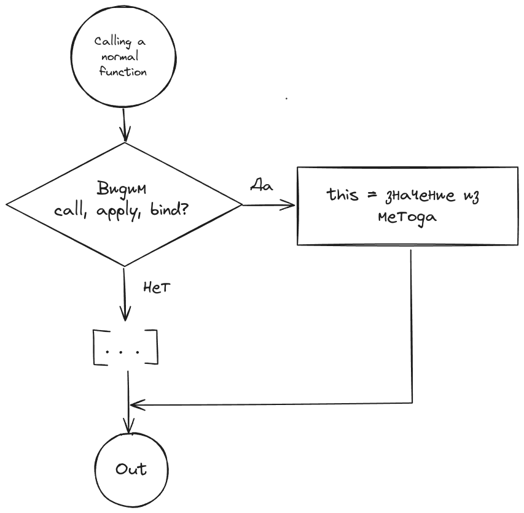
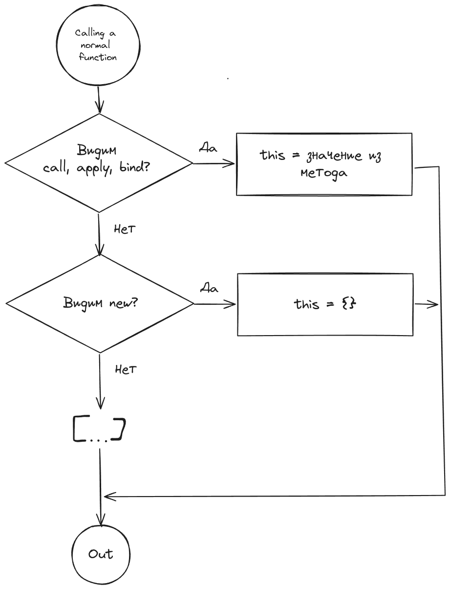

## Кратко

`this` в JS - это **не контекст**, как в других языках.

`this` в JS - это особая переменная, которая определена локально для всех функций (кроме стрелочных). Любая обычная функция вызывается минимум с 1 аргументом - `this`. Но передать его в функцию в виде аргумента нельзя. По умолчанию для обычной функции `this` равен [`undefined`](/js/undefined/). Значение `this` для обычной функции может быть изменено **только в момент вызова** этой функции и зависит от формы и способа её вызова.

Для определения, чему равняется `this` есть несложный алгоритм.

:warning: Все примеры ниже будут для [_строгого режима_](/js/use-strict/). В не строгом режиме поведение будет местами отличаться. Строгий режим автоматически влючён для режима `module`.

Кратко, чему может равняться `this` в разных ситуациях:

0. `this` в глобальном окружении (не внутри функции) может быть `undefined`, global object или любым, в зависимости от хост среды (браузер, нода и т.д.)
1. Если это стрелочная функция, то не важно, как она вызвана. Стрелочная функция не меняет `this`. Чему он равен нужно смотреть в родительском окружении - где стрелочная функция была определена.
2. Вызов обычной (не стрелочной) функции по умолчанию связывает `this` с `undefined`.
3. Вызов обычной функции с ключевым словом `new` свяжет `this` с пустым объектом `{}`.
4. Явно задать `this` с помощью `call`, `apply`, `bind`.
   ```js
   func.call(thisArg, ...args);
   func.apply(thisArg, ...args);
   func.bind(thisArg, ...args)();
   ```
5. Вызов обычной функции в dot-нотации (через точку), связывает `this` со значением идентификатора, который стоит перед точкой.
6. Внешние API могут как угодно менять значение `this`. Но только в случае, если это обычная функция для которой `this` не задан специально с помощью `call`, `apply`, `bind`.

## Алгоритм нахождения `this`

Сбросим таинственность с `this` в JS! Базовое правило определения `this`: проверить как и какая функция запускается.

### `this` и Global Environment

Самый простой (и бесполезный с практической точки зрения) случай, когда `this` находится в глобальном окружении. Т.е. `this` находится не внутри функции, а на "самом верхнем уровне":

```js
'use strict';

console.log('This is:', this);
```


В этом случае алгоритм нахождения `this`:

1. Код запускается в режиме `script` или `module`?
   1. Если `module`, то `this` равен `undefined`
   2. Если `script`, `this` ссылается на Global Object, но хост среда может изменять это по своему усмотрению:
      1. В браузере поведение `this` не меняется. `this` ссылается на Global Object, который равен объекту `window`
      2. Хост среда `nodejs` изменяет `this` по своей спецификации и устанавливает его равным пустому объекту `{}`

:exclamation: Но повторимся, этот случай не интересен с практической точки зрения. Но может пригодиться на собеседовании :)

### `this` и Function Environment

Самое интересное, когда `this` находится внутри кода функции. Тут важно, что это за функция: [обычная](/js/function/) или [стрелочная](/js/arrow-function/)


Если `this` находится внутри стрелочной функции, то мы просто поднимаемся в родительское окружение (область видимости) - то место, где функция была определена.

```js
'use strict';

function logThis() {
  var arrowFunc = () => console.log('this is:', this);
  arrowFunc();
}

logThis(); // this is: ?
```
В этом примере `this` находится внутри стрелочной функции `arrowFunc`. Значит, чтобы определить, чему равен `this` нужно посмотреть где эта стрелочная функция определена. И начать выполнение алгоритма поиска заново. `arrowFunc` определена внутри функции `logThis`. Это обычная функция? Да. Переходим к определению `this` внутри обычной функции.

### `this` и call, apply, bind

Вызывается ли наша функция `logThis` с помощью [`call`](https://developer.mozilla.org/en-US/docs/Web/JavaScript/Reference/Global_Objects/Function/call), [`apply`](https://developer.mozilla.org/en-US/docs/Web/JavaScript/Reference/Global_Objects/Function/apply) или [`bind`](https://developer.mozilla.org/en-US/docs/Web/JavaScript/Reference/Global_Objects/Function/bind)? Если да, то значение `this` будет взято из этих методов:



```js
'use strict';

function logThis() {
  var arrowFunc = () => console.log('this is:', this);
  arrowFunc();
}

var thisArg = { name: 'User' };
logThis.call(thisArg); // this is: { name: 'User' }
logThis.apply(thisArg); // this is: { name: 'User' }
logThis.bind(thisArg)(); // this is: { name: 'User' }

thisArg = 42;
logThis.call(thisArg); // this is: 42
logThis.apply(thisArg); // this is: 42
logThis.bind(thisArg)(); // this is: 42

logThis(); // this is: ?
```

Если функция вызывается без `call`, `apply` или `bind` идём дальше по алгоритму.

### `this` и `new`

Вызывается ли наша функция `logThis` с помощью ключевого слова `new`? Если да, то `this` будет связан с пустым объектом.




```js
'use strict';

function logThis() {
  var arrowFunc = () => console.log('this is:', this);
  arrowFunc();
}

new logThis(); // this is: {}

// И даже так, без скобочек. `new` принудительно вызывает функцию.
new logThis; // this is: {}

logThis(); // this is: ?
```

Если функция вызывается без `new`, то идём дальше по алгоритму.

### `this` и dot нотация

Если наша функция `logThis` вызывается через dot нотацию (т.е. через точку), как метод, то `this` будет связан с идентификатором, который расопложен слева от точки. Иными словами `this` внутри функции-метода будет ссылаться на сам объект, метод которого вызывается.

Иначе `this` будет связан с `undefined`


```js
'use strict';

function logThis() {
  var arrowFunc = () => console.log('this is:', this);
  arrowFunc();
}

var obj = {
  name: 'User',
  logThis,
}

obj.logThis(); // this is: { name: 'User', logThis }

logThis(); // this is: ?
```

Чтобы лучше прочувствовать разницу вот немного другой пример:

```js
'use strict';

function logThis() {
  var arrowFunc = () => console.log('this is:', this);
  arrowFunc();
}

var obj = {
  name: 'User',
  logThis,
}
// связали идентификатор функции с новым идентификатором log. Но функция logThis не вызывается
var log = obj.logThis;
log(); // this is: undefined

// Ура, наконец-то!
logThis(); // this is: undefined
```

Важный нюанс - функция должна именно **вызываться** в dot нотации.

В примере выше с `log` вызова функции `logThis` нет. Функция `logThis` вызывается только в самом конце листинга: `logThis()`. По алгоритму это не вызов с `call`, `apply`, `bind`, не вызов с помощью `new`, вызов без dot нотации. Значит `this` связан с `undfined`.

Ура! Теперь мы всегда можем легко понять, чему равен `this`. Ну... почти всегда и легко :) Путаница начинается, когда функция передаётся во внешнее API. Тогда `this` может быть любым, всё зависит от того, как его установит внешнее API.

## Внешние API

Внешнее API может как угодно менять `this` в функции, которая передана в него как [callback](/js/async-in-js/#kolbeki). Но:
1. Только если это обычная (не стрелочная) функция.
2. `this` не установлен принудительно через `bind`.

Чтобы точно узнать, чему равен `this` в случае вызова внешнего API, необходимо посмотреть документацию этого API.

Пара популярных примеров внешнего API

### addEventListener

Относится к стандарту HTML5. `this` будет ссылаться на объект DOM, на котором висит слушатель события.

```js
'use strict';

function handleClick() {
  console.log('this is:', this);
}

// this должен быть undefined по спецификации EcmaScript (JavaScript)
// Но будет ссылаться на body - элемент на котором висит слушатель
document.body.addEventListener('click', handleClick);

// this будет { value: 42 }, потому что мы явно это задали через bind
document.body.addEventListener('click', handleClick.bind({ value: 42 }));
```

### setTimeout

Внешнее API. Причём ещё более неоднозначное. Если мы в среде браузера, то это `setTimeout` из стандарта HTML5. Если мы в `nodejs`, то это уже API ноды, которое отличается от поведения в HTML5.

```js
'use strict';

var obj = {
  name: 'User',
  logThis() {
    console.log('this is:', this);
  },
};

setTimeout(obj.logThis, 1000);
```
Если этот код выполнить в браузере, то:
- в режиме module `this` будет `undefined`
- в режиме script `this` будет ссылаться на глобальный объект window

Если этот код выполнить в `nodejs`, то `this` будет ссылаться на объект `Timeout` ноды.

Совет для интервью - если спрашивают про `this` и внешнее API, то всегда можно добавить, что внешнее API может задать `this` так, как ему хочется (за исключением принудительной установки `this`), и чтобы узнать наверняка, чему оно будет равно, нужно посмотреть документацию соответствующего API