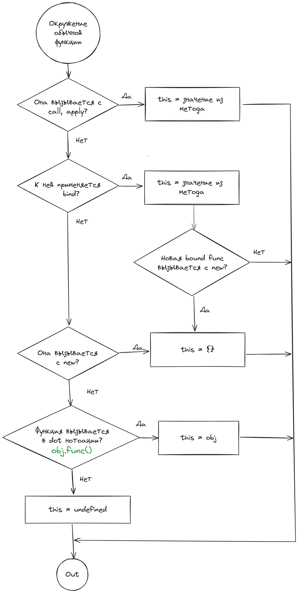

## Кратко

`this` в JavaScript - это **не контекст**, как в других языках.

Можно думать о `this`, как о скрытом параметре функции, который определяется в момент её вызова.

## Алгоритм нахождения `this`

❗ Все примеры ниже будут для [_строгого режима_](/js/use-strict/). В не строгом режиме значения `this` будет местами отличаться. Строгий режим автоматически влючён для режима `module`.

### `this` и Global Environment

Самый простой (и бесполезный с практической точки зрения) случай, когда `this` находится в глобальном окружении. Т.е. `this` находится не внутри функции, а на "самом верхнем уровне":

```js
'use strict';

console.log('This is:', this);
```


В этом случае алгоритм нахождения `this`:

Код запускается в режиме `script` или `module`?

- Если `module`, то `this` равен `undefined`
- Если `script`, `this` ссылается на Global Object, но хост среда может изменять это по своему усмотрению:
  - В браузере поведение `this` не меняется. `this` ссылается на Global Object, который равен объекту `window`
  - Хост среда `nodejs` изменяет `this` по своей спецификации и устанавливает его равным пустому объекту `{}`

❗ Но повторимся, этот случай не интересен с практической точки зрения. Но может пригодиться на собеседовании :)

### `this` и Arrow Function

Когда `this` находится внутри кода [стрелочной функции]((/js/arrow-function/)), то мы просто должны подняться в её родительское окружение (область видимости), где эта стрелочная функция была определена и начать алгоритм определения заново:


В этом примере `this` находится внутри стрелочной функции `arrowFunc`. Значит, чтобы определить, чему равен `this` нужно посмотреть где эта стрелочная функция определена. И начать выполнение алгоритма поиска заново. `arrowFunc` определена внутри функции `logThis`. Это обычная функция? Да. Переходим к определению `this` внутри обычной функции.

```js
'use strict';

function logThis() {
  var arrowFunc = () => console.log('this is:', this);
  arrowFunc();
}

logThis(); // this is: ?
```

### `this` и Обычная функция

Теперь нас интересует, как вызывается [обычная](/js/function/) родительская функция `logThis`


#### `this` и call, apply

Вызывается ли наша функция `logThis` с помощью [`call(thisArg, ...args)`](https://developer.mozilla.org/en-US/docs/Web/JavaScript/Reference/Global_Objects/Function/call) или [`apply(thisArg, ...args)`](https://developer.mozilla.org/en-US/docs/Web/JavaScript/Reference/Global_Objects/Function/apply)? Если да, то `this` будет ссылаться на те данные, на которые указывает идентификатор `thisArg`.


```js
'use strict';

function logThis() {
  var arrowFunc = () => console.log('this is:', this);
  arrowFunc();
}

var thisArg = { name: 'User' };
logThis.call(thisArg); // this is: { name: 'User' }
logThis.apply(thisArg); // this is: { name: 'User' }

thisArg = 42;
logThis.call(thisArg); // this is: 42
logThis.apply(thisArg); // this is: 42

logThis(); // this is: ?
```

Если функция вызывается без `call` или `apply`, идём дальше по алгоритму.

#### `this` и bind

Если к родительской обычной функции применяется метод [`bind(thisArg, ...args)`](https://developer.mozilla.org/en-US/docs/Web/JavaScript/Reference/Global_Objects/Function/bind), то возвращется новая функция. При вызове эта новая функция вызывает исходную функцию с аргументами `...args` и 'нацеливает' `this` на те данные, на которые указывает идентификатор `thisArg`. Если к новой функции (которая возвращается после `.bind()`) применить `call`, `apply` или снова `bind`, то это не изменит `this`.


Несколько примеров, чтобы показать тонкости работы js:

```js
'use strict';

function logThis() {
  var arrowFunc = () => console.log('this is:', this);
  arrowFunc();
}

var thisArgUser = { name: 'User' };
var thisArgAdmin = { name: 'Admin' };

var logBind = logThis.bind(thisArgUser);
logBind(); // this is: { name: User }

// this уже закреплён первым bind, задать его другим нельзя
logBind.call({ thisArgAdmin }); // this is: { name: User }
logBind.apply({ thisArgAdmin }); // this is: { name: User }

// this уже закреплён первым bind, задать его другим нельзя
var secondLogBind = logBind.bind(thisArgAdmin);
secondLogBind(); // this is: { name: User }
```
Есть важный нюас про переменные в js. Ассоциация с коробочкой и данными не очень подходит для js. Лучше думать, что переменная содержит ссылку на адрес в памяти, где данные действительно лежат:

```js
// Лучше читать так - `a` ссылается на адрес памяти,
// где лежит структура `{name: 'User'}`
// Знак `=` это знак связывания а не равенства сущностей.
var a = {name: 'User'};

// Переменная `b` не равна `a`, а переменная `b` связана с теми же
// данными, что и `a`. Т.е. `b` ссылается на туже область памяти, что и `a`
var b = a;

// Мы редактируем одни и теже данные,
// потому что и `a` и `b` суть ссылка на одну структуру в памяти
a.name = 'SuperUser';
console.log(a); // {name: 'SuperUser'};
console.log(b); // {name: 'SuperUser'};

b.name = 'SuperAdmin';
console.log(a); // {name: 'SuperAdmin'};
console.log(b); // {name: 'SuperAdmin'};
```
Поэтому пример ниже не противоречит алгоритму, а лишь показывает суть того, чем являются переменные в js:

```js
'use strict';

function logThis() {
  var arrowFunc = () => console.log('this is:', this);
  arrowFunc();
}

var thisArgUser = { name: 'User' };
var thisArgAdmin = { name: 'Admin' };

var logBind = logThis.bind(thisArgUser);
logBind(); // this is: { name: User }

thisArgUser.name = 'SuperUser';
// Поменялся не this, this ссылается на тоже, на что и `thisArgUser`
// Если мы меням данные по адресу `thisArgUser`,
// то this тоже показывает новое значение
logBind(); // this is: { name: SuperUser }

logBind.call({ thisArgAdmin }); // this is: { name: SuperUser }
logBind.apply({ thisArgAdmin }); // this is: { name: SuperUser }

var secondLogBind = logBind.bind(thisArgAdmin);
secondLogBind(); // this is: { name: SuperUser }

// Если мы свяжем `thisArgUser` с новыми данными в памяти,
// то this никак не изменится. Он остался связанным
// с теми данными, на которые стал связаться при первом `bind`
thisArgUser = 42;

logBind(); // this is: { name: SuperUser }

logBind.call({ thisArgAdmin }); // this is: { name: SuperUser }
logBind.apply({ thisArgAdmin }); // this is: { name: SuperUser }

var secondLogBind = logBind.bind(thisArgAdmin);
secondLogBind(); // this is: { name: SuperUser }
```

### `this` и `new`

Если наша родительская обычная функция `logThis` вызывается с помощью оператора `new` или иновая функця после `.bind()` вызывается с помощью оператора `new`, то в обоих случаях `this` связывается с пустым объектом `{}`


```js
'use strict';

function logThis() {
  var arrowFunc = () => console.log('this is:', this);
  arrowFunc();
}

new logThis(); // this is: {}

// И даже так, без скобочек. `new` принудительно вызывает функцию.
new logThis; // this is: {}

logThis(); // this is: ?
```

Ещё один хитрый пример на понимание `bind` и `this`:

```js
function Point(x, y) {
  this.x = x;
  this.y = y;
  console.log(this);
}

const superThis = { z: 3 };
const YAxisPoint = Point.bind(superThis, 1);

const a = new YAxisPoint(2); // {x: 1, y: 2}
```
Идём по алгоритму:
1. `this` внутри функции? Да, внутри `Point`
2. Это обычная функция? Да, не стрелочная.
3. `Point` вызывается с `call` или `apply`? Нет.
4. К `Point` применяется `bind`? Да.
5. Новая функция `YAxisPoint`, когда будет вызвана, применит аргумент `1` к своему первому входному параметру `x`. А `this` станет связан с теми данными, на которые ссылается `superThis`.
6. Новая функция `YAxisPoint` вызывается с помощью оператора `new`? Да.
7. Значит `this` начинает ссылаться на пустой объект `{}`, а функция `Point` вызывается с такими параметрами: `Point(1, 2)`. Поэтому присвоение `this.x` и `this.y` преобразуют `this` в объект `{x: 1, y: 2}`

### `this` и dot нотация

Если наша функция `logThis` вызывается через dot нотацию (т.е. через точку), как метод, то `this` будет связан с идентификатором, который расопложен слева от точки. Иными словами `this` внутри функции-метода будет ссылаться на сам объект, метод которого вызывается.

Иначе `this` будет связан с `undefined`



```js
'use strict';

function logThis() {
  var arrowFunc = () => console.log('this is:', this);
  arrowFunc();
}

var obj = {
  name: 'User',
  logThis,
}

obj.logThis(); // this is: { name: 'User', logThis }

logThis(); // this is: ?
```

Чтобы лучше прочувствовать разницу вот немного другой пример:

```js
'use strict';

function logThis() {
  var arrowFunc = () => console.log('this is:', this);
  arrowFunc();
}

var obj = {
  name: 'User',
  logThis,
}
// связали идентификатор функции с новым идентификатором log. Но функция logThis не вызывается
var log = obj.logThis;
log(); // this is: undefined

// Ура, наконец-то!
logThis(); // this is: undefined
```

Важный нюанс - функция должна именно **вызываться** в dot нотации.

В примере выше с `log` вызова функции `logThis` нет. Функция `logThis` вызывается только в самом конце листинга: `logThis()`. По алгоритму это не вызов с `call`, `apply`, `bind`, не вызов с помощью `new`, вызов без dot нотации. Значит `this` связан с `undfined`.

Ура! Теперь мы всегда можем легко понять, чему равен `this`. Ну... почти всегда и легко :) Путаница начинается, когда функция передаётся во внешнее API. Тогда `this` может быть любым, всё зависит от того, как его установит внешнее API.

## Внешние API

Внешнее API может как угодно менять `this` в функции, которая передана в него как [callback](/js/async-in-js/#kolbeki). Но:
1. Только если это обычная (не стрелочная) функция.
2. `this` не установлен принудительно через `bind`.

Чтобы точно узнать, чему равен `this` в случае вызова внешнего API, необходимо посмотреть документацию этого API.

Пара популярных примеров внешнего API

### addEventListener

Относится к стандарту HTML5. `this` будет ссылаться на объект DOM, на котором висит слушатель события.

```js
'use strict';

function handleClick() {
  console.log('this is:', this);
}

// this должен быть undefined по спецификации EcmaScript (JavaScript)
// Но будет ссылаться на body - элемент на котором висит слушатель
document.body.addEventListener('click', handleClick);

// this будет { value: 42 }, потому что мы явно это задали через bind
document.body.addEventListener('click', handleClick.bind({ value: 42 }));

```

### setTimeout

Внешнее API. Причём ещё более неоднозначное. Если мы в среде браузера, то это `setTimeout` из стандарта HTML5. Если мы в `nodejs`, то это уже API ноды, которое отличается от поведения в HTML5.

```js
'use strict';

var obj = {
  name: 'User',
  logThis() {
    console.log('this is:', this);
  },
};

setTimeout(obj.logThis, 1000);
```
Если этот код выполнить в браузере, то:
- в режиме module `this` будет `undefined`
- в режиме script `this` будет ссылаться на глобальный объект window

Если этот код выполнить в `nodejs`, то `this` будет ссылаться на объект `Timeout` ноды.

Совет для интервью - если спрашивают про `this` и внешнее API, то всегда можно добавить, что внешнее API может задать `this` так, как ему хочется (за исключением принудительной установки `this`), и чтобы узнать наверняка, чему оно будет равно, нужно посмотреть документацию соответствующего API
