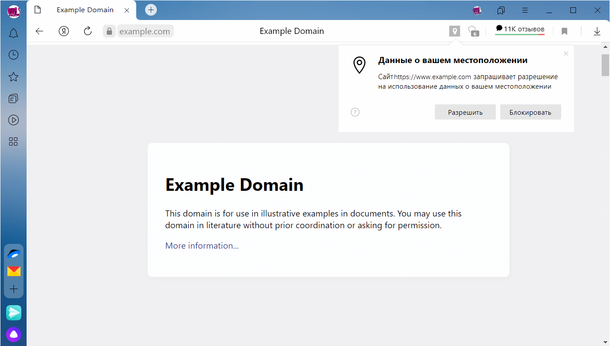

<aside>

Эта статья связана с понятием `Application Programming Interface`. Подробнее о нём читайте в отдельном материале про [`API`](/js/api/).

</aside>

## Кратко

`Geolocation API` позволяет запросить у пользователя данные геолокации. Если он не против, получим специальный объект `GeolocationCoordinates` с координатами и другими интересными параметрами.

## Как пишется

Получить доступ к геолокации позволяет свойство `geolocation` объекта [`navigator`](/js/bom/):

```js
navigator.geolocation
```

К этому свойству можно применить разные методы, чтобы уточнить запрос.

## Как понять

Иногда может понадобиться узнать, где пользователь. Например, мы хотим показать на карте, где находится человек и где ближайший к нему пункт выдачи товаров.

Для этого браузер предлагает использовать своё `API`, для чего нужно обратиться к объекту [`navigator`](/js/window-navigator/).

Когда мы запросим одним из методов данные геолокации, пользователь увидит диалоговое окно:



Если человек согласен и только этого и ждал, он одобрит запрос, а мы получим его геолокацию в виде особого объекта `GeolocationCoordinates`, вот как он выглядит:

```js
GeolocationCoordinates {
  latitude: 36.01068878173828,
  longitude: 37.20875549316406,
  altitude: null,
  accuracy: 40,
  altitudeAccuracy: null,
  …}
```

Пока тут много непонятного, но из этого объекта можно получить все нужные нам данные. Чаще всего используют широту (`latitude`) и долготу (`longitude`). Помимо этих свойств прочесть можно следующие:

- altitude — как высоко над эллипсоидом человек ([что за эллипсоид под нами?](https://support.virtual-surveyor.com/en/support/solutions/articles/1000261351-what-is-wgs84-));
- accuracy — отклонение точности геолокации в метрах;
- altitudeAccuracy — на какой высоте человек в метрах;
- heading — куда смотрит устройство от 0° до 360° градусов;
- speed — скорость движения в метрах в секунду.

## Как узнать геолокацию единожды

Чтобы получить разовую геолокацию, нужно использовать метод `getCurrentPosition` и передать колбэк внутрь. Его аргументом и будет объект `GeolocationCoordinates`.

```js
navigator.geolocation.getCurrentPosition(position => {
  const { latitude, longitude } = position.coords
})

// записываем в переменные latitude и longitude координаты пользователя
```
Кроме колбэка в `getCurrentPosition` можно передать ещё два аргумента: функцию на случай ошибки и опции в виде объекта:

```js
navigator.geolocation.getCurrentPosition(success, error, options)

function error() {
  alert('Где ты вообще...'); // на случай ошибки
}

const options = {
  enableHighAccuracy: true,
  maximumAge: 1000,
  timeout: 3600
}

```

Опции помогают настроить запрос чуть детальнее:

- enableHighAccuracy — просит передавать геолокацию поточнее (может скушать много энергии устройства);
- maximumAge — принимает кэшированную геолокацию не старше определённого времени;
- timeout — устанавливает «срок годности» на полученную геолокацию.

## Наблюдать в динамике

Если `getCurrentPosition` позволяет узнать геолокацию единожды, то для наблюдения за постоянно меняющимся местоположением лучше использовать метод `watchPosition`:

```js
navigator.geolocation.watchPosition(position => {
  const { latitude, longitude } = position.coords
})

// постоянно перезаписываем в latitude и longitude координаты пользователя
```

Метод `watchPosition` бесконца вызывает колбэк, чтобы данные не застаивались.

## Остановить наблюдение

Если объявить переменную и назначить её за получение геолокации, то `navigator.geolocation` вернёт ей `id`. Его можно использовать в методе `clearWatch`, чтобы прекратить наблюдение:

```js
const geoId = navigator.geolocation.watchPosition(position => {
  // наблюдаем за геолокацией и храним в geoId идентификатор
})

function geoWatchStopper() {
  navigator.geolocation.clearWatch(geoId)
  // останавливаем наблюдение
}
```

## Как обработать ошибки

В методы `getCurrentPosition` и `watchPosition` можно передать колбэк на случай ошибок. За них отвечает свойство `GeolocationPositionError`, его удобно обрабатывать через конструкцию [`switch`](/js/switch/):

```js
function handleError(error) {
  // эту фукнцию можно передать колбэком на случай ошибок

  const { code } = error

  switch (code) {
    case GeolocationPositionError.TIMEOUT:
      // как-то обрабатываем
      break
    case GeolocationPositionError.PERMISSION_DENIED:
      // не расстраиваемся
      break
    case GeolocationPositionError.POSITION_UNAVAILABLE:
      // что-то делаем
      break
  }
}
```
