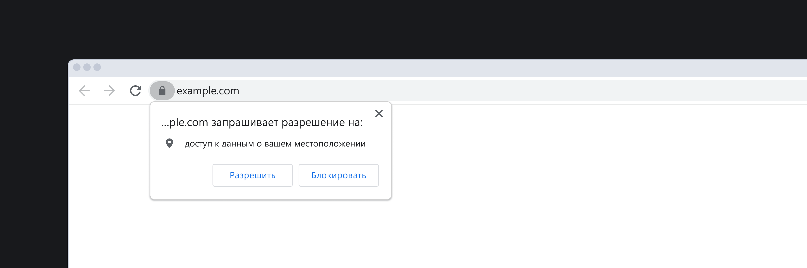

<aside>

Эта статья связана с понятием `Application Programming Interface`. Подробнее о нём читайте в отдельном материале про [`API`](/tools/api/).

</aside>

## Кратко

`Geolocation API` позволяет запросить у пользователя данные о географическом местоположении.

<aside>

🔔 Работать с геопозицией пользователей можно только при защищённом соединении (HTTPS).

</aside>

## Как пишется

Получить доступ к геолокации позволяет свойство `navigator.geolocation` объекта [`navigator`](/js/bom/):

```js
navigator.geolocation
```

## Как понять

Иногда может понадобиться узнать, где находится пользователь. Например, мы хотим показать на карте, где расположен ближайший к нему пункт выдачи товаров.

Для этого браузер предлагает своё `API`. Когда мы воспользуемся свойством `navigator.geolocation`, в ответе получим интерфейс `Geolocation`, — он позволяет работать с данными геопозиции:

```js
Geolocation {}
```

Внутри него:

```js
clearWatch: ƒ clearWatch()
getCurrentPosition: ƒ getCurrentPosition()
watchPosition: ƒ watchPosition()
constructor: ƒ Geolocation()
Symbol(Symbol.toStringTag): "Geolocation"
[[Prototype]]: Object
```

Для `Geolocation` есть различные методы: `getCurrentPosition`, `watchPosition` и `clearWatch`. Если их вызвать, то пользователь получит уведомление. Например, в Chrome появится следующее диалоговое окно:



Если человек одобрит запрос, мы получим возможность работать с интерфейсом `GeolocationPosition`:

```js
GeolocationPosition {coords: GeolocationCoordinates, timestamp: 1665141114856}
```

Он включает объект `GeolocationCoordinates` с данными геолокации пользователя и параметр `timestamp` со временем получения координат:

```js
GeolocationCoordinates {
  latitude: 36.01068878173828,
  longitude: 37.20875549316406,
  altitude: null,
  accuracy: 40,
  altitudeAccuracy: null,
  …}
```

Чаще всего используются широта `latitude` и долгота `longitude`. Помимо них в объекте содержатся:

- altitude — отвечает за высоту в метрах над эллипсоидом ([что за эллипсоид под нами?](https://support.virtual-surveyor.com/en/support/solutions/articles/1000261351-what-is-wgs84-));
- accuracy — точность широты и долготы в метрах (например, 40 метров);
- altitudeAccuracy — уровень точности высоты над эллипсоидом в метрах;
- heading — направление движения. Угол, который отсчитывается по часовой стрелке относительно [истинного севера](https://en.wikipedia.org/wiki/True_north#:~:text=True%20north%20(also%20called%20geodetic,lines%20of%20a%20map%20projection)) и может принимать значения от 0° до 360°;
- speed — скорость движения в метрах в секунду.

## Как узнать геолокацию единожды

Чтобы получить координаты один раз, воспользуйтесь методом `getCurrentPosition` и передайте внутрь колбэк. Его аргументом в случае успеха выступит объект `GeolocationPosition`:

```js
navigator.geolocation.getCurrentPosition(position => {
  const { latitude, longitude } = position.coords
})

// записываем в переменные latitude и longitude координаты пользователя
```
Кроме колбэка в `getCurrentPosition` можно передать ещё два аргумента: функцию на случай ошибки и объект с дополнительными опциями:

```js
navigator.geolocation.getCurrentPosition(success, error, options)

function error() {
  alert('Где ты вообще...'); // на случай ошибки
}

const options = {
  enableHighAccuracy: true,
  maximumAge: 1000,
  timeout: 3600
}

```

Опции помогают настроить запрос детальнее:

- enableHighAccuracy — просит передавать геолокацию особенно точно, жертвуя энергией устройства и временем;
- maximumAge — устанавливает время, по истечению которого _кэшированную_ геолокацию следует обновить;
- timeout — устанавливает временной интервал обновления геолокации.

## Наблюдать в динамике

Если `getCurrentPosition` позволяет узнать геолокацию единожды, то для наблюдения за постоянно меняющимся местоположением лучше использовать метод `watchPosition`:

```js
navigator.geolocation.watchPosition(position => {
  const { latitude, longitude } = position.coords
})

// постоянно перезаписываем в latitude и longitude координаты пользователя
```

Метод `watchPosition` без конца вызывает колбэк, чтобы данные не застаивались.

## Остановить наблюдение

Метод `watchPosition` возвращает `id` текущего наблюдения. Его можно использовать в методе `clearWatch`, чтобы прекратить наблюдение:

```js
const geoId = navigator.geolocation.watchPosition(position => {
  // наблюдаем за геолокацией и храним в geoId идентификатор
})

function geoWatchStopper() {
  navigator.geolocation.clearWatch(geoId)
  // останавливаем наблюдение
}
```

## Как обработать ошибки

В методы `getCurrentPosition` и `watchPosition` можно передать колбэк на случай ошибок. За них отвечает объект `GeolocationPositionError`, его удобно обрабатывать через конструкцию [`switch`](/js/switch/):

```js
function handleError(error) {
  // эту фукнцию можно передать колбэком на случай ошибок

  const { code } = error

  switch (code) {
    case GeolocationPositionError.TIMEOUT:
      // время получения геолокации истекло
      break
    case GeolocationPositionError.PERMISSION_DENIED:
      // пользователь запретил трекинг своей геопозиции
      break
    case GeolocationPositionError.POSITION_UNAVAILABLE:
      // получить местоположение не удалось
      break
  }
}
```
